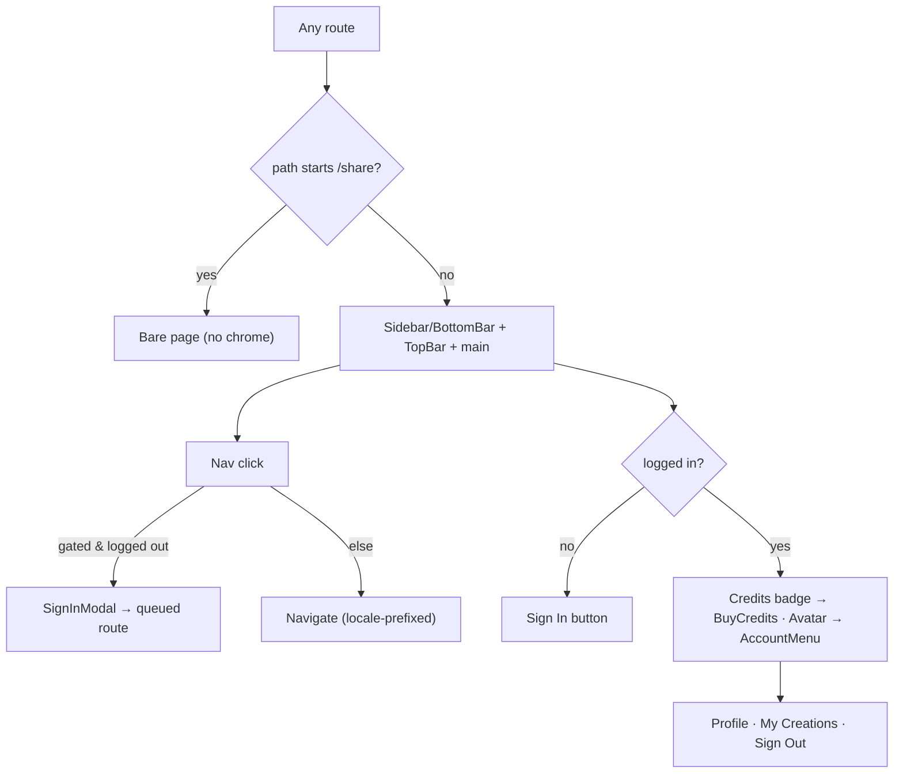

# Area 01 — App Shell & Global Chrome

> Read `../00-overview.md` first (conventions, ID scheme, global auth/credits/i18n models). **As-built**;
> ⚠️ = divergence from App v3.0, ❓ = a tracked `TBD-*`, 🔒 = mock/in-memory.
> This area owns the persistent navigation frame every other area assumes. It has **no `MuseApi`
> calls** and no route of its own.

---

## 1. Overview & scope

The app shell is the persistent frame: a **left sidebar** (desktop, ≥640px) or **bottom tab bar**
(mobile, <640px), a sticky **top bar** with a credits badge + account control, and the **account
dropdown menu**. It wraps every route via `AppShell` in `src/app/[locale]/layout.tsx`, except the
public `/share` page which renders bare.

**In scope:** `shell/AppShell`, `shell/Sidebar`, `shell/TopBar`, `shell/HeaderActions`,
`account/AccountMenu` (surface only — its destinations belong to areas 06/07).
**Out of scope:** `SignInModal` (area 09), the credits modals (area 07), the Profile/History/Settings
screens the shell links to (areas 05/06).

**Key divergences from the app:** brand wordmark is now **"YouCam Muse"** everywhere (SHELL-01, synced
to app, 2026-07-23); nav is a 5-item sidebar (Home · Create MV · Create Song · History · Profile) with
**no "＋ Create" FAB** (app F02 bottom bar = Explore · ＋Create · History) ⚠️; account is a **dropdown
menu**, not the app's full-screen Account sheet — it now includes **Notifications** and **Send
Feedback** rows (SHELL-03, UI-only) alongside Profile / My Creations / Sign Out.

---

## 2. Route / component / state / API map (RD)

| Component | Owns UI | Reads/writes state | `MuseApi` |
|---|---|---|---|
| `shell/AppShell` | chrome vs bare decision; `Sidebar` + `TopBar` + `<main>` | `usePathname` + `stripLocalePrefix` | — |
| `shell/Sidebar` | desktop rail + mobile bottom bar, 5 nav links, active state | `useAuth().{loggedIn,requireLogin}`, `useLocale().{locale}`, `useT()` | — |
| `shell/TopBar` | sticky header, mobile wordmark | — | — |
| `shell/HeaderActions` | logged-out Sign In button; logged-in credits badge + avatar; purchase toast | `useCredits().credits`, `useAuth().{loggedIn,openSignIn,profile,subscribed}` | — |
| `account/AccountMenu` | account dropdown (profile header, credits row, Profile / My Creations / Sign Out) | `useCredits().credits`, `useAuth().{signOut,profile,subscribed}`, `useLocale()` | — |

Nav labels are localized via `useT()` (`nav.home/createMv/createSong/history/profile`) — one of the
only two localized surfaces (nav + Profile). Everything else in the shell is hardcoded English.

---

## 3. State model & rules

- **Chrome vs bare:** `AppShell` strips the locale prefix and renders **bare** (no sidebar/top bar)
  when the path starts with `/share`; otherwise the full shell (`AppShell.tsx:11-12`).
- **Nav items** — canonical list (`Sidebar.tsx:23-29`, labels via `nav.*` keys), in order:
  Home `/` (`nav.home`) · Create MV `/mv/room` (`nav.createMv`) · Create Song `/song/create`
  (`nav.createSong`) · **History** `/history` (`nav.history` = "History") · Profile `/profile`
  (`nav.profile`). Note: the **same `/history` route is labeled "History" in the nav but
  "My Creations" in the account menu** (`AccountMenu.tsx:98`) and as the page title (area 05).
- **Gated nav** (`GATED = {/mv/room, /song/create, /history, /profile}`, `Sidebar.tsx:13`): clicking a
  gated item **while logged out** calls `requireLogin(() => push(target))` — opens `SignInModal` and
  queues the navigation for after sign-in (`Sidebar.tsx:45-51`). (Matches the four `AuthGuard` routes.)
- **Active state** (`Sidebar.tsx:40-43`): Home active when `pathname === localePath(locale,"/")`;
  other items active when `pathname.startsWith(localePath(locale, href))`. Locale prefix preserved via
  `localePath`.
- **Header, logged out** (`HeaderActions.tsx:22-32`): a single **Sign In** button → `openSignIn()`.
- **Header, logged in** (`HeaderActions.tsx:34-72`): a **credits badge** (gold, shows `credits` + "＋")
  → opens `BuyCreditsModal` (area 07); an **avatar button** (image or name initial; gold ring when
  `subscribed`) → toggles `AccountMenu`. Purchase shows a transient toast.
- **Account menu** (`AccountMenu.tsx`): header (avatar, name, **PRO/FREE** badge, email), a credits row
  with **Buy Credits**, and rows **Profile** (`/profile`), **My Creations** (`/history`),
  **Notifications** + **Send Feedback** (SHELL-03 — inert UI, wiring is backend `PROF-01/02`), and
  **Sign Out** (`signOut()`). Closes on outside-click / Escape.
- **Responsive:** sidebar shown at `sm:` and up; bottom bar below `sm:`; `<main>` gets `pb-20` on
  mobile to clear the bottom bar (`AppShell.tsx:19`).
- 🔒 All of `credits`, `profile`, `subscribed` are in-memory (reset on reload; see overview §5/§6).

---

## 4. Journeys

Screens to capture later: shell at 390px (bottom bar) and 1440px (sidebar); account menu open.

### SHELL-P1 — Navigate (signed in, or to a public route)
- **SHELL-P1-S1** User clicks a nav item (sidebar or bottom bar). **System:** routes via `next/link` to `localePath(locale, href)`, preserving locale; active styling updates.

### SHELL-P2 — Gated nav while logged out
- **SHELL-P2-S1** Logged-out user clicks Create MV / Create Song / My Creations / Profile. **System:** prevents navigation, `requireLogin` opens `SignInModal`, queues the target.
- **SHELL-P2-S2** On successful sign-in → the queued navigation runs. On dismiss → stays put (`onCancel` unset here, so no redirect).

### SHELL-P3 — Header, logged out
- **SHELL-P3-S1** User clicks **Sign In** (top bar). **System:** `openSignIn()` opens `SignInModal` with no queued action.

### SHELL-P4 — Header, logged in
- **SHELL-P4-S1** Click the **credits badge**. **System:** opens `BuyCreditsModal` (area 07); on purchase, toast "Added N credits".
- **SHELL-P4-S2** Click the **avatar**. **System:** opens `AccountMenu`.
- **SHELL-P4-S3** In the menu: **Buy Credits** → `BuyCreditsModal`; **Profile** → `/profile`; **My Creations** → `/history`; **Sign Out** → `signOut()` (clears session + resets subscription/profile in-memory). Outside-click/Esc closes.

### SHELL-P5 — Bare page
- **SHELL-P5-S1** Navigating to `/share…` renders the page **without** sidebar/top bar (standalone).

---

## 5. Error & edge states

| ID | Trigger | Behaviour |
|---|---|---|
| **SHELL-E1** | Pre-hydration (SSR/first paint) | **Fixed (SHELL-04, 2026-07-23):** `HeaderActions` returns a fixed-height placeholder until `hydrated`, so the logged-out→in flash no longer occurs. |
| **SHELL-E2** | Non-default locale active | All nav/menu links go through `localePath`, keeping the `/jpn/…` prefix; active-state comparison also prefix-aware. |
| **SHELL-E3** | Missing translation key | `useT()` falls back to English per key (empty non-English dicts). |

---

## 6. Acceptance criteria (EARS)

- **AC-SHELL-01** — WHILE viewport ≥640px, THE SYSTEM SHALL show the left sidebar; WHILE <640px, the bottom tab bar — both with the same five destinations. *(visual)*
- **AC-SHELL-02** — WHEN a nav item is clicked, THE SYSTEM SHALL navigate to that route under the active locale prefix and reflect the active item.
- **AC-SHELL-03** — WHEN a logged-out user clicks a gated nav item (`/mv/room`, `/song/create`, `/history`, `/profile`), THE SYSTEM SHALL open the sign-in modal and, on success, proceed to the queued route.
- **AC-SHELL-04** — WHILE logged out, THE SYSTEM SHALL show a **Sign In** button in the top bar and no credits badge/avatar.
- **AC-SHELL-05** — WHILE logged in, THE SYSTEM SHALL show the credits badge (current balance) and the avatar; and WHEN `subscribed`, render the avatar with the gold ring and a **PRO** badge in the menu.
- **AC-SHELL-06** — WHEN the avatar is clicked, THE SYSTEM SHALL open the account menu exposing Buy Credits, Profile, My Creations, Notifications, Send Feedback, and Sign Out; and close it on outside-click or Escape.
- **AC-SHELL-07** — WHEN the path starts with `/share`, THE SYSTEM SHALL render the page bare (no sidebar/top bar).
- **AC-SHELL-08** — THE SYSTEM SHALL render the shell at 390/768/1024/1440px with no overflow and the correct bar (bottom vs side) at the 640px switch. *(visual)*

---

## 7. Per-path QA checklist

- [ ] **SHELL-P1**: nav switches active item; locale prefix preserved on non-default locale (AC-02, E2).
- [ ] **SHELL-P2**: logged-out gated click → sign-in modal → post-sign-in lands on target (AC-03).
- [ ] **SHELL-P3/P4**: logged-out shows Sign In only; logged-in shows badge+avatar; subscribed → gold ring + PRO (AC-04/05).
- [ ] **SHELL-P4-S3**: menu links route correctly; Sign Out resets to guest; menu closes on outside-click/Esc (AC-06).
- [ ] **SHELL-P5**: `/share` renders bare (AC-07).
- [ ] **AC-08**: 390/768/1024/1440 clean; bottom-bar↔sidebar switch at 640px *(visual)*.

---

## 8. Open items for RD

No open items for this area — see `../00-overview.md` §9 for global open items.

---

## 9. Flow diagram

---

**Decisions (as-built):** desktop-native sidebar (not a stretched mobile tab bar); account as a
dropdown; `/share` is chrome-less; nav labels localized, rest English.
