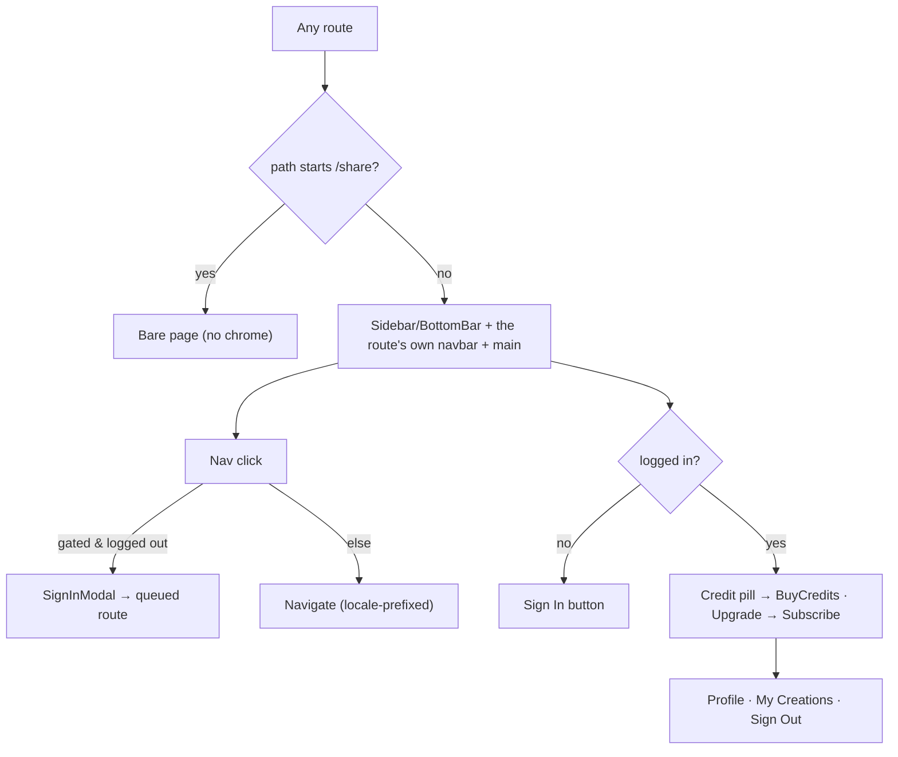

# Area 01 — App Shell & Global Chrome

> Read `../00-overview.md` first (conventions, ID scheme, global auth/credits/i18n models). **As-built**;
> ⚠️ = divergence from App v3.0, ❓ = a tracked `TBD-*`, 🔒 = mock/in-memory.
> This area owns the persistent navigation frame every other area assumes. It has **no `MuseApi`
> calls** and no route of its own.

---

## 1. Overview & scope

The app shell is the persistent frame: a **left sidebar** (desktop, ≥768px) or **bottom tab bar**
(phone, <768px), a top bar with a credits badge + account control, and the **account
dropdown menu**. It wraps every route via `AppShell` in `src/app/[locale]/layout.tsx`, except the
public `/share` page which renders bare.

> **Rewritten 2026-08-12 — this area predated the designer-UI migration (its previous revision was
> dated 2026-07-23, before the migration ran 08-04 → 08-07) and three of its statements had become
> factually wrong.** What changed, all verified against code:
>
> 1. **The phone cutover is 767px, not 640px.** `PHONE_QUERY = "(max-width: 767px)"`
>    (`src/lib/ssr.ts:13`), matching `designer/AppLayout.css`'s own media query. Both `AppShell.tsx`
>    and `MobileTabBar.tsx` carry the comment "the phone cutover moves 640px → 767px".
> 2. **The phone bar has THREE destinations, not five.** `MobileTabBar` is Explore / Create /
>    History. Profile and the second create entry are not on it; Profile is reached from
>    `MobileHeader`'s account button (phone) or the `Sidebar` profile footer (desktop). This
>    follows DP and was accepted as a product decision on 2026-08-12.
> 3. **`TopBar` is no longer universal.** Routes listed in `AppShell`'s `OWN_CHROME` draw their own
>    chrome (`DetailNavbar` / `RoomNavbar` / `MobileHeader` + `MobileTabBar`); `TopBar` survives only
>    as the fallback for routes not yet migrated, and `/` gets the marketing `Navbar` instead. `/`
>    can never be listed in `OWN_CHROME` because the check is `path.startsWith(r)`, which `"/"`
>    matches for every route.
>
> ⚠️ **Amended 2026-08-27 (S6 `shell-auth` storyboard build) — two more product-owner changes landed
> AFTER this rewrite (2026-08-22/23) and were never folded back in, so the paragraph above still
> overstates both `MobileTabBar` and `TopBar`:**
>
> 4. **`MobileTabBar`/`MobileHeader` are "Layer 1" components — they mount ONLY on Home and
>    History, not on every route below 767px.** `AppShell.tsx`'s `MOBILE_TAB_ROUTES = ["/history"]`
>    gates `MobileTabBar` to `isHome || pathname starts with /history`; `MobileHeader` mounts on
>    `isHome` alone. Confirmed live 2026-08-27: neither element exists in the DOM on `/watch`,
>    `/mv/room`, or `/profile` at any width. Every OTHER route draws its own back-affordance instead
>    (`DetailNavbar`'s compact bar, or `RoomNavbar`'s `mobileBackHref`) — there is no global bottom
>    tab bar below 767px, only a two-route one. **AC-SHELL-01 needs qualifying accordingly** (see
>    its correction below); this is the mechanism behind the already-documented A5 phone-back work
>    (`CLAUDE.md`), not a new bug — just a fact this area never recorded.
> 5. **`TopBar`/`HeaderActions`/`AccountMenu` were not "the fallback for routes not yet migrated" —
>    they were unreachable dead code, and they are now DELETED.** Point 3 was accurate in
>    2026-08-12 (routes still existed outside `OWN_CHROME`); by 2026-08-27 `OWN_CHROME`'s list had
>    grown to cover every route except `/` (which never used `TopBar` — see point 3) and `/share*`
>    (bare). The S6 storyboard build measured that and raised it as `Q-01`; **the product owner
>    chose deletion on 2026-08-27**, so `shell/TopBar.tsx`, `shell/HeaderActions.tsx` and
>    `account/AccountMenu.tsx` are gone from `src/`, and `OWN_CHROME` went with them — a list whose
>    only job was gating a component that no longer exists. Everything below marked ⚠️ _unreachable_
>    now reads as ⚠️ **removed**; the behaviour each correction describes is unchanged, because none
>    of it was reachable in the first place.
>
>    **The invariant that replaces it:** below `/`, the shell draws **no header at all** — every
>    route renders its own (`RoomNavbar` / `DetailNavbar`, or a page's own mobile header), which is
>    what all 16 already did. A NEW route must bring its own navbar; there is no fallback to inherit.

**In scope:** `shell/AppShell`, `shell/Sidebar`, `shell/MobileHeader`, `shell/MobileTabBar`,
`shell/DetailNavbar`, `shell/RoomNavbar`, `home/Navbar` (the `/`-only marketing header), `home/Footer`
(the `/`-only marketing footer — see **§3.1**, added 2026-09-01).
_(`shell/TopBar`, `shell/HeaderActions` and `account/AccountMenu` were in scope until they were
deleted on 2026-08-27 — see §1 point 5.)_
**Out of scope:** `SignInModal` (area 09), the credits modals (area 07), the Profile/History/Settings
screens the shell links to (areas 05/06).

**Key divergences from the app:** brand wordmark is now **"YouCam Muse"** everywhere (SHELL-01, synced
to app, 2026-07-23); nav is a 4-item sidebar (Home · Create MV · Create Song · History) plus a signed-in profile footer, matching DP _(corrected 2026-08-19)_, with
**no "＋ Create" FAB** (app F02 bottom bar = Explore · ＋Create · History) ⚠️; account is a **dropdown
menu**, not the app's full-screen Account sheet — it now includes **Notifications** and **Send
Feedback** rows (SHELL-03, UI-only) alongside Profile / My Creations / Sign Out.

> ⚠️ **Corrected 2026-08-27 (S6 `shell-auth` storyboard build).** The "account is a dropdown menu"
> clause above was already stale when written. `AccountMenu` mounts only inside `HeaderActions`,
> which mounts only inside `TopBar`, which `AppShell` renders only for a route that is **neither**
> in `OWN_CHROME` **nor** `/`. Every route the app actually serves matches one or the other today —
> `OWN_CHROME`'s prefix list now covers all 16 non-home routes (including `/profile/credits` via
> prefix match), `/` gets the marketing `Navbar` instead, and `/share*` renders bare — so `TopBar`,
> `HeaderActions` and `AccountMenu` are **unreachable dead code**: no `[aria-label="Account menu"]`
> renders on any route, confirmed live 2026-08-27 at `/`, `/history`, `/profile`, `/watch`,
> `/settings` while signed in, and `e2e/` has no spec that exercises any of the three files. Each
> own-chrome route instead renders its own inline cluster — `RoomNavbar` / `DetailNavbar` (own-chrome
> routes) or `Navbar` (`/`): **logged out** → a single **"Login"** button (not "Sign In"); **logged
> in** → a `credit-balance` pill (opens `BuyCreditsModal` directly) plus, for a non-subscriber, an
> **Upgrade** button (opens `SubscribeModal` directly) — no avatar, no gold ring, no PRO/FREE badge,
> no dropdown, and no Notifications/Send Feedback/Sign Out rows in any header, anywhere. The
> reachable equivalents today: Profile/My Creations are the signed-in `Sidebar` profile footer and
> `MobileHeader`'s account icon — both plain `Link`s straight to `/profile`, not a menu; **Sign
> Out** exists only in `Settings` (`SettingsView.tsx` — the only _other_ `signOut()` call site in
> `src/`); **Send Feedback** is live and wired at `/profile` (area 06 / S7's `FeedbackDialog`), so
> SHELL-03's "inert UI" note describes only the dead `AccountMenu` copy of that row, not the feature
> itself. Filed as an app-bug finding in the S6 build report rather than fixed here (build-session
> boundary — no `src/` authority); AC-SHELL-04/05/06 and SHELL-P3/P4 below are corrected to match
> what is actually reachable, and §2's table is annotated.

---

## 2. Route / component / state / API map (RD)

| Component            | Owns UI                                                                                                      | Reads/writes state                                                    | `MuseApi` |
| -------------------- | ------------------------------------------------------------------------------------------------------------ | --------------------------------------------------------------------- | --------- |
| `shell/AppShell`     | chrome vs bare decision; mounts `Navbar`/`MobileHeader`/`Footer` on `/` only, `MobileTabBar` on Home+History | `usePathname` + `stripLocalePrefix`                                   | —         |
| `shell/Sidebar`      | desktop rail (≥768px), 5 nav links, active state, profile footer                                             | `useAuth().{loggedIn,requireLogin}`, `useLocale().{locale}`, `useT()` | —         |
| `shell/MobileTabBar` | phone bottom bar (<768px), **3** items: Explore / Create / History                                           | `useAuth().{loggedIn,requireLogin}`, `useLocale()`, `useT()`          | —         |
| `shell/MobileHeader` | phone top bar (<768px) — wordmark, credits, account button (the Profile entry)                               | `useCredits().credits`, `useAuth()`                                   | —         |
| `shell/DetailNavbar` | back + title bar for detail routes (own-chrome)                                                              | `useCredits().credits`, `useAuth()`                                   | —         |
| `shell/RoomNavbar`   | create/room-screen navbar; also exports the shared `Tabs`                                                    | `useCredits().credits`, `useAuth()`                                   | —         |
| `home/Footer`        | `/`-only brand block + 3-column sitemap; **Contact** opens `FeedbackDialog` (added 2026-09-01, **§3.1**)     | local `fbOpen` — **now a client component** (was static markup)       | —         |

Nav labels are localized via `useT()` (`nav.home/createMv/createSong/history/profile`) — one of the
only two localized surfaces (nav + Profile). Everything else in the shell is hardcoded English.

---

## 3. State model & rules

- **Chrome vs bare:** `AppShell` strips the locale prefix and renders **bare** (no sidebar/top bar)
  when the path starts with `/share`; otherwise the full shell (`AppShell.tsx:11-12`).
- **Nav items** — canonical list (`Sidebar.tsx:23-29`, labels via `nav.*` keys), in order:
  Home `/` (`nav.home`) · Create MV `/mv/room` (`nav.createMv`) · Create Song `/song/create`
  (`nav.createSong`) · **History** `/history` (`nav.history` = "History") · Profile `/profile`
  (`nav.profile`). Note: the **same `/history` route** is labeled "History" in the nav but
  "My Creations" as the page title (area 05, `HistoryView.tsx`). _(It was also the deleted account menu's label — that file is gone as of 2026-08-27.)_
- **Gated nav** (`GATED = {/history, /profile, /settings}`, `Sidebar.tsx`): clicking a gated item
  **while logged out** calls `requireLogin(() => push(target))` — opens `SignInModal` and queues the
  navigation for after sign-in. Matches the four `AuthGuard` routes (`/profile/credits` has no nav
  item of its own).
  > **Corrected 2026-08-12.** Was `{/mv/room, /song/create, /history, /profile}`. The two CREATE
  > entries were removed by product decision: gating the nav click meant a guest tapping **Create MV**
  > — or the ＋ sheet on a phone — got a sign-in modal _instead of_ the screen, which walled off the
  > whole create flow and defeated the marketing Navbar's **Start for Free** (which lands on
  > `/mv/room`). `MobileTabBar`'s create sheet gated the same way and was un-gated with it; its
  > History entry still gates. The gates now live on the actions inside those screens — Song Library
  > and Create Music Video (area 02), Create Song (area 03), see AC-AUTH-08. `/settings` was already
  > gated by PROF-03 but had never been listed here.
- **Active state** (`Sidebar.tsx:40-43`): Home active when `pathname === localePath(locale,"/")`;
  other items active when `pathname.startsWith(localePath(locale, href))`. Locale prefix preserved via
  `localePath`.
- **Header, logged out** (`HeaderActions.tsx:22-32`): a single **Sign In** button → `openSignIn()`.
  > ⚠️ **Corrected 2026-08-27.** `HeaderActions` is unreachable (§1 correction). What a logged-out
  > user actually sees, on every route that renders one, is a **"Login"** button (not "Sign In") —
  > `RoomNavbar.tsx`, `DetailNavbar.tsx` and `home/Navbar.tsx` each render their own
  > `openSignIn()`-wired button with that exact label, independently of `HeaderActions`.
- **Header, logged in** (`HeaderActions.tsx:34-72`): a **credits badge** (gold, shows `credits` + "＋")
  → opens `BuyCreditsModal` (area 07); an **avatar button** (image or name initial; gold ring when
  `subscribed`) → toggles `AccountMenu`. Purchase shows a transient toast.
  > ⚠️ **Corrected 2026-08-27.** Same unreachable component. Live behaviour, from
  > `RoomNavbar`/`DetailNavbar`/`Navbar`: a `credit-balance` pill (icon + balance + "＋") that opens
  > `BuyCreditsModal` **directly** on click (no intermediate menu), and — only while `!subscribed` —
  > a separate **Upgrade** button that opens `SubscribeModal` directly. No avatar, no gold ring, no
  > toggled menu anywhere.
- **Account menu** (`AccountMenu.tsx`): header (avatar, name, **PRO/FREE** badge, email), a credits row
  with **Buy Credits**, and rows **Profile** (`/profile`), **My Creations** (`/history`),
  **Notifications** + **Send Feedback** (SHELL-03 — inert UI, wiring is backend `PROF-01/02`), and
  **Sign Out** (`signOut()`). Closes on outside-click / Escape.
  > ⚠️ **Corrected 2026-08-27.** This component is unreachable in the shipped app (§1 correction) —
  > there is no control anywhere that opens it. Profile/My Creations are reached instead via the
  > signed-in `Sidebar` profile footer or `MobileHeader`'s account icon (plain links, not a menu);
  > Sign Out exists only in `Settings`; Send Feedback is live at `/profile`, not inert. The
  > "My Creations" label a user actually sees comes from `/history`'s own page title
  > (`HistoryView.tsx`, `title="My Creations"` passed to `RoomNavbar`), not from this menu.
- **Responsive:** sidebar shown at 768px and up; bottom bar below it. _(Corrected 2026-08-19: the cutover moved from `sm:`/640px to 767px in the designer-UI migration, and the bottom clearance is no longer a Tailwind `pb-20` on `<main>` — it comes from `.app-layout` in `styles/designer/AppLayout.css`.)_ `<main>` formerly got `pb-20` on
  mobile to clear the bottom bar (`AppShell.tsx:19`).
- 🔒 All of `credits`, `profile`, `subscribed` are in-memory (reset on reload; see overview §5/§6).

---

## 3.1 Footer (`/`-only)

> **Added 2026-09-01 (product owner: "Footer, click 'Contact' will popup Send Feedback dialog").**
> `home/Footer.tsx` had no coverage in this file beyond the §2 component-map mention; this
> subsection is that coverage.

- **Renders only on `/`** — `AppShell.tsx` mounts it `{isHome && <Footer />}`, below `<main>`, the
  same `isHome` gate that decides `Navbar`/`MobileHeader` (§2's `AppShell` row). No other route
  renders a footer at all.
- **Three sitemap columns:** Studio (Music Video Creator, Song Composer), Support (FAQ), Company
  (Terms of Service, Privacy Policy, **Contact**).
- **Studio's two links NAVIGATE; three placeholders remain** (`DESIGNER-TODO` A29, scope reduced
  2026-09-02). Music Video Creator → `/mv/room` and Song Composer → `/song/create`, both through
  `next/link` + `localePath()` so the active locale prefix survives (R-9 — DP's own `<a href="/…">`
  would drop it, which looks correct in English and is broken in the other eight locales). Neither
  target is auth-gated: a guest reaches the full compose screen and the gate is at the ACTION
  inside it (`AC-AUTH-08`). **FAQ, Terms of Service and Privacy Policy are still `href="#"`** —
  they need real URLs, which is a different kind of open item from a routing decision.
  `AC-SHELL-10` asserts both halves.
- **Contact is a `<button className="footer__link">`, not an `<a href="#">`**, because it opens
  `FeedbackDialog` rather than navigating. The dialog is mounted conditionally
  (`{fbOpen && <FeedbackDialog … />}`), the same pattern `ProfileView` uses — unmounting is the form
  reset, so re-opening always starts from an empty form.
  The dialog's own fields, validation and submit states are **area 06's `FeedbackDialog` (§3.1),
  `AC-PROF-10` through `AC-PROF-16`** — not restated here.
  > ⚠️ **Corrected 2026-09-01, same day, reversing the paragraph as first written.** Contact now
  > **requires login**: `onClick={() => requireLogin(() => setFbOpen(true))}`
  > (`Footer.tsx`). The "No `requireLogin` gate, deliberately" reasoning that used to stand here —
  > that a visitor who cannot sign in is the one most likely to need support — was **overruled by
  > the product owner the same day**, in favour of gating first. Measured: signed out and clicking
  > Contact opens the **Sign in to YouCam Muse** dialog (`SignInModal`), not the feedback form;
  > `requireLogin` queues `setFbOpen(true)` to run after a successful sign-in, so the form opens
  > immediately afterward. Signed in, clicking Contact opens `FeedbackDialog` directly, same as
  > before. Dismissing the sign-in dialog leaves the form unopened (no `onCancel` is passed, matching
  > `SHELL-P2-S2`'s pattern elsewhere in this file). This also closes `TBD-SHELL-01` (§8) — see there.
- ⚠️ **Styling constraint (already caused one defect):** Contact's inline style resets only the
  button chrome the shared `.footer__link` class doesn't cover — `background`, `border`, `padding`,
  `textAlign`, `cursor` — and must **not** set `font`. An inline `font: inherit` outranks
  `.footer__link`'s own font rule instead of merely falling back to it, and the first version of
  this did exactly that: Contact rendered at **16px** against its siblings' **12px**. Fixed and
  measured in the browser: both now compute to `12px / 500 / Inter / rgb(156,156,171)`, height
  `15px` — visually identical to the anchor links beside it.
- **Phone (<768px): the WHOLE footer is hidden, not just its links.**
  `designer/AppLayout.css` (gated verbatim) carries
  `@media (max-width: 767px) { .app-layout--mobile-app .footer { display: none } }` — the same rule
  that hides `.sidebar`, `.navbar` and `.room-navbar` for the mobile-app layout. Measured at 375px:
  `.footer` computes to `display: none`, and Contact and its four sibling links therefore all
  measure 0×0. So **Contact is reachable only at ≥768px**, and that is parity with the untouched
  links rather than a regression this change introduced.
  > _(Corrected 2026-09-01, same day it was written: the first version of this bullet said the rule
  > hides "the entire sitemap column set". It does not — it hides the footer element itself, one
  > layer up and in a different stylesheet. The user-visible conclusion is the same, but the wrong
  > mechanism would send anyone debugging it to `Footer.css`, which has no `display` rule at all.)_
  > The dialog itself, opened at a width where Contact exists, renders full-screen with no horizontal
  > overflow (measured 375×812 by forcing the click — the dialog is not width-gated, only its trigger
  > is).
- ~~❓ **Open item** — see `TBD-SHELL-01` (§8): a signed-out visitor opening this sees the mock profile
  email prefilled.~~ ✅ **Closed 2026-09-01** — moot now that Contact requires login; see `TBD-SHELL-01` (§8).

---

## 4. Journeys

Screens to capture later: shell at 390px (bottom bar) and 1440px (sidebar); account menu open.

### SHELL-P1 — Navigate (signed in, or to a public route)

- **SHELL-P1-S1** User clicks a nav item (sidebar or bottom bar). **System:** routes via `next/link` to `localePath(locale, href)`, preserving locale; active styling updates.

### SHELL-P2 — Gated nav while logged out

- **SHELL-P2-S1** Logged-out user clicks **History** (sidebar or bottom bar). **System:** prevents navigation, `requireLogin` opens `SignInModal`, queues the target.
  > ⚠️ **Corrected 2026-08-27.** Was "Create MV / Create Song / My Creations / Profile" — wrong on
  > every item. Create MV/Create Song were already removed from `GATED` (see the 2026-08-12
  > correction two bullets above §4, same page); "My Creations" is not a nav label (the nav item is
  > "History"); and Profile is not a clickable-while-logged-out nav item at all — the `Sidebar`
  > profile footer only renders `{loggedIn && (...)}`, so a guest never sees it to click. **History
  > is the only nav item that is both gated and reachable while logged out**, on both the sidebar
  > and `MobileTabBar`.
- **SHELL-P2-S2** On successful sign-in → the queued navigation runs. On dismiss → stays put (`onCancel` unset here, so no redirect).

### SHELL-P3 — Header, logged out

- **SHELL-P3-S1** User clicks **Sign In** (top bar). **System:** `openSignIn()` opens `SignInModal` with no queued action.
  > ⚠️ **Corrected 2026-08-27.** "Top bar" is `HeaderActions`/`TopBar`, unreachable (§1). The
  > reachable control is each route's own **"Login"** button (`RoomNavbar`/`DetailNavbar`/`Navbar`),
  > same `openSignIn()` call, no queued action.

### SHELL-P4 — Header, logged in

- **SHELL-P4-S1** Click the **credits badge**. **System:** opens `BuyCreditsModal` (area 07); on purchase, toast "Added N credits".
- **SHELL-P4-S2** Click the **avatar**. **System:** opens `AccountMenu`.
- **SHELL-P4-S3** In the menu: **Buy Credits** → `BuyCreditsModal`; **Profile** → `/profile`; **My Creations** → `/history`; **Sign Out** → `signOut()` (clears session + resets subscription/profile in-memory). Outside-click/Esc closes.
  > ⚠️ **Corrected 2026-08-27.** S4-S2/S3 describe the unreachable `AccountMenu` (§1). Live: the
  > `credit-balance` pill opens `BuyCreditsModal` directly (S4-S1 stands); there is no avatar and no
  > menu to open; Profile/My Creations are the `Sidebar` footer / `MobileHeader` account link; Sign
  > Out is `Settings`-only (`SettingsView.tsx`), clearing the session and resetting
  > subscription/profile in-memory exactly as described, then routing Home.

### SHELL-P5 — Bare page

- **SHELL-P5-S1** Navigating to `/share…` renders the page **without** sidebar/top bar (standalone).

### SHELL-P6 — Footer Contact (Home only, added 2026-09-01)

- **SHELL-P6-S1** At ≥768px on `/`, **signed-in** user clicks **Contact** in the Footer. **System:**
  `requireLogin` sees `loggedIn === true` and runs its callback immediately — opens `FeedbackDialog`.
  See **§3.1** for why it's a button, not a link, and area 06's `AC-PROF-10`–`AC-PROF-16` for the
  dialog's own field/validation/submit behaviour.
- **SHELL-P6-S2** At ≥768px on `/`, **signed-out** user clicks **Contact**. **System:**
  `requireLogin` opens `SignInModal` (**Sign in to YouCam Muse**) and queues `FeedbackDialog`'s open
  as the pending action; the form itself does not open yet. On successful sign-in, the queued action
  runs and `FeedbackDialog` opens. On dismiss, nothing further happens (no `onCancel` is passed) —
  same pattern as **SHELL-P2-S2**.
  > ⚠️ **Corrected 2026-09-01, same day.** This step used to be a single ungated open ("no
  > `requireLogin` gate"); the product owner reversed that the same day — see **§3.1**'s correction
  > for the reasoning. `AC-SHELL-09` is corrected to match.

---

## 5. Error & edge states

| ID           | Trigger                         | Behaviour                                                                                                                                                                                                                                                                                                                                                                                                                                                                                                           |
| ------------ | ------------------------------- | ------------------------------------------------------------------------------------------------------------------------------------------------------------------------------------------------------------------------------------------------------------------------------------------------------------------------------------------------------------------------------------------------------------------------------------------------------------------------------------------------------------------- |
| **SHELL-E1** | Pre-hydration (SSR/first paint) | ⚠️ **Re-opened 2026-08-27.** The SHELL-04 fix (2026-07-23) was a fixed-height placeholder in `HeaderActions`, which was never reachable and is now deleted. In the navbars users actually see, `hydrated` guards only the Upgrade crown (`RoomNavbar.tsx:105`, `MobileHeader.tsx:69`); the **Login ↔ credit-pill swap itself is not guarded** in `RoomNavbar`/`DetailNavbar`, so a signed-in reload can still paint the logged-out control for a frame. Not fixed — flagged to the product owner with the deletion. |
| **SHELL-E2** | Non-default locale active       | All nav/menu links go through `localePath`, keeping the `/jpn/…` prefix; active-state comparison also prefix-aware.                                                                                                                                                                                                                                                                                                                                                                                                 |
| **SHELL-E3** | Missing translation key         | `useT()` falls back to English per key (empty non-English dicts).                                                                                                                                                                                                                                                                                                                                                                                                                                                   |

---

## 6. Acceptance criteria (EARS)

- **AC-SHELL-01** — WHILE viewport ≥768px, THE SYSTEM SHALL show the left sidebar with its five destinations; WHILE <768px **on Home or History**, the bottom tab bar with **three** (Explore / Create / History); WHILE <768px on any other route, THE SYSTEM SHALL show that route's own back-affordance instead (no bottom tab bar). _(visual)_ _(Corrected 2026-08-19: **DP puts Profile in a sidebar FOOTER (`sidebar__bottom` → `/account`), not in the nav list**, and WA matches it — `Sidebar.tsx` renders four nav destinations plus a footer profile row that appears once signed in. WA's extra condition (hidden for guests) is deliberate: a guest already has Sign In in the header, so a second entry point that only opens the same modal is duplication. The "5-item sidebar" wording predates the designer migration.)_
  > **Rewritten 2026-08-12.** Was "≥640px … <640px … both with the same five destinations" — wrong on both counts after the designer migration. The cutover is `PHONE_QUERY = "(max-width: 767px)"`, and `MobileTabBar` carries three items, not five. Profile is not on the phone bar; it is reached from `MobileHeader`'s account button. Following DP, accepted 2026-08-12.
  > ⚠️ **Amended 2026-08-27.** The bottom tab bar's own claim was still too broad: `MobileTabBar` and
  > `MobileHeader` mount only on Home and History (`AppShell.tsx`'s `MOBILE_TAB_ROUTES`/`isHome` —
  > see §1's "Amended 2026-08-27" point 4), not on every route below 768px. Confirmed live: no
  > `.mobile-tabbar`/`.mobile-header` in the DOM on `/watch`, `/mv/room`, or `/profile`.
- **AC-SHELL-02** — WHEN a nav item is clicked, THE SYSTEM SHALL navigate to that route under the active locale prefix and reflect the active item.
- **AC-SHELL-03** — WHEN a logged-out user clicks the gated **History** nav item (sidebar or `MobileTabBar`), THE SYSTEM SHALL open the sign-in modal and, on success, proceed to the queued route. _(Corrected 2026-08-19: `/mv/room` and `/song/create` are NOT in `Sidebar`'s `GATED` set — their route guards were removed 2026-08-07 / 2026-08-12 and the gate moved to the Create button. §3's "Corrected 2026-08-12" note already said so; this criterion did not.)_
  > ⚠️ **Amended 2026-08-27.** Still listed `/profile` as a gated nav item after the 2026-08-19 pass —
  > also wrong: `Sidebar`'s profile-footer link only renders `{loggedIn && (...)}`, so a guest never
  > sees it to click; it cannot be "clicked while logged out". History is the only nav item that is
  > both in `GATED` and visible to a guest, on both the sidebar and `MobileTabBar`. Confirmed live
  > during the S6 build (`specs/storyboards/shell-auth`).
- **AC-SHELL-04** — WHILE logged out, THE SYSTEM SHALL show a **Login** button in each route's own navbar and no credits badge/avatar. _(Corrected 2026-08-27: was "Sign In button in the top bar" — the top bar (`HeaderActions`/`TopBar`) is unreachable; the live control reads "Login" and lives in `RoomNavbar`/`DetailNavbar`/`Navbar`. See §1's correction.)_
- **AC-SHELL-05** — WHILE logged in, THE SYSTEM SHALL show the credits balance pill; and WHEN NOT `subscribed`, an additional **Upgrade** button. _(Corrected 2026-08-27: was "the avatar... gold ring and a PRO badge in the menu" — no avatar, gold ring, or menu exists on any reachable route today; see §1's correction. The PRO/FREE distinction a user can actually see is the `Sidebar` profile footer's plan-name text.)_
- **AC-SHELL-06** — ⚠️ **RETIRED 2026-08-27 (product owner, S6 `Q-01`).** This criterion described the account dropdown; `AccountMenu` and its only mount path (`HeaderActions` → `TopBar`) have been **deleted** from `src/`, so there is nothing left to assert. Its destinations each keep their own criterion or owner: Buy Credits / Upgrade → AC-SHELL-05; **Profile** and **My Creations** → the `Sidebar` profile footer (desktop) and `MobileHeader`'s account icon (phone), both plain links to `/profile`; **Sign Out** → `Settings` only (AC-AUTH-05); **Send Feedback** → live at `/profile` (area 06). **Notifications** has no reachable surface at all now — it existed only in the deleted menu (SHELL-03). The id is kept and struck rather than renumbered, so QA's existing traces don't silently re-point.
- **AC-SHELL-07** — WHEN the path starts with `/share`, THE SYSTEM SHALL render the page bare (no sidebar/top bar).
- **AC-SHELL-08** — THE SYSTEM SHALL render the shell at 320/375/768/1024/1440/1920px with no overflow and the correct bar (bottom vs side) at the **767px** switch. _(visual)_ _(Widths corrected 2026-08-19 to the six tiers the code and `visual-baseline.spec.ts` actually use; the old list said 390, which no test has ever measured.)_
  > **Corrected 2026-08-12** — was "640px". Note 768 is both a review viewport and the first width on the sidebar side of the cutover, so it exercises the boundary directly.
- **AC-SHELL-09** — WHEN the Footer's **Contact** control is clicked (route `/` only, and only where
  the sitemap is visible — ≥768px): WHILE logged in, THE SYSTEM SHALL open `FeedbackDialog`
  immediately; WHILE logged out, THE SYSTEM SHALL open `SignInModal` first and open `FeedbackDialog`
  only after a successful sign-in. The dialog's own fields, validation and submit states are area
  06's (`AC-PROF-10`–`AC-PROF-16`), not restated here. _(Added 2026-09-01, product owner.)_
  > ⚠️ **Corrected 2026-09-01, same day.** Was "SHALL open `FeedbackDialog` with **no** sign-in
  > gate" — the product owner reversed that same-day decision; see §3.1 and SHELL-P6-S2. `requireLogin`
  > now gates Contact exactly like `SHELL-P2`'s gated nav items.

- **AC-SHELL-10** — WHEN the Footer's **Studio** links are clicked, THE SYSTEM SHALL navigate to
  `/mv/room` and `/song/create` respectively, under the active locale prefix; AND FAQ, Terms of
  Service and Privacy Policy SHALL remain inert placeholders until their URLs are supplied
  (`DESIGNER-TODO` A29). _(Added 2026-09-02, product owner.)_
  > The placeholder half is asserted deliberately: without it the criterion would still pass if
  > someone invented destinations for the remaining three ahead of the decision.

---

## 7. Per-path QA checklist

- [ ] **SHELL-P1**: nav switches active item; locale prefix preserved on non-default locale (AC-02, E2).
- [ ] **SHELL-P2**: logged-out gated click → sign-in modal → post-sign-in lands on target (AC-03).
- [ ] **SHELL-P3/P4**: logged-out shows Login only; logged-in shows credits pill + (if !subscribed) Upgrade; no avatar/menu exists (AC-04/05, corrected 2026-08-27).
- [x] **SHELL-P4-S3 / AC-06**: ~~not checkable~~ — **retired 2026-08-27**: `AccountMenu` is deleted, so there is no menu to check. Its destinations are covered by AC-05 / AC-AUTH-05 and area 06.
- [ ] **SHELL-P5**: `/share` renders bare (AC-07).
- [ ] **AC-08**: 390/768/1024/1440 clean; bottom-bar↔sidebar switch at 640px _(visual)_.
- [ ] **SHELL-P6**: Footer Contact, signed in → `FeedbackDialog` opens directly; signed out →
      `SignInModal` opens first, `FeedbackDialog` opens only after sign-in (corrected 2026-09-01,
      reversing the earlier "no sign-in gate" check); at ≥768px on `/` only. Below 768px the whole
      **footer** is `display: none` (`AppLayout.css`'s mobile-app rule), so Contact is unreachable
      there — parity with its sibling links, not a regression (AC-09).

---

## 8. Open items for RD

| ID                   | Open item                                                                                                                                                                                                                                                                                                                                                                                                                                                                                                                                                                                                                                                                                                                                                                                                                                                                                                                       |
| -------------------- | ------------------------------------------------------------------------------------------------------------------------------------------------------------------------------------------------------------------------------------------------------------------------------------------------------------------------------------------------------------------------------------------------------------------------------------------------------------------------------------------------------------------------------------------------------------------------------------------------------------------------------------------------------------------------------------------------------------------------------------------------------------------------------------------------------------------------------------------------------------------------------------------------------------------------------- |
| ~~**TBD-SHELL-01**~~ | ✅ **Closed 2026-09-01, same day.** ~~🔧 **Backend (RD)** — `AuthProvider` serves `DEFAULT_PROFILE` (`MOCK_USER`, `src/lib/user.ts`) regardless of sign-in state, so a **signed-out** visitor who opens Send Feedback from the Footer (SHELL-P6) sees the mock address **`scott_wu@mail.com`** prefilled in the Email field. The field is editable and validated (`AC-PROF-11`), so this is not a blocker, but real backend wiring must prefill from the session or leave the field blank for a guest. Cross-ref: `FeedbackDialog`, area 06 §3.1. Added 2026-09-01, product owner.~~ Reason: the product owner put Contact behind `requireLogin` the same day (§3.1), so a signed-out visitor can no longer reach the form at all — `profile.email` is always the signed-in user's when the dialog opens. `AuthProvider` still serves `DEFAULT_PROFILE` regardless of sign-in state; that fact just can no longer surface here. |

See also `../00-overview.md` §9 for global open items.

---

## 9. Flow diagram

```mermaid
flowchart TD
  Any["Any route"] --> Bare{path starts /share?}
  Bare -->|yes| Standalone["Bare page (no chrome)"]
  Bare -->|no| Shell["Sidebar/BottomBar + the route's own navbar + main"]
  Shell --> Nav["Nav click"]
  Nav -->|gated & logged out| Gate["SignInModal → queued route"]
  Nav -->|else| Route["Navigate (locale-prefixed)"]
  Shell --> Header{logged in?}
  Header -->|no| SignIn["Sign In button"]
  Header -->|yes| Actions["Credit pill → BuyCredits · Upgrade → Subscribe"]
  Actions --> Menu["Profile · My Creations · Sign Out"]
```

---

**Decisions (as-built):** desktop-native sidebar (not a stretched mobile tab bar); account as a
dropdown; `/share` is chrome-less; nav labels localized, rest English.
