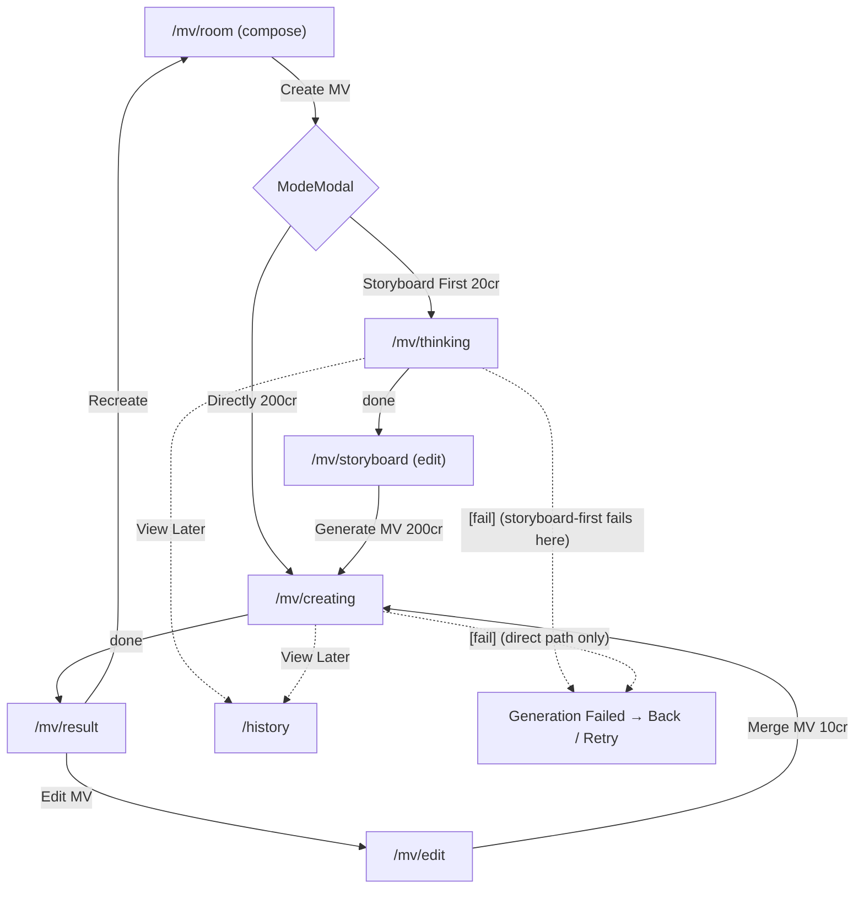

# Area 02 — AI Music Video Creation

> Read `../00-overview.md` first for conventions, the (area-qualified) ID scheme, and the global
> auth/credits/i18n models + global TBD register. This spec is **as-built** (current `web-app/`
> code); ⚠️ marks divergence from App Spec v3.0, ❓ points at a tracked `TBD-*`, 🔒 marks
> mock/in-memory behaviour.
>
> **Supersedes** `specs/mv-creation-flow.spec.md` (older, pre-auth). That file is removed when the
> batch phase lands.

---

## 1. Overview & scope

The end-to-end flow to create a music video: compose a brief (type, song, description, character
photos, output settings) → choose a generation mode → watch generation → (optionally) review/edit a
storyboard → view the result → share/publish or refine in Edit MV.

**In scope:** `/mv/room`, `/mv/thinking`, `/mv/storyboard`, `/mv/creating`, `/mv/result`, `/mv/edit`
and the sheets `ChooseSongModal`, `TrimAudioModal`, `FacePickerModal`, `SettingsModal`, `ModeModal`,
Templates (inline modal in `MvRoom`).
**Out of scope (other areas):** community MV player `/watch` (04); the app-shell chrome (01); the
credits/IAP modals (07); sign-in (09).
**External entry points into this flow (see area 05 / `CreationDialog`):** History/Community rows can
enter `/mv/edit`, `/mv/room` with **synthesized** MvFlow state — documented in MV-P6 below.

**Key divergences from the app** (details inline): create-flow entry is auth-gated (not "no gate");
no MV-type intro-carousel screen; Quality is Standard/High with no Pro gate; every song (incl. sample)
passes through Trim; Trim has no 30s minimum and no format/size validation; credits decrement only in
Edit MV.

---

## 2. Route / component / state / API map (RD)

| Route | View | Owns UI | Reads/writes state | `MuseApi` |
|---|---|---|---|---|
| `/mv/room` | `mv/MvRoom` | type picker, Choose Song, Describe, photos, Settings, CTA, Templates modal | `useMvFlow().compose`, `patchCompose`, `resetForNewMv` | `enhancePrompt` (Describe) |
| `/mv/thinking` | `StoryboardGenerationScreen` → `GenerationView` | progress ring, step, View Later | `startStoryboard`, `gen`, `storyboard` | `createMvJob(storyboard_first)`, `getMvJob` (poll) |
| `/mv/storyboard` | `StoryboardEditor` | character img, song, visual style, story, synopsis scenes, lyrics, Back, Save | `storyboard`, `setStoryboard`, `saveStoryboard`, `storyboardDirty`, `resetForRerender` | `enhancePrompt` (visual style) |
| `/mv/creating` | `RenderGenerationScreen` → `GenerationView` | progress, View Later | `startRender`, `gen`, `resultUrl` | `renderMvJob` (after storyboard/merge) **or** `createMvJob(direct)`; `getMvJob` (poll) |
| `/mv/result` | `MvResult` → `MvDetail` | video stage, like/dislike, share, download, publish toggle, Recreate, Edit MV | `resultUrl`, `compose`, `storyboard`, `useHistory` | — |
| `/mv/edit` | `MvEditor` | Back, cover + variants, scene timeline + takes, output settings, Save, Merge MV | `storyboard`, `compose`, `useCredits().addCredits` | `enhancePrompt` (scene, cover) |

**Providers:** `MvFlowProvider` (compose/storyboard/result + job polling), `HistoryProvider`
(`upsertGenerating`/`markCompleted`/`markFailed`), `CreditsProvider` (Edit MV only).
🔒 Only `MockMuseApi` today; mock derives progress from wall-clock (`STORYBOARD_MS≈7000` /
`RENDER_MS≈11000`).

---

## 3. State model & rules

**Compose (`ComposeState`)** — `src/lib/mv/types.ts` / `schemas.ts`:
- `mvType`: `singing` (default) | `storytelling` | `hybrid`.
- `song`: `null` | `{ id, source: library|import|sample|link, title, durationSec, art, url?, trim?{start,end}, lyrics? }` — **required**.
- `description`: string, **hard cap 2500** (`DESCRIPTION_MAX`) — **required** (non-empty after trim).
- `photos`: 0–2 `CharacterPhoto` (optional).
- `settings`: `ratio` 9:16(def)/16:9 · `resolution` **Standard(def)/High** · `title{on:true,text}` · `author{on:true,text}` · `showSubtitle:true` · `watermark:false`.
- **CTA-ready** (`isComposeReady`): `song != null && description.trim() !== ""`.

**Job (`MvJob`)** — `queued → processing(0–100, step) → done | failed`. `mode: storyboard_first | direct`.
- `storyboard_first` completes with `job.storyboard`; `direct`/`renderMvJob` complete with `job.resultUrl`.
- `[fail]` anywhere in `description` (mock `FAIL_TRIGGER`) → job fails at ~60%. **The fail marker is captured at `createMvJob` and reused by `renderMvJob`** — so on the storyboard-first path a `[fail]` job fails at the **storyboard (thinking)** stage; the post-edit render does not independently re-check. On the direct path it fails at **creating**.

**Storyboard (`Storyboard`)**: `characterImage`, `visualStyle` (editable), `scenes[]` (`{id, index, range, text}`; `text` editable, `id` is the React key + update key), `story` (read-only), `lyrics` (read-only, timestamped), `coverImage`, `coverDescription`. Persisted to `localStorage["mv-storyboard"]`; schema `.parse()` backfills older shapes. `storyboardDirty` = current storyboard ≠ last saved (i.e. scene text / visual style / cover description changed).

**Costs:** storyboard 20 · render 200 (`types.ts`); Edit-MV regen-scene 20 / cover 10 / merge 10 (hardcoded in `MvEditor.tsx`). Charging conflict → `TBD-GL-01`.

---

## 4. Journeys

Screens to capture later (storyboard-HTML phase): every route in §2.

### MV-P1 — Compose the MV brief (`/mv/room`)

| Step | User action | System response | On-screen text / rules |
|---|---|---|---|
| **MV-P1-S1** | Arrive at `/mv/room` (auth-gated) | Renders form; `mvType=singing`; CTA **disabled** | Title "AI Music Video". CTA hint: "Add a song and a description to continue." |
| **MV-P1-S2** | Tap an MV-type card | Selects type (purple border); autoplaying muted preview video per card | Types: Singing / Storytelling / Hybrid. ⚠️ No separate MV-type intro-carousel screen (→ `TBD-MV-07`). |
| **MV-P1-S3** | Choose a song | Opens `ChooseSongModal` (→ MV-P6-A) or Import-audio picker (→ MV-P6-B). **Both, and Sample songs, route through Trim (MV-P6-C) before the song is set.** After confirm: song card with play, Edit (re-trim), Change, Remove | Song is **required**. Card shows `effectiveDurationSec` (trimmed length). |
| **MV-P1-S4** | Type / paste a description | Updates `n/2500` counter; blocks keyboard/paste past 2500 | ⚠️ Hard 2500 cap is web-new. Shortcuts: **Templates**, **Ideas** (fills a random idea), **Enhance** (`enhancePrompt`, 🔒 mock). Note: shortcut-fills are not length-capped (see AC-MV-03). |
| **MV-P1-S5** | Add character photo(s) | Upload → `FacePickerModal` (→ MV-P6-D); Sample Photos strip adds directly; max 2 | Optional. "Add photo with single face" / "2nd face (optional)". |
| **MV-P1-S6** | Open Settings | `SettingsModal` (→ MV-P6-E) | Chips reflect current settings. |
| **MV-P1-S7** | Tap **Create Music Video** (enabled once ready) | `resetForNewMv()` then opens `ModeModal` (→ MV-P2/MV-P3) | CTA disabled while not ready. |

### MV-P2 — Storyboard-first generation

- **MV-P2-S1** In `ModeModal`, pick **Create Storyboard First** (Recommended · "~1 min" · `20` credits) → `router.push("/mv/thinking")`.
- **MV-P2-S2** `/mv/thinking`: on mount, if not `alreadyDone` (`storyboard == null`), `startStoryboard()` fires and **inserts a Generating row in History immediately**; ring shows `gen.progress`/`gen.step`; estimate "~1 minute" (display-only; mock ≈7s); **View Later** → `/history` (navigation only). Flow-guard: if compose not ready *and* no storyboard → redirect `/mv/room`.
- **MV-P2-S3** On `gen.status==="done"` → `/mv/storyboard` (`StoryboardEditor`). Edit **Visual Style** (+ Enhance) and each **Scene** synopsis; **Story** & **Lyrics** read-only; per-screen **Back** (`router.back()`); **Save changes** enabled only when `storyboardDirty`.
- **MV-P2-S4** Tap **Generate MV** (`200`) → `resetForRerender()` → `/mv/creating` → (MV-P3-S2).

### MV-P3 — Direct generation

- **MV-P3-S1** In `ModeModal`, pick **Create MV Directly** ("~2 min" · `200` credits) → `/mv/creating`.
- **MV-P3-S2** `/mv/creating`: `startRender()` (uses saved storyboard via `renderMvJob` if present, else `createMvJob(direct)`) and inserts a Generating row; ring/progress; estimate "~2 minutes" (display-only; mock ≈11s); View Later → `/history`.
- **MV-P3-S3** On `done` → `/mv/result`.

### MV-P4 — Result & actions (`/mv/result` via `MvDetail`)

- **MV-P4-S1** Video autoplays **muted + looped** with native controls on a square stage. ⚠️ App autoplays speaker-on; muted is a web/browser choice.
- **MV-P4-S2** Like / Dislike (mutually exclusive, local state) · **Share** (`ShareDialog`, link) · **Download** (`resultUrl`) · **Publish to community** toggle. **DECIDED (`TBD-MV-12`, sync App):** toggling Publish **on** opens a **"Ready to Go Public?" confirm dialog** (the same one History uses, area 05); on confirm → **Published · pending review**; toggling off **unpublishes**. On publish the client sends a **language/locale code** so the backend can rank the community feed locale-primary (backend/Curation — see area 04 §3; code format TBD `TBD-EXP-10`). (Feed pipeline/destination → `TBD-MV-06`, spec-only.)
- **MV-P4-S3** Info panel: type/character tags, title (settings title or song title), author (settings or `MOCK_USER.name`), Music row, Generation Detail (character, author, style, ratio, quality, scenes, subtitle).
- **MV-P4-S4** **Recreate** → `/mv/room` (keeps compose). **Edit MV** → `/mv/edit` (direct-mode renders, which have no storyboard, get a `mockStoryboard()` first). **DECIDED rule (`TBD-MV-13`):** a **published** (or in-review) MV must be **unpublished before editing** — while published, the Edit MV button renders **neutral (white bg / black text)** labeled **"Unpublish to edit MV"** (string optimizable); tapping it unpublishes, after which it returns to the accent **"Edit MV"** and opens the editor. No per-screen back arrow on Result — the shell handles back.

### MV-P5 — Edit MV (`/mv/edit`)

> **DECIDED (`TBD-MV-08`, sync App — supersedes the earlier "keep the multi-take tray" reading):**
> this version has **no "Project" mode** → **no Save**; edits are **ephemeral** (leaving `/mv/edit`
> loses them). Regenerate **overwrites in place** with **no take/cover picker** and **no undo**. The
> prototype's multi-take + cover-variant trays and the Save button are to be **hidden and code-marked**
> (not deleted) for a future richer version — see `../handoff.md`. Behaviour matches App F09.
>
> **As-built today (pre-change):** the code still has Save + the "Pick which take/cover to use" trays;
> the above is the target this round introduces.

- **MV-P5-S1** Header: per-screen **Back**, MV name, "N shots", **Merge MV** (`10`). **No Save button.** Context chips (type/song/ratio) are **read-only** — "Style & song are locked after creation".
- **MV-P5-S2** **Cover:** large preview (tap → lightbox); Edit description (modal + Enhance); **Recreate** cover (`10`, `addCredits(-10)`) **overwrites the cover directly** — no "pick which cover" tray, no undo.
- **MV-P5-S3** **Scenes:** timeline of scene thumbnails; side panel edits the active scene's prompt (max 2500 + Enhance); **Regenerate scene** (`20`, `addCredits(-20)`) **overwrites that scene's video directly** — no "pick which take" tray, no undo.
- **MV-P5-S4** **Output settings** modal: MV title/author toggles+inputs, Show subtitle, Show watermark (no ratio/quality here).
- **MV-P5-S5** **Merge MV** (`addCredits(-10)`) → `resetForRerender()` → `/mv/creating` → back to MV-P4, re-rendering the MV from the current (overwritten) cover/scenes + edited text. Enabled by **any** pending edit (text, regenerate, or settings). ⚠️ Credits decrement here.

### MV-P6 — Supporting sheets & external entries

- **MV-P6-A ChooseSongModal:** tabs **My Songs** (default) / **Sample Songs** (🔒 `MY_SONGS`/`SAMPLE_SONGS`); each row art/title/duration + **Use** → `onPick` (same handler for both tabs) → Trim. ⚠️ No in-modal inline preview (app F04-1 has one); preview happens on the song card in `/mv/room` after selection.
- **MV-P6-B Import audio:** real local file picker; derives duration from metadata, **falls back to 0 on error** (then Trim math uses a 180s fallback while the card shows `0:00`) → Trim. ⚠️ No format/size validation (app: MP3/AAC/WAV/M4A ≤50MB → `TBD-MV-02`).
- **MV-P6-C TrimAudioModal:** waveform + two drag handles; default select 15%→70%; min 5% gap; live preview of the selected region; **Use Trimmed Audio** stores `trim{start,end}` (full `durationSec` unchanged). ⚠️ **No 30s minimum** (app F04-2 enforces ≥30s / ≥MV length → `TBD-MV-01`). ⚠️ Sample-song trimming is web-new (app trims only library-import).
- **MV-P6-D FacePickerModal:** manual crop square + size slider (256×256 JPEG). Detected-face suggestions are supported by the component but **not passed** from `/mv/room` (manual-crop only as-built). ⚠️ App auto-detects up to 6 faces (→ `TBD-MV-03`).
- **MV-P6-E SettingsModal:** Aspect Ratio 9:16/16:9 · Quality **Standard/High** (SD/HD icons, **no Pro/crown gate** → `TBD-MV-04`) · Title/Author toggles+inputs · Show Subtitle · Show Watermark.
- **Templates** (inline `<Modal>` in `MvRoom`, not a separate component): grid of `TEMPLATES`; selecting fills `description` with the template prompt. ⚠️ Does **not** auto-select/lock a song (the old web spec claimed it did → `TBD-MV-05`).
- **External entries (`CreationDialog`, area 05):** from History/Community — **Recreate** → `/mv/room` (MV synthesizes compose with the row title); **Edit MV** → `/mv/edit` (fabricates a `mockStoryboard()` + a synthetic song with `durationSec:0`); **Use in MV** → `/mv/room` with a synthesized `library` song (`durationSec:0`). RD/QA: these enter the flow with placeholder state, not a real compose.

---

## 5. Error & edge states

| ID | Trigger | Behaviour |
|---|---|---|
| **MV-E1** | `description` contains `[fail]` (mock) | Job fails ~60% → "Generation Failed" screen: **Back** (→ `/mv/room`) + **Retry**. ⚠️ **Retry re-runs the same compose**, which still contains `[fail]`, so it **re-fails deterministically** — the error copy says "adjust your input" but there is no in-place edit; only Back returns to the form. (Mock-only artifact.) History row → Failed. |
| **MV-E2** | Reload / deep-link a mid-flow route with no in-memory state | Flow-guard `router.replace("/mv/room")` (thinking/creating & result: immediate; storyboard/edit: 400ms tolerant wait for localStorage hydrate). |
| **MV-E3** | Logged-out user hits `/mv/room` | `AuthGuard` opens `SignInModal`; dismiss → Home. |
| **MV-E4** | `/mv/thinking` or `/mv/creating` reached with a **persisted storyboard present but `gen` idle** (e.g. reload) | As-built: `valid` is true (no redirect) but `alreadyDone` skips `start()`, so progress **stays at 0% and never navigates — the screen can hang**. Intended behaviour undefined → `TBD-MV-09`. |
| **MV-E5** | Edit MV: leaving the page / regenerate | **DECIDED:** no Save/Project mode — edits are **ephemeral** and lost on leaving `/mv/edit`; regenerate (scene/cover) **overwrites** with **no undo**; **Merge** re-renders from the current state (`TBD-MV-08`/`TBD-MV-10`). |
| **MV-E6** | Choose Song with empty library | 🔒 seed always populated; empty-state to add → `TBD-MV-11` (sync App). |
| **MV-E7** | Attempt to Edit a **published** MV | Blocked while published/in-review — the Edit MV button reads **"Unpublish to edit MV"** (neutral); user must unpublish first (`TBD-MV-13`). Applies on `/mv/result` and should also apply to History's Edit MV (area 05). |

---

## 6. Acceptance criteria (EARS)

Legend: *(visual)* = verification blocked until the screenshot phase.

- **AC-MV-01** — WHEN `/mv/room` loads, THE SYSTEM SHALL default `mvType=singing` and keep **Create** disabled until `song != null` AND `description.trim() !== ""`.
- **AC-MV-02** — WHEN a song is selected from any source (My Songs, Sample Songs, or Import), THE SYSTEM SHALL route it through Trim, and on confirm show the song card (art/title/effective duration) and re-evaluate CTA-ready.
- **AC-MV-03** — WHEN the description is typed or pasted beyond 2500 chars, THE SYSTEM SHALL reject input past 2500 and show `2500/2500`. (Programmatic fills — Ideas/Templates/Enhance — are not length-capped; fixtures stay under the cap.)
- **AC-MV-04** — WHEN **Create** is tapped, THE SYSTEM SHALL run `resetForNewMv()` and open `ModeModal` preserving compose state.
- **AC-MV-05** — WHEN **Storyboard First** is chosen, THE SYSTEM SHALL navigate to `/mv/thinking` and start a storyboard job; WHEN **Directly**, navigate to `/mv/creating` and start a render job.
- **AC-MV-06** — WHEN a generation job starts, THE SYSTEM SHALL insert a Generating row in History; and WHILE `processing`, SHALL show 0–100% progress, a step label, an estimate, and a **View Later** control that navigates to `/history`.
- **AC-MV-07** — WHEN a storyboard job is `done`, THE SYSTEM SHALL navigate to `/mv/storyboard` populated with character image, song, visual style, story, timed scenes, and lyrics.
- **AC-MV-08** — WHEN Visual Style or a Scene text is edited, THE SYSTEM SHALL set `storyboardDirty` and enable **Save changes**; and persist on save.
- **AC-MV-09** — WHEN **Generate MV** is tapped, THE SYSTEM SHALL render using the (possibly edited) storyboard and land on `/mv/result`.
- **AC-MV-10** — WHEN `/mv/result` loads, THE SYSTEM SHALL loop the video muted and expose Like/Dislike (mutually exclusive), Share, Download, a **Publish toggle that opens a "Ready to Go Public?" confirm on turn-on**, Recreate, and **Edit MV** — where, while the MV is published/in-review, Edit MV is replaced by a neutral **"Unpublish to edit MV"** action.
- **AC-MV-11** — IF a job `failed`, THEN THE SYSTEM SHALL show the error state with **Back** and **Retry** and mark the History row Failed. (Retry with an unchanged `[fail]` description re-fails.)
- **AC-MV-12** — WHEN Regenerate scene or Recreate cover is invoked in Edit MV, THE SYSTEM SHALL **overwrite** that scene/cover in place (no take/cover picker, no undo) and decrement the balance (−20 / −10).
- **AC-MV-13** — WHEN **Merge MV** is invoked, THE SYSTEM SHALL re-render the MV from the current cover/scenes + edited text and decrement −10; there is **no Save** and edits do not persist across leaving the page.
- **AC-MV-14** — WHEN **Enhance** is invoked on the description, visual style, scene prompt, or cover description, THE SYSTEM SHALL replace that field with the value returned by `enhancePrompt` for the matching `kind`.
- **AC-MV-15** — WHEN a storyboard, render, or song job starts, THE SYSTEM SHALL NOT change the credit balance (only Edit-MV actions do). *(Locks in current behaviour pending `TBD-GL-01`.)*
- **AC-MV-16** — WHEN Trim is confirmed, THE SYSTEM SHALL store `{start,end}` with a ≥5% handle gap, leaving `durationSec` (full length) unchanged. *(No 30s minimum — see `TBD-MV-01`.)*
- **AC-MV-17** — THE SYSTEM SHALL render `/mv/room`, `/mv/storyboard`, `/mv/result`, `/mv/edit` at 390/768/1024/1440px with no overflow. *(visual)*

---

## 7. Per-path QA checklist

- [ ] **MV-P1**: fresh room CTA disabled → add song only → still disabled → add description → enabled (AC-01/02/03).
- [ ] **MV-P2**: Storyboard First → Generating row appears in History at start → progress 0→100 *(visual)* → storyboard with ≥1 editable scene → Save gated by dirty (AC-05/06/07/08).
- [ ] **MV-P3**: Directly → progress → result with `<video>` (AC-05/09/10).
- [ ] **MV-P4**: like/dislike exclusivity; Share dialog opens; Download triggers; **Publish on → "Ready to Go Public?" confirm**; **published → Edit MV shows "Unpublish to edit MV"**; Recreate returns to room prefilled; Edit MV opens editor when unpublished (AC-10, MV-E7).
- [ ] **MV-P5**: regen scene **overwrites** in place (−20, no picker); cover recreate **overwrites** (−10); **no Save button**; Merge (−10) → re-render; edits lost on leaving the page (AC-12/13).
- [ ] **MV-P6-C**: trim handles move, 5% min gap holds, preview plays selected region (AC-16).
- [ ] **MV-P6**: Enhance replaces each of the 4 fields (AC-14).
- [ ] **MV-E1**: `[fail]` → error + Retry, Retry re-fails (AC-11). **MV-E2**: reload `/mv/storyboard` → redirect to room. **MV-E3**: logged-out → sign-in modal. **MV-E4**: reload `/mv/thinking` with hydrated storyboard → confirm behaviour vs `TBD-MV-09`.
- [ ] **AC-15**: start a storyboard/render → balance unchanged.
- [ ] **AC-17**: four viewports clean *(visual)*.

---

## 8. Area TBD register — decisions 2026-07-22

**Decisions** — codebase change list in [`../handoff.md`](../handoff.md).

| ID | Decision |
|---|---|
| TBD-MV-01 | ✅ **Sync App** — Trim enforces ≥30s (and ≥ the MV's required length). |
| TBD-MV-02 | ✅ **Sync App** — import limited to MP3/AAC/WAV/M4A, ≤50MB; reject others with an error. |
| TBD-MV-03 | ⏸ **Phase 2** — multi-face auto-detect deferred; keep manual crop for MVP. |
| TBD-MV-04 | ✅ **Sync App** — "High" quality is Pro-gated (greyed + crown on free plan; tap → IAP). |
| TBD-MV-05 | ✅ **Resolved** — Template injects a **prompt only**; it does **not** select/lock a song (matches current code — the old-spec "locks a song" claim is dropped). No change. |
| TBD-MV-06 | ✅ **Sync App** frontend publish-confirm. Backend review pipeline = 📄 **spec-only** (Curation, `TBD-GL-05`) — no codebase change now. |
| TBD-MV-07 | ⏳ **Pending design** — MV-type intro / Style-Picker awaits the designer's guideline + confirmed UX flow. |
| TBD-MV-08 | ✅ **Sync App (SUPERSEDES the earlier "keep the multi-take tray" reading)** — Edit MV is app-consistent: **no take/cover picker**, regenerate **overwrites directly** (no undo), and **no Save/Project mode** (edits ephemeral). **Hide + code-mark** the removed multi-take/cover-variant/Save mechanisms for a future version (don't delete). |
| TBD-MV-09 | 🐞 **Bug (RD fix)** — generation screens can hang at 0% when state is hydrated-but-idle. |
| TBD-MV-10 | ✅ **Resolved by the Edit-MV rework** — with Save removed, **Merge** is enabled by any pending edit (incl. scene-text) and re-renders. |
| TBD-MV-11 | ✅ **Sync App** — Choose Song empty state ("You haven't created any songs yet" + create shortcut). |
| TBD-MV-12 | ✅ **Decided (sync App)** — MV result **Publish toggle-on opens a "Ready to Go Public?" confirm dialog** (reuse History's). |
| TBD-MV-13 | ✅ **Decided** — a **published** MV must be **unpublished before Edit MV**; while published the Edit MV button reads **"Unpublish to edit MV"** (neutral). Applies on `/mv/result` + History (area 05, `TBD-HIST-08`). |

See also global: `TBD-GL-01` (credit charging), `TBD-GL-02` (auth granularity).

| ID | Question |
|---|---|
| **TBD-MV-01** | **Trim minimum** — enforce app's ≥30s / ≥MV-length, or keep the current free-form 5%-gap trim? |
| **TBD-MV-02** | **Import validation** — enforce an audio format allow-list + 50MB cap (app), or accept any `audio/*` (incl. the duration-0 fallback in MV-P6-B)? |
| **TBD-MV-03** | **Face detection** — wire real multi-face auto-detect (app: up to 6) or keep manual crop? |
| **TBD-MV-04** | **Quality tier** — is "High" Pro-gated (app 1080p = Pro) or free? No gate exists today. |
| **TBD-MV-05** | **Templates** — should selecting a template also auto-select/lock a song (old web spec said so; code does not)? |
| **TBD-MV-06** | **Publish** — where does "Publish to community" write, and what is the review pipeline? (Ties to Curation PRD / area 04.) Local-only today. |
| **TBD-MV-07** | **MV-type intro** — is the app's Style-Picker/carousel intended for web, or intentionally dropped? |
| **TBD-MV-08** | **Edit-MV "takes"** — are per-scene takes meant to be real, committed, re-rendered variants, or cosmetic? Today only the cover commits on Merge; scene takes are discarded. Determines the Edit-MV data model. |
| **TBD-MV-09** | **Idle-with-state on generation screens** — what should `/mv/thinking` & `/mv/creating` do when a storyboard is hydrated but `gen` is idle (reload)? Today it can hang at 0% (MV-E4). |
| **TBD-MV-10** | **Text-only storyboard edit → re-render path** — a scene-text-only edit enables Save but not Merge (MV-E5); how should a text change reach a re-render? |
| **TBD-MV-11** | **Empty song library** — intended empty-state for Choose Song (seed always populated today). |

---

## 9. Flow diagram

---

## 10. Decisions & changelog

**Decisions (as-built):** desktop single-column compose + Trending aside; centered mode modal; muted
autoplay result; storyboard persisted to localStorage; credits display-only except Edit MV; every song
trims before use.

| Date | Change |
|---|---|
| 2026-07-22 | Rewritten as-built from current code. Supersedes `mv-creation-flow.spec.md`. |
| 2026-07-22 | Senior-RD review applied — accuracy fixes: all songs trim (not just library/import); Merge commits cover+text only (takes discarded, MV-P5-S5/AC-13); Generating row inserted at job start (AC-06); scene shape includes `id`; Edit-MV cost locations noted. Added MV-E4 (idle hang), MV-E5 (Save/Merge gate gap), MV-E6; corrected `[fail]` staging + mermaid; area-qualified IDs; MuseApi column; new AC-14/15/16; TBD register `TBD-MV-01…11`. |
