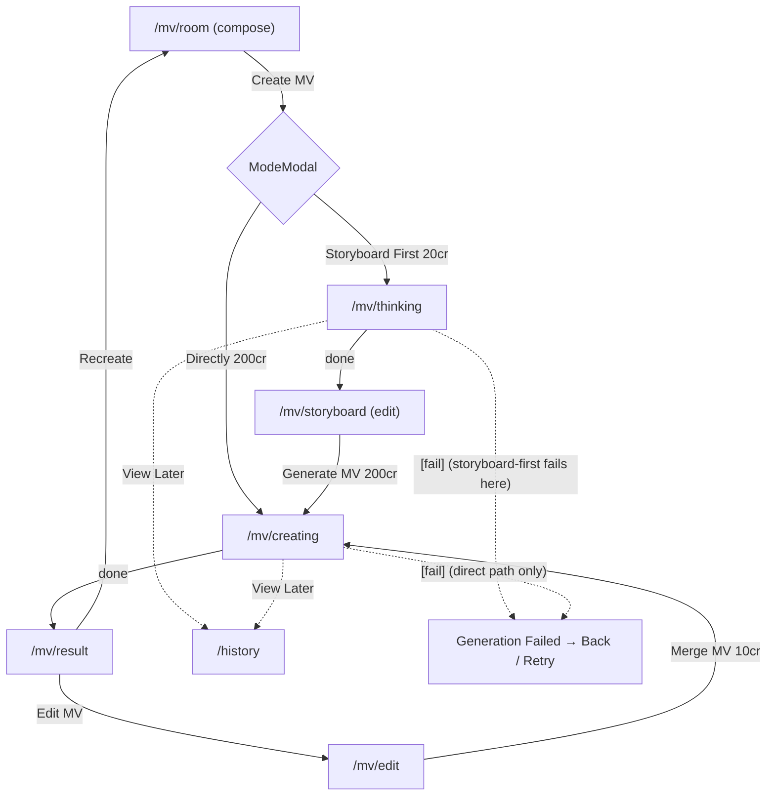

# Area 02 — AI Music Video Creation

> Read `../00-overview.md` first for conventions, the (area-qualified) ID scheme, and the global
> auth/credits/i18n models + global TBD register. This spec is **as-built** (current `web-app/`
> code); ⚠️ marks divergence from App Spec v3.0, ❓ points at a tracked `TBD-*`, 🔒 marks
> mock/in-memory behaviour.
>
> **Supersedes** the older pre-auth `mv-creation-flow.spec.md` (removed 2026-07-23).

---

## 1. Overview & scope

The end-to-end flow to create a music video: compose a brief (type, song, description, character
photos, output settings) → choose a generation mode → watch generation → (optionally) review/edit a
storyboard → view the result → share/publish or refine in Edit MV.

**In scope:** `/mv/room`, `/mv/thinking`, `/mv/storyboard`, `/mv/creating`, `/mv/result`, `/mv/edit`
and the six `/mv/room` overlays — `ChooseSongModal`, `TrimAudioModal`, `FacePickerModal`,
`SettingsModal`, `ModeModal`, `TemplateSheet`.

> **Naming, as of the designer-UI migration (slice 3g-2, 2026-08-06):** all six are now DP
> **sheets** (`MvSheet` → `.mv-sheet`), not the WA `<Modal>` this document was written against.
> The five `*Modal.tsx` filenames were kept so RD's existing references still resolve; **Templates
> is no longer inline in `MvRoom`** — it is its own component, `TemplateSheet.tsx`. Where this
> document says "modal" about one of these six, read "sheet". `/mv/creating` is the one route in
> this area **not** migrated, deliberately (it is the shared `GenerationView`).
> **Out of scope (other areas):** community MV player `/watch` (04); the app-shell chrome (01); the
> credits/IAP modals (07); sign-in (09).
> **External entry points into this flow (see area 05):** History/Community rows can
> enter `/mv/edit`, `/mv/room` with **synthesized** MvFlow state — documented in MV-P6 below.

**Key divergences from the app** (details inline): no MV-type intro-carousel screen; every song (incl.
sample) passes through Trim. **Synced to app 2026-07-23:** create is auth-gated at the action (GL-02);
**Quality "High" is Pro-gated** (MV-04); **Trim enforces ≥30s** (MV-01) and **import is limited to
MP3/AAC/WAV/M4A ≤50MB** (MV-02); **credits are charged on generation** (storyboard/render) with an
insufficient-balance → IAP route, in addition to the Edit-MV micro-charges (GL-01).

---

## 2. Route / component / state / API map (RD)

| Route            | View                                            | Owns UI                                                                                                                                                                                                                                                                                                                             | Reads/writes state                                                                                          | `MuseApi`                                                                              |
| ---------------- | ----------------------------------------------- | ----------------------------------------------------------------------------------------------------------------------------------------------------------------------------------------------------------------------------------------------------------------------------------------------------------------------------------- | ----------------------------------------------------------------------------------------------------------- | -------------------------------------------------------------------------------------- |
| `/mv/room`       | `mv/MvRoom`                                     | type picker, Choose Song, Describe, photos, Settings, CTA, Templates sheet, **two-mode side rail** (no Ideas button — removed for V1)                                                                                                                                                                                               | `useMvFlow().compose`, `patchCompose`, `resetForNewMv`; `useAuth().loggedIn`, `useHistory().history` (rail) | `enhancePrompt` (Describe)                                                             |
| `/mv/thinking`   | `StoryboardGenerationScreen` → `GenerationView` | progress ring, step, View Later                                                                                                                                                                                                                                                                                                     | `startStoryboard`, `gen`, `storyboard`                                                                      | `createMvJob(storyboard_first)`, `getMvJob` (poll)                                     |
| `/mv/storyboard` | `StoryboardEditor`                              | character img, **play-only** song, visual style, story, synopsis scenes, lyrics, Back, Generate MV (no Save)                                                                                                                                                                                                                        | `storyboard`, `setStoryboard`, `resetForRerender`, `useAudioPlayer` (song preview)                          | `enhancePrompt` (visual style)                                                         |
| `/mv/creating`   | `RenderGenerationScreen` → `GenerationView`     | progress, View Later                                                                                                                                                                                                                                                                                                                | `startRender`, `gen`, `resultUrl`                                                                           | `renderMvJob` (after storyboard/merge) **or** `createMvJob(direct)`; `getMvJob` (poll) |
| `/mv/result`     | `MvResult` (self-contained since 3i)            | **Back (→ History)**, video stage, like/dislike, share, download, publish toggle, Recreate, Edit MV                                                                                                                                                                                                                                 | `resultUrl`, `compose`, `storyboard`, `useHistory`                                                          | —                                                                                      |
| `/mv/edit`       | `MvEditor`                                      | Back, cover (+ lightbox), per-clip storyboard strip w/ preview + scene-version row, scene editor (phones: a full-screen scene view, DP's `MobileSceneDetail` — implemented inline in `MvEditor.tsx` behind `isPhone`, not a separate component file), output settings, Delete this Project, Merge MV (MV-08: no Save, no take tray) | `storyboard`, `compose`, `useCredits().{credits,addCredits}`                                                | `enhancePrompt` (scene, cover)                                                         |

**Providers:** `MvFlowProvider` (compose/storyboard/result + job polling), `HistoryProvider`
(`upsertGenerating`/`markCompleted`/`markFailed`), `CreditsProvider` (Edit MV only).
🔒 Only `MockMuseApi` today; mock derives progress from wall-clock (`STORYBOARD_MS≈7000` /
`RENDER_MS≈11000`).

---

## 3. State model & rules

**Compose (`ComposeState`)** — `src/lib/mv/types.ts` / `schemas.ts`:

- `mvType`: `singing` (default) | `storytelling` | `hybrid`.
- `song`: `null` | `{ id, source: library|import|sample|link, title, durationSec, art, url?, trim?{start,end}, lyrics? }` — **required**.
- `description`: string, **hard cap 2500** (`DESCRIPTION_MAX`) — **required** (non-empty after trim).
- `photos`: 0–2 `CharacterPhoto` (optional).
- `settings`: `ratio` 9:16(def)/16:9 · `resolution` **Standard(def)/High** · `title{on:true,text}` · `author{on:true,text}` · `showSubtitle:true` · `watermark:false`.
- **CTA-ready** (`isComposeReady`): `song != null && description.trim() !== ""`.

**Job (`MvJob`)** — `queued → processing(0–100, step) → done | failed`. `mode: storyboard_first | direct`.

- `storyboard_first` completes with `job.storyboard`; `direct`/`renderMvJob` complete with `job.resultUrl`.
- `[fail]` anywhere in `description` (mock `FAIL_TRIGGER`) → job fails at ~60%. **The fail marker is captured at `createMvJob` and reused by `renderMvJob`** — so on the storyboard-first path a `[fail]` job fails at the **storyboard (thinking)** stage; the post-edit render does not independently re-check. On the direct path it fails at **creating**.

**Storyboard (`Storyboard`)**: `characterImage`, `visualStyle` (editable), `scenes[]` (`{id, index, range, text}`; `text` editable, `id` is the React key + update key), `story` (read-only), `lyrics` (read-only, timestamped), `coverImage`, `coverDescription`. Persisted to `localStorage["mv-storyboard"]`; schema `.parse()` backfills older shapes. `storyboardDirty` = current storyboard ≠ last saved (i.e. scene text / visual style / cover description changed).

**Costs:** storyboard 20 · render 200 (`types.ts`); Edit-MV regen-scene `COST_REGEN=20` / cover `COST_COVER=4`; Merge is the re-render, priced at `COST_RENDER`. _(Cover corrected 10→4 on 2026-08-19 from code — it was repriced 2026-08-12 per `TBD-CC-02`; the separate merge-10 figure was wrong, Merge has never had its own constant.)_ These three (storyboard / render / regen) remain placeholders vs `areas/11-credit-consumption.md`, which is the authority — see `TBD-CC-05`.

---

## 4. Journeys

Screens to capture later (storyboard-HTML phase): every route in §2.

### MV-P1 — Compose the MV brief (`/mv/room`)

| Step         | User action                                               | System response                                                                                                                                                                                                                                                                                           | On-screen text / rules                                                                                                                                                                                                                                                                              |
| ------------ | --------------------------------------------------------- | --------------------------------------------------------------------------------------------------------------------------------------------------------------------------------------------------------------------------------------------------------------------------------------------------------- | --------------------------------------------------------------------------------------------------------------------------------------------------------------------------------------------------------------------------------------------------------------------------------------------------- |
| **MV-P1-S0** | Arrive at `/mv/room` — desktop **side rail** (2026-08-06) | Two modes, following DP: **"Trending MVs"** over `NEW_MVS` with a "See all" → `/explore/mvs`, or **"My Creations"** over the user's own finished MVs from `useHistory()`, with **no** "See all" (DP renders none in that branch) and each row opening `/mv/result?id=` via the shared seed-then-navigate. | The My Creations branch needs `loggedIn` **and** ≥1 completed MV — DP keys on sign-in alone because its fixture is never empty; WA's list is real and starts empty. 🔒 History is in-memory, so a reload puts the rail back to Trending.                                                            |
| **MV-P1-S1** | Arrive at `/mv/room` (auth-gated)                         | Renders form; `mvType=singing`; CTA **disabled**                                                                                                                                                                                                                                                          | Title "AI Music Video". **No CTA hint text** — DP's `MVCreatePage` has no such line and `MVCreatePage.css` has no class for one. _(The "Add a song and a description to continue." requirement was removed 2026-08-20: 以 DP 為準。This also closes `TODO.md` 7h, which existed only to chase it.)_                                                                                                                                                                                                                       |
| **MV-P1-S2** | Tap an MV-type card                                       | Selects type (purple border); autoplaying muted preview video per card                                                                                                                                                                                                                                    | Types: Singing / Storytelling / Hybrid — **three cards, each autoplaying its own `feature_intro_ai_mv_*` video**. That IS the type introduction; there is no separate carousel, in DP or here. _(Corrected 2026-08-20 against DP `MVCreatePage.tsx:45-47,91-93`.)_ ⚠️ **The on-screen label for `hybrid` is &ldquo;Sing &amp; Story&rdquo;, not &ldquo;Hybrid&rdquo;** (product owner request, 2026-08-13) — the `id` stays `hybrid` (`MvTypeSchema`, frozen contract surface), only the DISPLAY name changed. Corrected 2026-08-27 from code (`src/lib/mv/mock.ts` `MV_TYPES`) during the S2 storyboard-spec capture.                                                                                                                                                                                               |
| **MV-P1-S3** | Choose a song                                             | Opens `ChooseSongModal` (→ MV-P6-A) or Import-audio picker (→ MV-P6-B). **Both, and Sample songs, route through Trim (MV-P6-C) before the song is set.** After confirm: song card with play, Edit (re-trim), Change, Remove                                                                               | Song is **required**. Card shows `effectiveDurationSec` (trimmed length).                                                                                                                                                                                                                           |
| **MV-P1-S4** | Type / paste a description                                | Updates `n/2500` counter; blocks keyboard/paste past 2500                                                                                                                                                                                                                                                 | ⚠️ Hard 2500 cap is web-new. Shortcuts: **Templates**, **Enhance** (`enhancePrompt`, 🔒 mock). **The "Ideas" button was removed 2026-08-06** — V1 ships no canned-sample fillers; a deliberate subtraction from DP, which still has one. Note: shortcut-fills are not length-capped (see AC-MV-03). |
| **MV-P1-S5** | Add character photo(s)                                    | Upload → `FacePickerModal` (→ MV-P6-D); Sample Photos strip adds directly; max 2                                                                                                                                                                                                                          | Optional. "Add photo with single face" / "2nd face (optional)".                                                                                                                                                                                                                                     |
| **MV-P1-S6** | Open Settings                                             | `SettingsModal` (→ MV-P6-E)                                                                                                                                                                                                                                                                               | Chips reflect current settings.                                                                                                                                                                                                                                                                     |
| **MV-P1-S7** | Tap **Create Music Video** (enabled once ready)           | `resetForNewMv()` then opens `ModeModal` (→ MV-P2/MV-P3)                                                                                                                                                                                                                                                  | CTA disabled while not ready.                                                                                                                                                                                                                                                                       |

### MV-P2 — Storyboard-first generation

- **MV-P2-S1** In `ModeModal`, pick **Create Storyboard First** (Recommended · "~1 min" · `20` credits) → `router.push("/mv/thinking")`.
- **MV-P2-S2** `/mv/thinking`: on mount, if not `alreadyDone` (`storyboard == null`), `startStoryboard()` fires and **inserts a Generating row in History immediately**; ring shows `gen.progress`/`gen.step`; estimate "~1 minute" (display-only; mock ≈7s); **View Later** → `/history` (navigation only). Flow-guard: if compose not ready _and_ no storyboard → redirect `/mv/room`.
- **MV-P2-S3** On `gen.status==="done"` → `/mv/storyboard` (`StoryboardEditor`). Edit **Visual Style** (+ Enhance) and each **Scene** synopsis; **Story** & **Lyrics** read-only; the **MV Song is play-only** — tap its thumbnail to play/pause the track, but it can't be changed (locked after creation) (2026-07-23). per-screen **Back** (`router.back()`). **No "Save changes" button** (removed 2026-07-23) — edits are ephemeral and carried into **Generate MV**, which re-renders from the current storyboard state.
- **MV-P2-S4** Tap **Generate MV** (`200`) → `resetForRerender()` → `/mv/creating` → (MV-P3-S2).

### MV-P3 — Direct generation

- **MV-P3-S1** In `ModeModal`, pick **Create MV Directly** ("~2 min" · `200` credits) → `/mv/creating`.
- **MV-P3-S2** `/mv/creating`: `startRender()` (uses saved storyboard via `renderMvJob` if present, else `createMvJob(direct)`) and inserts a Generating row; ring/progress; estimate "~2 minutes" (display-only; mock ≈11s); View Later → `/history`.
- **MV-P3-S3** On `done` → `/mv/result`.

### MV-P4 — Result & actions (`/mv/result`, self-contained since slice 3i)

- **MV-P4-S0 (2026-08-06)** The screen is reachable two ways: at the end of a generation, and from a done MV row in `/history` (area 05, `?id=` carries the row). **Back** goes `router.back()` with `/history` as the fallback.

- **MV-P4-S1** Video autoplays **muted + looped** with native controls on a square stage. ⚠️ App autoplays speaker-on; muted is a web/browser choice. _(Corrected 2026-08-19: the player uses a hand-built control row — play / seek / mute / fullscreen — not the browser's native `controls`. Changed during the designer migration; this line was not updated.)_
- **MV-P4-S2** Like / Dislike (mutually exclusive, local state) · **Share** (`ShareDialog`, link) · **Download** (`resultUrl`) · **Publish to community** toggle. **DECIDED (`TBD-MV-12`, sync App):** toggling Publish **on** opens a **"Ready to Go Public?" confirm dialog** (the same one History uses, area 05); on confirm → **Published · pending review**; toggling off **unpublishes**. **Locale ranking is RD's, not ours (產品負責人 2026-08-20).** The community feed's locale-primary ranking, including whatever locale value the request carries, is decided and implemented by RD end-to-end — the web prototype sends nothing and is not expected to. This is deliberately NOT listed as a front-end gap so RD does not read it as work waiting on us. (Feed ranking → area 04 §3 / `TBD-EXP-10`, owner RD.) (Feed pipeline/destination → `TBD-MV-06`, spec-only.) 🔒 On this fresh-generation screen, publish state is **local to `MvResult`** (there is no History row to share it with yet); opening the _same_ creation later from History uses the controlled path described in area 05 §3, where the row's `⋯` menu and its detail dialog share one state.
- **MV-P4-S3** Info panel: type/character tags, title (settings title or song title), author (settings or `MOCK_USER.name`), Music row, Generation Detail (character, author, style, ratio, quality, scenes, subtitle).
- **MV-P4-S4** **Recreate** → `/mv/room` (keeps compose). **Edit MV** → `/mv/edit` (direct-mode renders, which have no storyboard, get a `mockStoryboard()` first). **DECIDED rule (`TBD-MV-13`):** a **published** (or in-review) MV must be **unpublished before editing** — while published, the Edit MV button renders **neutral (white bg / black text)** labeled **"Unpublish to edit"**; tapping it unpublishes, after which it returns to the accent **"Edit MV"** and opens the editor. No per-screen back arrow on Result — the shell handles back.

### MV-P5 — Edit MV (`/mv/edit`)

> **DECIDED (`TBD-MV-08`, sync App — supersedes the earlier "keep the multi-take tray" reading):**
> this version has **no "Project" mode** → **no Save**; edits are **ephemeral** (leaving `/mv/edit`
> loses them). Regenerate **overwrites in place** with **no take/cover picker** and **no undo**. The
> prototype's multi-take + cover-variant trays and the Save button were **hidden and code-marked**
> (not deleted) for a future richer version. Behaviour matches App F09.
>
> **As-built (MV-08 landed 2026-07-23; re-stated 2026-08-06, slice 3k):** Regenerate/Recreate
> auto-select the new result so it overwrites in place. **Merge MV is the re-render, priced at
> `COST_RENDER` (200)** — the former local `COST_MERGE` (10) was removed to avoid double-charging
> with GL-01. ⚠️ **The `LEGACY_TAKE_TRAY_UI = false` flag and the hidden tray markup are GONE**
> (3k): the designer prototype has no design for them, and a flag guarding dead markup inside a
> migrated screen is worse than the decision it recorded. MV-08's rule is unchanged — only its
> escape hatch is. Reviving trays means designing them, not flipping a flag.

- **MV-P5-S1** Header: DP renders **`DetailNavbar` alone** — back, the title "Edit Music Video", and the credit balance (`MVEditPage.tsx:404`). **Merge MV** lives in the page footer, priced at `COST_MERGE`. **No Save button.**
  > _Corrected 2026-08-20 以 DP 為準._ The previous wording required a **"N shots" count** and **read-only type/song/ratio chips** carrying "Style & song are locked after creation". **DP has none of the three**, and `MVEditPage.css` has no class for any of them — they described the pre-migration WA screen. Removed rather than left as a gap; `DESIGNER-TODO` **A25** is closed by this.
- **MV-P5-S2** **Cover:** large preview (Expand → lightbox, Download); a **Cover description** textarea + Enhance; **Recreate** cover (`COST_COVER`, currently **4**) **overwrites the cover directly** — no "pick which cover" tray, no undo. _(Was 10; repriced 2026-08-12, spec corrected 2026-08-19.)_
- **MV-P5-S3** **Scenes:** a per-clip storyboard strip with an inline video preview and its own transport; the scene editor edits the active scene's prompt (max 2500 + Enhance) and shows a **scene-version history row**; **Recreate scene** (`20`, `addCredits(-20)`) **overwrites that scene's video directly** — no "pick which take" tray, no undo. **Below 768px the inline editor and the preview are replaced by a full-screen `MobileSceneDetail`** (DP's phone frame has no room for the inline pair).
- **MV-P5-S4** **Output settings are inline sections of the right rail, not a modal**: MV title toggle+input, Author name toggle+input, Show Subtitle, Show Watermark (no ratio/quality here). The two ON-OFF switches are WA's — DP ships the text inputs alone, but `settings.title.on` / `settings.author.on` are `MvSettingsSchema` fields (contract surface C2) and decide whether the caption is burned in at all.
- **MV-P5-S6** **Delete this Project** (DP's control; DP's own handler is dead) confirms with History's wording and then discards the in-memory flow and leaves — which is what deleting an uncommitted project means when the flow state is in memory. It does **not** call a backend delete.
- **MV-P5-S5** **Merge MV** → `resetForRerender()` → `/mv/creating`, where `startRender` charges `COST_RENDER` (200, refunded on failure — GL-01); re-renders the MV from the current (overwritten) cover/scenes + edited text. Enabled by **any** pending edit (text, regenerate, cover, or settings — incl. `storyboardDirty`). If `credits < COST_RENDER`, Merge opens `BuyCreditsModal` instead.

### MV-P6 — Supporting sheets & external entries

- **MV-P6-A ChooseSongModal:** tabs **My Songs** (default) / **Sample Songs** (🔒 `MY_SONGS`/`SAMPLE_SONGS`); each row art/title/duration + **Use** → `onPick` (same handler for both tabs) → Trim. ⚠️ **Stale as of slice 3g-2 (2026-08-06) — the migration ADDED an in-modal inline preview.** Tapping a row now plays/pauses that song right there (art swaps to a pause icon, a live position readout replaces the duration) via `useAudioPlayer`; the row's **Use** pill is revealed on hover/tap/focus. This line used to say the opposite ("No in-modal inline preview"), true of the pre-migration `Modal` this document was written against but not of the current `MvSheet`-based component. Corrected 2026-08-27 from code (`ChooseSongModal.tsx`) during the S2 storyboard-spec capture; the song card on `/mv/room` still ALSO plays/pauses after selection, so both previews exist now, not one.
- **MV-P6-B Import audio:** real local file picker. **MV-02 (2026-07-23):** accepts only MP3/AAC/WAV/M4A up to 50MB (by extension or MIME) — otherwise an error toast and no import. On accept, derives duration from metadata, **falls back to 0 on error** (then Trim math uses a 180s fallback while the card shows `0:00`) → Trim.
- **MV-P6-C TrimAudioModal:** waveform + two drag handles; default select 15%→70%; min 5% gap; live preview of the selected region; a **Confirm** footer button (⚠️ **not** &ldquo;Use Trimmed Audio&rdquo; — that was the pre-migration `Modal`'s own label; slice 3g-2's `MvSheet` shell gives every one of the six sheets the same generic Cancel/Confirm footer, so this one reads plain &ldquo;Confirm&rdquo; like its siblings. Corrected 2026-08-27 from code during the S2 storyboard-spec capture, also visible in `e2e/mv-flow.spec.ts`'s own comment on the same rename) stores `trim{start,end}` (full `durationSec` unchanged). **MV-01 (2026-07-23):** the selected length must be **≥30s** — below that the button is disabled and a "minimum 30s" hint shows. ⚠️ Sample-song trimming is web-new (app trims only library-import).
- **MV-P6-D FacePickerModal:** manual crop square + size slider (256×256 JPEG). Detected-face suggestions are supported by the component but **not passed** from `/mv/room` (manual-crop only as-built). ⚠️ App auto-detects up to 6 faces (→ `TBD-MV-03`).
- **MV-P6-E SettingsModal:** Aspect Ratio 9:16/16:9 · Quality **Standard/High** (SD/HD icons). **MV-04 (2026-07-23):** on the free plan **"High" is greyed with a crown**; tapping it opens `SubscribeModal` (IAP) instead of selecting. Subscribers select it normally. · Title/Author toggles+inputs · Show Subtitle · Show Watermark.
- **MV-P6-F TemplateSheet** (its own component since 3g-2 — it used to be an inline `<Modal>` in `MvRoom`): grid of `TEMPLATES`; selecting fills `description` with the template prompt. ⚠️ Does **not** auto-select/lock a song (the old web spec claimed it did → `TBD-MV-05`).
- **External entries (area 05's `useOpenCreation` / `useSeedMvFlow`):** from History — **Create MV** → `/mv/room`, **Edit MV** → `/mv/edit`, and opening a done row → `/mv/result`. All three fabricate flow state from the row (a `mockStoryboard()` plus a synthetic song with `durationSec:145`). RD/QA: these enter the flow with placeholder state, not a real compose. _(Until 2026-08-06 this went through `CreationDialog`, now deleted.)_

---

## 5. Error & edge states

| ID        | Trigger                                                                                                       | Behaviour                                                                                                                                                                                                                                                                                                                                                                                                                                                                                                                                                                  |
| --------- | ------------------------------------------------------------------------------------------------------------- | -------------------------------------------------------------------------------------------------------------------------------------------------------------------------------------------------------------------------------------------------------------------------------------------------------------------------------------------------------------------------------------------------------------------------------------------------------------------------------------------------------------------------------------------------------------------------- |
| **MV-E1** | `description` contains `[fail]` (mock)                                                                        | Job fails ~60% → "Generation Failed" screen: **Back** (→ `/mv/room`) + **Retry**. ⚠️ **Retry re-runs the same compose**, which still contains `[fail]`, so it **re-fails deterministically** — the error copy says "adjust your input" but there is no in-place edit; only Back returns to the form. (Mock-only artifact.) History row → Failed.                                                                                                                                                                                                                           |
| **MV-E2** | Reload / deep-link a mid-flow route with no in-memory state                                                   | Flow-guard `router.replace("/mv/room")` (thinking/creating & result: immediate; storyboard/edit: 400ms tolerant wait for localStorage hydrate).                                                                                                                                                                                                                                                                                                                                                                                                                            |
| **MV-E3** | Logged-out user hits `/mv/room`                                                                               | **No route guard — the page renders.** ⚠️ **Corrected 2026-08-12:** this row used to say "`AuthGuard` opens `SignInModal`; dismiss → Home". `/mv/room` lost its `AuthGuard` on 2026-08-07 by designer request — it is the destination of the marketing Navbar's **Start for Free**, so a guest must be able to browse and compose first. The gate moved to the action: `MvRoom`'s **Create Music Video** button calls `requireLogin` before opening the mode chooser (GL-02). Dismissing that modal leaves the user on `/mv/room` with their draft intact. See area 09 §3. |
| **MV-E4** | `/mv/thinking` or `/mv/creating` reached with a **persisted storyboard present but `gen` idle** (e.g. reload) | **Fixed (MV-09, 2026-07-23):** `GenerationView` now forwards to `nextHref` when `alreadyDone` (the artifact already exists), so it no longer hangs at 0%.                                                                                                                                                                                                                                                                                                                                                                                                                  |
| **MV-E5** | Edit MV: leaving the page / regenerate                                                                        | **DECIDED:** no Save/Project mode — edits are **ephemeral** and lost on leaving `/mv/edit`; regenerate (scene/cover) **overwrites** with **no undo**; **Merge** re-renders from the current state (`TBD-MV-08`/`TBD-MV-10`).                                                                                                                                                                                                                                                                                                                                               |
| **MV-E6** | Choose Song with empty library                                                                                | 🔒 seed always populated; empty-state to add → `TBD-MV-11` (sync App).                                                                                                                                                                                                                                                                                                                                                                                                                                                                                                     |
| **MV-E7** | Attempt to Edit a **published** MV                                                                            | Blocked while published/in-review — the Edit MV button reads **"Unpublish to edit"** (neutral); user must unpublish first (`TBD-MV-13`). Applies on `/mv/result` and History's Edit MV (area 05).                                                                                                                                                                                                                                                                                                                                                                          |

---

## 6. Acceptance criteria (EARS)

Legend: _(visual)_ = verification blocked until the screenshot phase.

- **AC-MV-01** — WHEN `/mv/room` loads, THE SYSTEM SHALL default `mvType=singing` and keep **Create** disabled until `song != null` AND `description.trim() !== ""`.
- **AC-MV-01b** — WHILE logged out, WHEN `/mv/room` is opened, THE SYSTEM SHALL render the full compose screen with no sign-in modal; and THE SYSTEM SHALL open the sign-in modal only when the user activates **Song Library** or **Create Music Video**. **Import Audio stays ungated** — a file the user already holds is not account data, and it is therefore the only way a guest can reach a CTA-ready state (AC-MV-01 needs a song). _(new 2026-08-12; see area 09 AC-AUTH-08)_
- **AC-MV-02** — WHEN a song is selected from any source (My Songs, Sample Songs, or Import), THE SYSTEM SHALL route it through Trim, and on confirm show the song card (art/title/effective duration) and re-evaluate CTA-ready.
- **AC-MV-03** — WHEN the description is typed or pasted beyond 2500 chars, THE SYSTEM SHALL reject input past 2500 and show `2500/2500`. (Programmatic fills — Templates/Enhance — are not length-capped; fixtures stay under the cap.)
- **AC-MV-04** — WHEN **Create** is tapped, THE SYSTEM SHALL run `resetForNewMv()` and open `ModeModal` preserving compose state.
- **AC-MV-05** — WHEN **Storyboard First** is chosen, THE SYSTEM SHALL navigate to `/mv/thinking` and start a storyboard job; WHEN **Directly**, navigate to `/mv/creating` and start a render job.
- **AC-MV-06** — WHEN a generation job starts, THE SYSTEM SHALL insert a Generating row in History; and WHILE `processing`, SHALL show 0–100% progress, a step label, an estimate, and a **View Later** control that navigates to `/history`.
- **AC-MV-07** — WHEN a storyboard job is `done`, THE SYSTEM SHALL navigate to `/mv/storyboard` populated with character image, song, visual style, story, timed scenes, and lyrics.
- **AC-MV-08** — WHEN Visual Style or a Scene text is edited in `/mv/storyboard`, THE SYSTEM SHALL update the in-memory storyboard (no Save button; edits are ephemeral) and carry the change into the next **Generate MV**. The MV Song section SHALL be **play-only** (no editing).
- **AC-MV-09** — WHEN **Generate MV** is tapped, THE SYSTEM SHALL render using the (possibly edited) storyboard and land on `/mv/result`.
- **AC-MV-18** — WHEN `/mv/result` is reached from a `/history` row, THE SYSTEM SHALL show that row's creation (flow state is seeded by `useOpenCreation`, area 05) and carry the row id in `?id=` so Share builds that row's link; and **Back** SHALL return to `/history`. _(Back is `router.back()` per Q6; `/history` is also the fallback. The generation screens `replace` rather than `push`, so Back off a freshly rendered MV reaches `/mv/room`, not the creating screen.)_
- **AC-MV-10** — WHEN `/mv/result` loads, THE SYSTEM SHALL loop the video muted and expose Like/Dislike (mutually exclusive), Share, Download, a **Publish toggle that opens a "Ready to Go Public?" confirm on turn-on**, Recreate, and **Edit MV** — where, while the MV is published/in-review, Edit MV is replaced by a neutral **"Unpublish to edit"** action. _(Same correction as MV-P4-S1: hand-built controls, not native ones — 2026-08-19.)_
- **AC-MV-11** — IF a job `failed`, THEN THE SYSTEM SHALL show the error state with **Back** and **Retry** and mark the History row Failed. (Retry with an unchanged `[fail]` description re-fails.)
- **AC-MV-12** — WHEN Regenerate scene or Recreate cover is invoked in Edit MV, THE SYSTEM SHALL **overwrite** that scene/cover in place (no take/cover picker, no undo) and decrement the balance (`COST_REGEN` −20 / `COST_COVER` −4). _(Cover corrected from −10 on 2026-08-19.)_
- **AC-MV-13** — WHEN **Merge MV** is invoked with sufficient balance, THE SYSTEM SHALL re-render the MV from the current cover/scenes + edited text and charge `COST_RENDER` (−200) on generation start (refunded on failure); there is **no Save** and edits do not persist across leaving the page. WHEN the balance is insufficient, it SHALL open the buy-credits IAP instead.
- **AC-MV-14** — WHEN **Enhance** is invoked on the description, visual style, scene prompt, or cover description, THE SYSTEM SHALL replace that field with the value returned by `enhancePrompt` for the matching `kind`.
- **AC-MV-15** — ~~WHEN a storyboard, render, or song job starts, THE SYSTEM SHALL NOT change the credit balance (only Edit-MV actions do).~~ **WITHDRAWN 2026-08-19 — this was written backwards.** It contradicted `AC-MV-19` in this same file, and the code, `00-overview` §6, the e2e guard `G5-d#1` and the QA checklist below all implement the opposite. **The charging rule is `AC-MV-19`: charge on generation start, refund on failure.** Nothing replaces this ID; it is retired rather than renumbered so existing references resolve to this note.
- **AC-MV-16** — WHEN Trim is confirmed, THE SYSTEM SHALL store `{start,end}` (leaving `durationSec` unchanged) only when the selected length is **≥30s** (MV-01); below that the confirm is disabled.
- **AC-MV-17** — WHEN a local audio file is imported, THE SYSTEM SHALL accept only MP3/AAC/WAV/M4A ≤50MB and reject anything else with an error toast (MV-02).
- **AC-MV-18b** — WHILE on the free plan, WHEN "High" quality is tapped in Settings, THE SYSTEM SHALL open the subscribe IAP rather than selecting it (MV-04). _(Renumbered 2026-08-19 — `AC-MV-18` was used twice; the history-entry criterion above keeps the plain id.)_
- **AC-MV-19** — WHEN storyboard or render generation starts, THE SYSTEM SHALL charge the matching cost (COST_STORYBOARD/COST_RENDER) and refund on failure; and WHEN the balance is insufficient at the CTA (mode select / Generate MV / Merge), it SHALL route to the buy-credits IAP (GL-01).
- **AC-MV-17b** — THE SYSTEM SHALL render `/mv/room`, `/mv/storyboard`, `/mv/result`, `/mv/edit` at 320/375/768/1024/1440/1920px with no overflow. _(visual)_ _(Renumbered 2026-08-19 — `AC-MV-17` was used twice; the audio-import criterion above keeps the plain id. Widths updated to the six-tier set the code and `visual-baseline.spec.ts` actually use.)_

---

## 7. Per-path QA checklist

- [ ] **MV-P1**: fresh room CTA disabled → add song only → still disabled → add description → enabled (AC-01/02/03).
- [ ] **MV-P2**: Storyboard First → Generating row appears in History at start → progress 0→100 _(visual)_ → storyboard with ≥1 editable scene; **MV Song plays on tap, not editable**; **no Save button**; edits carried into Generate MV (AC-05/06/07/08).
- [ ] **MV-P3**: Directly → progress → result with `<video>` (AC-05/09/10).
- [ ] **MV-P4**: like/dislike exclusivity; Share dialog opens; Download triggers; **Publish on → "Ready to Go Public?" confirm**; **published → Edit MV shows "Unpublish to edit"**; Recreate returns to room prefilled; Edit MV opens editor when unpublished (AC-10, MV-E7).
- [ ] **MV-P5**: regen scene **overwrites** in place (−20, no picker); cover recreate **overwrites** (−10); **no Save button and no tray markup at all** (the `LEGACY_TAKE_TRAY_UI` flag was deleted in 3k); Merge charges `COST_RENDER` (−200) on re-render, or opens IAP when short; edits lost on leaving the page (AC-12/13/19). Check the phone path too: below 768px the scene editor is `MobileSceneDetail`, not the inline pair.
- [ ] **MV-P6-C**: trim handles move, 5% min gap holds, preview plays selected region (AC-16).
- [ ] **MV-P6**: Enhance replaces each of the 4 fields (AC-14).
- [ ] **MV-E1**: `[fail]` → error + Retry, Retry re-fails (AC-11). **MV-E2**: reload `/mv/storyboard` → redirect to room. **MV-E3**: logged-out → sign-in modal. **MV-E4**: reload `/mv/thinking` with hydrated storyboard → confirm behaviour vs `TBD-MV-09`.
- [ ] **AC-19**: start a storyboard/render → balance drops by the matching cost immediately; a failed job refunds it. _(Was "AC-15: balance unchanged" — corrected 2026-08-19, see AC-MV-15.)_
- [ ] **AC-17**: four viewports clean _(visual)_.

---

## 8. Open items for RD

| ID            | Open item                                                                                                                                                                                                                    |
| ------------- | ---------------------------------------------------------------------------------------------------------------------------------------------------------------------------------------------------------------------------- |
| **TBD-MV-03** | ⏸ **Phase 2** — multi-face auto-detect deferred; MVP keeps manual crop (app supports up to 6 detected faces).                                                                                                                |
| **TBD-MV-06** | 📄 **Backend pipeline undefined** — the frontend publish-confirm is built, but where "Publish to community" actually writes and what the review pipeline does is spec-only, tied to the Curation PRD (`TBD-GL-05`, area 04). |
| ~~**TBD-MV-07**~~ | ✅ **2026-08-20 結案 — 不需要 carousel。** 以現在的 DP 為準：`MVCreatePage` 只有三張類型卡，每張自動播放自己的 `feature_intro_ai_mv_{singing,storytelling,hybrid}` 影片，**那就是類型介紹**。carousel 是遷移前的舊規格描述，DP 從未畫過。WA 的實作已與 DP 一致，沒有缺口。 |
| **TBD-MV-11** | ⏳ **Empty song library** — Choose Song's seed is always populated today; the intended empty-state ("You haven't created any songs yet" + create shortcut) is not yet built.                                                 |

See also global: `TBD-GL-01` (credit charging), `TBD-GL-02` (auth granularity).

---

## 9. Flow diagram

```mermaid
flowchart TD
  Room["/mv/room (compose)"] -->|Create MV| Mode{ModeModal}
  Mode -->|Storyboard First 20cr| Think["/mv/thinking"]
  Mode -->|Directly 200cr| Create["/mv/creating"]
  Think -->|done| SB["/mv/storyboard (edit)"]
  SB -->|Generate MV 200cr| Create
  Create -->|done| Result["/mv/result"]
  Result -->|Edit MV| Edit["/mv/edit"]
  Edit -->|Merge MV 10cr| Create
  Result -->|Recreate| Room
  Think -.View Later.-> Hist["/history"]
  Create -.View Later.-> Hist
  Think -.->|"[fail] (storyboard-first fails here)"| Err["Generation Failed → Back / Retry"]
  Create -.->|"[fail] (direct path only)"| Err
```

---

**Decisions (as-built):** desktop single-column compose + Trending aside; centered mode modal; muted
autoplay result; storyboard persisted to localStorage; credits display-only except Edit MV; every song
trims before use.
