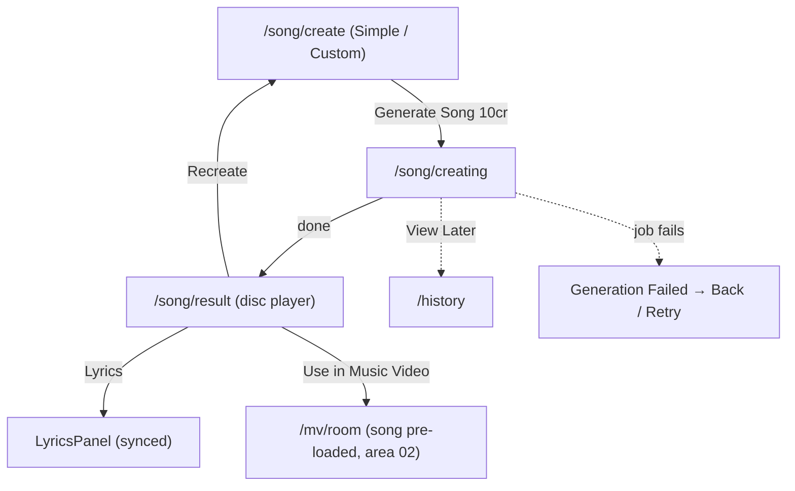

# Area 03 — AI Song Creation

> Read `../00-overview.md` first (conventions, ID scheme, global auth/credits models). **As-built**;
> ⚠️ = divergence from App v3.0, ❓ = a tracked `TBD-*`, 🔒 = mock/in-memory.

---

## 1. Overview & scope

The end-to-end flow to create an AI song: compose (Simple or Custom) → watch generation → view the
result (disc player + synced Lyrics sheet) → use the song in an MV or recreate.

**In scope:** `/song/create` (`SongCompose`), `/song/creating` (`SongGenerationScreen`),
`/song/result` (`SongResultView` → `SongDetail` + `LyricsPanel`).
**Out of scope (cross-referenced):** the community song player `/song/play` (area 04 —
`CommunitySongPlayer`); `SongDetail` is **shared** with History's `CreationDialog` (area 05);
`ShareDialog` (area 10); Use-in-MV lands in `/mv/room` (area 02).

**Key divergences from App F11–F13:** Custom mode has **Genre / Mood / Vocal chips + Title** but **no
BPM slider or Key selector** (App F11) ⚠️; **no 30s free-preview gating** — full playback for everyone
(App F12 gates free users to 30s) ⚠️; **Recreate** just returns to compose with **no credit cost**
(App: 50 cr, prior saved) ⚠️; Enhance is **free** (App: first free then 1 cr) ⚠️; the compose screen's
inline credit pill is **hardcoded `390`**, not the live balance ⚠️.

---

## 2. Route / component / state / API map (RD)

| Route | View | Owns UI | Reads/writes state | `MuseApi` |
|---|---|---|---|---|
| `/song/create` | `song/SongCompose` (🔒 **Auth**) | Simple/Custom tabs, describe/lyrics, Instrumental, Genre/Mood/Vocal chips, Title, Ideas/Lyrics/Enhance, Generate CTA | `useSongFlow().{songCompose,patchSongCompose,resetForNewSong}` | `enhancePrompt` (song/lyrics) |
| `/song/creating` | `song/SongGenerationScreen` → `GenerationView` | progress ring/step, View Later | `startSong`, `gen`, `songResult` | `createSongJob`, `getSongJob` (poll) |
| `/song/result` | `song/SongResultView` → `SongDetail` | disc player, progress/seek, ±15s, Lyrics sheet, Share, Use-in-MV, Recreate | `songResult`, `useMvFlow().patchCompose` (Use-in-MV), `useHistory` (share id) | — |

**Provider:** `SongFlowProvider` (`useSongFlow`) — compose form, job polling, result; feeds
`HistoryProvider` on start/complete/fail. `LyricsPanel` = the synced-lyrics bottom sheet opened from
`SongDetail`. 🔒 mock generation (`GenerationView` shared with MV).

---

## 3. State model & rules

**Compose (`SongCompose`)** — `types.ts` / `schemas.ts`:
- `mode`: `simple` (default) | `custom`.
- `describe`: string (Simple), max 2500 (`DESCRIPTION_MAX`).
- `instrumental`: boolean (both modes) — when ON in Custom, the Lyrics field is replaced by "No lyrics needed…".
- `lyrics`: string (Custom), max 2500.
- `genre` (default "Pop"), `mood` (default "Uplifting"), `vocal` (nullable, optional), `title` (optional).
- **CTA-ready** (`isSongReady`): **Custom → always ready**; **Simple → `describe.trim() !== ""`**.
- Cost: `COST_SONG = 10` shown on the Generate CTA. ⚠️ App said 50 (→ `TBD-GL-01`).
- Compose helpers: **Ideas** (Simple: random `SONG_IDEAS`; Custom: Idea + Lyrics sample fills),
  **Enhance** (`enhancePrompt`; Custom lyrics offers Refine Idea vs Refine Lyrics), a supported-languages
  info popover (Custom). Inline **`CreditPill` is hardcoded `390`** (`SongCompose.tsx:46`) ⚠️.

**Job (`SongJob` → `SongResult`)**: `createSongJob(compose)` → poll `getSongJob` → on done sets
`songResult` ({title, cover, genre, mood, durationSec, audioUrl?, instrumental, lyrics?}) and marks
History completed. Generation estimate "~1 minute" (display-only; mock timing).

**Result (`SongDetail`)**: circular disc cover (spins while playing), progress bar w/ seek, ±15s nudge,
play/pause; **Lyrics** button → `LyricsPanel` (synced timed lines highlighting the current line + mini
player) when lyrics exist; **Share** → `ShareDialog`; CTAs **Use in Music Video** and **Recreate**.
**No Like** (own creation). Full playback — **no 30s gate** ⚠️.
- **Use in Music Video** → `patchCompose({ song: {source:"library", …, lyrics} })` + `/mv/room` (area 02).
- **Recreate** → `/song/create` (re-compose; no cost, no auto-regenerate) ⚠️.

🔒 `songResult` is in-memory; a reload on `/song/creating` or `/song/result` triggers the flow-guard
(redirect to `/song/create`).

---

## 4. Journeys

Screens to capture later: `/song/create` (Simple + Custom), `/song/creating`, `/song/result`, Lyrics sheet.

### SONG-P1 — Compose
- **SONG-P1-S1** Arrive `/song/create` (auth-gated); **Simple** tab default; **Generate** disabled until `describe` non-empty. Hint "Describe your song to continue."
- **SONG-P1-S2** Toggle **Instrumental** (both modes). Simple: describe + Ideas + Enhance. 
- **SONG-P1-S3** Switch to **Custom**: Lyrics/Idea field (or "No lyrics needed" when Instrumental) + Ideas/Lyrics/Enhance; Genre/Mood chips (required-ish defaults) + Vocal (optional, clearable) + optional Title. Custom CTA always enabled.
- **SONG-P1-S4** Tap **Generate Song** (`10`) → `resetForNewSong()` → `/song/creating`.

### SONG-P2 — Generation
- **SONG-P2-S1** `/song/creating`: `startSong()` fires once (inserts a Generating History row); ring/step; estimate "~1 minute"; **View Later** → `/history`. Flow-guard: not ready & no result → redirect `/song/create`.
- **SONG-P2-S2** On `done` → `/song/result`.

### SONG-P3 — Result
- **SONG-P3-S1** Disc player autoloads; play/pause, seek, ±15s.
- **SONG-P3-S2** **Lyrics** → `LyricsPanel` (synced highlight + mini player) — only when lyrics exist. In practice this means **Custom mode + non-instrumental + typed lyrics**; Simple mode never sets `lyrics`, so a Simple-mode result has no Lyrics sheet.
- **SONG-P3-S3** **Share** → `ShareDialog`. **Use in Music Video** → `/mv/room` with the song pre-loaded (incl. lyrics). **Recreate** → `/song/create`.

---

## 5. Error & edge states

| ID | Trigger | Behaviour |
|---|---|---|
| **SONG-E1** | Song job fails | Shared `GenerationView` failure state: "Generation Failed" + **Back** (`/song/create`) + **Retry**, "credits were not charged". **`[fail]` in the Simple-mode `describe` triggers a mock failure at ~60% (`mock.ts:137`); `lyrics` does not — so a Custom-mode song cannot be failed via the UI.** Production trigger → `TBD-SONG-06`. |
| **SONG-E2** | Reload/deep-link `/song/creating` or `/song/result` with no in-memory state | Flow-guard → `router.replace("/song/create")`. |
| **SONG-E3** | Logged-out user opens `/song/create` | `AuthGuard` → sign-in modal (area 09). |
| **SONG-E4** | Instrumental ON (Custom) | Lyrics field replaced with an instrumental note; result typically has no Lyrics sheet. ⚠️ Toggling Instrumental does **not** clear already-typed lyrics, so an atypical path (type lyrics → enable Instrumental) can still carry lyrics into the result (→ `TBD-SONG-01`). |

---

## 6. Acceptance criteria (EARS)

- **AC-SONG-01** — WHEN `/song/create` loads, THE SYSTEM SHALL default to **Simple** and keep **Generate** disabled until `describe.trim() !== ""`; in **Custom**, Generate SHALL be enabled by default.
- **AC-SONG-02** — WHEN Instrumental is ON in Custom, THE SYSTEM SHALL hide the lyrics editor and typically generate without lyrics (no Lyrics sheet). *(Note: toggling does not clear previously-typed lyrics — see SONG-E4 / `TBD-SONG-01`.)*
- **AC-SONG-03** — WHEN describe/lyrics exceeds 2500 chars, THE SYSTEM SHALL cap typed/pasted input at 2500. (Ideas/Enhance fills are not capped.)
- **AC-SONG-04** — WHEN **Generate Song** is tapped, THE SYSTEM SHALL `resetForNewSong()`, insert a Generating History row, and navigate to `/song/creating`.
- **AC-SONG-05** — WHILE the song job is `processing`, THE SYSTEM SHALL show progress, step, an estimate, and View Later → `/history`; on `done` navigate to `/song/result`.
- **AC-SONG-06** — WHEN `/song/result` loads, THE SYSTEM SHALL play the full track (no 30s gate) with seek/±15s, expose Share, a Lyrics sheet (when lyrics exist), Use in Music Video, and Recreate — and no Like.
- **AC-SONG-07** — WHEN **Use in Music Video** is tapped, THE SYSTEM SHALL pre-load the song (incl. lyrics) into MV compose and navigate to `/mv/room`.
- **AC-SONG-08** — IF the song job fails, THEN THE SYSTEM SHALL show the shared error state with Back + Retry.
- **AC-SONG-09** — WHEN a song job starts, THE SYSTEM SHALL NOT change the credit balance. *(pending `TBD-GL-01`.)*
- **AC-SONG-10** — THE SYSTEM SHALL render `/song/create`, `/song/creating`, `/song/result` at 390/768/1024/1440px with no overflow. *(visual)*

---

## 7. Per-path QA checklist

- [ ] **SONG-P1**: Simple CTA gated by describe; Custom CTA always on; Instrumental hides lyrics (AC-01/02).
- [ ] **SONG-P2**: Generate → Generating row + progress → result (AC-04/05).
- [ ] **SONG-P3**: full playback (no 30s lock), seek/±15s; Lyrics sheet when lyrics; Share; Use-in-MV pre-loads song in `/mv/room`; Recreate → compose (AC-06/07).
- [ ] **SONG-E1**: failure → Back + Retry (AC-08). **SONG-E2**: reload → redirect compose. **SONG-E3**: logged-out → sign-in.
- [ ] **AC-09**: start job → balance unchanged. **AC-10**: 3 screens clean at 4 widths *(visual)*.

---

## 8. Area TBD register — decisions 2026-07-22

**Decisions** — codebase change list in [`../handoff.md`](../handoff.md).

| ID | Decision |
|---|---|
| TBD-SONG-01 | ✅ **Sync App** — Custom mode gains Genre picker + BPM slider + Key selector + per-line lyrics. |
| TBD-SONG-02 | ✅ **Sync App** — free users limited to a 30s preview; full playback unlocked for Pro. |
| TBD-SONG-03 | ✅ **Sync App** — Recreate costs 50 credits; the prior song is kept in History. |
| TBD-SONG-04 | ✅ **Sync App** — Enhance: first per session free, then 1 credit each. |
| TBD-SONG-05 | 🐞 **Bug (RD fix)** — replace the hardcoded `390` credit pill with the live balance. |
| TBD-SONG-06 | 🔧 **Backend (RD)** — production song-failure trigger. |
| TBD-SONG-07 | ⏳ **TBD** — supported-language list still open. |

See also global: `TBD-GL-01` (credit charging — incl. `COST_SONG=10` vs app 50).

| ID | Question |
|---|---|
| **TBD-SONG-01** | **Custom controls** — App F11 Custom has a BPM slider + Key selector + per-line lyrics timing; web has Genre/Mood/Vocal chips + free-text lyrics only. Which controls are in web scope? |
| **TBD-SONG-02** | **Free-preview gating** — App F12/F13 limits free users to a 30s preview (full with Pro); web plays full for everyone. Is preview-gating required? |
| **TBD-SONG-03** | **Recreate cost/behaviour** — App: 50 cr, prior song saved. Web: free return to compose, no auto-regenerate. Confirm intended. |
| **TBD-SONG-04** | **Enhance cost** — App: first free then 1 cr each. Web: always free. |
| **TBD-SONG-05** | **Inline credit pill** — `SongCompose` shows a hardcoded `390` pill instead of the live balance; intended, or should it read `useCredits()`? |
| **TBD-SONG-06** | **Song failure trigger** — confirm how a song generation failure is triggered/handled in production (the mock's `[fail]` behaviour for songs needs verification). |
| **TBD-SONG-07** | **Supported languages** — the Custom info popover lists 11 languages; confirm the real supported set for lyric generation. |

---

## 9. Flow diagram

---

## 10. Decisions & changelog

**Decisions (as-built):** Simple default; Custom uses chips (no BPM/Key); full playback (no preview
gate); Recreate is free re-compose; song result has no Like; generation is mock and display-only on
credits.

| Date | Change |
|---|---|
| 2026-07-22 | Initial as-built spec. |
| 2026-07-22 | Validator PASS; tightened SONG-E1 fail trigger (Simple `describe` only), noted Simple-mode results have no Lyrics sheet, flagged Instrumental-doesn't-clear-lyrics quirk. |
