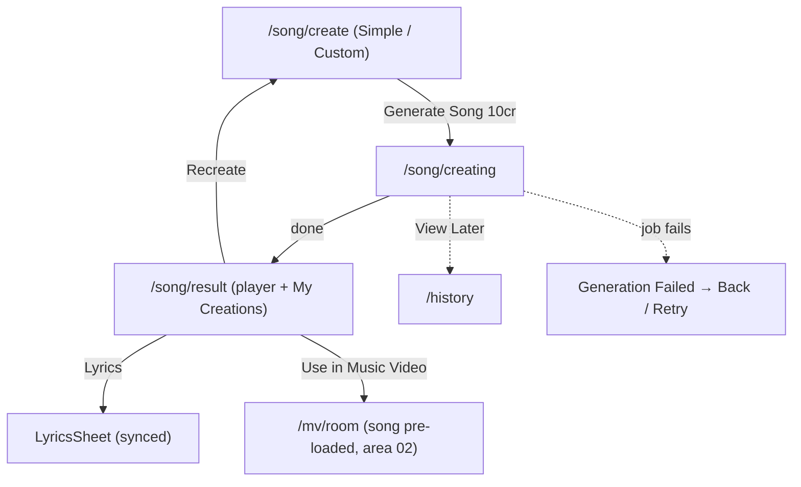

# Area 03 — AI Song Creation

> Read `../00-overview.md` first (conventions, ID scheme, global auth/credits models). **As-built**;
> ⚠️ = divergence from App v3.0, ❓ = a tracked `TBD-*`, 🔒 = mock/in-memory.

---

## 1. Overview & scope

The end-to-end flow to create an AI song: compose (Simple or Custom) → watch generation → view the
result (disc player + synced Lyrics sheet) → use the song in an MV or recreate.

**In scope:** `/song/create` (`SongCompose`), `/song/creating` (`SongGenerationScreen`),
`/song/result` (`SongResultView`, self-contained since slice 3j).
**Out of scope (cross-referenced):** the community song player `/song/play` (area 04 —
`CommunitySongPlayer`);
`ShareDialog` (area 10); Use-in-MV lands in `/mv/room` (area 02).

**As-built vs App F11–F13 (SONG-01…05 landed 2026-07-23; amended 2026-08-06 by the designer-UI
migration, slice 3j):** Custom mode has Genre / Mood / Vocal chips + Title; the **Lyrics**
input is a free-form textarea (app-style — **Idea** + **Lyrics** sample fills + Enhance; the Idea
fills were removed for V1 on 2026-08-06 and **restored 2026-08-24** with the product owner's own
copy, see §3), matching the app
prototype; **Recreate charges a normal generation (6 / 12) and keeps the prior song in History**
(SONG-03); **AI Enhance is FREE** (SONG-04 — the old free-first-then-1-credit rule was removed 2026-08-12, spec area 11 §5.5, closing TBD-CC-03); the compose
credit pill shows the **live balance** (SONG-05). Generation itself charges **6 (vocal) / 12
(instrumental)** on start (GL-01, insufficient → IAP) — `songCost(instrumental)`, repriced
2026-08-12 from a flat `COST_SONG = 10` placeholder per spec area 11 §3.1.

**GENRE / MOOD / VOCAL respecified (product owner, 2026-09-01).** All three STYLE chip rows are
**optional, single-select, and tap-to-clear** — tapping the already-selected chip in a row now
unsets it, where previously GENRE and MOOD were single-select but STICKY (nothing could unset
them once touched; VOCAL already cleared this way). `GENRES` (`src/lib/mv/mock.ts`) is now
**nine** values in the product owner's order — `Pop, Hip-Hop, R&B, Rock, Jazz, Electronic, Rap,
Classical, Country` — replacing the previous eight (`Acoustic` and `Lo-fi` are gone from the
vocabulary); `MOODS` is **unchanged**. Full detail, including the new Instrumental-hides-VOCAL
rule, is in §3. _(One line for the record: the request wrote the second genre "Hip pop"; the
product owner confirmed 2026-09-01 this means the existing **`Hip-Hop`** spelling, with `Rap` as
a separate, additional chip — not a new "Hip Pop" genre.)_

**GENRE and MOOD now START EMPTY, not pre-filled (product owner, 2026-09-01, SECOND pass — reversing
a decision made earlier the SAME DAY).** `DEFAULT_SONG_COMPOSE.genre` and `.mood`
(`src/lib/mv/types.ts`) are now `""` / `""`, not `"Pop"` / `"Uplifting"`. The first pass of this
change made the two fields clearable but left the old seed values in place, reasoning that
`SongResultView`'s `genre · mood` line — the only thing the result screen says about what was
generated — would otherwise read blank for anyone who never opened STYLE. **The product owner
overruled that reasoning:** a field that arrives pre-filled does not read as optional regardless of
what the CTA does, and preserving one line of result-screen text is not a good enough reason to make
a user un-pick a genre they never chose. `SongResultView` already had the fix for the visible
consequence in place before this decision (`visibility: hidden`, not `display: none`, on the
`genre · mood` line when either value is empty — panel height is unchanged; see §3), so the empty
defaults ship with no other code change. See §3, `SONG-P1-S3` below; `AC-SONG-15`/`16`/`17` (added
the same day) never asserted a starting value, so none needed rewording beyond this note.

**Two of SONG-01/02 no longer describe the code — both by decision, both recorded here:**

- ⚠️ **SONG-01's BPM slider and Key selector are GONE from the form** (plan S4, slice 3j). The
  designer prototype has neither control. **The `bpm` / `key` FIELDS on `SongComposeSchema` are
  untouched** and still carry `DEFAULT_SONG_COMPOSE`'s values into every request — plan §11 makes
  removing them a **C8 contract change that must be its own PR**, so the slice removed the controls
  only. RD: build against the fields, not against the (absent) UI. Guarded in both directions by
  `e2e/behaviour-regressions.spec.ts` → `3j / S4`.
- ⚠️ **SONG-02's 30s free-preview gate is CANCELLED** (plan §1.4, S3) and `/song/result` no longer
  enforces it. `/song/play` dropped it in slice 3b; `/song/result` dropped it in 3j when it stopped
  rendering `SongDetail`. **`SongDetail.tsx` and its `FREE_PREVIEW_SEC` were DELETED 2026-08-06**
  along with `CreationDialog`, so the cancelled cap no longer exists anywhere in the code. The
  inconsistency that entry described is gone; the entry stays so nobody re-derives why the cap was
  migrated.

---

## 2. Route / component / state / API map (RD)

| Route            | View                                           | Owns UI                                                                                                                                                                             | Reads/writes state                                                                                                     | `MuseApi`                            |
| ---------------- | ---------------------------------------------- | ----------------------------------------------------------------------------------------------------------------------------------------------------------------------------------- | ---------------------------------------------------------------------------------------------------------------------- | ------------------------------------ |
| `/song/create`   | `song/SongCompose` (guest-reachable)           | Simple/Custom tabs, describe/lyrics, Instrumental, Genre/Mood/Vocal chips, Title, **Idea** + **Lyrics** sample fills + Enhance, **Create Song** CTA, **two-mode side rail**         | `useSongFlow().{songCompose,patchSongCompose,resetForNewSong}`; `useAuth().loggedIn`, `useHistory().history` (rail)    | `enhancePrompt` (song/lyrics)        |
| `/song/creating` | `song/SongGenerationScreen` → `GenerationView` | progress ring/step, View Later                                                                                                                                                      | `startSong`, `gen`, `songResult`                                                                                       | `createSongJob`, `getSongJob` (poll) |
| `/song/result`   | `song/SongResultView` (self-contained)         | **Back (→ History)**, player + progress/seek, prev/next transport, volume/mute, Like, Share, Download, Lyrics sheet, Publish toggle, Use-in-MV, Recreate, **My Creations** playlist | `songResult`, `useHistory` (earlier songs + share id), `useMvFlow().patchCompose` (Use-in-MV), `useCredits` (Recreate) | —                                    |

**Provider:** `SongFlowProvider` (`useSongFlow`) — compose form, job polling, result; feeds
`HistoryProvider` on start/complete/fail. 🔒 mock generation (`GenerationView` shared with MV).

⚠️ **`/song/result` no longer renders `SongDetail`** (slice 3j). It is DP's own markup, and its
lyrics sheet is the shared `ui/LyricsSheet`, not `LyricsPanel`. `SongDetail` and `LyricsPanel`
were **deleted on 2026-08-06** when their last consumer (`CreationDialog`) went. Anything
this area used to say about `/song/result` "sharing `SongDetail` with History" now describes
History alone.

---

## 3. State model & rules

**Compose (`SongCompose`)** — `types.ts` / `schemas.ts`:

- `mode`: `simple` (default) | `custom`.
- `describe`: string (Simple), max 2500 (`DESCRIPTION_MAX`).
- `instrumental`: boolean (both modes) — when ON in Custom, the box **keeps whatever is in it** and only the **Lyrics** sample-fill hides; the placeholder (visible only while the box is empty) swaps to the instrumental copy (see `AC-SONG-02` / `AC-SONG-02c`). **VOCAL follows a different, NEW rule** — see the bullet below; `AC-SONG-02` governs only the Lyrics text box and does not extend to VOCAL.
- `lyrics`: string (Custom), max 2500.
- **`genre` / `mood` / `vocal` — all three OPTIONAL, single-select, tap-to-clear (product owner,
  2026-09-01).** `genre` and `mood` both start **empty** (`DEFAULT_SONG_COMPOSE.genre = ""`,
  `.mood = ""`). ⚠️ _(Corrected 2026-09-01, second pass, same day: this row previously said `genre`
  starts at `"Pop"` and `mood` at `"Uplifting"`, framed as "starting values, not required ones." The
  product owner overruled keeping those seeds — see the callout in §1 — so the row now describes
  the code as it actually ships.)_ `isSongReady()` has never read either field, so the CTA was
  already optional on them before either change; what changed across both passes is the _control_
  (clearability) and now also the _starting value_ (empty, not seeded). GENRE and MOOD were
  single-select but STICKY (`onClick` set the value and nothing unset it, so the first chip a user
  touched became permanent) — tapping the already-selected chip now clears it
  (`patch({ genre: s.genre === g ? "" : g })`, same shape for `mood`), and both labels gained an
  `(Optional)` suffix (`song-create__chip-label-optional`). VOCAL was already tap-to-clear
  (`nullable`) before this change; it gains the Instrumental-hides rule below instead.
  `GENRES` is now the **nine** values `Pop, Hip-Hop, R&B, Rock, Jazz, Electronic, Rap, Classical,
Country`, in this exact product-owner order (not alphabetical) — replacing the previous eight
  (`Pop, R&B, Electronic, Hip-Hop, Acoustic, Jazz, Classical, Lo-fi`); `Acoustic` and `Lo-fi` are
  gone from the vocabulary. `MOODS` is **unchanged**: `Uplifting, Melancholic, Romantic, Energetic,
Calm, Dark` — only the selection semantics were respecified, not the option list. `title` stays
  optional, unaffected by this change.
  > One line for the record: the product owner's request wrote the second genre as "Hip pop";
  > confirmed 2026-09-01 that this means the existing **`Hip-Hop`** spelling `GENRES` already
  > carried, with `Rap` as a separate, additional chip — not a new "Hip Pop" genre.
- **VOCAL is HIDDEN (unmounted from the DOM), not disabled, while Instrumental is ON** — an
  instrumental track has no vocal to pick, so the field is _not applicable_, not temporarily
  unavailable; unmounting also keeps it out of the tab order and the a11y tree, which
  `disabled`+`opacity` would not reliably do. **Turning Instrumental ON also clears `vocal` to
  `null`**, via the shared `setInstrumental()` handler both mode tabs' `ToggleSwitch`es call —
  `vocal` is C2 contract surface RD consumes, and hiding the control without clearing the value
  would ship an instrumental job whose payload still carried `vocal: "Female"`. **Turning
  Instrumental back OFF restores the VOCAL group empty — the prior pick is NOT restored.** This is
  deliberately NOT the treatment `AC-SONG-02` gives the Lyrics box (which never discards typed
  text on either transition): lyrics survive because they live in two separate fields (`lyrics` /
  `instrumentalText`) with nothing to contradict, while there is no second vocal field to park a
  pick in — "preserve it" and "don't send a contradiction" cannot both be true for a single field.
  See `AC-SONG-15`/`AC-SONG-16`/`AC-SONG-17` and `SONG-E4`.
- **CTA-ready** (`isSongReady`): **Custom → always ready**; **Simple → `describe.trim() !== ""`**.
- Cost: `songCost(instrumental)` — **6 vocal / 12 instrumental** — shown live on the **Create Song**
  CTA, so toggling Instrumental changes the number. (Was a flat `COST_SONG = 10`; repriced
  2026-08-12, spec area 11 §3.1.)
- Custom-mode **Lyrics** field: a **free-form textarea** (`s.lyrics`, max 2500) with
  Lyrics sample fills + Enhance — matching the app prototype (an earlier per-line editor was
  reverted 2026-07-23).
- ⚠️ **No BPM slider and no Key selector** (S4 / 3j — see §1). `bpm` (`BPM_MIN 60`–`BPM_MAX 200`)
  and `key` (`SONG_KEYS`, nullable = "Auto") are still schema fields with defaults, still sent on
  every request, and now **unreachable from the UI**. `BPM_MIN` / `BPM_MAX` / `SONG_KEYS` remain
  exported from `src/lib/mv/types.ts` for the same reason.
- DP's **Song Length** slider is not ported: DP ships it behind `SHOW_SONG_LENGTH = false`, and
  whether that is a temporary hide or a removal is open question U1 for the designer.
- **Sample fills — the two `Idea` buttons and `Lyrics` (restored 2026-08-24).** Removed on
  2026-08-06 ("V1 ships no canned-sample fillers"), reinstated at the product owner's request with
  their own copy behind them. The strings live in `src/lib/mv/songIdeas.ts`, transcribed verbatim
  from the two `[YCM] AI Song Ideas & Lyrics` CSVs (2026-08-24): **`SONG_IDEA_PROMPTS` — 12** briefs
  in a _style + scene + tempo + mood_ shape, and **`LYRIC_PRESETS` — 10** complete lyric sheets with
  `[intro]`/`[verse]`/`[chorus]` markers (one of them Japanese). Neither pool is a mock fixture: RD
  keeps them as content, and they are NOT `ENHANCE_SAMPLES` (that array is the mock `enhancePrompt`
  response — a different feature).
  - **Simple** — one **Idea** pill, fills `describe` from `SONG_IDEA_PROMPTS`. The fill satisfies
    AC-SONG-01, so it enables **Create Song** on its own.
  - **Custom** — **Idea** fills `lyrics` from `SONG_IDEA_PROMPTS`; **Lyrics** fills the same field
    from `LYRIC_PRESETS`. Same pill skin, different pool: DP labels that box "LYRICS / IDEA" and it
    accepts either a brief or a finished sheet.
  - **Under Instrumental, `Lyrics` hides and `Idea` does not** — a brief is what the instrumental
    box asks for, and it is what both DP and the app prototype do. ⚠️ This gives SONG-E4 /
    `TBD-SONG-01` one more way to leave a non-lyric string in `lyrics` while Instrumental is on;
    the field is still sent, so RD must not read `lyrics` as "the user wrote lyrics" (read
    `instrumental` for that).
  - `pickIdea(pool, current)` is **random but never the string already in the box** — a repeat on a
    10-item pool would read as a dead button. Fills are set programmatically, so `maxLength` does
    not clip them; every preset is inside `DESCRIPTION_MAX` and a unit test holds that.
  - ⚠️ **UI pending designer polish.** The control is DP's `.song-create__idea-btn` verbatim
    (lightbulb mask + label, the pill the Lyrics button already used). The product owner asked for a
    working button first and for the designer to adjust it later.
  - **RESOLVED 2026-08-25: build-in, not MSR cloud config.** A candidate MSR (cloud-config) JSON
    for these two pools — same shape as the sample handed to RD, i18n block for 9 target-market
    locales (`en de es hi id ja ko pt-BR zh-TW`) with only `en` filled — was drafted and given to
    RD to weigh against keeping the content in `src/lib/mv/songIdeas.ts`. **RD decided build-in.**
    The draft is archived at `docs/archive/song-idea-lyrics-msr.json` for the record, not as a
    spec to implement against. `src/lib/mv/songIdeas.ts` stays the one source of truth; a future
    localization pass (if any) translates the two exported arrays in place rather than adding a
    cloud-config layer.
- Other compose helpers:
  **Enhance** (`enhancePrompt`; **FREE — no charge
  at all** since 2026-08-12. `enhanceCost` / `consumeEnhance` were removed from `useCredits` and the
  cost badge from `EnhanceButton`; there is no cloud-config action for Enhance, so billing it was
  never in the approved model — SONG-04, spec area 11 §5.5), a supported-languages info
  popover (Custom). The inline **`CreditPill` shows the live balance** (SONG-05).

### Enhance asks first only when there is something to ask about (`AC-SONG-14`)

`Enhance` is one pill with two behaviours, and **Instrumental is what selects between them**:

| Where      | Instrumental | Behaviour                                                                                                                                                |
| ---------- | ------------ | -------------------------------------------------------------------------------------------------------------------------------------------------------- |
| **Custom** | OFF          | Opens a menu titled **"What would you like to enhance?"** — the box may hold a lyric sheet or a brief, so the front end cannot know which the user meant |
| **Custom** | ON           | **No menu.** Runs **Refine Idea** (`kind: "song"`) on the first tap — lyrics are not supported in this mode, so there is nothing to choose between       |
| **Simple** | either       | **No menu.** Runs `kind: "song"` directly — Simple has only the one field                                                                                |

The chooser's two entries:

| Choice            | Sub-label                          | `enhancePrompt` `kind` |
| ----------------- | ---------------------------------- | ---------------------- |
| **Refine Idea**   | Sharpen the mood, tone, and detail | `song`                 |
| **Refine Lyrics** | Polish wording, rhythm, and flow   | `lyrics`               |

**The engine has two refine modes, so each choice is its own API call — RD owns both**
(product owner, 2026-08-25). The front end only picks the `kind`; it does not decide what
"refine" means for either.

Implementation note: `EnhanceButton` branches on whether it was given `directions`, so
`SongCompose` passes them **conditionally** — withholding them under Instrumental is what
turns the chooser off. `Enhance` itself renders in both toggle states; the only control that
hides under Instrumental is the **Lyrics** sample-fill (`AC-SONG-02`).

> 🎨 **The chooser is a CENTRED DIALOG as of 2026-08-27.** It was an anchored `w-60` popover
> for two days — a WA placeholder for a design DP does not ship. The real one comes from the
> mobile app prototype's "Enhance Direction Sheet" (`muse-prototype-v2.html:5726`): a centred
> card, a gradient icon tile per direction (`ic_lightbulb` / `ic_singing_mic`), label over
> sub-label. It renders through `DpDialog`, so Escape and the backdrop both close it, and its
> styling is `src/styles/enhance-dialog.css` (WA-authored — there is no DP file to be verbatim
> with). **This closes the first half of `DESIGNER-TODO` A28**; the phone question is still open.
>
> ⚠️ **This menu had been unreachable since the DP migration and was restored 2026-08-25.**
> `EnhanceButton`'s DP-skinned branch returned the button alone while its click handler set
> the open state, so on Custom **Enhance was a dead button** — it did nothing at all. The
> two modes, their copy and the `kind` split had been in the code the whole time; only the
> rendering was missing. Guarded by `e2e/behaviour-regressions.spec.ts` →
> "Custom Enhance opens the two-mode menu".
>
> The remaining A28 question is what this does at 375px: the app prototype is a phone and
> draws it as a bottom SHEET, while the web build shows the same centred card at every width.

**Job (`SongJob` → `SongResult`)**: `createSongJob(compose)` → poll `getSongJob` → on done sets
`songResult` ({title, cover, genre, mood, durationSec, audioUrl?, instrumental, lyrics?}) and marks
History completed. Generation estimate "~1 minute" (display-only; mock timing).

**Result (`SongResultView`, DP markup since 3j)**: cover + title + `genre · mood` line, progress bar
w/ seek, play/pause and **prev/next transport across the playlist**, volume + mute (desktop);
**Lyrics** → the shared `LyricsSheet` (synced timed lines + mini player) when lyrics exist;
**Share** → `ShareDialog`; **Download** (desktop); a **Publish to community** toggle (GL-02 — Song
publishes on the action with no confirm, unlike MV's MV-12); CTAs **Use in Music Video** and
**Recreate · 50 Credits**; and a **My Creations** grid of the user's earlier songs from `useHistory`
that swaps the active track. Playback is uncapped for everyone (SONG-02 cancelled — see §1).

- ⚠️ **A Like button now exists on your own creation**, ported from DP's player, `aria-pressed`
  and local-only (no API, no History write). The spec's long-standing rule was **no Like on an own
  creation** — flagged, not resolved. Product owner / designer call: keep DP's control, or drop it
  as WA did. Until then AC-SONG-06's "and no Like" is a KNOWN divergence.

  > **RESOLVED 2026-08-19: the Like stays.** Product owner — a user may like their own creation.
  > It remains local state until `TBD-EXP-08` gives likes a real backing store.

- **Use in Music Video** → `patchCompose({ song: {source:"library", …, lyrics} })` + `/mv/room` (area 02).
- **Recreate** (SONG-03) → charges **the same as a fresh generation** (`songRecreateCost` — vocal 6 / instrumental 12, spec area 11 §3.1) via `resetForRecreate()` and routes to `/song/creating`, **keeping the previous song in History**; below that balance it opens `BuyCreditsModal` instead.
  > **Repriced 2026-08-12 (TBD-CC-05).** Was a flat `COST_SONG_RECREATE = 50`, a number with **no counterpart anywhere in spec area 11 or the cloud config**. Product decision: a Recreate is just another generation, so it bills what one bills. ⚠️ **The button does not display its price** — it never has; `.song-result__cta-secondary` renders only the icon + "Recreate". AC-SONG-12 requires the charge and the gate, not a label, so this is within spec — but it means a paid action gives no warning before charging. Raised as `DESIGNER-TODO` **A23**.

🔒 `songResult` is in-memory; a reload on `/song/creating` or `/song/result` triggers the flow-guard
(redirect to `/song/create`).

---

## 4. Journeys

Screens to capture later: `/song/create` (Simple + Custom), `/song/creating`, `/song/result`, Lyrics sheet.

### SONG-P1 — Compose

- **SONG-P1-S0 (side rail, 2026-08-06)** Same two-mode aside as `/mv/room` (area 02 MV-P1-S0): **"Trending Songs"** over `TOP_PICKS_SONGS` with a "See all" → `/explore/songs`, or **"My Creations"** over the user's own finished songs from `useHistory()`, no "See all", each row opening `/song/result?id=`. Requires `loggedIn` **and** at least one completed song.
- **SONG-P1-S1** Arrive `/song/create` (**guest-reachable** — the route guard was removed 2026-08-12, the gate is on the Create Song button; see `SONG-E3` / `AC-AUTH-08`); **Simple** tab default; **Create Song** disabled until `describe` non-empty. Hint "Describe your song to continue."
- **SONG-P1-S2** Toggle **Instrumental** (both modes). Simple: describe + **Idea** fill + Enhance. Toggling **never changes the text** in either box — see `AC-SONG-02`.
- **SONG-P1-S3** Switch to **Custom**: free-form **Lyrics** textarea (or "No lyrics needed" when Instrumental) + **Idea**/**Lyrics** sample fills (Idea survives Instrumental, Lyrics does not) / **Enhance** (survives Instrumental, but drops its chooser there — `AC-SONG-14`); **GENRE / MOOD / VOCAL chips — all three optional, single-select, tap-to-clear, and all three render with NOTHING selected on arrival** (product owner, 2026-09-01: GENRE and MOOD gained clearing, VOCAL already had it; separately, and later the same day, GENRE/MOOD's pre-filled `"Pop"`/`"Uplifting"` seeds were also removed — see §1/§3); **VOCAL disappears from the DOM entirely while Instrumental is ON** and its stored value is cleared, reappearing empty (not restored) when Instrumental goes back OFF — see §3, `AC-SONG-15`–`17`; optional Title. Custom CTA always enabled. _(No BPM/Key row since 3j — §1.)_
- **SONG-P1-S4** Tap **Create Song** (`songCost(instrumental)` — **6** vocal / **12** instrumental) → `resetForNewSong()` → `/song/creating`. _(Was a flat `10`; repriced 2026-08-12, journey text corrected 2026-08-19.)_

### SONG-P2 — Generation

- **SONG-P2-S1** `/song/creating`: `startSong()` fires once (inserts a Generating History row); ring/step; estimate "~1 minute"; **View Later** → `/history`. Flow-guard: not ready & no result → redirect `/song/create`.
- **SONG-P2-S2** On `done` → `/song/result`.

### SONG-P3 — Result

- **SONG-P3-S1** Player autoloads; play/pause, drag-to-seek, prev/next through **My Creations**, volume/mute on desktop. Playback is not capped (SONG-02 cancelled).
- **SONG-P3-S2** **Lyrics** → the shared `LyricsSheet` (synced highlight + mini player) — only when lyrics exist. In practice this means **Custom mode + non-instrumental + typed lyrics**; Simple mode never sets `lyrics`, so a Simple-mode result has no Lyrics sheet.
- **SONG-P3-S3** **Share** → `ShareDialog`; **Download** saves the mp3 (desktop). **Use in Music Video** → `/mv/room` with the song pre-loaded (incl. lyrics). **Recreate** → charges a normal generation (6 / 12) and regenerates (`/song/creating`), keeping the prior song in History (SONG-03).
- **SONG-P3-S4** **Publish** toggle publishes the song to the community immediately when switched on — sign-in required, **no confirm step** (GL-02; MV's equivalent does confirm, MV-12).

---

## 5. Error & edge states

| ID          | Trigger                                                                     | Behaviour                                                                                                                                                                                                                                                                                                                                                                                                                                                                                                                                                                 |
| ----------- | --------------------------------------------------------------------------- | ------------------------------------------------------------------------------------------------------------------------------------------------------------------------------------------------------------------------------------------------------------------------------------------------------------------------------------------------------------------------------------------------------------------------------------------------------------------------------------------------------------------------------------------------------------------------- |
| **SONG-E1** | Song job fails                                                              | Shared `GenerationView` failure state: "Generation Failed" + **Back** (`/song/create`) + **Retry**, "credits were not charged". **`[fail]` in the Simple-mode `describe` triggers a mock failure at ~60% (`mock.ts:137`); `lyrics` does not — so a Custom-mode song cannot be failed via the UI.** Production trigger → `TBD-SONG-06`.                                                                                                                                                                                                                                    |
| **SONG-E2** | Reload/deep-link `/song/creating` or `/song/result` with no in-memory state | Flow-guard → `router.replace("/song/create")`.                                                                                                                                                                                                                                                                                                                                                                                                                                                                                                                            |
| **SONG-E3** | Logged-out user opens `/song/create`                                        | **The page renders — no route guard.** ⚠️ **Corrected 2026-08-12:** this row said "`AuthGuard` → sign-in modal". `/song/create` lost its `AuthGuard` by product decision so a guest can compose before signing in, matching `/mv/room`. The gate moved to **Create Song**: `SongCompose.generate()` wraps the whole action in `requireLogin`, and the GL-01 balance check runs INSIDE that callback so a guest is never shown the credits upsell for an account they do not have. Dismissing the modal leaves the draft intact. See area 09 §3 / AC-AUTH-08.              |
| **SONG-E4** | Instrumental ON (Custom)                                                    | Lyrics field keeps its contents and only the **Lyrics** sample-fill hides; result typically has no Lyrics sheet. ⚠️ Because the toggle never clears the box, a path of type lyrics → enable Instrumental can still carry lyrics into the result (→ `TBD-SONG-01`). **VOCAL is the opposite of this row** (product owner, 2026-09-01, §3): the VOCAL chip group is unmounted from the DOM and its stored value cleared to `null` on toggle-on, and is NOT restored on toggle-off — read as the VOCAL twin of this error state, not a re-statement of it. See `AC-SONG-17`. |

---

## 6. Acceptance criteria (EARS)

- **AC-SONG-01** — WHEN `/song/create` loads, THE SYSTEM SHALL default to **Simple** and keep **Create Song** disabled until `describe.trim() !== ""`; in **Custom**, it SHALL be enabled by default.
- **AC-SONG-01b** — WHILE logged out, WHEN `/song/create` is opened, THE SYSTEM SHALL render the full compose screen with no sign-in modal; and THE SYSTEM SHALL open the sign-in modal only when the user activates **Create Song**. THE SYSTEM SHALL NOT show the insufficient-credit upsell to a logged-out user — `requireLogin` wraps the GL-01 balance check, so sign-in always comes first. _(new 2026-08-12; see area 09 AC-AUTH-08)_
- **AC-SONG-02** — WHEN Instrumental is toggled in Custom, THE SYSTEM SHALL leave the Lyrics box contents **unchanged** in both directions, and SHALL hide only the **Lyrics** sample-fill while it is ON. THE **Idea** fill and **Enhance** SHALL remain available while Instrumental is ON, and the song SHALL generate without a Lyrics sheet. _(Rewritten 2026-08-26: a rule that cleared the box on toggle-on was in place for one day and is withdrawn — the toggle is not a destructive control.)_
  > _Rewritten 2026-08-25 (product owner). The previous rule was the opposite — "toggling does not clear previously-typed lyrics" — which left the old prompt sitting under an instrumental placeholder that contradicted it. The two drafts are swapped, so neither piece of text is lost. Closes the clearing half of `TBD-SONG-01`._
  > _Scope note, 2026-09-01: this AC governs the Lyrics text box and its sample-fill ONLY. It does_
  > _NOT extend to the VOCAL chip — VOCAL is hidden AND cleared on the same toggle, the opposite_
  > _treatment. That is deliberate, not a contradiction: see `AC-SONG-17` and §3._
- **AC-SONG-02c** — WHILE Instrumental is ON, the Lyrics box placeholder SHALL read exactly:
  `No lyrics needed - AI will create a pure instrumental track.` / newline / `Describe the mood or vibe of your instrumental...` _(copy fixed by the product owner 2026-08-25; the previous text put the two sentences in the opposite order.)_
- **AC-SONG-02b** — WHEN the user activates **Idea**, THE SYSTEM SHALL replace the active box's contents with a randomly chosen `SONG_IDEA_PROMPTS` entry other than the one already there; and WHEN the user activates **Lyrics** (Custom, non-instrumental), THE SYSTEM SHALL do the same from `LYRIC_PRESETS`. **Idea** SHALL be present in both tabs and SHALL remain available while Instrumental is ON; **Lyrics** SHALL NOT be rendered while Instrumental is ON. _(new 2026-08-24 — the buttons were removed 2026-08-06 and restored with the product owner's copy; guarded by `e2e/behaviour-regressions.spec.ts` → `3j / 2026-08-24`.)_
- **AC-SONG-03** — WHEN describe/lyrics exceeds 2500 chars, THE SYSTEM SHALL cap typed/pasted input at 2500. (Enhance and the Idea / Lyrics sample fills are not capped by `maxLength` — every shipped preset is inside 2500 by construction, held by `src/lib/mv/songIdeas.test.ts`.)
- **AC-SONG-04** — WHEN **Create Song** is tapped, THE SYSTEM SHALL `resetForNewSong()`, insert a Generating History row, and navigate to `/song/creating`.
- **AC-SONG-05** — WHILE the song job is `processing`, THE SYSTEM SHALL show progress, step, an estimate, and View Later → `/history`; on `done` navigate to `/song/result`.
- **AC-SONG-11** — WHEN `/song/result` is reached from a `/history` row, THE SYSTEM SHALL show that row's song (flow state is seeded by `useOpenCreation`, area 05) and carry the row id in `?id=` so Share builds that row's link. THE SYSTEM SHALL expose a **Back** control on this stage — DP switches it from `RoomNavbar` to `DetailNavbar backHref="/history"` — going `router.back()` with `/history` as the fallback. _(An earlier song has no stored genre/mood, so the genre · mood line is omitted rather than invented.)_
- **AC-SONG-06** — WHEN `/song/result` loads, THE SYSTEM SHALL expose drag-to-seek, prev/next across My Creations, Share, Download, a Lyrics sheet (when lyrics exist), a Publish toggle, Use in Music Video, and Recreate. Playback SHALL NOT be capped for any account.
  - _(b)_ ~~"**and no Like**"~~ — **WITHDRAWN 2026-08-19.** The product owner decided a user MAY like their own work, so the ported Like is correct and this clause was the mistake. `TBD-SONG-08` closed.
  - _(c)_ the 30s cap it required is cancelled by S3 (§1) — already decided.
- **AC-SONG-11b** — ⚠️ **SUPERSEDED by plan S4 (slice 3j) — the code deliberately does not satisfy this.** It required a BPM slider (60–200) and a Key selector in Custom mode; both controls are removed. What remains true: the free-form Lyrics / Idea textarea, and `songCompose.{bpm,key}` persisting their defaults. Reinstating the controls, or deleting the fields (a C8 PR), are the two open resolutions — this AC stays on the page so neither happens by accident. _(Renumbered from a second `AC-SONG-11` on 2026-08-19; the history-entry criterion above keeps the plain id.)_
- **AC-SONG-12** — WHEN Recreate is invoked with a balance covering one generation (`songRecreateCost` — 6 vocal / 12 instrumental), THE SYSTEM SHALL charge that amount and regenerate while keeping the prior song in History; otherwise it SHALL open the buy-credits IAP (SONG-03). _(repriced 2026-08-12; was a flat 50)_
- **AC-SONG-13** — WHEN AI Enhance is used, THE SYSTEM SHALL charge **nothing, ever** (SONG-04). _(Corrected 2026-08-19. The old "free first, then 1 credit" rule was removed on 2026-08-12 — §1 and §3 of this same file already said so, and `enhanceCost`/`consumeEnhance` are gone from `useCredits`. This AC was the last place the withdrawn rule survived.)_
- **AC-SONG-14** — WHEN **Enhance** is activated on the **Custom** tab WHILE Instrumental is **OFF**, THE SYSTEM SHALL open a chooser offering **Refine Idea** (`kind: "song"`) and **Refine Lyrics** (`kind: "lyrics"`), and SHALL call `enhancePrompt` only after one is picked. WHILE Instrumental is **ON**, THE SYSTEM SHALL call `enhancePrompt` with `kind: "song"` **directly, with no chooser** — lyrics are not supported in that mode, so there is nothing to choose between. WHEN it is activated on **Simple**, THE SYSTEM SHALL likewise call `kind: "song"` directly. _(new 2026-08-25; the Instrumental branch added 2026-08-26.)_
- **AC-SONG-07** — WHEN **Use in Music Video** is tapped, THE SYSTEM SHALL pre-load the song (incl. lyrics) into MV compose and navigate to `/mv/room`.
- **AC-SONG-08** — IF the song job fails, THEN THE SYSTEM SHALL show the shared error state with Back + Retry.
- **AC-SONG-09** — WHEN a song job starts, THE SYSTEM SHALL charge `songCost(instrumental)` (6 vocal / 12 instrumental) immediately and refund it if the job fails. _(Corrected 2026-08-19 — this previously said the balance must NOT change, which is the opposite of `SongFlowProvider.tsx:62-67` and of the same rule for MV in `AC-MV-19`. It was the song-side twin of the withdrawn `AC-MV-15`.)_
- **AC-SONG-10** — THE SYSTEM SHALL render `/song/create`, `/song/creating`, `/song/result` at 320/375/768/1024/1440/1920px with no overflow. _(visual)_ _(Widths corrected 2026-08-19 to the six tiers the code and `visual-baseline.spec.ts` actually use; the old list said 390, which no test has ever measured.)_
- **AC-SONG-15** — WHEN Custom mode renders the STYLE section, THE SYSTEM SHALL offer exactly the **nine** GENRE chips, in this order: `Pop, Hip-Hop, R&B, Rock, Jazz, Electronic, Rap, Classical, Country` (`GENRES`, `src/lib/mv/mock.ts`). _(new 2026-09-01, product owner — replaces the previous eight-value list; see §1/§3.)_
- **AC-SONG-16** — WHEN a GENRE or MOOD chip is tapped, THE SYSTEM SHALL select it if it is not already the selected chip in its row (single-select — selecting one clears any other in the same row), and SHALL clear the row back to no selection if the tapped chip is already selected. Neither field SHALL be required by `isSongReady()`. _(new 2026-09-01, product owner — GENRE and MOOD were single-select but could not previously be cleared once touched; VOCAL already behaved this way, see `AC-SONG-17`.)_
- **AC-SONG-17** — WHILE Instrumental is ON, THE SYSTEM SHALL NOT render the VOCAL chip group (removed from the DOM, not merely visually hidden or disabled) and SHALL clear any stored `vocal` value to `null`. WHEN Instrumental is toggled back OFF, THE SYSTEM SHALL re-render the VOCAL group with **no** chip selected — the prior pick is NOT restored. _(new 2026-09-01, product owner: "If Instrumental toggle on, hide the VOCAL field." Deliberately the opposite of `AC-SONG-02`'s Lyrics-box treatment — see §3 for why the two fields cannot both be handled the same way.)_

---

## 7. Per-path QA checklist

- [ ] **SONG-P1**: Simple CTA gated by describe; Custom CTA always on; Instrumental hides lyrics (AC-01/02); **Idea** fills in both tabs and **Lyrics** in Custom, neither repeating the current value (AC-02b).
- [ ] **SONG-P1 / STYLE (2026-09-01)**: Custom's GENRE row shows exactly the nine chips in order `Pop, Hip-Hop, R&B, Rock, Jazz, Electronic, Rap, Classical, Country` (AC-15). Tap a GENRE chip → selects; tap the SAME chip again → clears back to no selection; same for MOOD; same (already true) for VOCAL (AC-16). Toggle Instrumental ON → VOCAL group disappears from the DOM (not just visually) AND any prior VOCAL pick is cleared; toggle OFF → VOCAL group reappears with **nothing** selected, not the prior pick (AC-17). Confirm this is the OPPOSITE of what happens to the Lyrics textarea on the same toggle (AC-02) — the two must not be conflated.
- [ ] **SONG-P2**: Generate → Generating row + progress → result (AC-04/05).
- [ ] **SONG-P3**: full playback (no 30s lock); drag-to-seek; prev/next across My Creations; Lyrics sheet when lyrics; Share; Download; Publish toggle; Use-in-MV pre-loads song in `/mv/room`; Recreate → compose (AC-06/07).
- [ ] **SONG-E1**: failure → Back + Retry (AC-08). **SONG-E2**: reload → redirect compose. **SONG-E3**: logged-out → sign-in.
- [ ] **AC-09**: start job → balance unchanged. **AC-10**: 3 screens clean at 4 widths _(visual)_.

---

## 8. Open items for RD

| ID                  | Open item                                                                                                                                                                                                                                                   |
| ------------------- | ----------------------------------------------------------------------------------------------------------------------------------------------------------------------------------------------------------------------------------------------------------- |
| **TBD-SONG-06**     | 🔧 **Backend (RD)** — the production song-generation failure trigger is undefined (the mock's `[fail]`-in-description behaviour needs a real equivalent).                                                                                                   |
| **TBD-SONG-07**     | ⏳ **TBD** — the Custom info popover lists 11 languages; confirm the real supported-language set for lyric generation.                                                                                                                                      |
| ~~**TBD-SONG-08**~~ | ✅ **2026-08-19 結案 — KEEP.** 產品負責人決定：**使用者可以 like 自己的作品**，`/song/result` 的 Like 保留。目前是 local state；接後端時它需要和社群的 like 走同一條寫入路徑（`TBD-EXP-08`）。`AC-SONG-06` 的 "and no Like" 子句已撤回。                    |
| **TBD-SONG-10**     | 🔧 **RD (from 3j / S4)** — `bpm` / `key` are now unreachable from the UI but still on `SongComposeSchema` and still sent. Deleting them is the C8 PR plan §11 requires; leaving them is also a valid answer. Decide before backend integration, not during. |

See also global: `TBD-GL-01` (credit charging). _(The old "`COST_SONG=10` vs app 50" note is obsolete — song pricing was resolved to 6/12 on 2026-08-12 per area 11 §3.1.)_

---

## 9. Flow diagram

```mermaid
flowchart TD
  Create["/song/create (Simple / Custom)"] -->|Generate Song 10cr| Creating["/song/creating"]
  Creating -->|done| Result["/song/result (player + My Creations)"]
  Result -->|Lyrics| Sheet["LyricsSheet (synced)"]
  Result -->|Use in Music Video| Room["/mv/room (song pre-loaded, area 02)"]
  Result -->|Recreate| Create
  Creating -.View Later.-> Hist["/history"]
  Creating -.->|job fails| Err["Generation Failed → Back / Retry"]
```

---

**Decisions (as-built, 2026-08-06; ⚠️ prices below corrected 2026-09-01 — see §3/§6, this paragraph
had not been touched since the 2026-08-12 repricing):** Simple default; Custom is Genre/Mood/Vocal
chips + Title + a free-form Lyrics/Idea textarea (GENRE/MOOD now start empty and are tap-to-clear,
2026-09-01 — §1/§3), **no BPM/Key controls** (S4 — the fields stay); **no free-preview cap on
either player screen** (S3), and since 2026-08-06 it survives nowhere at all; `/song/result` is
DP's player over a **My Creations** playlist with a Publish toggle; Recreate charges the same as a
fresh generation — **6 vocal / 12 instrumental**, not the old flat 50cr this line used to say
(repriced 2026-08-12, AC-SONG-12) — and keeps the prior song; generation is mock and display-only
on credits (except the real `songCost` charge). **Resolved, not open:** the ported Like on an own
creation stays (`TBD-SONG-08`, closed 2026-08-19); the ±15s controls it replaced do not exist and
are not coming back (`TBD-SONG-09`, closed 2026-08-20 — removed from this spec outright 2026-09-01
per the product owner, not merely marked deferred).
