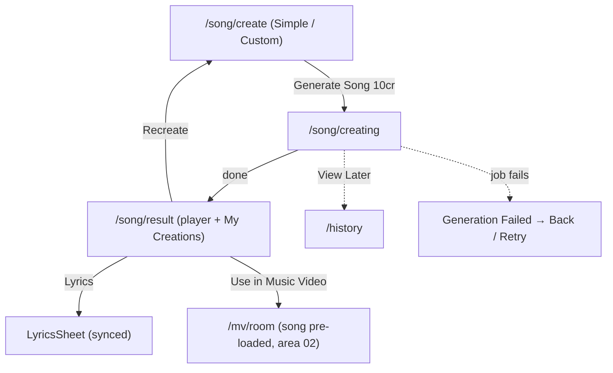

# Area 03 — AI Song Creation

> Read `../00-overview.md` first (conventions, ID scheme, global auth/credits models). **As-built**;
> ⚠️ = divergence from App v3.0, ❓ = a tracked `TBD-*`, 🔒 = mock/in-memory.

---

## 1. Overview & scope

The end-to-end flow to create an AI song: compose (Simple or Custom) → watch generation → view the
result (disc player + synced Lyrics sheet) → use the song in an MV or recreate.

**In scope:** `/song/create` (`SongCompose`), `/song/creating` (`SongGenerationScreen`),
`/song/result` (`SongResultView` → `SongDetail` + `LyricsPanel`).
**Out of scope (cross-referenced):** the community song player `/song/play` (area 04 —
`CommunitySongPlayer`); `SongDetail` is **shared** with History's `CreationDialog` (area 05);
`ShareDialog` (area 10); Use-in-MV lands in `/mv/room` (area 02).

**As-built vs App F11–F13 (SONG-01…05 landed 2026-07-23; amended 2026-08-06 by the designer-UI
migration, slice 3j):** Custom mode has Genre / Mood / Vocal chips + Title; the **Lyrics / Idea**
input is a free-form textarea (app-style — Ideas / Lyrics samples + Enhance), matching the app
prototype; **Recreate charges `COST_SONG_RECREATE` (50) and keeps the prior song in History**
(SONG-03); **AI Enhance is free the first time per session, then 1 credit** (SONG-04); the compose
credit pill shows the **live balance** (SONG-05). Generation itself charges `COST_SONG` (10) on
start (GL-01, insufficient → IAP).

**Two of SONG-01/02 no longer describe the code — both by decision, both recorded here:**

- ⚠️ **SONG-01's BPM slider and Key selector are GONE from the form** (plan S4, slice 3j). The
  designer prototype has neither control. **The `bpm` / `key` FIELDS on `SongComposeSchema` are
  untouched** and still carry `DEFAULT_SONG_COMPOSE`'s values into every request — plan §11 makes
  removing them a **C8 contract change that must be its own PR**, so the slice removed the controls
  only. RD: build against the fields, not against the (absent) UI. Guarded in both directions by
  `e2e/behaviour-regressions.spec.ts` → `3j / S4`.
- ⚠️ **SONG-02's 30s free-preview gate is CANCELLED** (plan §1.4, S3) and `/song/result` no longer
  enforces it. `/song/play` dropped it in slice 3b; `/song/result` dropped it in 3j when it stopped
  rendering `SongDetail`. `FREE_PREVIEW_SEC` still exists inside `SongDetail.tsx` for its one
  remaining unmigrated consumer, History's `CreationDialog` — so the cap is alive in History and
  dead on both player screens. That inconsistency is deliberate and ends when `CreationDialog` is
  migrated.

---

## 2. Route / component / state / API map (RD)

| Route            | View                                           | Owns UI                                                                                                                                                       | Reads/writes state                                                                                                     | `MuseApi`                            |
| ---------------- | ---------------------------------------------- | ------------------------------------------------------------------------------------------------------------------------------------------------------------- | ---------------------------------------------------------------------------------------------------------------------- | ------------------------------------ |
| `/song/create`   | `song/SongCompose` (🔒 **Auth**)               | Simple/Custom tabs, describe/lyrics, Instrumental, Genre/Mood/Vocal chips, Title, Ideas/Lyrics/Enhance, **Create Song** CTA, **two-mode side rail**                                   | `useSongFlow().{songCompose,patchSongCompose,resetForNewSong}`; `useAuth().loggedIn`, `useHistory().history` (rail)     | `enhancePrompt` (song/lyrics)        |
| `/song/creating` | `song/SongGenerationScreen` → `GenerationView` | progress ring/step, View Later                                                                                                                                | `startSong`, `gen`, `songResult`                                                                                       | `createSongJob`, `getSongJob` (poll) |
| `/song/result`   | `song/SongResultView` (self-contained)         | **Back (→ History)**, player + progress/seek, prev/next transport, volume/mute, Like, Share, Download, Lyrics sheet, Publish toggle, Use-in-MV, Recreate, **My Creations** playlist | `songResult`, `useHistory` (earlier songs + share id), `useMvFlow().patchCompose` (Use-in-MV), `useCredits` (Recreate) | —                                    |

**Provider:** `SongFlowProvider` (`useSongFlow`) — compose form, job polling, result; feeds
`HistoryProvider` on start/complete/fail. 🔒 mock generation (`GenerationView` shared with MV).

⚠️ **`/song/result` no longer renders `SongDetail`** (slice 3j). It is DP's own markup, and its
lyrics sheet is the shared `ui/LyricsSheet`, not `LyricsPanel`. `SongDetail` + `LyricsPanel` are
still live — but only under History's `CreationDialog` (area 05), which is not migrated. Anything
this area used to say about `/song/result` "sharing `SongDetail` with History" now describes
History alone.

---

## 3. State model & rules

**Compose (`SongCompose`)** — `types.ts` / `schemas.ts`:

- `mode`: `simple` (default) | `custom`.
- `describe`: string (Simple), max 2500 (`DESCRIPTION_MAX`).
- `instrumental`: boolean (both modes) — when ON in Custom, the Lyrics field is replaced by "No lyrics needed…".
- `lyrics`: string (Custom), max 2500.
- `genre` (default "Pop"), `mood` (default "Uplifting"), `vocal` (nullable, optional), `title` (optional).
- **CTA-ready** (`isSongReady`): **Custom → always ready**; **Simple → `describe.trim() !== ""`**.
- Cost: `COST_SONG = 10` shown on the **Create Song** CTA (label matches the app prototype, 2026-07-23).
- Custom-mode **Lyrics / Idea** field: a **free-form textarea** (`s.lyrics`, max 2500) with Idea /
  Lyrics sample fills + Enhance — matching the app prototype (an earlier per-line editor was
  reverted 2026-07-23).
- ⚠️ **No BPM slider and no Key selector** (S4 / 3j — see §1). `bpm` (`BPM_MIN 60`–`BPM_MAX 200`)
  and `key` (`SONG_KEYS`, nullable = "Auto") are still schema fields with defaults, still sent on
  every request, and now **unreachable from the UI**. `BPM_MIN` / `BPM_MAX` / `SONG_KEYS` remain
  exported from `src/lib/mv/types.ts` for the same reason.
- DP's **Song Length** slider is not ported: DP ships it behind `SHOW_SONG_LENGTH = false`, and
  whether that is a temporary hide or a removal is open question U1 for the designer.
- Compose helpers: **Ideas** (Simple: random `SONG_IDEAS`; Custom: Idea + Lyrics sample fills),
  **Enhance** (`enhancePrompt`; Custom lyrics offers Refine Idea vs Refine Lyrics; **first free/session
  then 1 cr** via `useCredits().{enhanceCost,consumeEnhance}` — SONG-04), a supported-languages info
  popover (Custom). The inline **`CreditPill` shows the live balance** (SONG-05).

**Job (`SongJob` → `SongResult`)**: `createSongJob(compose)` → poll `getSongJob` → on done sets
`songResult` ({title, cover, genre, mood, durationSec, audioUrl?, instrumental, lyrics?}) and marks
History completed. Generation estimate "~1 minute" (display-only; mock timing).

**Result (`SongResultView`, DP markup since 3j)**: cover + title + `genre · mood` line, progress bar
w/ seek, play/pause and **prev/next transport across the playlist**, volume + mute (desktop);
**Lyrics** → the shared `LyricsSheet` (synced timed lines + mini player) when lyrics exist;
**Share** → `ShareDialog`; **Download** (desktop); a **Publish to community** toggle (GL-02 — Song
publishes on the action with no confirm, unlike MV's MV-12); CTAs **Use in Music Video** and
**Recreate · 50 Credits**; and a **My Creations** grid of the user's earlier songs from `useHistory`
that swaps the active track. Playback is uncapped for everyone (SONG-02 cancelled — see §1).

- ⚠️ **A Like button now exists on your own creation**, ported from DP's player, `aria-pressed`
  and local-only (no API, no History write). The spec's long-standing rule was **no Like on an own
  creation** — flagged, not resolved. Product owner / designer call: keep DP's control, or drop it
  as WA did. Until then AC-SONG-06's "and no Like" is a KNOWN divergence.
- ⚠️ **±15s nudge is gone** — DP's transport spends those two slots on prev/next through the
  playlist. Seek by dragging the progress bar is unaffected.

- **Use in Music Video** → `patchCompose({ song: {source:"library", …, lyrics} })` + `/mv/room` (area 02).
- **Recreate** (SONG-03) → charges `COST_SONG_RECREATE` (50) via `resetForRecreate()` and routes to `/song/creating` to generate a fresh take, **keeping the previous song in History**; if `credits < 50`, opens `BuyCreditsModal` instead.

🔒 `songResult` is in-memory; a reload on `/song/creating` or `/song/result` triggers the flow-guard
(redirect to `/song/create`).

---

## 4. Journeys

Screens to capture later: `/song/create` (Simple + Custom), `/song/creating`, `/song/result`, Lyrics sheet.

### SONG-P1 — Compose

- **SONG-P1-S0 (side rail, 2026-08-06)** Same two-mode aside as `/mv/room` (area 02 MV-P1-S0): **"Trending Songs"** over `TOP_PICKS_SONGS` with a "See all" → `/explore/songs`, or **"My Creations"** over the user's own finished songs from `useHistory()`, no "See all", each row opening `/song/result?id=`. Requires `loggedIn` **and** at least one completed song.
- **SONG-P1-S1** Arrive `/song/create` (auth-gated); **Simple** tab default; **Create Song** disabled until `describe` non-empty. Hint "Describe your song to continue."
- **SONG-P1-S2** Toggle **Instrumental** (both modes). Simple: describe + Ideas + Enhance.
- **SONG-P1-S3** Switch to **Custom**: free-form **Lyrics / Idea** textarea (or "No lyrics needed" when Instrumental) + Ideas/Lyrics/Enhance; Genre/Mood chips + Vocal (optional, clearable); optional Title. Custom CTA always enabled. _(No BPM/Key row since 3j — §1.)_
- **SONG-P1-S4** Tap **Create Song** (`10`) → `resetForNewSong()` → `/song/creating`.

### SONG-P2 — Generation

- **SONG-P2-S1** `/song/creating`: `startSong()` fires once (inserts a Generating History row); ring/step; estimate "~1 minute"; **View Later** → `/history`. Flow-guard: not ready & no result → redirect `/song/create`.
- **SONG-P2-S2** On `done` → `/song/result`.

### SONG-P3 — Result

- **SONG-P3-S1** Player autoloads; play/pause, drag-to-seek, prev/next through **My Creations**, volume/mute on desktop. Playback is not capped (SONG-02 cancelled).
- **SONG-P3-S2** **Lyrics** → the shared `LyricsSheet` (synced highlight + mini player) — only when lyrics exist. In practice this means **Custom mode + non-instrumental + typed lyrics**; Simple mode never sets `lyrics`, so a Simple-mode result has no Lyrics sheet.
- **SONG-P3-S3** **Share** → `ShareDialog`; **Download** saves the mp3 (desktop). **Use in Music Video** → `/mv/room` with the song pre-loaded (incl. lyrics). **Recreate** → charges 50 cr and regenerates (`/song/creating`), keeping the prior song in History (SONG-03).
- **SONG-P3-S4** **Publish** toggle publishes the song to the community immediately when switched on — sign-in required, **no confirm step** (GL-02; MV's equivalent does confirm, MV-12).

---

## 5. Error & edge states

| ID          | Trigger                                                                     | Behaviour                                                                                                                                                                                                                                                                                                                              |
| ----------- | --------------------------------------------------------------------------- | -------------------------------------------------------------------------------------------------------------------------------------------------------------------------------------------------------------------------------------------------------------------------------------------------------------------------------------- |
| **SONG-E1** | Song job fails                                                              | Shared `GenerationView` failure state: "Generation Failed" + **Back** (`/song/create`) + **Retry**, "credits were not charged". **`[fail]` in the Simple-mode `describe` triggers a mock failure at ~60% (`mock.ts:137`); `lyrics` does not — so a Custom-mode song cannot be failed via the UI.** Production trigger → `TBD-SONG-06`. |
| **SONG-E2** | Reload/deep-link `/song/creating` or `/song/result` with no in-memory state | Flow-guard → `router.replace("/song/create")`.                                                                                                                                                                                                                                                                                         |
| **SONG-E3** | Logged-out user opens `/song/create`                                        | `AuthGuard` → sign-in modal (area 09).                                                                                                                                                                                                                                                                                                 |
| **SONG-E4** | Instrumental ON (Custom)                                                    | Lyrics field replaced with an instrumental note; result typically has no Lyrics sheet. ⚠️ Toggling Instrumental does **not** clear already-typed lyrics, so an atypical path (type lyrics → enable Instrumental) can still carry lyrics into the result (→ `TBD-SONG-01`).                                                             |

---

## 6. Acceptance criteria (EARS)

- **AC-SONG-01** — WHEN `/song/create` loads, THE SYSTEM SHALL default to **Simple** and keep **Create Song** disabled until `describe.trim() !== ""`; in **Custom**, it SHALL be enabled by default.
- **AC-SONG-02** — WHEN Instrumental is ON in Custom, THE SYSTEM SHALL hide the lyrics editor and typically generate without lyrics (no Lyrics sheet). _(Note: toggling does not clear previously-typed lyrics — see SONG-E4 / `TBD-SONG-01`.)_
- **AC-SONG-03** — WHEN describe/lyrics exceeds 2500 chars, THE SYSTEM SHALL cap typed/pasted input at 2500. (Ideas/Enhance fills are not capped.)
- **AC-SONG-04** — WHEN **Create Song** is tapped, THE SYSTEM SHALL `resetForNewSong()`, insert a Generating History row, and navigate to `/song/creating`.
- **AC-SONG-05** — WHILE the song job is `processing`, THE SYSTEM SHALL show progress, step, an estimate, and View Later → `/history`; on `done` navigate to `/song/result`.
- **AC-SONG-11** — WHEN `/song/result` is reached from a `/history` row, THE SYSTEM SHALL show that row's song (flow state is seeded by `useOpenCreation`, area 05) and carry the row id in `?id=` so Share builds that row's link. THE SYSTEM SHALL expose a **Back** control on this stage — DP switches it from `RoomNavbar` to `DetailNavbar backHref="/history"` — going `router.back()` with `/history` as the fallback. *(An earlier song has no stored genre/mood, so the genre · mood line is omitted rather than invented.)*
- **AC-SONG-06** — WHEN `/song/result` loads, THE SYSTEM SHALL expose drag-to-seek, prev/next across My Creations, Share, Download, a Lyrics sheet (when lyrics exist), a Publish toggle, Use in Music Video, and Recreate. Playback SHALL NOT be capped for any account.
  - ⚠️ **Two clauses of the original AC-SONG-06 are now knowingly untrue and are NOT rewritten away.** _(a)_ "**±15s**" — removed in 3j; DP's transport uses those slots for prev/next. _(b)_ "**and no Like**" — DP's player has a Like and it was ported (local state only). _(c)_ the 30s cap it required is cancelled by S3 (§1). (a) and (b) need a product/designer decision; (c) is already decided.
- **AC-SONG-11** — ⚠️ **SUPERSEDED by plan S4 (slice 3j) — the code deliberately does not satisfy this.** It required a BPM slider (60–200) and a Key selector in Custom mode; both controls are removed. What remains true: the free-form Lyrics / Idea textarea, and `songCompose.{bpm,key}` persisting their defaults. Reinstating the controls, or deleting the fields (a C8 PR), are the two open resolutions — this AC stays on the page so neither happens by accident.
- **AC-SONG-12** — WHEN Recreate is invoked with `credits ≥ 50`, THE SYSTEM SHALL charge 50 and regenerate while keeping the prior song in History; otherwise it SHALL open the buy-credits IAP (SONG-03).
- **AC-SONG-13** — WHEN AI Enhance is used, THE SYSTEM SHALL charge nothing the first time per session and 1 credit each time after (SONG-04).
- **AC-SONG-07** — WHEN **Use in Music Video** is tapped, THE SYSTEM SHALL pre-load the song (incl. lyrics) into MV compose and navigate to `/mv/room`.
- **AC-SONG-08** — IF the song job fails, THEN THE SYSTEM SHALL show the shared error state with Back + Retry.
- **AC-SONG-09** — WHEN a song job starts, THE SYSTEM SHALL NOT change the credit balance. _(pending `TBD-GL-01`.)_
- **AC-SONG-10** — THE SYSTEM SHALL render `/song/create`, `/song/creating`, `/song/result` at 390/768/1024/1440px with no overflow. _(visual)_

---

## 7. Per-path QA checklist

- [ ] **SONG-P1**: Simple CTA gated by describe; Custom CTA always on; Instrumental hides lyrics (AC-01/02).
- [ ] **SONG-P2**: Generate → Generating row + progress → result (AC-04/05).
- [ ] **SONG-P3**: full playback (no 30s lock); drag-to-seek; prev/next across My Creations; Lyrics sheet when lyrics; Share; Download; Publish toggle; Use-in-MV pre-loads song in `/mv/room`; Recreate → compose (AC-06/07).
- [ ] **SONG-E1**: failure → Back + Retry (AC-08). **SONG-E2**: reload → redirect compose. **SONG-E3**: logged-out → sign-in.
- [ ] **AC-09**: start job → balance unchanged. **AC-10**: 3 screens clean at 4 widths _(visual)_.

---

## 8. Open items for RD

| ID              | Open item                                                                                                                                                                                                                                                   |
| --------------- | ----------------------------------------------------------------------------------------------------------------------------------------------------------------------------------------------------------------------------------------------------------- |
| **TBD-SONG-06** | 🔧 **Backend (RD)** — the production song-generation failure trigger is undefined (the mock's `[fail]`-in-description behaviour needs a real equivalent).                                                                                                   |
| **TBD-SONG-07** | ⏳ **TBD** — the Custom info popover lists 11 languages; confirm the real supported-language set for lyric generation.                                                                                                                                      |
| **TBD-SONG-08** | 🎨 **Designer/PO (from 3j)** — `/song/result` gained a **Like** on the user's own creation (DP's control, local state only). Keep it and give it a backing action, or drop it? See AC-SONG-06 (b).                                                          |
| **TBD-SONG-09** | 🎨 **Designer/PO (from 3j)** — **±15s** was dropped for prev/next. Confirm, or find room for both. See AC-SONG-06 (a).                                                                                                                                      |
| **TBD-SONG-10** | 🔧 **RD (from 3j / S4)** — `bpm` / `key` are now unreachable from the UI but still on `SongComposeSchema` and still sent. Deleting them is the C8 PR plan §11 requires; leaving them is also a valid answer. Decide before backend integration, not during. |

See also global: `TBD-GL-01` (credit charging — incl. `COST_SONG=10` vs app 50).

---

## 9. Flow diagram

```mermaid
flowchart TD
  Create["/song/create (Simple / Custom)"] -->|Generate Song 10cr| Creating["/song/creating"]
  Creating -->|done| Result["/song/result (player + My Creations)"]
  Result -->|Lyrics| Sheet["LyricsSheet (synced)"]
  Result -->|Use in Music Video| Room["/mv/room (song pre-loaded, area 02)"]
  Result -->|Recreate| Create
  Creating -.View Later.-> Hist["/history"]
  Creating -.->|job fails| Err["Generation Failed → Back / Retry"]
```

---

**Decisions (as-built, 2026-08-06):** Simple default; Custom is Genre/Mood/Vocal chips + Title +
a free-form Lyrics/Idea textarea, **no BPM/Key controls** (S4 — the fields stay); **no free-preview
cap on either player screen** (S3), the cap surviving only inside `SongDetail` for History;
`/song/result` is DP's player over a **My Creations** playlist with a Publish toggle; Recreate costs
50cr and keeps the prior song; generation is mock and display-only on credits (except the real
`COST_SONG` charge). **Open, deliberately unresolved:** the ported Like on an own creation, and the
±15s controls it replaced (TBD-SONG-08/09).
