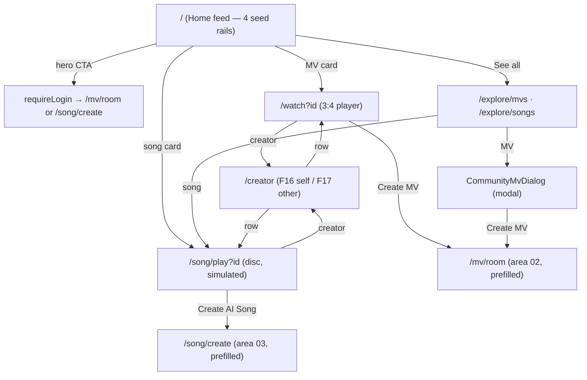

# Area 04 — Explore & Community

> Read `../00-overview.md` first (conventions, ID scheme, global models). **As-built**; ⚠️ = divergence
> from App v3.0, ❓ = a tracked `TBD-*`, 🔒 = mock/seed.
>
> 🔒🔒 **Whole-area caveat (product-undefined):** every surface here runs on **static seed data**
> (`lib/mv/community.ts`). The **Explore Curation PRD** (4 ranked rails, scoring formulas, AI+human
> moderation, refresh cadence, admin pin/unpin) is **not implemented** — there is no ranking, no
> eligibility gating, no moderation, no publish→feed pipeline, and **no community `MuseApi` endpoints**
> (`TODO.md #1`). This spec documents the **UI as-built**; **all curation/feed/moderation logic is
> `TBD`** (`TBD-GL-05` + `TBD-EXP-*`). Do not read production ranking into this doc (gate G3).

---

## 1. Overview & scope

The discovery + community-consumption surface: the Home feed, the two "See all" explore pages, the MV
video player, the community song player, and the creator profile.

**In scope:** `home/HomeView` (`/`), `community/MvExplore` (`/explore/mvs`), `community/SongExplore`
(`/explore/songs`), `community/CommunityMvPlayer` (`/watch`), `community/CommunitySongPlayer`
(`/song/play`), `community/CreatorProfile` (`/creator`), `community/CommunityMvDialog` (modal player),
`community/TrendingMvsPanel` (rendered inside `/mv/room` — area 02), and the shared
`community/ui.tsx` primitives.
**Out of scope (cross-referenced):** the shell (area 01); the actual create flows the CTAs lead into
(areas 02/03); sign-in (area 09); `ShareDialog` (area 10). `LyricsPanel` is shared with area 03.

**Key divergences from the app:** rails are **static seed**, not ranked (Curation PRD) ⚠️; `/watch`
has **no 9:16↔3:4 toggle and no swipe-up feed** (App F10) ⚠️ (`TBD-EXP-03`); `/song/play` is still a
**simulated timer with no real audio**, but now has **shuffle + repeat and the 30s free-preview gate**
(EXP-04 / SONG-02, 2026-07-23) ⚠️; there is a **single sample creator** (`DEFAULT_CREATOR`) behind
every avatar and **no Report/Block** (App F17) ⚠️ (`TBD-EXP-05`). **GL-02 (2026-07-23):** Create MV /
Create Song / Like on community surfaces now **gate at the action** (`requireLogin`); like/share are
still local, non-persistent (real counters → `TBD-EXP-08`).

---

## 2. Route / component / state / API map (RD)

| Route / Component | Owns UI | Reads/writes state | `MuseApi` |
|---|---|---|---|
| `/` → `home/HomeView` | hero CTAs, Trending marquee, New MVs, Top Picks, New Songs, per-row like/share/create | `useAuth().requireLogin`, `useSongFlow().patchSongCompose`, local like map | **none** (seed) |
| `/explore/mvs` → `community/MvExplore` | grid of all MVs → `CommunityMvDialog` | local `playId` | **none** |
| `/explore/songs` → `community/SongExplore` | Top Picks + New Songs lists → player; Create | `useSongFlow().patchSongCompose` | **none** |
| `/watch` → `community/CommunityMvPlayer` | 3:4 video player, like/share, Create MV | `useSearchParams().id`, `useMvFlow().setCompose`, local play/mute/like | **none** |
| `/song/play` → `community/CommunitySongPlayer` | disc player (**simulated**), prev/next, like/share, Lyrics, Create AI Song | `useSearchParams().id`, `useSongFlow().patchSongCompose`, local idx/progress | **none** |
| `/creator` → `community/CreatorProfile` | header + stats + MV/Songs tabs + rows | `useSearchParams().{self,tab}` | **none** |
| `community/CommunityMvDialog` | modal 1:1 MV player + Create MV | `useMvFlow().setCompose` | **none** |
| `community/TrendingMvsPanel` | Trending list aside in `/mv/room` (area 02) | — | **none** |

Data: `lib/mv/community.ts` — `TRENDING_MVS`, `NEW_MVS`, `TOP_PICKS_SONGS`, `NEW_SONGS`,
`ALL_COMMUNITY_SONGS`, `CREATOR_MVS`, `CREATOR_SONGS`, `DEFAULT_CREATOR`, `getCommunityMv/Song`,
`formatCount`. All routes are **public** (no `AuthGuard`).

---

## 3. State model & rules

### 3.1 The four rails (Home) — 🔒 seed, not ranked
`HomeView` renders four sections mirroring the Curation PRD rails, but each is a **fixed seed array**:
- **Trending MV** — auto-scrolling infinite **marquee** (`TRENDING_MVS` cloned ×2); card → `/watch?id`.
- **New MVs** — horizontal scroll, `NEW_MVS.slice(0,8)`, portrait 3:4 cards; "See all" → `/explore/mvs`.
- **Top Picks Songs** — horizontal scroll, `TOP_PICKS_SONGS`, square cards; card → `/song/play?id`; "See all" → `/explore/songs`.
- **New Songs** — 2-col grid, `NEW_SONGS.slice(0,6)`; row → `/song/play?id`; per-row Like (local), Share (`ShareDialog`), **Create** → `createFromSong` (`requireLogin` → `patchSongCompose` → `/song/create`).
- **Hero CTAs**: "AI Music Video Studio" → `requireLogin(→ /mv/room)`; "AI Audio Lab" → `requireLogin(→ /song/create)` (auth triggers — area 09).
- ⚠️ **No ranking, refresh, eligibility, or dedup** from the Curation PRD — ordering is array order (`TBD-EXP-01`).
- 📄 **Publish→feed locale contract (backend; spec-only).** When a creation is published (area 02/05) it carries a **language/locale code**. The backend returns each feed **already ranked locale-primary** (viewer's locale first, then engagement signals per the Curation PRD). The **frontend just requests and displays** the server-sorted data — no client-side ranking; "we only ask, the backend sorts." The **code format (2-char ISO `en` vs 3-char product `enu`, etc.) is RD-TBD** → `TBD-EXP-10` (relates to i18n `TBD-GL-06`). No prototype change now (mock feed stays seed).

### 3.2 Explore pages
- **`/explore/mvs`** (`MvExplore`): responsive grid (2/3/4 cols) of `[...TRENDING_MVS, ...NEW_MVS]`; card → **`CommunityMvDialog`** (modal player); Back → `/`. Every card's creator avatar is `DEFAULT_CREATOR.avatar` ⚠️. (`MvExplore` also accepts an `initialPlayId` deep-link prop, but the route never passes it — currently dead.)
- **`/explore/songs`** (`SongExplore`): "Top Picks" + "New Songs" lists; row → `/song/play?id`; creator → `/creator`; **Create** → `requireLogin` → `patchSongCompose` + `/song/create` (gated at the click, consistent with Home — GL-02/EXP-02); Back → `router.back()`.

### 3.3 MV player — `/watch` + `CommunityMvDialog`
- `/watch` reads `?id` → `getCommunityMv(id) ?? NEW_MVS[0]`; **3:4 portrait** stage, autoplay **muted** loop, tap play/pause, mute toggle; `# Music Video` tag, title, meta; creator → `/creator`; **Like** (local), **Share** (`ShareDialog`), `Stats`, prompt; **Create Music Video** → `setCompose` (mvType + prompt + `matchedSong` + title) → `/mv/room` (area 02).
- `CommunityMvDialog` is the same experience as a **modal** (1:1 `object-contain` stage), used from `/explore/mvs`.
- ⚠️ App F10 offers a 9:16↔3:4 aspect toggle and a swipe-up "next MV" community feed; web has neither (`TBD-EXP-03`).

### 3.4 Song player — `/song/play` (`CommunitySongPlayer`)
- Reads `?id`; **EXP-09 fix (2026-07-23):** the player picks the **playlist the song belongs to** —
  `CREATOR_SONGS` for `cps-*` ids, else `ALL_COMMUNITY_SONGS` — so creator deep-links play the right
  track and Prev/Next stay within that set. **disc** cover (spins while playing); **playback is a
  simulated `setInterval` progress over `DURATION=125s` — no real `<audio>`** ⚠️; **shuffle** (random
  next) + **repeat** (loops the track); click-to-seek; **Like** (gated, local), **Share**, **Lyrics**
  → `LyricsPanel`; **Create AI Song** (gated) → `patchSongCompose` → `/song/create`.
- **SONG-02 30s gate:** free accounts can only play/scrub the first 30s (an upgrade prompt opens `SubscribeModal`); subscribers play in full.

### 3.5 Creator profile — `/creator` (`CreatorProfile`)
- Reads `?self` (`self=1` → `MOCK_USER` name/email; else `DEFAULT_CREATOR`) and `?tab` (`mv`|`songs`).
- Header avatar/name/email + **Plays/Likes** stats (always `DEFAULT_CREATOR.plays/likes` strings, even in self mode ⚠️); MV/Songs tabs; rows (`CREATOR_MVS`/`CREATOR_SONGS`) → `/watch?id` or `/song/play?id`; per-row `⋯` menu = **Like / Share** only.
- This route is **both** the App's *My Community Profile* (F16, via `/profile` stats → `/creator?self=1`, area 06) **and** *Community User Profile* (F17, via any creator link).
- ⚠️ Self mode shows `MOCK_USER`'s identity but the **sample creator's stats + content** (`CREATOR_MVS/SONGS`); no **Report/Block** (App F17) (`TBD-EXP-05`).

### 3.6 Shared
- `community/ui.tsx`: `Headphones/Heart/Share/Play/ChevronRight` icons, `BadgePill` (HOT/NEW), `Stats`, `SectionHead` ("See all" link). `formatCount` → "1.2k" style.
- 🔒 Every like/share/play interaction is **local component state** — no persistence, no server. **Like and Create now gate at the action** (GL-02); share stays open. Real counters/persistence → `TBD-EXP-08`.

---

## 4. Journeys

Screens to capture later: `/`, `/explore/mvs` (+ dialog), `/explore/songs`, `/watch`, `/song/play`, `/creator` (self + other, both tabs).

### EXP-P1 — Home feed
- **EXP-P1-S1** Open `/` (public). **System:** hero CTAs + four seed rails render.
- **EXP-P1-S2** Hero **Create MV / Create Song** → `requireLogin` → `/mv/room` / `/song/create` (area 09/02/03).
- **EXP-P1-S3** Tap a Trending/New MV card → `/watch?id`; a Top Picks/New Song → `/song/play?id`; a New-Songs **Create** → `requireLogin` → `/song/create` (song pre-filled); Like/Share act locally.
- **EXP-P1-S4** "See all" → `/explore/mvs` or `/explore/songs`.

### EXP-P2 — Explore MVs
- **EXP-P2-S1** `/explore/mvs`: grid of all MVs. Tap a card → `CommunityMvDialog` (modal player). Back → `/`.
- **EXP-P2-S2** In the dialog: play/pause, mute, creator → `/creator`, Like/Share, **Create Music Video** → `/mv/room`.

### EXP-P3 — Explore Songs
- **EXP-P3-S1** `/explore/songs`: Top Picks + New Songs lists. Row → `/song/play?id`; creator → `/creator`; **Create** → `/song/create` (pre-filled).

### EXP-P4 — Watch (MV player)
- **EXP-P4-S1** `/watch?id`: 3:4 player (autoplay muted, tap to pause, mute toggle). Missing/invalid id → falls back to `NEW_MVS[0]`.
- **EXP-P4-S2** Creator → `/creator`; Like (local); Share (`ShareDialog`); **Create Music Video** → `/mv/room` pre-filled from this MV.

### EXP-P5 — Song play (community)
- **EXP-P5-S1** `/song/play?id`: disc + simulated progress; Prev/Next cycle the playlist; seek; Like/Share; Lyrics sheet (if lyrics).
- **EXP-P5-S2** **Create AI Song** → `/song/create` pre-filled (genre/mood/title/lyrics).

### EXP-P6 — Creator profile
- **EXP-P6-S1** `/creator` (or `?self=1&tab=…`): header + stats + MV/Songs tabs.
- **EXP-P6-S2** Tap a row → `/watch?id` (MV) or `/song/play?id` (song). Row `⋯` → Like/Share.

---

## 5. Error & edge states

| ID | Trigger | Behaviour |
|---|---|---|
| **EXP-E1** | `/watch` or `/song/play` with **no** `?id` | Falls back to `NEW_MVS[0]` / first playlist song. |
| **EXP-E1b** | `/watch` or `/song/play` with an **unresolvable** `?id` | **EXP-06 (2026-07-23):** shows a **not-found** `CommunityEmpty` state (with an Explore CTA), not a silent fallback. The former creator-Songs wrong-track bug is **fixed** (EXP-09 — see §3). |
| **EXP-E1c** | Explore grid empty / browser offline | **EXP-06:** the grids render a `CommunityEmpty` **empty** ("Be the first to create!") or **offline** state (`useOnline`). |
| **EXP-E2** | Like/Create on any community item | **GL-02 (2026-07-23):** gated at the action — `requireLogin` runs before the effect. State is still local, lost on reload; real counters/persistence → `TBD-EXP-08`. |
| **EXP-E3** | `/song/play` "playback" | No real audio — a `setInterval` advances a progress bar to 125s then stops. 🔒 |
| **EXP-E4** | Empty rail / no content | Not handled — seed arrays are always populated (`TBD-EXP-06`). |
| **EXP-E5** | Create from a community item while logged out | All Create entry points (Home hero, New-Songs, `/explore/songs`, players) call `requireLogin` at the click (GL-02/EXP-02). |

---

## 6. Acceptance criteria (EARS)

- **AC-EXP-01** — WHEN `/` loads, THE SYSTEM SHALL render the hero CTAs and the four seed rails (Trending MV marquee, New MVs, Top Picks Songs, New Songs) in seed order.
- **AC-EXP-02** — WHEN a hero CTA or a New-Songs **Create** is tapped, THE SYSTEM SHALL run `requireLogin` and, on success, navigate to the create flow (pre-filling the song for Create-from-song).
- **AC-EXP-03** — WHEN an MV card is tapped, THE SYSTEM SHALL open `/watch?id` (Home) or `CommunityMvDialog` (Explore); a song card → `/song/play?id`.
- **AC-EXP-04** — WHEN `/watch` loads, THE SYSTEM SHALL play the MV muted in 3:4 with play/pause + mute, and expose Like, Share, and **Create Music Video** → `/mv/room` pre-filled.
- **AC-EXP-05** — WHEN `/song/play` loads, THE SYSTEM SHALL resolve the id to the correct playlist (creator vs community), show the disc player with simulated progress, Prev/Next, **shuffle + repeat**, Like/Share, a Lyrics sheet when lyrics exist, and **Create AI Song** → `/song/create` pre-filled. WHILE not subscribed, playback SHALL cap at 30s with an upgrade prompt (SONG-02).
- **AC-EXP-08** — WHEN a community **Like** or **Create MV/Song** is invoked while logged out, THE SYSTEM SHALL open the sign-in modal at the action and run it on success (GL-02).
- **AC-EXP-09** — WHEN a `/watch` or `/song/play` id is unresolvable, THE SYSTEM SHALL show a not-found state; WHEN an explore grid is empty or the browser is offline, THE SYSTEM SHALL show the empty / offline state (EXP-06).
- **AC-EXP-06** — WHEN `/creator` loads, THE SYSTEM SHALL show the profile header + stats and MV/Songs tabs whose rows open the respective players; `?self=1` shows `MOCK_USER` identity.
- **AC-EXP-07** — WHEN an id is missing/invalid on `/watch` or `/song/play`, THE SYSTEM SHALL fall back to a default item (no crash).
- **AC-EXP-08** — THE SYSTEM SHALL render all six surfaces at 390/768/1024/1440px with no overflow. *(visual)*

> No AC asserts ranking, moderation, refresh, persistence, real audio, or publish→feed — none exist (§8).

---

## 7. Per-path QA checklist

- [ ] **EXP-P1**: rails render in seed order; hero + New-Songs Create gate via sign-in; cards route correctly (AC-01/02/03).
- [ ] **EXP-P2**: grid → dialog player → Create MV → /mv/room (AC-03/04).
- [ ] **EXP-P3**: song lists → player; Create → /song/create pre-filled (AC-03).
- [ ] **EXP-P4**: /watch autoplay muted 3:4; play/mute/like/share; Create MV pre-fills (AC-04); bad id → NEW_MVS[0] (AC-07, E1).
- [ ] **EXP-P5**: simulated progress; Prev/Next cycle; Lyrics when present; Create AI Song pre-fills (AC-05, E3).
- [ ] **EXP-P6**: creator tabs + rows open players; self=1 shows MOCK_USER (AC-06).
- [ ] **AC-08**: six surfaces clean at 4 widths *(visual)*.

---

## 8. Open items for RD

Curation items are **spec-only** — do not change the codebase from these; backend by RD later (`TBD-GL-05`).

| ID | Open item |
|---|---|
| **TBD-EXP-01** | 📄 **Spec-only (Curation PRD)** — implement the Explore PRD: scoring formulas per rail (Trending/New MVs/Top Picks/New Songs), eligibility gates, refresh cadence, dedup. Today all four are static seed in array order. |
| **TBD-EXP-03** | ⏳ **TBD** — App F10 aspect toggle (9:16↔3:4) + swipe-up next-MV community feed; web has neither. In scope? |
| **TBD-EXP-05** | ⏳ **TBD** — a single `DEFAULT_CREATOR` backs every avatar; self mode mixes `MOCK_USER` identity with sample content/stats; no Report/Block (App F17). Wire real creators + moderation actions. |
| **TBD-EXP-07** | 📄 **Spec-only (Curation PRD)** — how user creations enter these rails (ties `TBD-MV-06`), plus the AI+human moderation pipeline and admin pin/unpin. Entirely unbuilt. |
| **TBD-EXP-08** | 🔧 **Backend (RD)** — likes/shares/plays are local, ungated (well, gated at the click per GL-02, but not persisted), non-persistent. Define real counters + storage. |
| **TBD-EXP-10** | ⏳ **Format TBD (RD)** — the publish/feed **language/locale code format** (2-char ISO vs 3-char product code). Frontend just passes it through and requests the server-sorted feed; RD decides the format (ties i18n `TBD-GL-06`). |

See also global: `TBD-GL-02` (like/publish gating), `TBD-GL-05` (Curation/community backend track), and `TBD-MV-06` (publish → community pipeline, area 02).

---

## 9. Flow diagram

---

**Decisions (as-built):** community is UI-only on static seed; no ranking/moderation/persistence; single
sample creator; MV player 3:4-only; song player simulated (no real audio); like/share gated at the
click but not persisted. All curation/feed logic deferred to the backend track (Explore Curation PRD).
