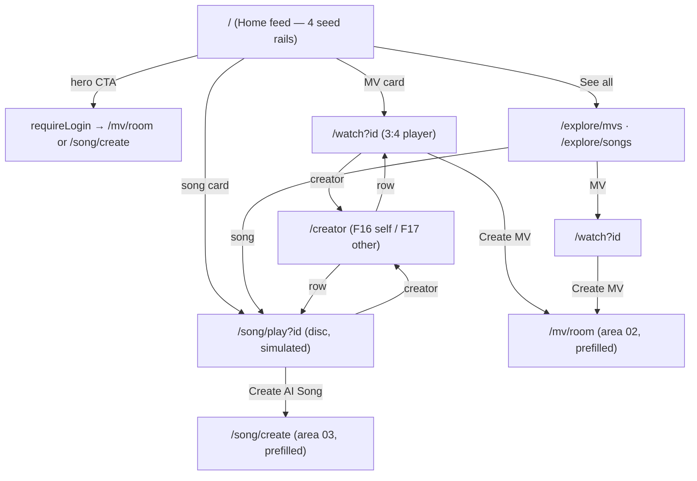

# Area 04 — Explore & Community

> Read `../00-overview.md` first (conventions, ID scheme, global models). **As-built**; ⚠️ = divergence
> from App v3.0, ❓ = a tracked `TBD-*`, 🔒 = mock/seed.
>
> 🔒🔒 **Whole-area caveat (product-undefined):** every surface here runs on **static seed data**
> (`lib/mv/community.ts`). The **Explore Curation PRD** (4 ranked rails, scoring formulas, AI+human
> moderation, refresh cadence, admin pin/unpin) is **not implemented** — there is no ranking, no
> eligibility gating, no moderation, no publish→feed pipeline, and **no community `MuseApi` endpoints**
> (`TODO.md #1`). This spec documents the **UI as-built**; **all curation/feed/moderation logic is
> `TBD`** (`TBD-GL-05` + `TBD-EXP-*`). Do not read production ranking into this doc (gate G3).

---

## 1. Overview & scope

The discovery + community-consumption surface: the Home feed, the two "See all" explore pages, the MV
video player, the community song player, and the creator profile.

**In scope:** `home/HomeView` (`/`), `community/MvExplore` (`/explore/mvs`),
`song/SongDetailView` (**both** `/explore/songs` and `/song/play` — merged 2026-08-05, Slice 3b;
it replaced `community/SongExplore` and `community/CommunitySongPlayer`, both deleted),
`community/CommunityMvPlayer` (`/watch`), `community/CreatorProfile` (`/creator`),
and the shared
`community/ui.tsx` primitives.

> _Corrected 2026-08-19: `community/ui.tsx` now exports only `Heart` and `Share`. The other six were deleted on 2026-08-06 and replaced by `DpIcon` / `ui/SectionHeader` / `ui/Card` / `ui/ListItem` — a deliberate consolidation, not a loss._
> **Out of scope (cross-referenced):** the shell (area 01); the actual create flows the CTAs lead into
> (areas 02/03); sign-in (area 09); `ShareDialog` (area 10).

**Key divergences from the app:** rails are **static seed**, not ranked (Curation PRD) ⚠️; `/watch`
has **no user-facing 9:16↔3:4 toggle** — the stage's ratio is always automatic, per item
(`mvCoverRatio()`, `AC-EXP-04`) — but, corrected 2026-09-01, it is **not** true that web lacks a
swipe-to-next-MV gesture: `CommunityMvPlayer.tsx` has a built, live vertical-swipe-to-next/prev
feature on `.mv-player__stage`, **at every width**, shipped 2026-08-20/21 (§3.3, `AC-EXP-11`).
`DESIGNER-TODO` A26's claim that web has neither is **stale on that half** — confirmed with the
product owner 2026-09-01, the gesture **stays** (`TBD-EXP-03`, ✅ closed). `/song/play` is still a
**simulated timer with no real audio**, but now has **real `<audio>` playback and no free-preview cap** _(and deliberately no shuffle/repeat — 2026-08-19)_ ~~shuffle + repeat and the 30s free-preview gate~~
(EXP-04 / SONG-02, 2026-07-23) ⚠️; there is a **single sample creator** (`DEFAULT_CREATOR`) behind
every avatar and **no Report/Block** (App F17) ⚠️ (`TBD-EXP-05`). **GL-02 (2026-07-23):** Create MV /
Create Song / Like on community surfaces now **gate at the action** (`requireLogin`); like/share are
still local, non-persistent (real counters → `TBD-EXP-08`).

---

## 2. Route / component / state / API map (RD)

| Route / Component                        | Owns UI                                                                                                                | Reads/writes state                                                         | `MuseApi`       |
| ---------------------------------------- | ---------------------------------------------------------------------------------------------------------------------- | -------------------------------------------------------------------------- | --------------- |
| `/` → `home/HomeView`                    | hero + tool selector (a phone pair and a desktop pair), Trending MVs, Top Picks, New Songs, per-row like/share/create  | `useAuth().requireLogin`, `useSongFlow().patchSongCompose`, local like map | **none** (seed) |
| `/explore/mvs` → `community/MvExplore`   | grid of all MVs → `/watch?id=`                                                                                         | —                                                                          | **none**        |
| `/explore/songs` → `song/SongDetailView` | one tabbed list (All + the nine creation `GENRES`, hardcoded — 2026-09-01, was derived) → Now Playing / player; Create | `useSongFlow().patchSongCompose`                                           | **none**        |
| `/watch` → `community/CommunityMvPlayer` | 3:4 video player, like/share, Create MV, YCM watermark on official videos (2026-09-01)                                 | `useSearchParams().id`, `useMvFlow().setCompose`, local play/mute/like     | **none**        |
| `/song/play` → `song/SongDetailView`     | disc player (**real `<audio>`**), prev/next, like/share, Lyrics, Create AI Song                                        | `useSearchParams().id`, `useSongFlow().patchSongCompose`, local idx        | **none**        |
| `/creator` → `community/CreatorProfile`  | header + stats + MV/Songs tabs + rows                                                                                  | `useSearchParams().{self,tab}`                                             | **none**        |

Data: `lib/mv/community.ts` — `TRENDING_MVS`, `NEW_MVS`, `TOP_PICKS_SONGS`, `NEW_SONGS`,
`ALL_COMMUNITY_SONGS`, `CREATOR_MVS`, `CREATOR_SONGS`, `DEFAULT_CREATOR`, `getCommunityMv/Song`,
`formatCount`. All routes are **public** (no `AuthGuard`).

---

## 3. State model & rules

### 3.1 The three rails (Home) — 🔒 seed, not ranked

> **Rewritten 2026-08-07 — the landing page migrated to the designer UI (the 17th and last
> route).** It described the pre-migration Tailwind screen: FOUR rails led by a Trending MV
> marquee, and two gradient hero CTA tiles. Both are gone. What follows is the migrated screen.

`HomeView` renders a hero, a tool selector and **three** rails. Each rail is still a **fixed seed
array** — nothing here is ranked or served.

**Hero + tool selector — two treatments, chosen in JS, not CSS.** `HomeView` reads
`useMediaQuery(PHONE_QUERY)` and mounts a structurally different pair on each side of 768px, which
is DP's own arrangement:

- **≥768px:** `ToolSelectorSectionV3` (a display heading over two cards) ABOVE
  `HeroBannerSectionV3` (a scroll-snap filmstrip of 8 hero items; only the centred card plays its
  video, the rest show posters).
- **<768px:** `HeroBannerSection` (a draggable, auto-advancing infinite carousel) ABOVE
  `ToolSelectorSection` (two compact full-gradient tiles).
- Both tool-selector cards are `requireLogin` gated: **AI Music Video** → `/mv/room`,
  **AI Song** → `/song/create` (auth triggers — area 09; GL-02 / `AC-EXP-02`). Both hero
  "Create MV" CTAs are the same gate to `/mv/room`. DP has no auth at all, so every one of these
  gates is WA's.
- Hero media is `public/assets/hero/` — 8 mp4 + poster pairs vendored from the DP drop
  (`designer-prototype/PROVENANCE.md` explains why that one directory is not excluded).

The rails:

- **Trending Music Videos** — horizontal scroll of the whole of `NEW_MVS`, prev/next arrows that
  appear only when the row can scroll that way; card → `/watch?id`; "See all" → `/explore/mvs`.
- **Top Picks Songs** — horizontal scroll, `TOP_PICKS_SONGS`, square cards; the card navigates to
  `/song/play?id`, the cover's play button previews the real audio in place; "See all" →
  `/explore/songs`.
- **Newly Released Songs** — `NEW_SONGS.slice(0,6)` in 2 columns (1 column below 768px); per row a
  **title** that navigates to `/song/play?id`, **album art** that starts `SongPlayBar` (the desktop
  preview bar; on a phone it falls back to navigating, because the bar is `display:none` there),
  Like (local), Share (`ShareDialog`), and **Create** → `requireLogin` → `patchSongCompose` →
  `/song/create`.
- ⚠️ **The Trending MV marquee is GONE, and with it `TRENDING_MVS`'s only home entry point.**
  It was WA's own 45s infinite rail; DP has no equivalent, and the product owner decided
  2026-08-07 to follow DP ("TRENDING_MVS 不用首頁 (Match DP)"). `TRENDING_MVS` is now reachable
  from `/explore/mvs` alone, where it is the `--primary` section — which is also the only MV
  catalog a phone can reach there. That reach is a CSS section-hiding rule, not a fixed item
  count — see §3.2's correction of `DESIGNER-TODO` **A19**. `DESIGNER-TODO` **A20**; asserted in
  `e2e` so it is not quietly restored.
- ⚠️ **No ranking, refresh, eligibility, or dedup** from the Curation PRD — ordering is array order (`TBD-EXP-01`).
- 📄 **Publish→feed locale contract (backend; spec-only).** When a creation is published (area 02/05) it carries a **language/locale code**. The backend returns each feed **already ranked locale-primary** (viewer's locale first, then engagement signals per the Curation PRD). The **frontend just requests and displays** the server-sorted data — no client-side ranking; "we only ask, the backend sorts." The **code format (2-char ISO `en` vs 3-char product `enu`, etc.) is RD-TBD** → `TBD-EXP-10` (relates to i18n `TBD-GL-06`). No prototype change now (mock feed stays seed).

### 3.2 Explore pages

- **`/explore/mvs`** (`MvExplore`): **two sections** (Top Picks ← `TRENDING_MVS`, Newly Released ← `NEW_MVS`), each a **justified-row gallery** at ≥1024px and a wrapping grid below; card → **navigates to `/watch?id=`** (2026-08-06 — it used to open `CommunityMvDialog` in place; DP's grid links at `/mv-detail?id=`, which is this app's `/watch`, so the dialog was a second rendering of a screen that already existed); Back → `DetailNavbar`'s `router.back()` with a fallback to `/`. Every card's creator avatar is `DEFAULT_CREATOR.avatar` ⚠️.
  > **Corrected 2026-08-05.** Was described as a "responsive grid (2/3/4 cols) of `[...TRENDING_MVS, ...NEW_MVS]`" with "Back → `/`". Slice **3a** replaced that with the designer's justified gallery and two real sections and did not update this line; caught while fixing the equivalent drift for `/explore/songs`.
  > **Item count is not a rule, corrected 2026-09-01 (product owner: "DP 只是示範,實際看後端拿到幾
  > 隻影片就顯示幾隻" — DP is only a demo; the real screen shows however many the backend returns).**
  > `MvGridSections` (shared by this route and `/watch`'s lower half) maps `TOP_PICKS = TRENDING_MVS`
  > and `NEWLY_RELEASED = NEW_MVS` straight through with no `.slice()`/cap anywhere in the render
  > path — confirmed in code. Today the mock seed holds 3 and 11 items (14 total); that split is a
  > property of the fixture data, not a designed limit — a bigger or smaller backend feed renders in
  > full. What a **phone** actually sees fewer of is a separate, CSS-only fact: `MVDetailPage.css`'s
  > `@media (max-width:767px)` rule hides every `.mv-detail__grid-section` and re-shows only
  > `--primary` (Top Picks) — so a phone on `/explore/mvs` reaches 3 of the 14 mock items regardless
  > of the true catalog size, and `/watch`'s mobile treatment (`.mv-detail--selected`) hides both
  > sections outright. This closes the question `DESIGNER-TODO` **A19** raised about the 3-of-14
  > ratio: it was never a spec'd number, only (mock length) × (this hiding rule).
- **`/explore/songs`** (`song/SongDetailView` — **the same component as `/song/play`**, merged in Slice 3b): tabbed list (All + ~~one tab per catalog `genre`, derived at runtime~~ **the nine creation `GENRES`, hardcoded** — reversed 2026-09-01, see §4 EXP-P3) beside a Now Playing column, 1:1 at ≥1024px; row → selects in Now Playing at ≥768px, opens the full-screen player at `/song/play?id` below that; creator → `/creator`; **Create** → `requireLogin` → `patchSongCompose` + `/song/create` (gated at the click, consistent with Home — GL-02/EXP-02); Back → `DetailNavbar`'s `router.back()` with a fallback to `/explore/songs`.
  > _Note found while editing this line (2026-09-01): "beside a Now Playing column" and "selects in Now Playing at ≥768px" describe the pre-drop-2 screen. §4 EXP-P3 and AC-EXP-03 already record that DP drop `2670ed2` (2026-08-07) deleted the desktop Now Playing column and a ≥768px row click navigates to `/song/result` instead — this line was not updated when that landed. Flagging rather than silently rewriting it, since only the genre-tab clause is this task's assignment._

### 3.3 MV player — `/watch`

- `/watch` reads `?id` → `getCommunityMv(id) ?? NEW_MVS[0]`; **3:4 portrait** stage, autoplay **muted** loop, tap play/pause, mute toggle; `# Music Video` tag, title, meta; creator → `/creator`; **Like** (local), **Share** (`ShareDialog`), `Stats`, prompt; **Create Music Video** → `setCompose` (mvType + prompt + `matchedSong` + title) → `/mv/room` (area 02).
- **`CommunityMvDialog` was DELETED on 2026-08-06**, along with `TrendingMvsPanel` (dead since
  slice 3g). `/watch` is the only MV player.
- **YCM watermark, new to this spec (2026-09-01).** `isOfficialMv(mv)` (`lib/mv/community.ts`) —
  `mv.creator === OFFICIAL_CREATOR_NAME`, `OFFICIAL_CREATOR_NAME = "YouCam Muse"` — gates a
  `ycm_watermark_hor.svg` overlay on the video (Figma "Guideline_YCM"). Gated on officialness
  alone, not on play/pause state: the mark identifies the video, the same way it would on a real
  broadcast, not "is it currently playing". `creator` carries the official/not fact **instead of a
  new schema field**, because `CommunityMvSchema` is frozen contract surface C2 (gate G4-a fails on
  any diff) — the same reasoning `mvCoverRatio()`/`songAudioUrl()` already use to keep a
  presentation-only fact out of the schema. **Confirmed in code:** the only official rows are the
  eight `HERO_MVS` (the home hero-banner videos); every row in `NEW_MVS`/`TRENDING_MVS`/
  `CREATOR_MVS` — i.e. every user-submitted MV reachable from the grids, rails or a creator profile
  — has some other `creator` string, so the mark never shows on them.
  `CommunityMvPlayer.tsx`'s `watermarkPos` **measures the rendered `<video>` element's own
  bounding rect at runtime** (`ResizeObserver`-driven), not a flat CSS `top`/`left` on the stage:
  `.mv-player__stage` centers the video (`align-items:center;justify-content:center`), so a fixed
  corner offset would land in the letterboxed blank space above/beside a video shorter than its
  stage — which happens whenever AC-EXP-04's per-item 3:4/4:3 ratio leaves a gap — rather than on
  the video itself. `.mv-player__watermark` (`designer-overrides.css` ~line 3624) is
  `position:absolute; height:24px` (`19.2px` at ≤1023px, the six-tier tablet-and-below cutoff),
  `width:auto`; the SVG bakes in its own Figma-spec `opacity:0.85`, so no CSS opacity is applied on
  top of it. **`HERO_MVS` are deliberately excluded from `MV_LIST`** (`TRENDING_MVS`+`NEW_MVS`, the
  swipeable feed built for the grids) for the same reason `CREATOR_MVS` ids already are — so the
  watermark only ever renders on the single-video fallback path (`mvIndex < 0`), never mid-swipe;
  a `HERO_MVS` id still resolves via `getCommunityMv` (folded into the lookup map), it is just
  never a member of the swipe feed itself.
- **Vertical swipe to next/previous MV — built and live in `CommunityMvPlayer.tsx`, corrected
  2026-09-01.** Dragging on `.mv-player__stage` (pointer events — mouse or touch, no width gate:
  the handlers are attached unconditionally, not inside a phone-only branch) past
  `SWIPE_THRESHOLD_RATIO` (80/693 of the measured stage height) commits to the next item (swipe
  up) or previous item (swipe down) in `MV_LIST` (`[...TRENDING_MVS, ...NEW_MVS]`, wrapping
  circularly with no first/last item); three permanent `<video>` elements (`slotVideoRefs`) rotate
  which one plays "prev"/"curr"/"next" on commit, so the already-preloaded neighbour keeps playing
  with zero reload/black-flash, and `router.replace()` mirrors the new id into the URL afterward.
  Below threshold, the drag springs back. An id with no defined neighbour in `MV_LIST` (`mvIndex <
0` — e.g. a `CREATOR_MVS` id reached from `/creator`) falls back to the single plain `<video>`
  this screen always had, and the drag always springs back (no commit path). Scoped to the stage
  only — the mobile header, meta/creator row, like/share/CTA and transport controls are siblings of
  the slot viewport and never move during a drag (per this file's own header comment, measured
  live). In-code comments date this to 2026-08-20/21 and attribute it to the product owner, built
  against a supplied reference (`code-snippets/mv-drag-preview.snippet.html`) with no DP comp at
  all — unlike everything else on this screen. **No automated test (`e2e/` or unit) exercises it.**
  > ⚠️ **This contradicts today's (2026-09-01) instruction for this very spec round.** The brief for
  > this edit states, citing the product owner: "確認範圍為整個 web,不分寬度" — web supports
  > neither the aspect toggle nor the swipe-up feed, at any width, and directs deleting both from
  > this spec. Read against the code: **the aspect-toggle half is correct** — there never has been a
  > user-facing 9:16↔3:4 control; the ratio is fully automatic per item (`mvCoverRatio()`,
  > `AC-EXP-04`), unaffected by this section. **The swipe-up-feed half is not correct** — the
  > gesture above is shipped, working code on this exact route, with commit dates nine to eleven
  > days before the "web has neither, delete it" instruction, credited to the same product owner in
  > both places. Per this round's own rule ("code wins over docs; describe what it actually does"),
  > this spec keeps documenting the swipe as built rather than deleting it.
  > ✅ **RESOLVED the same day: the product owner confirmed the gesture STAYS.** The "delete both"
  > instruction was written against `DESIGNER-TODO` A26, which still claimed web had neither — it
  > was a request to remove something believed not to exist, not a decision to tear out working
  > code. A26 is the stale document; the code is right. `TBD-EXP-03` is closed accordingly.
  > ⚠️ App F10 additionally offers a **viewer-controlled** 9:16↔3:4 toggle; web still has no such
  > control at any width (unchanged by the above — see `AC-EXP-04`).

### 3.4 Song player — `/song/play` (`song/SongDetailView`, shared with `/explore/songs`)

> **Rewritten 2026-08-05 (Slice 3b).** This section described the pre-migration
> `CommunitySongPlayer`, which no longer exists. Both URLs now render one screen.

- Reads `?id` via `useSearchParams`; **EXP-09 still holds:** the **playlist follows the song** —
  a `cps-*` id switches the left list to `CREATOR_SONGS` (and then no tab is marked active, since
  none is driving the list); clicking any tab returns to the community catalog. **EXP-06 still
  holds:** an id that resolves to nothing renders the not-found `CommunityEmpty` with an
  "Explore Songs" CTA, not a silent fall back to the first song.
- **disc** cover (spins while playing); **playback is a real `<audio>` element** — duration,
  currentTime, seek and "advance on ended" all come from it. Audio URLs are derived per id by
  `songAudioUrl()` in `src/lib/mv/community.ts`, because `CommunitySongSchema` is frozen contract
  surface (C2) and has no `audio` field. ⚠️ Known cost: the whole catalog maps onto the two demo
  mp3s in `public/assets/songs/`, so every song is one of two sounds (demo-media limit U4).
- Click/drag-to-seek; **Like** (gated, per-id, shared between the list row and the player),
  **Share**, **Lyrics** (desktop: an overlay replacing the cover art; mobile: DP's `LyricsSheet`);
  **Create AI Song** (gated) → `patchSongCompose` → `/song/create`.
- **Below 768px** the Now Playing column is replaced by a full-screen player (DP's
  `MobileNowPlaying`, portalled to `<body>`) whose own back control returns to the list via
  `router.back()` with a fallback to `/explore/songs`. "Open" is derived from `?id=` being present.
- **No 30s gate.** Free accounts play in full (decision S3; `G5-d #7`'s preview half is inverted in
  `e2e/behaviour-regressions.spec.ts`). `SubscribeModal` is not reachable from this screen.
- **No shuffle / repeat** — the transport is prev / play / next. Settled 2026-08-19: follow DP, and
  `AC-EXP-05` no longer asks for them. Historical context (was an open designer question) —
  `docs/DESIGNER-TODO.md` A7, plan S21.

### 3.5 Creator profile — `/creator` (`CreatorProfile`)

- Reads `?self` (`self=1` → `MOCK_USER` name/email; else `DEFAULT_CREATOR`) and `?tab` (`mv`|`songs`).
- Header avatar/name/email + **Plays/Likes** stats (always `DEFAULT_CREATOR.plays/likes` strings, even in self mode ⚠️); MV/Songs tabs; rows (`CREATOR_MVS`/`CREATOR_SONGS`) → `/watch?id` or `/song/play?id`; per-row `⋯` menu = **Like / Share** only.
- This route is **both** the App's _My Community Profile_ (F16, via `/profile` stats → `/creator?self=1`, area 06) **and** _Community User Profile_ (F17, via any creator link).
- ⚠️ Self mode shows `MOCK_USER`'s identity but the **sample creator's stats + content** (`CREATOR_MVS/SONGS`); no **Report/Block** (App F17) (`TBD-EXP-05`).
- **`profileEmpty` demo flag — live, added to this spec 2026-09-01.** `CREATOR_MVS`/`CREATOR_SONGS`
  are fixed constants and can never be empty for real, so `?demo=1`'s `profileEmpty` toggle
  (`src/lib/demoStore.ts`, `status: "live"`) is the only way to reach this UI: `CreatorProfile`
  reads it via `useDemoFlag("profileEmpty")` and, as the LAST render-time branch (`demoEmpty ?
[] : rows.filter(...)`), empties whichever tab's `items` list is active. The empty view (Figma
  "Community User Profile — Empty", node `1961:42438`) is a bespoke block, not the shared
  `CommunityEmpty` component used elsewhere in this area: an icon, the title **No works released
  yet**, and — only when `self` (your own profile) — a subtitle (**Start making AI music or music
  videos and they'll all show up in one place.**) and a tab-specific CTA (**Create Music Video** /
  **Create Song** → `/mv/room` / `/song/create`). On someone **else's** empty profile there is no
  subtitle or CTA, since prompting a visitor to go create on a stranger's page reads as wrong.

### 3.6 Shared

- `community/ui.tsx`: `Headphones/Heart/Share/Play/ChevronRight` icons, `BadgePill` (HOT/NEW), `Stats`, `SectionHead` ("See all" link). `formatCount` → "1.2k" style.
- 🔒 Every like/share/play interaction is **local component state** — no persistence, no server. **Like and Create now gate at the action** (GL-02); share stays open. Real counters/persistence → `TBD-EXP-08`.

---

## 4. Journeys

Screens to capture later: `/`, `/explore/mvs`, `/explore/songs`, `/watch`, `/song/play`, `/creator` (self + other, both tabs).

### EXP-P1 — Home feed

- **EXP-P1-S1** Open `/` (public). **System:** hero CTAs + three seed rails render.
- **EXP-P1-S2** Hero **Create MV / Create Song** → `requireLogin` → `/mv/room` / `/song/create` (area 09/02/03).
- **EXP-P1-S3** Tap a Trending/New MV card → `/watch?id`; a Top Picks/New Song → `/song/play?id`; a New-Songs **Create** → `requireLogin` → `/song/create` (song pre-filled); Like/Share act locally.
- **EXP-P1-S4** "See all" → `/explore/mvs` or `/explore/songs`.

### EXP-P2 — Explore MVs

- **EXP-P2-S1** `/explore/mvs`: grid of all MVs. Tap a card → **`/watch?id=`** (EXP-P4). Back → `/`.
- **EXP-P2-S2** Every card is a real `next/link` with a locale-prefixed href, so plain click, middle-click and copy-link all reach the same screen.

### EXP-P3 — Explore Songs

- **EXP-P3-S1** `/explore/songs`: one tabbed list — **All** plus ~~one tab per `genre` present in the catalog (Acoustic / Electronic / Funk / Indie / Jazz / Lo-fi / Pop / R&B), derived at runtime from `CommunitySong.genre` rather than hardcoded~~ **the nine creation `GENRES`, hardcoded — reversed 2026-09-01** (ten tabs total, in this order: `All · Pop · Hip-Hop · R&B · Rock · Jazz · Electronic · Rap · Classical · Country`) _(changed 2026-08-14; reversed 2026-09-01; spec corrected 2026-08-19 — it previously said "Top Picks / New Releases")_ — occupying the full width, two columns at ≥1024px (the same screen as `/song/play`; see §3.2). Row title → `/song/result?id&from=song-detail` at ≥768px, or the full-screen player at `/song/play?id` below 768px; row album art → a preview in the bottom `SongPlayBar` at ≥768px, the full-screen player below it; creator → `/creator`; **Create** → `/song/create` (pre-filled). Switching a tab changes the list only and must NOT change what is playing.
  > **Reversed 2026-09-01 (product owner: "tag please match creation").** The 2026-08-14 derivation
  > (`Array.from(new Set(ALL_COMMUNITY_SONGS.map(s => s.genre))).sort()`) is superseded: `TABS` in
  > `SongDetailView.tsx` is now hardcoded to `[{id:"All"}, ...GENRES]`, importing the same nine
  > chips `/song/create` offers (`src/lib/mv/mock.ts`) — verbatim, in the product owner's order, NOT
  > sorted. **The mock catalog was re-tagged onto these nine in the same change**
  > (`src/lib/mv/community.ts`), 18 of 32 songs moving genre with no id/title/audio/cover change:
  > `Acoustic`(8) → `Country`(3) / `Classical`(5); `Lo-fi`(4) → `Hip-Hop`; `Indie`(1) → `Rock`;
  > `Funk`(1) → `R&B`; plus three more (`Midnight Drive` ×2, `Neon City Nights`) → `Rap` and
  > `Last September` → `Rock`, to fill the two remaining thin tabs. Resulting distribution across
  > all 32 fixtures: Electronic 5 · Classical 5 · Pop 4 · R&B 4 · Hip-Hop 4 · Rap 3 · Country 3 ·
  > Rock 2 · Jazz 2 — **every tab has at least two songs.**
  >
  > **This reverses the 2026-08-14 decision's own stated reasoning**, not just its output: that
  > pass derived the tabs from the catalog specifically because "Hip-Hop" had no song to carry a
  > tab for. The product owner ruled the opposite way — the catalog moves to fit the creation
  > vocabulary, not the tab bar to fit the catalog — which is exactly the shape the error log
  > warns about (a passing decision recorded as if settled, later reopened).
  >
  > ⚠️ **Standing risk:** a genre with no songs now renders a **bare empty list** — this tab bar
  > has no empty state (`DESIGNER-TODO` A30). Keeping the catalog covering all nine is a constraint
  > on future fixture edits, and on RD's real catalog.
  >
  > **Updated 2026-08-07 with `AC-EXP-03`.** The Now Playing column this line used to describe was deleted by DP drop `2670ed2`; the tab pills are also hidden below 768px as of that drop (`designer-overrides.css`, A4), so a phone sees the **All** catalog only.
  > **Rewritten 2026-08-05 (Slice 3b), flagged by the G7 reviewer.** Was: "Top Picks + New Songs lists. Row → `/song/play?id`". Two things changed: the two stacked lists became three tabs (`Trending` deliberately not built — `DESIGNER-TODO.md` A6), and the row click stopped navigating on desktop. **The "must NOT change what is playing" clause is also a G7 finding** — the default was derived live from the visible list, so changing a browse filter restarted playback; now guarded by an e2e.

### EXP-P4 — Watch (MV player)

- **EXP-P4-S1** `/watch?id`: 3:4 player (autoplay muted, tap to pause, mute toggle). Missing/invalid id → falls back to `NEW_MVS[0]`.
- **EXP-P4-S2** Creator → `/creator`; Like (local); Share (`ShareDialog`); **Create Music Video** → `/mv/room` pre-filled from this MV.
- **EXP-P4-S3** _(new 2026-09-01)_ WHEN the MV is official (`isOfficialMv(mv)` — one of the eight `HERO_MVS`), the YCM watermark overlays the video for the duration of playback, positioned against the video's own rendered rect; a user-submitted MV never shows it. See §3.3, `AC-EXP-10`.
- **EXP-P4-S4** _(new 2026-09-01)_ Drag vertically on the video stage past the swipe threshold → commits to the next (up) or previous (down) item in `MV_LIST`, updating the URL via `router.replace` without a full navigation; below threshold, springs back; an id outside `MV_LIST` (e.g. from `/creator`) never commits. _(Briefly flagged as contested on 2026-09-01; the product owner confirmed the same
  day that the gesture stays — see §3.3 and `TBD-EXP-03`.)_

### EXP-P5 — Song play (community)

- **EXP-P5-S1** `/song/play?id`: disc + **real `<audio>` progress**; Prev/Next cycle the playlist; seek; Like/Share; Lyrics sheet. _("simulated progress" corrected 2026-08-19 — real audio landed 2026-08-05, see AC-EXP-05.)_
- **EXP-P5-S2** **Create AI Song** → `/song/create` pre-filled (genre/mood/title/lyrics).

### EXP-P6 — Creator profile

- **EXP-P6-S1** `/creator` (or `?self=1&tab=…`): header + stats + MV/Songs tabs.
- **EXP-P6-S2** Tap a row → `/watch?id` (MV) or `/song/play?id` (song). Row `⋯` → on **someone else's** profile, Like / Share. On **your own** (`?self=1`, signed in), all six: **Edit · Like · Share · Publish · Download · Delete**, wired to History's existing implementations. _(Corrected 2026-08-19 — the product owner decided "port all six and wire every one" on 2026-08-05 (slice 3e); this line still said Like/Share only.)_
- **EXP-P6-S3** _(new 2026-09-01)_ `?demo=1` + the `profileEmpty` toggle → the active tab's list renders empty: icon + "No works released yet", plus (self only) a subtitle and a **Create Music Video**/**Create Song** CTA. See §3.5.

---

## 5. Error & edge states

| ID          | Trigger                                                    | Behaviour                                                                                                                                                                                                                                                                                  |
| ----------- | ---------------------------------------------------------- | ------------------------------------------------------------------------------------------------------------------------------------------------------------------------------------------------------------------------------------------------------------------------------------------ |
| **EXP-E1**  | `/watch` or `/song/play` with **no** `?id`                 | Falls back to `NEW_MVS[0]` / first playlist song.                                                                                                                                                                                                                                          |
| **EXP-E1b** | `/watch` or `/song/play` with an **unresolvable** `?id`    | **EXP-06 (2026-07-23):** shows a **not-found** `CommunityEmpty` state (with an Explore CTA), not a silent fallback. The former creator-Songs wrong-track bug is **fixed** (EXP-09 — see §3).                                                                                               |
| **EXP-E1c** | Explore grid empty / browser offline                       | **EXP-06:** the grids render a `CommunityEmpty` **empty** ("Be the first to create!") or **offline** state (`useOnline`).                                                                                                                                                                  |
| **EXP-E2**  | Like/Create on any community item                          | **GL-02 (2026-07-23):** gated at the action — `requireLogin` runs before the effect. State is still local, lost on reload; real counters/persistence → `TBD-EXP-08`.                                                                                                                       |
| **EXP-E3**  | `/song/play` playback                                      | ~~No real audio — a `setInterval` advances a progress bar to 125s then stops.~~ **Obsolete since 2026-08-05** — it is a real `<audio>` element (`SongDetailView.tsx:625-636`). Row kept so the ID resolves; there is no edge state here any more. _(Corrected 2026-08-19.)_                |
| **EXP-E4**  | Empty rail / no content                                    | Not handled for real data — seed arrays are always populated (`TBD-EXP-06`). **A live UI for this state does now exist for `/creator`**, corrected 2026-09-01 — see EXP-E6; nothing analogous exists for the Home rails or the two explore grids, which is what `TBD-EXP-06` still tracks. |
| **EXP-E5**  | Create from a community item while logged out              | All Create entry points (Home hero, New-Songs, `/explore/songs`, players) call `requireLogin` at the click (GL-02/EXP-02).                                                                                                                                                                 |
| **EXP-E6**  | `/creator`, `profileEmpty` demo flag on _(new 2026-09-01)_ | The active tab's list is forced empty (last render-time branch, `demoStore.ts` convention). Renders a bespoke empty block (not `CommunityEmpty`): icon + "No works released yet"; `self` mode adds a subtitle + a Create CTA, other-profile mode adds neither. See §3.5.                   |

---

## 6. Acceptance criteria (EARS)

- **AC-EXP-01** — WHEN `/` loads, THE SYSTEM SHALL render the hero, the tool selector, and the three seed rails (Trending Music Videos, Top Picks Songs, Newly Released Songs) in seed order — and SHALL mount the phone treatment of the hero and tool selector below 768px and the desktop treatment at or above it.
  > **Rewritten 2026-08-07 with the landing-page migration.** It said "the hero CTAs and the four
  > seed rails (Trending MV marquee, …)". The marquee rail was deleted to follow DP (A20), so the
  > count is three; and the hero/tool-selector branch is new, load-bearing and invisible to a
  > screenshot taken at one width, so it is stated here rather than left as an implementation
  > detail.
- **AC-EXP-02** — WHEN a hero CTA, a tool-selector card, or a New-Songs **Create** is tapped, THE SYSTEM SHALL run `requireLogin` and, on success, navigate to the create flow (pre-filling the song for Create-from-song).
- **AC-EXP-03** — WHEN an MV card is tapped **anywhere** (Home rails or `/explore/mvs`), THE SYSTEM SHALL navigate to `/watch?id`. WHEN a song card is tapped **from Home**, THE SYSTEM SHALL navigate to `/song/play?id`. WHEN a song row is tapped **on `/explore/songs`**, THE SYSTEM SHALL, below 768px, open the full-screen player at `/song/play?id`; and at 768px and above, navigate to `/song/result?id&from=song-detail`. WHEN a row's **album art** is tapped at 768px and above, THE SYSTEM SHALL start a preview in the persistent bottom bar **without navigating**.
  > **Rewritten 2026-08-07 (DP drop `2670ed2`), and this REVERSES the 2026-08-05 wording below.** Drop 2 deleted DP's desktop Now Playing column — all 54 `.now-playing__*` rules — and made the list a full-width two-column grid. There is no right-hand column left to swap, so the previous criterion described markup that no stylesheet dresses. The product owner chose to adopt DP (2026-08-07): a desktop row click now navigates to the result-stage player, seeding SongFlow first the way `/history` rows already do.
  >
  > **The two affordances split, and that is the part worth reading.** DP did not simply replace "swap" with "navigate": the row's TITLE navigates, while the row's ALBUM ART starts `SongPlayBar`, a desktop-only preview bar, so browsing continues while a preview plays. An earlier reading of this drop concluded the bar had REPLACED the player and that adopting it would delete four of `AC-EXP-05`'s five requirements. That was wrong — inferred from a CSS diff instead of read from the markup — and nothing is lost: the disc player, Like, Lyrics and the Create CTA all still exist, on `/song/result` for desktop and in `MobileNowPlaying` on phones.
  >
  > Asserted by `e2e/behaviour-regressions.spec.ts`, "drop 2 desktop: clicking a song navigates to its result screen" and "drop 2 desktop: the album art previews in place without navigating". Home is NOT migrated and still navigates, which is why the criterion stays split by entry point.
  >
  > 

Superseded 2026-08-05 wording (Slice 3b)

  >
  > _"…and at 768px and above, select that song in the Now Playing column **without navigating**."_ — correct for one day. This is the error log's "a test can hold a decision in place after the decision is wrong": 3b pinned the swap with an e2e assertion, and when drop 2 reversed the decision the assertion had to move with the criterion rather than argue against it.
  >
  > 

- **AC-EXP-04** — WHEN `/watch` loads, THE SYSTEM SHALL play the MV muted in **its own aspect ratio — 3:4 or 4:3, per the item's cover ratio** (`mvCoverRatio()`, `lib/mv/community.ts`) — with play/pause + mute, and expose Like, Share, and **Create Music Video** → `/mv/room` pre-filled.
  > _Corrected 2026-08-19: this said "in 3:4" flatly. The stage has always sized itself to the item, and the fixtures alternate 3:4 / 4:3 on purpose, because real community MVs are not all portrait. Confirmed by the product owner as intended, not a defect._
- **AC-EXP-05** — WHEN `/song/play` loads, THE SYSTEM SHALL resolve the id to the correct playlist (creator vs community) and present the disc player with **real `<audio>` progress**, Prev/Next, Like/Share, a Lyrics sheet when lyrics exist, and **Create AI Song** → `/song/create` pre-filled — below 768px in the full-screen `MobileNowPlaying`, and at 768px and above on `/song/result`, which the row click navigates to. Playback SHALL NOT be capped for free accounts.
  > **Amended 2026-08-07 (DP drop `2670ed2`) — the requirements are unchanged, only WHERE desktop satisfies them.** Drop 2 deleted the desktop Now Playing column, so this screen no longer carries the disc player at ≥768px; `/song/result` does, and `AC-EXP-03`'s row click is what reaches it. Every one of the five requirements above still holds at every width. This was very nearly recorded as "adopting drop 2 deletes four of AC-EXP-05's five requirements" — a conclusion reached by reading a CSS diff rather than DP's markup, and caught by the product owner running the prototype.
  > **Rewritten 2026-08-05 by the designer-UI migration (Slice 3b). Three changes, all deliberate:**
  >
  > 1. **The 30s cap is gone** — plan §1.4 decided S1/S3 cancel the Pro playback gate; 3b is where it actually landed. `e2e/behaviour-regressions.spec.ts` asserts the inverse ("S3 / G5-d#7 inverted"), so it cannot creep back.
  > 2. **Progress is a real `<audio>` element**, not `setInterval` against a hardcoded `DURATION = 125`. URLs are derived per id in `community.ts` (`songAudioUrl`) — the frozen `CommunitySongSchema` (C2) has no `audio` field, so there is no contract change. Known cost: the whole catalog maps onto two mp3s (demo-media limit U4).
  > 3. **`shuffle + repeat` are not part of this criterion — CLOSED 2026-08-19.** DP's transport has only prev/play/next; the product owner chose to follow DP on 2026-08-05 and confirmed the removal on 2026-08-19, so the requirement itself was dropped rather than left contradicting the code. `DESIGNER-TODO` **A7** and plan **S21** are closed by that decision. Re-adding a five-button transport is now a new request, not a return to a previous spec.
  >
  > Same screen also merged with `/explore/songs` — one view behind two URLs. EXP-09's playlist resolution survives: a `cps-*` id makes the LIST the creator's playlist.
- **AC-EXP-08** — WHEN a community **Like** or **Create MV/Song** is invoked while logged out, THE SYSTEM SHALL open the sign-in modal at the action and run it on success (GL-02).
- **AC-EXP-09** — WHEN a `/watch` or `/song/play` id is unresolvable, THE SYSTEM SHALL show a not-found state; WHEN an explore grid is empty or the browser is offline, THE SYSTEM SHALL show the empty / offline state (EXP-06).
- **AC-EXP-06** — WHEN `/creator` loads, THE SYSTEM SHALL show the profile header + stats and MV/Songs tabs whose rows open the respective players; `?self=1` shows `MOCK_USER` identity.
- **AC-EXP-07** — WHEN an id is missing/invalid on `/watch` or `/song/play`, THE SYSTEM SHALL fall back to a default item (no crash).
- **AC-EXP-08b** — THE SYSTEM SHALL render all six surfaces at 320/375/768/1024/1440/1920px with no overflow. _(visual)_ _(Renumbered from a second `AC-EXP-08` on 2026-08-19; widths updated to the six-tier set the code and `visual-baseline.spec.ts` actually use.)_
- **AC-EXP-10** — WHEN `/watch` plays an MV for which `isOfficialMv(mv)` is true, THE SYSTEM SHALL overlay the YCM watermark (`ycm_watermark_hor.svg`) positioned against the video's own rendered bounding rect (not a flat stage-relative offset); WHEN the MV is user-submitted, THE SYSTEM SHALL NOT show it.
  > **Added 2026-09-01.** New to this spec — the watermark was implemented and had never been
  > documented. `mv.creator === OFFICIAL_CREATOR_NAME` (`"YouCam Muse"`) carries the officialness
  > fact rather than a new schema field, because `CommunityMvSchema` is frozen contract surface C2
  > (gate G4-a fails on any diff). Officialness in the seed data is exactly the eight `HERO_MVS`;
  > every row in `NEW_MVS`/`TRENDING_MVS`/`CREATOR_MVS` carries a different `creator`. See §3.3.
- **AC-EXP-11** — _(added 2026-09-01; briefly contested, confirmed the same day — see §3.3)_ WHEN the viewer drags
  vertically on `/watch`'s video stage past the swipe threshold, THE SYSTEM SHALL commit to the
  next (swipe up) or previous (swipe down) item in `MV_LIST`, replacing the URL without a full page
  navigation; WHEN the current id has no neighbour in `MV_LIST`, THE SYSTEM SHALL take no action on
  any drag. This describes shipped, working code (`CommunityMvPlayer.tsx`) that a same-dated
  instruction for this spec round says should not exist on web at all — recorded here per "code
  wins over docs," not as a settled requirement. Do not treat the ❓ as decorative: this criterion
  may be deleted, not just re-annotated, once the product owner resolves the conflict.
- **AC-EXP-12** — _(added 2026-09-01)_ WHEN `/creator` loads with the `profileEmpty` demo flag on,
  THE SYSTEM SHALL render the active tab's list as empty with the icon + "No works released yet"
  block; WHEN also `self=1`, THE SYSTEM SHALL additionally show the subtitle and a tab-specific
  Create CTA. See §3.5, EXP-E6.

> No AC asserts ranking, moderation, refresh, or publish→feed — none exist (§8). (Real `<audio>`
> playback IS asserted, by `AC-EXP-05` above — corrected 2026-09-01, this line previously listed
> "real audio" alongside the others as unimplemented, which stopped being true on 2026-08-05.)

---

## 7. Per-path QA checklist

- [ ] **EXP-P1**: rails render in seed order; hero + New-Songs Create gate via sign-in; cards route correctly (AC-01/02/03).
- [ ] **EXP-P2**: grid → `/watch?id` → Create MV → /mv/room (AC-03/04).
- [ ] **EXP-P3**: song lists → player; Create → /song/create pre-filled (AC-03); tab bar reads All · Pop · Hip-Hop · R&B · Rock · Jazz · Electronic · Rap · Classical · Country, every tab non-empty.
- [ ] **EXP-P4**: /watch autoplay muted 3:4; play/mute/like/share; Create MV pre-fills (AC-04); bad id → NEW_MVS[0] (AC-07, E1); a `HERO_MVS` id shows the YCM watermark, a `NEW_MVS`/`TRENDING_MVS`/`CREATOR_MVS` id does not (AC-10); ❓ vertical drag on the stage swipes to next/prev MV (AC-11, contested — see §3.3 before treating this as a requirement).
- [ ] **EXP-P5**: real `<audio>` progress; Prev/Next cycle; Lyrics; Create AI Song pre-fills (AC-05).
- [ ] **EXP-P6**: creator tabs + rows open players; self=1 shows MOCK_USER (AC-06); `?demo=1` + `profileEmpty` shows the empty block, with the subtitle/CTA only in self mode (AC-12).
- [ ] **AC-08**: six surfaces clean at 4 widths _(visual)_.
- [ ] **`/explore/mvs`**: confirm no hardcoded item cap — grid renders every `TRENDING_MVS`/`NEW_MVS` entry, not a fixed "3 of 14" (§3.2, closes A19).

---

## 8. Open items for RD

Curation items are **spec-only** — do not change the codebase from these; backend by RD later (`TBD-GL-05`).

| ID             | Open item                                                                                                                                                                                                                           |
| -------------- | ----------------------------------------------------------------------------------------------------------------------------------------------------------------------------------------------------------------------------------- |
| **TBD-EXP-01** | 📄 **Spec-only (Curation PRD)** — implement the Explore PRD: scoring formulas per rail (Trending/New MVs/Top Picks/New Songs), eligibility gates, refresh cadence, dedup. Today all four are static seed in array order.            |
| ~~**TBD-EXP-03**~~ | ✅ **CLOSED 2026-09-01 — the shipped swipe gesture STAYS.** This row previously asked for a 9:16↔3:4 toggle and a swipe-up "next MV" feed on `/watch`, per `DESIGNER-TODO` A26 ("等設計稿"). Both halves are now settled, differently. **Toggle:** never built, never needed — the ratio is automatic per item (`AC-EXP-04`), so there is nothing to decide; web has no viewer-controlled aspect switch and App F10's remains an app-only affordance. **Swipe feed:** `CommunityMvPlayer.tsx` has shipped one since 2026-08-20/21, attributed in its own comments to the product owner across three iterations. A same-day instruction to "delete both, web supports neither" was written against A26's stale claim that neither existed — i.e. a request to remove something believed absent, not a decision to remove working code. **On being shown the implementation the product owner confirmed it stays.** A26 is the stale document; the code is correct. Specified as built in §3.3 / `AC-EXP-11` / `EXP-P4-S4`, and now guarded by e2e (previously it had zero test coverage, which is how a delete request nearly went unnoticed). |
| **TBD-EXP-05** | ⏳ **TBD** — a single `DEFAULT_CREATOR` backs every avatar; self mode mixes `MOCK_USER` identity with sample content/stats; no Report/Block (App F17). Wire real creators + moderation actions.                                     |
| **TBD-EXP-06** | ⏳ **TBD, narrowed 2026-09-01** — a real empty rail/grid (backend returns zero items) still has no handling on Home or the two explore grids; seed data can't exercise it. `/creator`'s equivalent state now DOES have a live, testable UI via the `profileEmpty` demo flag (EXP-E6, `AC-EXP-12`) — this row covers what is still missing elsewhere, not the whole area any more. |
| **TBD-EXP-07** | 📄 **Spec-only (Curation PRD)** — how user creations enter these rails (ties `TBD-MV-06`), plus the AI+human moderation pipeline and admin pin/unpin. Entirely unbuilt.                                                             |
| **TBD-EXP-08** | 🔧 **Backend (RD)** — likes/shares/plays are local, ungated (well, gated at the click per GL-02, but not persisted), non-persistent. Define real counters + storage.                                                                |
| **TBD-EXP-10** | ⏳ **Format TBD (RD)** — the publish/feed **language/locale code format** (2-char ISO vs 3-char product code). Frontend just passes it through and requests the server-sorted feed; RD decides the format (ties i18n `TBD-GL-06`).  |

See also global: `TBD-GL-02` (like/publish gating), `TBD-GL-05` (Curation/community backend track), and `TBD-MV-06` (publish → community pipeline, area 02).

---

## 9. Flow diagram

```mermaid
flowchart TD
  Home["/ (Home feed — 4 seed rails)"] -->|hero CTA| Create["requireLogin → /mv/room or /song/create"]
  Home -->|MV card| Watch["/watch?id (3:4 player)"]
  Home -->|song card| Play["/song/play?id (disc, simulated)"]
  Home -->|See all| Explore["/explore/mvs · /explore/songs"]
  Explore -->|MV| Watch2["/watch?id"]
  Explore -->|song| Play
  Watch -->|creator| Creator["/creator (F16 self / F17 other)"]
  Play -->|creator| Creator
  Watch -->|Create MV| Room["/mv/room (area 02, prefilled)"]
  Watch2 -->|Create MV| Room
  Play -->|Create AI Song| Song["/song/create (area 03, prefilled)"]
  Creator -->|row| Watch
  Creator -->|row| Play
```

---

**Decisions (as-built):** community is UI-only on static seed; no ranking/moderation/persistence; single
sample creator; MV player 3:4-only; song player simulated (no real audio); like/share gated at the
click but not persisted. All curation/feed logic deferred to the backend track (Explore Curation PRD).
