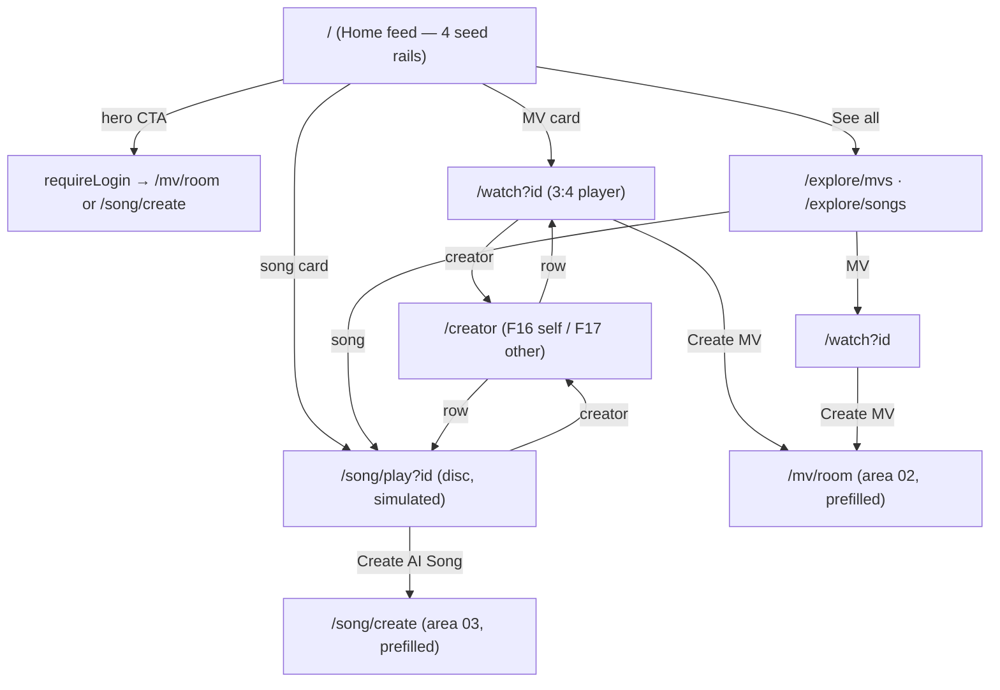

# Area 04 — Explore & Community

> Read `../00-overview.md` first (conventions, ID scheme, global models). **As-built**; ⚠️ = divergence
> from App v3.0, ❓ = a tracked `TBD-*`, 🔒 = mock/seed.
>
> 🔒🔒 **Whole-area caveat (product-undefined):** every surface here runs on **static seed data**
> (`lib/mv/community.ts`). The **Explore Curation PRD** (4 ranked rails, scoring formulas, AI+human
> moderation, refresh cadence, admin pin/unpin) is **not implemented** — there is no ranking, no
> eligibility gating, no moderation, no publish→feed pipeline, and **no community `MuseApi` endpoints**
> (`TODO.md #1`). This spec documents the **UI as-built**; **all curation/feed/moderation logic is
> `TBD`** (`TBD-GL-05` + `TBD-EXP-*`). Do not read production ranking into this doc (gate G3).

---

## 1. Overview & scope

The discovery + community-consumption surface: the Home feed, the two "See all" explore pages, the MV
video player, the community song player, and the creator profile.

**In scope:** `home/HomeView` (`/`), `community/MvExplore` (`/explore/mvs`),
`song/SongDetailView` (**both** `/explore/songs` and `/song/play` — merged 2026-08-05, Slice 3b;
it replaced `community/SongExplore` and `community/CommunitySongPlayer`, both deleted),
`community/CommunityMvPlayer` (`/watch`), `community/CreatorProfile` (`/creator`),
`community/TrendingMvsPanel` (rendered inside `/mv/room` — area 02), and the shared
`community/ui.tsx` primitives.
**Out of scope (cross-referenced):** the shell (area 01); the actual create flows the CTAs lead into
(areas 02/03); sign-in (area 09); `ShareDialog` (area 10). ⚠️ **`LyricsPanel` is no longer shared
with area 03** — `/song/result` moved to the shared `ui/LyricsSheet` in slice 3j, so `LyricsPanel`'s
only remaining consumer was History's `CreationDialog`, which itself lost its last consumer on
2026-08-06 (area 05) — both are dead code pending removal.

**Key divergences from the app:** rails are **static seed**, not ranked (Curation PRD) ⚠️; `/watch`
has **no 9:16↔3:4 toggle and no swipe-up feed** (App F10) ⚠️ (`TBD-EXP-03`); `/song/play` is still a
**simulated timer with no real audio**, but now has **shuffle + repeat and the 30s free-preview gate**
(EXP-04 / SONG-02, 2026-07-23) ⚠️; there is a **single sample creator** (`DEFAULT_CREATOR`) behind
every avatar and **no Report/Block** (App F17) ⚠️ (`TBD-EXP-05`). **GL-02 (2026-07-23):** Create MV /
Create Song / Like on community surfaces now **gate at the action** (`requireLogin`); like/share are
still local, non-persistent (real counters → `TBD-EXP-08`).

---

## 2. Route / component / state / API map (RD)

| Route / Component                              | Owns UI                                                                               | Reads/writes state                                                           | `MuseApi`       |
| ---------------------------------------------- | ------------------------------------------------------------------------------------- | ---------------------------------------------------------------------------- | --------------- |
| `/` → `home/HomeView`                          | hero CTAs, Trending marquee, New MVs, Top Picks, New Songs, per-row like/share/create | `useAuth().requireLogin`, `useSongFlow().patchSongCompose`, local like map   | **none** (seed) |
| `/explore/mvs` → `community/MvExplore`         | grid of all MVs → `/watch?id=`                                                        | —                                                                            | **none**        |
| `/explore/songs` → `community/SongExplore`     | Top Picks + New Songs lists → player; Create                                          | `useSongFlow().patchSongCompose`                                             | **none**        |
| `/watch` → `community/CommunityMvPlayer`       | 3:4 video player, like/share, Create MV                                               | `useSearchParams().id`, `useMvFlow().setCompose`, local play/mute/like       | **none**        |
| `/song/play` → `community/CommunitySongPlayer` | disc player (**simulated**), prev/next, like/share, Lyrics, Create AI Song            | `useSearchParams().id`, `useSongFlow().patchSongCompose`, local idx/progress | **none**        |
| `/creator` → `community/CreatorProfile`        | header + stats + MV/Songs tabs + rows                                                 | `useSearchParams().{self,tab}`                                               | **none**        |
| `community/TrendingMvsPanel`                   | Trending list aside in `/mv/room` (area 02)                                           | —                                                                            | **none**        |

Data: `lib/mv/community.ts` — `TRENDING_MVS`, `NEW_MVS`, `TOP_PICKS_SONGS`, `NEW_SONGS`,
`ALL_COMMUNITY_SONGS`, `CREATOR_MVS`, `CREATOR_SONGS`, `DEFAULT_CREATOR`, `getCommunityMv/Song`,
`formatCount`. All routes are **public** (no `AuthGuard`).

---

## 3. State model & rules

### 3.1 The four rails (Home) — 🔒 seed, not ranked

`HomeView` renders four sections mirroring the Curation PRD rails, but each is a **fixed seed array**:

- **Trending MV** — auto-scrolling infinite **marquee** (`TRENDING_MVS` cloned ×2); card → `/watch?id`.
- **New MVs** — horizontal scroll, `NEW_MVS.slice(0,8)`, portrait 3:4 cards; "See all" → `/explore/mvs`.
- **Top Picks Songs** — horizontal scroll, `TOP_PICKS_SONGS`, square cards; card → `/song/play?id`; "See all" → `/explore/songs`.
- **New Songs** — 2-col grid, `NEW_SONGS.slice(0,6)`; row → `/song/play?id`; per-row Like (local), Share (`ShareDialog`), **Create** → `createFromSong` (`requireLogin` → `patchSongCompose` → `/song/create`).
- **Hero CTAs**: "AI Music Video Studio" → `requireLogin(→ /mv/room)`; "AI Audio Lab" → `requireLogin(→ /song/create)` (auth triggers — area 09).
- ⚠️ **No ranking, refresh, eligibility, or dedup** from the Curation PRD — ordering is array order (`TBD-EXP-01`).
- 📄 **Publish→feed locale contract (backend; spec-only).** When a creation is published (area 02/05) it carries a **language/locale code**. The backend returns each feed **already ranked locale-primary** (viewer's locale first, then engagement signals per the Curation PRD). The **frontend just requests and displays** the server-sorted data — no client-side ranking; "we only ask, the backend sorts." The **code format (2-char ISO `en` vs 3-char product `enu`, etc.) is RD-TBD** → `TBD-EXP-10` (relates to i18n `TBD-GL-06`). No prototype change now (mock feed stays seed).

### 3.2 Explore pages

- **`/explore/mvs`** (`MvExplore`): **two sections** (Top Picks ← `TRENDING_MVS`, Newly Released ← `NEW_MVS`), each a **justified-row gallery** at ≥1024px and a wrapping grid below; card → **navigates to `/watch?id=`** (2026-08-06 — it used to open `CommunityMvDialog` in place; DP's grid links at `/mv-detail?id=`, which is this app's `/watch`, so the dialog was a second rendering of a screen that already existed); Back → `DetailNavbar`'s `router.back()` with a fallback to `/`. Every card's creator avatar is `DEFAULT_CREATOR.avatar` ⚠️.
  > **Corrected 2026-08-05.** Was described as a "responsive grid (2/3/4 cols) of `[...TRENDING_MVS, ...NEW_MVS]`" with "Back → `/`". Slice **3a** replaced that with the designer's justified gallery and two real sections and did not update this line; caught while fixing the equivalent drift for `/explore/songs`.
- **`/explore/songs`** (`song/SongDetailView` — **the same component as `/song/play`**, merged in Slice 3b): tabbed list (All / Top Picks / New Releases) beside a Now Playing column, 1:1 at ≥1024px; row → selects in Now Playing at ≥768px, opens the full-screen player at `/song/play?id` below that; creator → `/creator`; **Create** → `requireLogin` → `patchSongCompose` + `/song/create` (gated at the click, consistent with Home — GL-02/EXP-02); Back → `DetailNavbar`'s `router.back()` with a fallback to `/explore/songs`.

### 3.3 MV player — `/watch`

- `/watch` reads `?id` → `getCommunityMv(id) ?? NEW_MVS[0]`; **3:4 portrait** stage, autoplay **muted** loop, tap play/pause, mute toggle; `# Music Video` tag, title, meta; creator → `/creator`; **Like** (local), **Share** (`ShareDialog`), `Stats`, prompt; **Create Music Video** → `setCompose` (mvType + prompt + `matchedSong` + title) → `/mv/room` (area 02).
- **`CommunityMvDialog` has no consumer since 2026-08-06** and is dead code pending removal.
- ⚠️ App F10 offers a 9:16↔3:4 aspect toggle and a swipe-up "next MV" community feed; web has neither (`TBD-EXP-03`).

### 3.4 Song player — `/song/play` (`song/SongDetailView`, shared with `/explore/songs`)

> **Rewritten 2026-08-05 (Slice 3b).** This section described the pre-migration
> `CommunitySongPlayer`, which no longer exists. Both URLs now render one screen.

- Reads `?id` via `useSearchParams`; **EXP-09 still holds:** the **playlist follows the song** —
  a `cps-*` id switches the left list to `CREATOR_SONGS` (and then no tab is marked active, since
  none is driving the list); clicking any tab returns to the community catalog. **EXP-06 still
  holds:** an id that resolves to nothing renders the not-found `CommunityEmpty` with an
  "Explore Songs" CTA, not a silent fall back to the first song.
- **disc** cover (spins while playing); **playback is a real `<audio>` element** — duration,
  currentTime, seek and "advance on ended" all come from it. Audio URLs are derived per id by
  `songAudioUrl()` in `src/lib/mv/community.ts`, because `CommunitySongSchema` is frozen contract
  surface (C2) and has no `audio` field. ⚠️ Known cost: the whole catalog maps onto the two demo
  mp3s in `public/assets/songs/`, so every song is one of two sounds (demo-media limit U4).
- Click/drag-to-seek; **Like** (gated, per-id, shared between the list row and the player),
  **Share**, **Lyrics** (desktop: an overlay replacing the cover art; mobile: DP's `LyricsSheet`);
  **Create AI Song** (gated) → `patchSongCompose` → `/song/create`.
- **Below 768px** the Now Playing column is replaced by a full-screen player (DP's
  `MobileNowPlaying`, portalled to `<body>`) whose own back control returns to the list via
  `router.back()` with a fallback to `/explore/songs`. "Open" is derived from `?id=` being present.
- **No 30s gate.** Free accounts play in full (decision S3; `G5-d #7`'s preview half is inverted in
  `e2e/behaviour-regressions.spec.ts`). `SubscribeModal` is not reachable from this screen.
- ⚠️ **No shuffle / repeat.** Removed to match the designer's transport; this contradicts
  `AC-EXP-05` as written before 2026-08-05 and is an open designer question —
  `docs/DESIGNER-TODO.md` A7, plan S21.

### 3.5 Creator profile — `/creator` (`CreatorProfile`)

- Reads `?self` (`self=1` → `MOCK_USER` name/email; else `DEFAULT_CREATOR`) and `?tab` (`mv`|`songs`).
- Header avatar/name/email + **Plays/Likes** stats (always `DEFAULT_CREATOR.plays/likes` strings, even in self mode ⚠️); MV/Songs tabs; rows (`CREATOR_MVS`/`CREATOR_SONGS`) → `/watch?id` or `/song/play?id`; per-row `⋯` menu = **Like / Share** only.
- This route is **both** the App's _My Community Profile_ (F16, via `/profile` stats → `/creator?self=1`, area 06) **and** _Community User Profile_ (F17, via any creator link).
- ⚠️ Self mode shows `MOCK_USER`'s identity but the **sample creator's stats + content** (`CREATOR_MVS/SONGS`); no **Report/Block** (App F17) (`TBD-EXP-05`).

### 3.6 Shared

- `community/ui.tsx`: `Headphones/Heart/Share/Play/ChevronRight` icons, `BadgePill` (HOT/NEW), `Stats`, `SectionHead` ("See all" link). `formatCount` → "1.2k" style.
- 🔒 Every like/share/play interaction is **local component state** — no persistence, no server. **Like and Create now gate at the action** (GL-02); share stays open. Real counters/persistence → `TBD-EXP-08`.

---

## 4. Journeys

Screens to capture later: `/`, `/explore/mvs`, `/explore/songs`, `/watch`, `/song/play`, `/creator` (self + other, both tabs).

### EXP-P1 — Home feed

- **EXP-P1-S1** Open `/` (public). **System:** hero CTAs + four seed rails render.
- **EXP-P1-S2** Hero **Create MV / Create Song** → `requireLogin` → `/mv/room` / `/song/create` (area 09/02/03).
- **EXP-P1-S3** Tap a Trending/New MV card → `/watch?id`; a Top Picks/New Song → `/song/play?id`; a New-Songs **Create** → `requireLogin` → `/song/create` (song pre-filled); Like/Share act locally.
- **EXP-P1-S4** "See all" → `/explore/mvs` or `/explore/songs`.

### EXP-P2 — Explore MVs

- **EXP-P2-S1** `/explore/mvs`: grid of all MVs. Tap a card → **`/watch?id=`** (EXP-P4). Back → `/`.
- **EXP-P2-S2** Every card is a real `next/link` with a locale-prefixed href, so plain click, middle-click and copy-link all reach the same screen.

### EXP-P3 — Explore Songs

- **EXP-P3-S1** `/explore/songs`: one tabbed list — **All** / **Top Picks** / **New Releases** — beside a Now Playing column (the same screen as `/song/play`; see §3.2). Row → selects that song in Now Playing at ≥768px, or opens the full-screen player at `/song/play?id` below 768px; creator → `/creator`; **Create** → `/song/create` (pre-filled). Switching a tab changes the list only and must NOT change what is playing.
  > **Rewritten 2026-08-05 (Slice 3b), flagged by the G7 reviewer.** Was: "Top Picks + New Songs lists. Row → `/song/play?id`". Two things changed: the two stacked lists became three tabs (`Trending` deliberately not built — `DESIGNER-TODO.md` A6), and the row click stopped navigating on desktop. **The "must NOT change what is playing" clause is also a G7 finding** — the default was derived live from the visible list, so changing a browse filter restarted playback; now guarded by an e2e.

### EXP-P4 — Watch (MV player)

- **EXP-P4-S1** `/watch?id`: 3:4 player (autoplay muted, tap to pause, mute toggle). Missing/invalid id → falls back to `NEW_MVS[0]`.
- **EXP-P4-S2** Creator → `/creator`; Like (local); Share (`ShareDialog`); **Create Music Video** → `/mv/room` pre-filled from this MV.

### EXP-P5 — Song play (community)

- **EXP-P5-S1** `/song/play?id`: disc + simulated progress; Prev/Next cycle the playlist; seek; Like/Share; Lyrics sheet (if lyrics).
- **EXP-P5-S2** **Create AI Song** → `/song/create` pre-filled (genre/mood/title/lyrics).

### EXP-P6 — Creator profile

- **EXP-P6-S1** `/creator` (or `?self=1&tab=…`): header + stats + MV/Songs tabs.
- **EXP-P6-S2** Tap a row → `/watch?id` (MV) or `/song/play?id` (song). Row `⋯` → Like/Share.

---

## 5. Error & edge states

| ID          | Trigger                                                 | Behaviour                                                                                                                                                                                    |
| ----------- | ------------------------------------------------------- | -------------------------------------------------------------------------------------------------------------------------------------------------------------------------------------------- |
| **EXP-E1**  | `/watch` or `/song/play` with **no** `?id`              | Falls back to `NEW_MVS[0]` / first playlist song.                                                                                                                                            |
| **EXP-E1b** | `/watch` or `/song/play` with an **unresolvable** `?id` | **EXP-06 (2026-07-23):** shows a **not-found** `CommunityEmpty` state (with an Explore CTA), not a silent fallback. The former creator-Songs wrong-track bug is **fixed** (EXP-09 — see §3). |
| **EXP-E1c** | Explore grid empty / browser offline                    | **EXP-06:** the grids render a `CommunityEmpty` **empty** ("Be the first to create!") or **offline** state (`useOnline`).                                                                    |
| **EXP-E2**  | Like/Create on any community item                       | **GL-02 (2026-07-23):** gated at the action — `requireLogin` runs before the effect. State is still local, lost on reload; real counters/persistence → `TBD-EXP-08`.                         |
| **EXP-E3**  | `/song/play` "playback"                                 | No real audio — a `setInterval` advances a progress bar to 125s then stops. 🔒                                                                                                               |
| **EXP-E4**  | Empty rail / no content                                 | Not handled — seed arrays are always populated (`TBD-EXP-06`).                                                                                                                               |
| **EXP-E5**  | Create from a community item while logged out           | All Create entry points (Home hero, New-Songs, `/explore/songs`, players) call `requireLogin` at the click (GL-02/EXP-02).                                                                   |

---

## 6. Acceptance criteria (EARS)

- **AC-EXP-01** — WHEN `/` loads, THE SYSTEM SHALL render the hero CTAs and the four seed rails (Trending MV marquee, New MVs, Top Picks Songs, New Songs) in seed order.
- **AC-EXP-02** — WHEN a hero CTA or a New-Songs **Create** is tapped, THE SYSTEM SHALL run `requireLogin` and, on success, navigate to the create flow (pre-filling the song for Create-from-song).
- **AC-EXP-03** — WHEN an MV card is tapped **anywhere** (Home rails or `/explore/mvs`), THE SYSTEM SHALL navigate to `/watch?id`. WHEN a song card is tapped **from Home**, THE SYSTEM SHALL navigate to `/song/play?id`. WHEN a song row is tapped **on `/explore/songs`**, THE SYSTEM SHALL, below 768px, open the full-screen player at `/song/play?id`; and at 768px and above, select that song in the Now Playing column **without navigating**.
  > **Corrected 2026-08-05 (Slice 3b).** This criterion previously said a song card always routes to `/song/play?id`, which the merge of `/explore/songs` and `/song/play` made false on desktop — the two are now one screen, so a desktop row click swaps the right-hand column and deliberately leaves the URL alone (asserted by `e2e/behaviour-regressions.spec.ts`, "3b desktop: clicking a song swaps the right column without navigating"). Home is NOT migrated and still navigates, which is why the criterion is now split by entry point. **Found by the Gate G7 reviewer:** the same change rewrote `AC-EXP-05` with a full rationale and left this sibling — and `EXP-P3-S1` — asserting the old behaviour.
- **AC-EXP-04** — WHEN `/watch` loads, THE SYSTEM SHALL play the MV muted in 3:4 with play/pause + mute, and expose Like, Share, and **Create Music Video** → `/mv/room` pre-filled.
- **AC-EXP-05** — WHEN `/song/play` loads, THE SYSTEM SHALL resolve the id to the correct playlist (creator vs community), show the disc player with **real `<audio>` progress**, Prev/Next, Like/Share, a Lyrics sheet when lyrics exist, and **Create AI Song** → `/song/create` pre-filled. Playback SHALL NOT be capped for free accounts.
  > **Rewritten 2026-08-05 by the designer-UI migration (Slice 3b). Three changes, all deliberate:**
  >
  > 1. **The 30s cap is gone** — plan §1.4 decided S1/S3 cancel the Pro playback gate; 3b is where it actually landed. `e2e/behaviour-regressions.spec.ts` asserts the inverse ("S3 / G5-d#7 inverted"), so it cannot creep back.
  > 2. **Progress is a real `<audio>` element**, not `setInterval` against a hardcoded `DURATION = 125`. URLs are derived per id in `community.ts` (`songAudioUrl`) — the frozen `CommunitySongSchema` (C2) has no `audio` field, so there is no contract change. Known cost: the whole catalog maps onto two mp3s (demo-media limit U4).
  > 3. ⚠️ **`shuffle + repeat` REMOVED, and this is an open divergence, not a settled decision.** DP's transport has only prev/play/next. The product owner chose to follow DP on 2026-08-05 and ask the designer — see `docs/DESIGNER-TODO.md` **A7** and plan **S21**. If the designer supplies a five-button transport, this criterion goes back to requiring them; if the product confirms the removal, this note goes away. **Do not "fix" the code to match an older copy of this line.**
  >
  > Same screen also merged with `/explore/songs` — one view behind two URLs. EXP-09's playlist resolution survives: a `cps-*` id makes the LIST the creator's playlist.
- **AC-EXP-08** — WHEN a community **Like** or **Create MV/Song** is invoked while logged out, THE SYSTEM SHALL open the sign-in modal at the action and run it on success (GL-02).
- **AC-EXP-09** — WHEN a `/watch` or `/song/play` id is unresolvable, THE SYSTEM SHALL show a not-found state; WHEN an explore grid is empty or the browser is offline, THE SYSTEM SHALL show the empty / offline state (EXP-06).
- **AC-EXP-06** — WHEN `/creator` loads, THE SYSTEM SHALL show the profile header + stats and MV/Songs tabs whose rows open the respective players; `?self=1` shows `MOCK_USER` identity.
- **AC-EXP-07** — WHEN an id is missing/invalid on `/watch` or `/song/play`, THE SYSTEM SHALL fall back to a default item (no crash).
- **AC-EXP-08** — THE SYSTEM SHALL render all six surfaces at 390/768/1024/1440px with no overflow. _(visual)_

> No AC asserts ranking, moderation, refresh, persistence, real audio, or publish→feed — none exist (§8).

---

## 7. Per-path QA checklist

- [ ] **EXP-P1**: rails render in seed order; hero + New-Songs Create gate via sign-in; cards route correctly (AC-01/02/03).
- [ ] **EXP-P2**: grid → `/watch?id` → Create MV → /mv/room (AC-03/04).
- [ ] **EXP-P3**: song lists → player; Create → /song/create pre-filled (AC-03).
- [ ] **EXP-P4**: /watch autoplay muted 3:4; play/mute/like/share; Create MV pre-fills (AC-04); bad id → NEW_MVS[0] (AC-07, E1).
- [ ] **EXP-P5**: simulated progress; Prev/Next cycle; Lyrics when present; Create AI Song pre-fills (AC-05, E3).
- [ ] **EXP-P6**: creator tabs + rows open players; self=1 shows MOCK_USER (AC-06).
- [ ] **AC-08**: six surfaces clean at 4 widths _(visual)_.

---

## 8. Open items for RD

Curation items are **spec-only** — do not change the codebase from these; backend by RD later (`TBD-GL-05`).

| ID             | Open item                                                                                                                                                                                                                          |
| -------------- | ---------------------------------------------------------------------------------------------------------------------------------------------------------------------------------------------------------------------------------- |
| **TBD-EXP-01** | 📄 **Spec-only (Curation PRD)** — implement the Explore PRD: scoring formulas per rail (Trending/New MVs/Top Picks/New Songs), eligibility gates, refresh cadence, dedup. Today all four are static seed in array order.           |
| **TBD-EXP-03** | ⏳ **TBD** — App F10 aspect toggle (9:16↔3:4) + swipe-up next-MV community feed; web has neither. In scope?                                                                                                                        |
| **TBD-EXP-05** | ⏳ **TBD** — a single `DEFAULT_CREATOR` backs every avatar; self mode mixes `MOCK_USER` identity with sample content/stats; no Report/Block (App F17). Wire real creators + moderation actions.                                    |
| **TBD-EXP-07** | 📄 **Spec-only (Curation PRD)** — how user creations enter these rails (ties `TBD-MV-06`), plus the AI+human moderation pipeline and admin pin/unpin. Entirely unbuilt.                                                            |
| **TBD-EXP-08** | 🔧 **Backend (RD)** — likes/shares/plays are local, ungated (well, gated at the click per GL-02, but not persisted), non-persistent. Define real counters + storage.                                                               |
| **TBD-EXP-10** | ⏳ **Format TBD (RD)** — the publish/feed **language/locale code format** (2-char ISO vs 3-char product code). Frontend just passes it through and requests the server-sorted feed; RD decides the format (ties i18n `TBD-GL-06`). |

See also global: `TBD-GL-02` (like/publish gating), `TBD-GL-05` (Curation/community backend track), and `TBD-MV-06` (publish → community pipeline, area 02).

---

## 9. Flow diagram

```mermaid
flowchart TD
  Home["/ (Home feed — 4 seed rails)"] -->|hero CTA| Create["requireLogin → /mv/room or /song/create"]
  Home -->|MV card| Watch["/watch?id (3:4 player)"]
  Home -->|song card| Play["/song/play?id (disc, simulated)"]
  Home -->|See all| Explore["/explore/mvs · /explore/songs"]
  Explore -->|MV| Watch2["/watch?id"]
  Explore -->|song| Play
  Watch -->|creator| Creator["/creator (F16 self / F17 other)"]
  Play -->|creator| Creator
  Watch -->|Create MV| Room["/mv/room (area 02, prefilled)"]
  Watch2 -->|Create MV| Room
  Play -->|Create AI Song| Song["/song/create (area 03, prefilled)"]
  Creator -->|row| Watch
  Creator -->|row| Play
```

---

**Decisions (as-built):** community is UI-only on static seed; no ranking/moderation/persistence; single
sample creator; MV player 3:4-only; song player simulated (no real audio); like/share gated at the
click but not persisted. All curation/feed logic deferred to the backend track (Explore Curation PRD).
