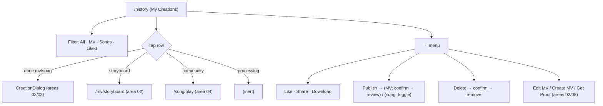

# Area 05 — History (My Creations)

> Read `../00-overview.md` first (conventions, ID scheme, global auth/credits models). **As-built**;
> ⚠️ = divergence from App v3.0, ❓ = a tracked `TBD-*`, 🔒 = mock/in-memory.

---

## 1. Overview & scope

The signed-in user's **"My Creations"** list (`/history`, auth-gated). It merges **live in-memory jobs**
(from the MV/Song flow providers) with a **static seed** of sample creations, shown as filterable
cards with a per-row `⋯` options menu (like/share/download/delete/publish + Edit MV / Create MV / Get
Proof). Opening a row routes to the right destination (detail dialog, storyboard editor, or community
player).

**In scope:** `history/HistoryView` (`/history`), its cards + `⋯` menu, the delete/publish confirm
modals.
**Out of scope (cross-referenced):** `CreationDialog` detail content (areas 02 MV / 03 song);
`ShareDialog` (area 10); the seed flow into `/mv/edit`/`/mv/storyboard`/`/mv/room` (area 02); the
community player `/song/play` (area 04); `/proof` (area 08).

**Key divergences from App F15:** the **Liked** tab shows **any liked row** (incl. the user's own),
not only community-liked content ⚠️; Storyboard rows expose **Create MV in the `⋯` menu**, not a
"Create" **pill** on the row ⚠️; retention copy is **"14 days"** (copy-only, unenforced) ⚠️. Matches
the app on: "My Creations" title, All/Music Videos/Songs/Liked tabs, and the Edit MV / Get Proof menu
CTAs.

---

## 2. Route / component / state / API map (RD)

| Route / Component | Owns UI | Reads/writes state | `MuseApi` |
|---|---|---|---|
| `/history` → `history/HistoryView` | title + retention note, filter chips, card grid, `⋯` menu (portal), delete + publish-confirm modals, toasts | `useHistory().history`, local `removed`/`ov`(overrides)/`selected`/`openMenu`/`share`/`del`/`pubConfirm`; `useMvFlow().{setStoryboard,saveStoryboard,setCompose}` (seedFlow) | **none** |
| `mv/CreationDialog` | detail view for a tapped MV/Song row | see areas 02/03 | — |
| `ui/ShareDialog` | share composer | see area 10 | — |

**Data sources:** `useHistory()` (live jobs, in-memory) + `HISTORY_SAMPLES` (static seed in
`lib/mv/mock`). No history endpoint exists — the backend adds one later (→ `TBD-GL-04`).

---

## 3. State model & rules

- **Auth-gated** route (`AuthGuard`, area 09). Title "My Creations". **DECIDED (`TBD-HIST-02`):
  retention is PERMANENT** — once generated, a creation is **never auto-deleted**. The current code
  copy "Creations are kept for 14 days. Download to keep them." must be updated to reflect permanence
  (→ handoff). (Share-**link** expiry, `TBD-SHARE-01`, is a separate concept.)
- **Rows** (`HistoryView.tsx:91-100`): live `useHistory` items mapped (status `generating→processing`,
  `failed→failed`, else `done`; failed rows drop the thumb and show a `meta` label) **prepended** to
  the static `HISTORY_SAMPLES`. `removed` ids are filtered out.
- **Filters** (`HistoryView.tsx:20-26,102-108`): **All** (non-community only) · **Music Videos**
  (`mv`|`storyboard`, non-community) · **Songs** (`song`, non-community) · **Liked** (any row with
  `liked` true — includes own creations). ⚠️ vs App (community-liked only) → `TBD-HIST-03`.
- **Card** (`HistoryCard`): aspect-video thumb (or processing/failed placeholder), 20% scrim,
  hover-play (MV only), **status pill** (Generating…=gold / Failed=red / Done=green; community=none),
  **kind badge** (MV / SONG / STORYBOARD icon), title, stats (plays/likes/shares for done mv/song) or
  `meta`, date.
- **Open row** (`HistoryView.tsx:110-115`): `processing` → not clickable; community song → `router.push(/song/play?id=…)` (id = `communitySongId`, area 04); `storyboard` → `seedFlow` + `/mv/storyboard?id=…` (area 02); else open `CreationDialog`.
- **`⋯` menu** (`Menu`, portal) — contents depend on row type (`HistoryView.tsx:331-355`):
  - **CTA row** (non-community, non-failed): **Edit MV** (mv) / **Create MV** (song|storyboard, primary) / **Get Proof** (mv|song).
  - **Like / Share**: shown for community, mv, and song rows (`:339-340`) — so a **failed song still shows Like + Share**; storyboard rows do **not**.
  - **Publish (toggle) / Download / normal Delete**: non-community, non-failed, mv|song only (`:342-353`). **Delete is hidden** when an MV is published/reviewing or a song is published (`:309`).
  - **Standalone Delete**: also shown for **failed** and **storyboard** rows (`:355`).
  - **Net per type:** MV = Edit MV/Get Proof + Like/Share/Publish/Download/Delete · Song = Create MV/Get Proof + Like/Share/Publish/Download/Delete · **Storyboard = Create MV + Delete only** · **Community = Like + Share only** · **Failed (song) = Like + Share + Delete** (liking/sharing a failed generation is possible as-built — likely a quirk, → `TBD-HIST-06`).
- **Publish** (`HistoryView.tsx:125-137`): **MV** → "Ready to Go Public?" confirm modal → sets reviewing+published, toast "Submitted for review"; already-published/reviewing → unpublish directly. **Song** → direct toggle, toast "Published/Unpublished success". 🔒 local override only; no community write (→ `TBD-MV-06`, area 04).
- **Delete** (`HistoryView.tsx:194-200`): confirm modal → adds id to `removed` (list-local; not a server delete). `CreationDialog` delete does the same.
- **Download** (`HistoryView.tsx:118-122`): song → `SAMPLE_AUDIO` as `{title}.mp3`; else `SAMPLE_RESULT_VIDEO` as `{title}.mp4` (fixture media, not the row's own render). 🔒
- **`seedFlow`** (`HistoryView.tsx:78-89`): builds a `mockStoryboard` from the row title/thumb and sets compose, so Edit/Create/Storyboard entries render for that row (synthesized state — cross-ref area 02 MV-P6 external entries).
- 🔒 **All in-memory:** live rows vanish on reload (seed samples remain, being static); like/publish/delete are local overrides.

---

## 4. Journeys

Screens to capture later: `/history` (All + Liked filters), `⋯` menu open (MV / song / storyboard / community / failed), publish + delete confirm modals.

### HIST-P1 — Browse & filter
- **HIST-P1-S1** Open `/history` (auth-gated). **System:** renders merged rows under **All**. Empty filter → empty-state copy.
- **HIST-P1-S2** Tap a filter chip (All / Music Videos / Songs / Liked). **System:** re-filters per §3 rules.

### HIST-P2 — Open a creation
- **HIST-P2-S1** Tap a **done MV/song** card → `CreationDialog` (detail; areas 02/03).
- **HIST-P2-S2** Tap a **storyboard** card → `seedFlow` → `/mv/storyboard?id=…` (area 02).
- **HIST-P2-S3** Tap a **community** row → `/song/play?id=…` (area 04). **Processing** rows are inert.

### HIST-P3 — Row menu quick actions
- **HIST-P3-S1** `⋯` → **Like/Unlike** (updates local like + count), **Share** (`ShareDialog` w/ `buildShareUrl(id)`), **Download** (fixture media + toast).

### HIST-P4 — Publish
- **HIST-P4-S1** `⋯` → **Publish** on an **MV** → "Ready to Go Public?" modal → **Confirm** → reviewing+published, toast "Submitted for review". Toggling again unpublishes.
- **HIST-P4-S2** **Publish** on a **song** → immediate toggle + toast (no confirm).

### HIST-P5 — Delete
- **HIST-P5-S1** `⋯` → **Delete** → confirm modal ("cannot be undone") → **Delete** → row removed from the list (local). Delete is hidden for published/reviewing items.

### HIST-P6 — Create / Edit / Proof entries (cross-area)
- **HIST-P6-S1** `⋯` → **Edit MV** (mv) → `seedFlow` → `/mv/edit?id=…` (area 02).
- **HIST-P6-S2** `⋯` → **Create MV** (song/storyboard) → `seedFlow` → `/mv/storyboard?id=…` (storyboard) or `/mv/room` (song) (area 02).
- **HIST-P6-S3** `⋯` → **Get Proof** (mv/song) → `/proof` (area 08).

---

## 5. Error & edge states

| ID | Trigger | Behaviour |
|---|---|---|
| **HIST-E1** | Row status `processing` | Card not clickable; `⋯` menu not rendered (only after done/failed). |
| **HIST-E2** | Row status `failed` | Thumb-less placeholder (alert icon) + `meta` label; menu offers **Like + Share + Delete** (the failed fixture is a song, so Like/Share still render — likely a code quirk, → `TBD-HIST-06`). |
| **HIST-E7** | Storyboard row | Menu collapses to **Create MV (CTA) + Delete** only — no Like/Share/Publish/Download. |
| **HIST-E3** | Community-sourced row | Reduced menu (Like/Share only); no Publish/Delete/CTA row; status pill hidden. |
| **HIST-E4** | Reload | Live rows lost (in-memory); only static seed samples remain (🔒 → `TBD-GL-04`). |
| **HIST-E5** | Empty filter | Empty-state card: "Nothing here yet. Your {filter} will appear here." |
| **HIST-E6** | Logged out | `AuthGuard` → sign-in modal (area 09). |

---

## 6. Acceptance criteria (EARS)

- **AC-HIST-01** — WHEN `/history` loads for a signed-in user, THE SYSTEM SHALL show live jobs prepended to the seed samples, under the **All** filter (community rows excluded).
- **AC-HIST-02** — WHEN a filter chip is selected, THE SYSTEM SHALL show only rows matching it (All=own, Music Videos=mv/storyboard, Songs=song, Liked=any liked row).
- **AC-HIST-03** — WHILE a row is `processing`, THE SYSTEM SHALL show a Generating pill and disable open + the `⋯` menu; WHEN `failed`, show a Failed pill and a **Like + Share + Delete** menu; storyboard rows SHALL show only **Create MV + Delete**.
- **AC-HIST-04** — WHEN a done MV/song card is tapped, THE SYSTEM SHALL open `CreationDialog`; a storyboard → `/mv/storyboard`; a community row → `/song/play`.
- **AC-HIST-05** — WHEN **Publish** is invoked on an MV, THE SYSTEM SHALL show the "Ready to Go Public?" confirm and, on confirm, mark it reviewing/published with a "Submitted for review" toast; a song publishes immediately without a confirm.
- **AC-HIST-06** — WHEN **Delete** is confirmed, THE SYSTEM SHALL remove the row from the list; and Delete SHALL be hidden for published/reviewing items.
- **AC-HIST-07** — WHEN **Edit MV / Create MV / Get Proof** is chosen, THE SYSTEM SHALL seed flow state and route to `/mv/edit` / `/mv/storyboard`|`/mv/room` / `/proof` respectively.
- **AC-HIST-08** — WHEN **Share** / **Download** is invoked, THE SYSTEM SHALL open `ShareDialog` with `buildShareUrl(id)` / download the fixture media as `{title}.mp4`|`.mp3`. *(download uses fixture media, not the row's own render — 🔒)*
- **AC-HIST-09** — THE SYSTEM SHALL render `/history` at 390/768/1024/1440px with no overflow (1/2/3-column grid). *(visual)*

---

## 7. Per-path QA checklist

- [ ] **HIST-P1**: All excludes community; Liked shows liked rows; empty filter → empty state (AC-01/02, E5).
- [ ] **HIST-P2**: done mv/song → dialog; storyboard → editor; community → player; processing inert (AC-03/04).
- [ ] **HIST-P3**: like toggles + count; Share dialog w/ correct url; Download toast (AC-08).
- [ ] **HIST-P4**: MV publish → confirm → review toast; song publish → immediate (AC-05).
- [ ] **HIST-P5**: delete confirm removes row; hidden for published/reviewing (AC-06).
- [ ] **HIST-P6**: Edit MV / Create MV / Get Proof seed + route correctly (AC-07).
- [ ] **HIST-E2/E3/E7**: failed → Like + Share + Delete; community → Like/Share only; storyboard → Create MV + Delete.
- [ ] **AC-09**: grid clean at 4 widths *(visual)*.

---

## 8. Area TBD register — decisions 2026-07-22

**Decisions** — codebase change list in [`../handoff.md`](../handoff.md).

| ID | Decision |
|---|---|
| TBD-HIST-01 | 🔧 **Backend (RD)** — persisted per-user history endpoint (list/detail/delete). |
| TBD-HIST-02 | ✅ **Decided — PERMANENT retention.** Once generated, a creation is **never auto-deleted** (supersedes both the earlier "30 days" and the code's "14 days" copy). Share-link expiry (`TBD-SHARE-01`) is separate. |
| TBD-HIST-03 | ✅ **Sync App** — Liked tab shows only community-liked content. |
| TBD-HIST-04 | ✅ **Sync App** — Publish = confirm → review → community; backend pipeline is 📄 spec-only (Curation, `TBD-GL-05`). |
| TBD-HIST-05 | ✅ **Sync App** — Storyboard "Create" as a row **pill** (not a menu CTA). |
| TBD-HIST-06 | 🐞 **Bug (RD fix)** — a failed row should be **Delete-only** (remove Like + Share). |
| TBD-HIST-07 | ✅ **Decided** — on **Publish** (MV or Song), the client sends a **language/locale code**; the backend ranks the community feed locale-primary. The frontend just requests the sorted feed (backend/Curation, area 04; code format TBD `TBD-EXP-10`). |
| TBD-HIST-08 | ✅ **Decided (`TBD-MV-13`)** — a **published** MV must be **unpublished before Edit MV**; apply the same "Unpublish to edit" rule to History's Edit MV entry. |

See also global: `TBD-GL-04` (persistence), and `TBD-MV-06` (publish → community pipeline).

| ID | Question |
|---|---|
| **TBD-HIST-01** | **Persisted history** — production needs a real per-user history endpoint (list/detail/delete). Today live rows are in-memory and downloads use fixture media, not the row's own render. |
| **TBD-HIST-02** | **Retention** — is the "14 days" retention real (auto-purge), or copy only? Reconcile with share's "30 days" (area 10). |
| **TBD-HIST-03** | **Liked tab semantics** — App F15 shows community-liked content; web shows any liked row. Which is intended? |
| **TBD-HIST-04** | **Publish pipeline** — what does Publish actually do (moderation/review → community)? Ties to the Curation PRD (area 04). Local toggle only today. |
| **TBD-HIST-05** | **Storyboard "Create" affordance** — App uses a row **pill**; web uses a menu CTA. Confirm intended pattern. |
| **TBD-HIST-06** | **Like/Share on failed rows** — a failed (song) row still exposes Like + Share in the `⋯` menu. Intended, or should failed rows be Delete-only? (Likely a code quirk.) |

---

## 9. Flow diagram

---

## 10. Decisions & changelog

**Decisions (as-built):** merged live+seed list; in-memory (reload loses live rows); publish/like/delete
are local overrides; downloads use fixture media; grid layout (not the app's vertical list).

| Date | Change |
|---|---|
| 2026-07-22 | Initial as-built spec. |
| 2026-07-22 | Validator fix: corrected failed-row menu (Like+Share+Delete, not Delete-only) and specified storyboard menu (Create MV + Delete); added per-type menu breakdown, HIST-E7, TBD-HIST-06; noted community id = communitySongId. |
