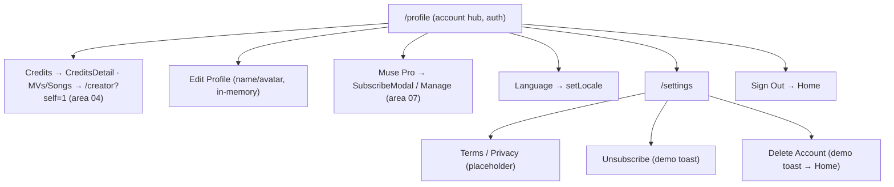

# Area 06 — Profile, Account & Settings

> Read `../00-overview.md` first (conventions, ID scheme, global auth/credits/i18n models).
> **As-built**; ⚠️ = divergence from App v3.0, ❓ = a tracked `TBD-*`, 🔒 = mock/in-memory.

---

## 1. Overview & scope

The account hub. `/profile` is a **settings-style hub** (avatar/name/PRO, credits+MVs+Songs stats,
Muse Pro, Notifications, Language, Feedback, Settings, Sign Out) with an inline Edit-Profile modal.
`/settings` holds legal links + subscription cancel + account delete.

**In scope:** `profile/ProfileView` (`/profile`, 🔒 **Auth**), `profile/SettingsView` (`/settings`),
the Edit-Profile / Language / Feedback modals.
**Out of scope (cross-referenced):** the account dropdown (area 01 `AccountMenu`); the credits/IAP
modals opened from here (area 07 — `BuyCreditsModal`, `CreditsDetailModal`, `SubscribeModal`); the
**community profile content grid** at `/creator?self=1` that the stat tiles link to (area 04);
sign-in (area 09).

**Key mapping note (important):** web `/profile` is closest to the **App's Account screen (F18)** — a
row-based hub — **not** the App's *My Community Profile* (F16), whose tabbed content grid lives at
`/creator?self=1` (area 04). The stat tiles bridge the two. ⚠️ The overview parity matrix lists
F16→06 for convenience; the content-grid half is actually area 04.

**Other key divergences:** Notifications is a **local toggle with no effect** ⚠️; Unsubscribe /
Delete Account are **demo toasts** (Unsubscribe does not actually downgrade; Delete does not delete)
⚠️; **Sign Out stays on `/profile`** (+ account menu), whereas App F19 relocated it *into* Settings ⚠️;
`/settings` is **not auth-gated** ⚠️.

---

## 2. Route / component / state / API map (RD)

| Route / Component | Owns UI | Reads/writes state | `MuseApi` |
|---|---|---|---|
| `/profile` → `profile/ProfileView` (🔒 **Auth**) | header (avatar/name/PRO/email + edit), stat tiles (Credits/MVs/Songs), rows (Muse Pro, Notifications, Language, Feedback, Settings, Sign Out), Edit-Profile/Language/Feedback modals | `useAuth().{profile,subscribed,subscribedPlan,signOut,updateProfile}`, `useCredits().credits`, `useLocale().{locale,setLocale}`, `useT()` | **none** |
| `/settings` → `profile/SettingsView` (public) | Back, Terms/Privacy (placeholder modals), Unsubscribe confirm, Delete-Account confirm | local `dialog` | **none** |

Localized via `useT()` (`profile.*`, `language.*`, `common.*`) — `/profile` is one of the only two
localized surfaces (nav + Profile). `/settings` copy is hardcoded English.

---

## 3. State model & rules

**Profile header** (`ProfileView.tsx`): avatar (image or name-initial), name, **PRO** pill when
`subscribed`, email; edit-pencil → Edit-Profile modal.
**Stat tiles** (`:116-127`): **Credits** → `CreditsDetailModal` (area 07; its **Buy More** opens `BuyCreditsModal`, also mounted here); **MVs** → `/creator?self=1&tab=mv`; **Songs** → `/creator?self=1&tab=songs` (area 04). Counts derive from the **static** `SAMPLE_CREATIONS` (not the user's real creations) ⚠️.
**Rows** (`:129-146`):
- **Muse Pro** — not subscribed → **Subscribe** → `SubscribeModal` (area 07); subscribed → shows plan name + hardcoded "validity 2026-08-10" + **Manage** → `CreditsDetailModal`.
- **Notifications** — local `useState(true)` toggle; **no effect** 🔒 (→ `TBD-PROF-01`).
- **Language** — opens a 9-locale picker → `setLocale(code)` (i18n, area-wide).
- **Send Feedback** — opens a textarea modal; submit → toast, **content discarded** 🔒 (→ `TBD-PROF-02`).
- **Settings** — navigates to `/settings` (via `localePath`).
- **Sign Out** — `signOut()` + toast → redirect Home. ⚠️ App F19 puts Sign Out inside Settings.
**Edit-Profile modal** (`:176-197`): avatar **cycles `AVATAR_SAMPLES`** (mock "Change Photo", no real upload) 🔒; name (max 30); email **read-only**; Save → `updateProfile({name,avatar})` (in-memory; lost on reload → `TBD-GL-04`).

**Settings** (`SettingsView.tsx`): **Terms of Use** / **Privacy Policy** open **placeholder** legal text
modals (explicitly "This is a prototype") ⚠️; **Unsubscribe** → confirm → toast "Unsubscribed (demo)"
— **does not clear `subscribed`** 🔒; **Delete Account** → destructive confirm → toast "Account deleted
(demo)" → redirect Home — **no real deletion, no sign-out** 🔒. Public route (no `AuthGuard`).

🔒 Everything here is in-memory (profile/subscription) or static (stat counts, legal text).

---

## 4. Journeys

Screens to capture later: `/profile`, Edit-Profile modal, Language picker, `/settings`, delete confirm.

### PROF-P1 — View profile hub
- **PROF-P1-S1** Open `/profile` (auth-gated). **System:** header + stat tiles + rows; PRO pill if subscribed.
- **PROF-P1-S2** Tap **Credits** tile → `CreditsDetailModal`; **MVs**/**Songs** tile → `/creator?self=1&tab=…` (area 04).

### PROF-P2 — Edit profile
- **PROF-P2-S1** Tap edit pencil → Edit-Profile modal (draft seeded from live profile).
- **PROF-P2-S2** **Change Photo** cycles sample avatars; edit name (≤30); email read-only. **Save** → `updateProfile` + "updated" toast (in-memory).

### PROF-P3 — Rows
- **PROF-P3-S1** **Muse Pro** → Subscribe modal (area 07) or Manage (if subscribed). **Notifications** → local toggle. **Language** → locale picker → `setLocale`. **Send Feedback** → textarea → submit toast. **Settings** → `/settings`. **Sign Out** → `signOut` + Home.

### PROF-P4 — Settings
- **PROF-P4-S1** `/settings`: **Terms**/**Privacy** → placeholder modals.
- **PROF-P4-S2** **Unsubscribe** → confirm → "Unsubscribed (demo)" toast (no downgrade).
- **PROF-P4-S3** **Delete Account** → destructive confirm → "Account deleted (demo)" toast → Home (no real deletion).

---

## 5. Error & edge states

| ID | Trigger | Behaviour |
|---|---|---|
| **PROF-E1** | Logged out on `/profile` | `AuthGuard` → sign-in modal (area 09). |
| **PROF-E2** | Direct-navigate `/settings` logged out | Renders (no gate); Unsubscribe/Delete are demo-only regardless of auth. ⚠️ (→ `TBD-PROF-03`). |
| **PROF-E3** | Reload after edit/subscribe | Name/avatar/subscription reset to defaults (in-memory; only logged-in boolean persists → `TBD-GL-04`). |
| **PROF-E4** | Unsubscribe while subscribed | Toast only; `subscribed` stays true (no state change). 🔒 |

---

## 6. Acceptance criteria (EARS)

- **AC-PROF-01** — WHEN `/profile` loads for a signed-in user, THE SYSTEM SHALL show avatar/name/email, a PRO pill iff subscribed, the Credits/MVs/Songs tiles, and the row list.
- **AC-PROF-02** — WHEN a stat tile is tapped, THE SYSTEM SHALL open `CreditsDetailModal` (Credits) or navigate to `/creator?self=1&tab=mv|songs` (MVs/Songs).
- **AC-PROF-03** — WHEN Edit-Profile is saved, THE SYSTEM SHALL commit name/avatar via `updateProfile` and reflect them in the shell (in-memory).
- **AC-PROF-04** — WHEN the Muse Pro row is tapped, THE SYSTEM SHALL open the Subscribe modal (not subscribed) or the Credits detail (subscribed).
- **AC-PROF-05** — WHEN Language is changed, THE SYSTEM SHALL switch locale via `setLocale` and reflect it in localized surfaces.
- **AC-PROF-06** — WHEN Sign Out is invoked, THE SYSTEM SHALL clear auth and redirect Home.
- **AC-PROF-07** — WHEN Unsubscribe or Delete Account is confirmed in `/settings`, THE SYSTEM SHALL show a demo toast (and Delete redirects Home) **without** actually cancelling or deleting anything. *(as-built placeholder — pending `TBD-PROF-04`.)*
- **AC-PROF-08** — THE SYSTEM SHALL render `/profile` and `/settings` at 390/768/1024/1440px with no overflow. *(visual)*

---

## 7. Per-path QA checklist

- [ ] **PROF-P1**: header/tiles/rows render; PRO pill only when subscribed; tiles route correctly (AC-01/02).
- [ ] **PROF-P2**: edit → change photo cycles, name ≤30, email read-only, Save reflects in shell (AC-03).
- [ ] **PROF-P3**: Muse Pro → subscribe/manage; Notifications toggles (no effect); Language switches; Feedback toast; Settings nav; Sign Out → Home (AC-04/05/06).
- [ ] **PROF-P4**: Terms/Privacy placeholder; Unsubscribe demo toast (still subscribed); Delete demo toast → Home (AC-07, E4).
- [ ] **PROF-E1**: logged-out /profile → sign-in. **PROF-E3**: reload loses edits/subscription.
- [ ] **AC-08**: both screens clean at 4 widths *(visual)*.

---

## 8. Area TBD register — decisions 2026-07-22

**Decisions** — codebase change list in [`../handoff.md`](../handoff.md).

| ID | Decision |
|---|---|
| TBD-PROF-01 | 🔧 **Backend (RD)** — real notifications wiring. |
| TBD-PROF-02 | 🔧 **Backend (RD)** — feedback destination/endpoint. |
| TBD-PROF-03 | ✅ **Sync App** — move Sign Out into Settings; reach `/settings` via the (gated) account. |
| TBD-PROF-04 | 🔧 **Backend (RD)** — real Unsubscribe (store deeplink) + real account Delete. |
| TBD-PROF-05 | 🔧 **Backend (RD)** — real stats source (not static `SAMPLE_CREATIONS`). |
| TBD-PROF-06 | ✅ **Sync App** — wire real localized Terms/Privacy WebViews (same links as `TBD-AUTH-03`). |
| TBD-PROF-07 | ✅ **Confirmed** — `/profile` hub vs `/creator?self=1` grid split is fine. No change. |

See also global: `TBD-GL-01` (credits), `TBD-GL-04` (persistence), `TBD-GL-06` (localization).

| ID | Question |
|---|---|
| **TBD-PROF-01** | **Notifications** — real push/notification wiring (App F18 toggles creation-complete/like alerts); today it's an inert local toggle. |
| **TBD-PROF-02** | **Send Feedback** — where does feedback go? App opens an in-app form (WebView) with device metadata; web discards it. Define the endpoint/destination. |
| **TBD-PROF-03** | **Settings auth** — `/settings` is public; App reaches it via the (gated) Account screen. Should it be gated? Sign Out placement (App = inside Settings; web = on /profile). |
| **TBD-PROF-04** | **Unsubscribe / Delete Account** — real cancellation (store deeplink per App F19) and real account deletion (App: permanent data removal, cancels subscription). Both are demo toasts today. |
| **TBD-PROF-05** | **Stats source** — MVs/Songs counts come from static `SAMPLE_CREATIONS`; hardcoded "validity 2026-08-10". Wire to real user data. |
| **TBD-PROF-06** | **Terms/Privacy** — App opens localized legal WebViews; web shows placeholder text. Provide the real localized URLs. |
| **TBD-PROF-07** | **Profile = which App screen?** Confirm web's split of Account-hub (`/profile`) vs My-Community-Profile grid (`/creator?self=1`, area 04) matches intended IA (App F16 vs F18). |

---

## 9. Flow diagram

---

## 10. Decisions & changelog

**Decisions (as-built):** `/profile` = Account-style hub (rows), community grid split to `/creator?self=1`;
edits/subscription in-memory; Notifications/Feedback/Unsubscribe/Delete are demo-only; `/settings`
ungated; Sign Out on profile (not Settings).

| Date | Change |
|---|---|
| 2026-07-22 | Initial as-built spec. Validator PASS (2 NITs applied: Settings nav via localePath; BuyCreditsModal reachable via Credits tile chain). |
