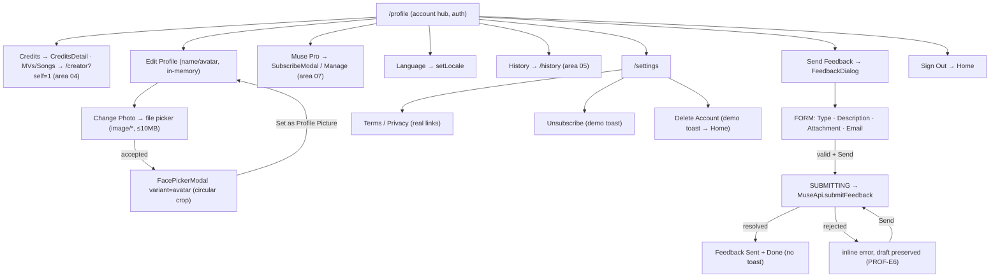

# Area 06 — Profile, Account & Settings

> Read `../00-overview.md` first (conventions, ID scheme, global auth/credits/i18n models).
> **As-built**; ⚠️ = divergence from App v3.0, ❓ = a tracked `TBD-*`, 🔒 = mock/in-memory.
> **§3.1 Send Feedback** was specified and shipped on 2026-08-17; what remains open there is the
> backend (`TBD-PROF-02`), two ids (`TBD-PROF-06`), and whether CSB still needs a `title`
> (`TBD-PROF-07`) — not the frontend.

---

## 1. Overview & scope

The account hub. `/profile` is a **settings-style hub** (avatar/name/PRO, credits+MVs+Songs stats,
Muse Pro, Language, History, Send Feedback, Settings) with an inline Edit-Profile modal. **Sign Out
now lives in `/settings`** (PROF-03), not on the profile screen. `/settings` (auth-gated) holds legal
links + Sign Out + subscription cancel + account delete.

**In scope:** `profile/ProfileView` (`/profile`, 🔒 **Auth**), `profile/SettingsView` (`/settings`),
the Edit-Profile / Language / Feedback modals. **Send Feedback is a real support ticket** — see
**§3.1** for the form and its CSB param mapping.
**Out of scope (cross-referenced):** the credits/IAP
the Credits Detail route + modals reached from here (area 07 — `/profile/credits`, `BuyCreditsModal`, `SubscribeModal`); the
**community profile content grid** at `/creator?self=1` that the stat tiles link to (area 04);
sign-in (area 09).

**Key mapping note (important):** web `/profile` is closest to the **App's Account screen (F18)** — a
row-based hub — **not** the App's _My Community Profile_ (F16), whose tabbed content grid lives at
`/creator?self=1` (area 04). The stat tiles bridge the two. ⚠️ The overview parity matrix lists
F16→06 for convenience; the content-grid half is actually area 04.

**Other key divergences:** the **Notifications row is removed** (product owner, 2026-08-14 — the web
has no push/permission flow behind it, so it was an inert local toggle; `TBD-PROF-01` is moot on web)
⚠️; Unsubscribe / Delete Account are **demo toasts** (Unsubscribe does not actually downgrade; Delete
does not delete) ⚠️. **Synced to App F19 (2026-07-23):** **Sign Out moved into Settings** (PROF-03)
and **`/settings` is now auth-gated** (`AuthGuard`); Terms of Use / Privacy Policy are **real links**
(PROF-06).

**Related docs (Send Feedback / support ticket):**

| Doc                                                                              | What it is                                                                     |
| -------------------------------------------------------------------------------- | ------------------------------------------------------------------------------ |
| [Feedback API document](https://ecl.cyberlink.com/dc/DocView.aspx?d=4828)        | The CSB feedback endpoint RD wires `submitFeedback` to — params, auth, limits. |
| [API test tool](https://stage2.cyberlink.com/prog/support/app/feedback-test.htm) | Stage form for firing a ticket by hand; use it to confirm ids before wiring.   |
| `CS Chatbot — Support ticket spec` §T3 (source of the mapping in **§3.1**)       | The YCO ticket form this reuses. Muse Web ships a 5-field subset of it.        |

---

## 2. Route / component / state / API map (RD)

| Route / Component                                           | Owns UI                                                                                                                                                          | Reads/writes state                                                                                                                | `MuseApi`            |
| ----------------------------------------------------------- | ---------------------------------------------------------------------------------------------------------------------------------------------------------------- | --------------------------------------------------------------------------------------------------------------------------------- | -------------------- |
| `/profile` → `profile/ProfileView` (🔒 **Auth**)            | header (avatar/name/PRO/email + edit), stat tiles (Credits/MVs/Songs), rows (Muse Pro, Language, History, Send Feedback, Settings), Edit-Profile/Language modals | `useAuth().{profile,subscribed,subscribedPlan,updateProfile}`, `useCredits().credits`, `useLocale().{locale,setLocale}`, `useT()` | **none**             |
| `FeedbackDialog` (opened from `/profile`)                   | the 5-field support-ticket form, its inline validation, the pending/success/error steps (**§3.1**)                                                               | `useAuth().profile.email` (prefill), `useLocale().locale` (`language` param), `useT()`, local form state                          | **`submitFeedback`** |
| `/settings` → `profile/SettingsView` (🔒 **Auth**, PROF-03) | Back, Terms/Privacy (real links → `lib/legal.ts`, new tab), Unsubscribe confirm, Delete-Account confirm, **Sign Out**                                            | `useAuth().signOut`, `useLocale()`, local `dialog`                                                                                | **none**             |

Localized via `useT()` (`profile.*`, `language.*`, `common.*`) — `/profile` is one of the only two
localized surfaces (nav + Profile). `/settings` copy is hardcoded English.

---

## 3. State model & rules

**Profile header** (`ProfileView.tsx`): avatar (image or name-initial), name, **PRO** pill when
`subscribed`, email; edit-pencil → Edit-Profile modal.
**Stat tiles** (`:116-127`): **Credits** → `router.push('/profile/credits')` (area 07; its **Buy More** opens `BuyCreditsModal`, now mounted on that route); **MVs** → `/creator?self=1&tab=mv`; **Songs** → `/creator?self=1&tab=songs` (area 04). Counts derive from the **static** `SAMPLE_CREATIONS` (not the user's real creations) ⚠️.
**Rows** (`:129-146`):

- **Muse Pro** — not subscribed → an **Upgrade** pill (`.button--secondary`) + row click → `SubscribeModal` (area 07); subscribed → plan name + hardcoded "validity 2026-08-10", **no pill**, row click → `/profile/credits` (product owner, 2026-08-14).
- **Language** — opens a 9-locale picker → `setLocale(code)` (i18n, area-wide).
- **History** — navigates to `/history` (area 05).
- **Send Feedback** — opens `FeedbackDialog`: a **5-field support ticket** submitted through `MuseApi.submitFeedback` → **§3.1**. _(Replaced the one-textarea modal whose content was discarded, 2026-08-17. `TBD-PROF-02`'s frontend half is closed; the endpoint itself stays RD's.)_
- **Settings** — navigates to `/settings` (via `localePath`). Sign Out is no longer on this screen (PROF-03 moved it into Settings).
  ⚠️ The `?demo=1` panel's `profileEmpty` flag drives an empty state on the content grid the MVs/Songs
  tiles above link to — but that grid is `CreatorProfile` (`/creator?self=1`), which is **area 04's**
  screen per this file's own §1 mapping note, not this one's. `profileEmpty` has **no consumer inside
  `/profile` or `/settings` themselves** — grep confirms `CreatorProfile.tsx` is its only reader. Spec
  the behaviour in area 04; nothing on this screen changes when it is toggled. `subOnApp` (the other
  demo flag touching this area) already has its own note under **Settings** below.

**Edit-Profile modal** (`:363-435`): avatar upload is a **real `<input type="file" accept="image/*">`**
since 2026-09-01 (product owner) — **not** the `AVATAR_SAMPLES`-cycle mock this line described until
then. **Change Photo** opens the native picker; a file that isn't `image/*` is rejected with the toast
`Unsupported format. Please choose an image.`, one over **10MB** with `File too large. Maximum size is
10MB.` (`onAvatarFile`, `:143-156`) — no dialog opens in either case. A valid pick opens
`FacePickerModal` (`:445-458`) in a new **`variant="avatar"`** — the identical drag/scale/canvas-crop
pipeline as `/mv/room`'s **Select a Face** (area 02 MV-P6-D), reused rather than reimplemented. The
variant changes only three strings and the frame shape: title **Edit Profile Picture**, subtitle
**Move and scale the box to select your avatar area.**, CTA **Set as Profile Picture**, and a
**circular** crop frame (`border-radius: 50%` — see the boxRatio note below); it passes no
`suggestions`, so the face-detection strip never renders. Confirming crops to a **256×256 JPEG data
URL** (`cropToDataUrl`, same routine as MV-P6-D) held in `avatarDraft`; closing the crop dialog without
confirming discards the pending pick (revokes the object URL) and leaves `avatarDraft` unchanged.
`avatarDraft` itself is committed only by the Edit-Profile modal's own **Save**; its **Cancel**
discards it too, because `openEdit()` re-seeds both drafts from the live profile on the next open —
no new commit path exists alongside `nameDraft`'s. Name (max 30); email **read-only**; Save →
`updateProfile({name,avatar})` (in-memory; lost on reload → `TBD-GL-04`). 🔒 **Nothing is uploaded
anywhere** — a real backend has to replace the data URL with an upload plus a stored URL
(`TBD-PROF-08`). `DESIGNER-TODO` B's "Profile avatar upload is completely blank" is closed by this.

> 🐞 **A pre-existing crop bug was found and fixed alongside this feature (2026-09-01), and it affects
> `/mv/room`'s Select a Face too — not something to re-file as new.** `FacePickerModal`'s `boxRatio`
> correction (added 2026-08-14 so the crop box can be non-square) never actually re-measured once the
> image loaded: the effect's first `ResizeObserver` read landed while a CSS min/max clamp still forced
> the preview box square, latching `boxRatio` at `1`, and no later resize fired to correct it — probed
> live, a settled 384×288 box still reported `boxRatio: 1.0000001`. Consequence: the on-screen frame
> was drawn at `crop.size`% of **both** axes while `cropToDataUrl` has always cut a square `s × s`
> region, so **the area a user framed was never the exact area they got**. It went unnoticed on the
> square/rounded-square face-picker frame; the circular avatar frame turned the same mismatch into a
> visible ellipse, which is how it was caught. Fixed by re-measuring on the ``'s own `onLoad`, not
> `ResizeObserver` alone. Cross-reference area 02 MV-P6-D rather than duplicating the mechanism here —
> the fix is one shared component, not two.

**Settings** (`SettingsView.tsx`): **Terms of Use** / **Privacy Policy** now **open the real legal
pages** (`lib/legal.ts` `TERMS_URL`/`PRIVACY_URL`, new tab — PROF-06, same set as the sign-in modal
AUTH-03) — the old placeholder modals are removed; **Unsubscribe** → confirm → toast "Unsubscribed
(demo)" — **does not clear `subscribed`** 🔒; **Delete Account** → destructive confirm → toast "Account
deleted (demo)" → redirect Home — **no real deletion** 🔒; **Sign Out** (PROF-03) → `signOut()` →
redirect Home. **Auth-gated route** (`AuthGuard`, PROF-03).

> ⚠️ **Unsubscribe first branches on where the subscription was bought — not documented until the
> S7 storyboard build found it (2026-08-31), D11.** `SettingsView.tsx:122` checks the `?demo=1`
> panel's `subOnApp` flag (standing in for an unbuilt `subscriptionPlatform` field, `TBD-PROF-04`
> extended) before choosing a dialog: **off** → the confirm→toast flow this paragraph and
> AC-PROF-07 describe; **on** → a different, non-dismissable-to-toast dialog ("Manage Subscription
> in the App Store" / "…Google Play") that explains the store owns the billing relationship and
> offers only "Got It" — no confirm, no toast, nothing to cancel from the web at all. No Figma was
> supplied for this branch; its copy is the session that built it, not a design. See
> `specs/storyboards/profile-account/specs/spec.html` P4-S6 for the capture and `open_questions`
> for the design-review gap this leaves.

🔒 Everything here is in-memory (profile/subscription) or static (stat counts, legal text).

---

## 3.1 Send Feedback — support-ticket form

> **Status: as-built** (specified and shipped 2026-08-17). `src/components/profile/FeedbackDialog.tsx`
>
> - `src/lib/feedback.ts` + `MuseApi.submitFeedback`. Guarded by `src/lib/feedback.test.ts` (13 unit
>   tests) and four `e2e/behaviour-regressions.spec.ts` tests — field order/gating, the whole-batch
>   attachment refusal, keyboard-only Type, and axe at 1440 + 375. The two attachment/keyboard guards
>   were mutation-tested in both directions.

Send Feedback creates a **CS support ticket** through the **same CSB endpoint as the CS Chatbot**, so
the field mapping below is a deliberate subset of that spec's **§T3** (`CS Chatbot — Support ticket
spec`). **The word "ticket" never appears in the UI** — the row and the dialog both stay
**"Send Feedback"**; ticketing is an implementation detail (see the naming decision in §10).

### Field → CSB param mapping

| Field                     | Shown?    | Placeholder / prefill                                    | Required | CSB param                                                                                                                |
| ------------------------- | --------- | -------------------------------------------------------- | -------- | ------------------------------------------------------------------------------------------------------------------------ |
| Product (YouCam Muse Web) | No        | —                                                        | —        | `prodVerId` = ❓ **`TBD-PROF-06`** (YCO's is `504`; Muse Web needs its own)                                              |
| Type                      | **Yes**   | "Select an issue type"                                   | **Yes**  | `questionTypeId` — Purchase and Payment `313` · Account `348` · Feature Issue `204` · Community Report ❓ · Others `211` |
| Subject                   | **No** ⚠️ | —                                                        | —        | **REMOVED** (product owner, 2026-08-27) — and with it the `title` param; the payload omits it (see §11)                  |
| Description               | **Yes**   | "Tell us what you think…" · max **1000** chars + counter | **Yes**  | `q` — the **raw description only** ⚠️ (see divergences)                                                                  |
| Attachment                | **Yes**   | any file type, **5 MB total** across all files           | No       | `attachment` (multipart)                                                                                                 |
| Email                     | **Yes**   | autofill from `profile.email`, else "Enter your email"   | **Yes**  | `email`                                                                                                                  |
| UI language               | No        | —                                                        | —        | `language` — the **active product locale code** (`enu`…`ptg` from `LOCALES`), **not** BCP-47; RD maps if CSB differs     |
| User ID                   | No        | —                                                        | —        | injected **server-side** from the session ⚠️ — WA's `Profile` has no id field                                            |
| Order ID / Invoice #      | **No** ⚠️ | —                                                        | —        | **dropped** from T3 (product owner, 2026-08-17)                                                                          |
| RD log · chat history     | No        | —                                                        | —        | out of scope — there is no chatbot on web                                                                                |

**On-screen order** (product owner, 2026-08-27 — supersedes the 2026-08-17 five-field order, and
still differs from T3): **Type → Description → Attachment → Email**. Classification first, then what
happened, then evidence; the prefilled contact detail sits last so a field the user rarely touches
never separates two they must fill.

> ⚠️ **Subject was field 2 of five until 2026-08-27.** Removing it also removed the only source of
> the `title` param, so the payload now omits `title` entirely rather than substituting anything.
> Three substitutes were put to the product owner and explicitly rejected: the Type label, the
> first 60 chars of the description, and a fixed constant. **`FeedbackTicketSchema.title` is
> deleted — a C2 contract change, logged in `docs/CHANGELOG-RD.md`.**
>
> **The product owner confirmed "don't send it" a second time on 2026-08-27, with a reason that
> changes the rest of this section: Muse looks to be on a DIFFERENT API from YCO's CSB.** If that
> is right, then the whole CSB inheritance in this table is provisional — not just `title`, but the
> four `questionTypeId` values, `prodVerId` 504, and AC-22's 10 MB. That is now ❓ **`TBD-PROF-07`**:
> RD confirms **which endpoint Muse actually posts to**, and whether it wants a `title` at all.
> Until it answers, `title` stays unsent. Do not pick a substitute unilaterally.

### Type control

A **custom listbox** (not a native `<select>`) so it matches the DP surfaces around it — there is no
DP select in `AccountPage.css`, so this is new styling either way. Because it is hand-built, its
keyboard and ARIA contract is **part of the spec, not an implementation detail** (same lesson as
`ui/SeekBar`, `TODO.md` #5):

- trigger: `aria-haspopup="listbox"`, `aria-expanded`, shows the placeholder until a type is chosen
- list: `role="listbox"`, options `role="option"` + `aria-selected`
- keys: **↑ ↓** move, **Home/End** jump, **Enter/Space** select, **Esc** closes and returns focus to
  the trigger; focus returns to the trigger on select too
- the five labels are `useT()` strings; the id sent is the mapping above

### Attachment rules

- hidden `<input type="file" multiple>` + a styled "Add file" trigger (the `MvRoom.tsx:368` pattern)
- **any** file type; **5 MB cumulative** across all picked files, with the running total shown
- picked files render as removable chips (name + size)
- a pick that would exceed 5 MB is **refused whole** — nothing is added — with **one** message under
  the field, never a toast (CS spec AC-22)

> **5 MB is the requirement** (product owner, 2026-08-27). It was **10 MB** until then — a figure
> inherited from YCO's CS spec (AC-22). ⚠️ **Do not "correct" it back on the next read of that
> document**, and note the document may not even apply: the product owner's read is that Muse uses
> a **different endpoint** from YCO's CSB (see `TBD-PROF-07`), which makes the old figure irrelevant
> rather than merely overridden. Only the NUMBER changed — the budget is still cumulative and a
> crossing pick is still refused whole.

- files are held in memory only; the mock does not upload. RD sends them as `multipart/form-data`

### States

| State        | Entry                            | Visible / enabled                                                                                          | Exit                                        |
| ------------ | -------------------------------- | ---------------------------------------------------------------------------------------------------------- | ------------------------------------------- |
| `FORM`       | Send Feedback tapped             | 4 fields; **Send disabled** while any required field is empty or the email is malformed                    | on valid input → `FORM_VALID`               |
| `FORM_VALID` | Type + Description + valid Email | Send enabled                                                                                               | on Send → `SUBMITTING`                      |
| `SUBMITTING` | Send pressed                     | Send disabled + pending state; fields read-only                                                            | on resolve → `SUCCESS`; on reject → `ERROR` |
| `SUCCESS`    | `submitFeedback` resolved        | Form and actions **replaced** by "Feedback Sent" + one line ("We'll reply to `<email>`.") + **Done**       | Done closes the dialog                      |
| `ERROR`      | `submitFeedback` rejected        | Form **intact** — every field and attachment preserved — one error line above the actions, Send re-enabled | on Send → `SUBMITTING`                      |

**No toast.** The existing `profile.toast.feedback` ("Thanks for your feedback!") is **removed** —
the in-dialog `SUCCESS` step replaces it (CS spec AC-23). Cancel / Esc / backdrop close the dialog
and discard the draft with **no confirm** (prototype scope).

### Contract surface (RD)

This touched two **frozen** surfaces; the `docs/CHANGELOG-RD.md` entry Gate G4-g requires is in
place, and `contract.surface.test.ts`'s C1/C2 snapshots were re-recorded to include them:

- **C2** `src/lib/api/schemas.ts` — a `FeedbackTicket` schema whose **field names are the CSB params**
  (`email`, `questionTypeId`, `title`, `q`, `language`, `attachment`), so the wire shape is the type.
- **C1** `src/lib/api/contract.ts` — `submitFeedback(input): Promise<{ ticketId: string }>`, mocked in
  `mock.ts` (validate → short delay → fake id). **This is the single swap point**: RD points that one
  function at the endpoint in the Feedback API doc and the UI needs no change.
- `grep -rn 'fetch(' src` stays empty — the mock never reaches a network (`YCM_REAL_API=1` is the
  documented relaxation for when the real client lands).
- `useAuth`/`Profile` are **unchanged** — no `id` field is added, because the User ID is injected
  server-side.

### i18n

New keys under **`profile.feedback.*`** in `src/lib/i18n/dictionaries/en.ts` (labels, placeholders,
the five type names, the attachment refusal, the success/error copy). `/profile` is one of only two
`useT()` surfaces, so this is inside the existing R-8 boundary — not a widening. The 8 non-English
dictionaries stay **empty**; per-key English fallback applies. ⚠️ These strings are e2e-visible.

### Deliberate divergences from T3

| #   | T3 says                                                           | Muse Web does                                           | Why                                                                                |
| --- | ----------------------------------------------------------------- | ------------------------------------------------------- | ---------------------------------------------------------------------------------- |
| 1   | 4 types (Purchase and Payment · Account · Feature Issue · Others) | **5** — adds **Community Report**                       | Muse has a community surface YCO does not. Its id is ❓ `TBD-PROF-06`.             |
| 2   | Order ID / Invoice # shown, optional, prefilled                   | **not shown**                                           | CS asks in the reply when needed; keeps a payment field off a UI-bug report.       |
| 3   | `q` carries Description **+ User ID + Order ID**                  | `q` = **description only**                              | No id in WA's model; the session already identifies the user server-side.          |
| 4   | Subject/Description prefilled from the AI summary                 | user-typed Description, real placeholder (no Subject)   | There is no chatbot on web, so there is no summary to prefill.                     |
| 5   | Email autofill "else placeholder"                                 | same, but the placeholder path is **unreachable today** | Both entry points are signed-in only; kept so a signed-out entry point can use it. |

---

## 4. Journeys

Screens to capture later: `/profile`, Edit-Profile modal, Language picker, `/settings`, delete confirm.

### PROF-P1 — View profile hub

- **PROF-P1-S1** Open `/profile` (auth-gated). **System:** header + stat tiles + rows. _(The "PRO pill if subscribed" clause was removed 2026-08-19 — see `AC-PROF-01`.)_
- **PROF-P1-S2** Tap **Credits** tile → navigates to `/profile/credits`; **MVs**/**Songs** tile → `/creator?self=1&tab=…` (area 04).

### PROF-P2 — Edit profile

- **PROF-P2-S1** Tap edit pencil → Edit-Profile modal (draft seeded from live profile).
- **PROF-P2-S2** **Change Photo** opens a native file picker (`image/*`); edit name (≤30); email
  read-only. **Save** → `updateProfile` + "updated" toast (in-memory). _(Corrected 2026-09-01 from
  code — Change Photo used to cycle sample avatars; see §3 and PROF-P2-S3/S4 below.)_
- **PROF-P2-S3** A non-image file, or one over 10MB, is rejected with a toast and opens nothing; a
  valid pick opens `FacePickerModal` (`variant="avatar"` — circular frame, avatar copy, no
  face-suggestion strip; area 02 MV-P6-D is the shared mechanism).
- **PROF-P2-S4** Drag/scale the circular crop box, then **Set as Profile Picture** → the 256×256 JPEG
  crop becomes `avatarDraft` and the crop dialog closes; closing it instead (✕ / backdrop) discards
  the pending pick and leaves `avatarDraft` as it was.

### PROF-P3 — Rows

- **PROF-P3-S1** **Muse Pro** → Upgrade pill / Subscribe modal (area 07), or Credits detail if subscribed. **Language** → locale picker → `setLocale`. **History** → `/history`. **Send Feedback** → `FeedbackDialog` (PROF-P5). **Settings** → `/settings` (Sign Out lives there now, PROF-03).

### PROF-P5 — Send Feedback (support ticket)

- **PROF-P5-S1** Tap **Send Feedback** → `FeedbackDialog` opens on `FORM`: Type (placeholder "Select an issue type"), Description, Attachment, Email **prefilled from the account**. **Send is disabled.** There is **no Subject field** (removed 2026-08-27).
- **PROF-P5-S2** Open **Type** → 5 options; pick one with mouse or ↑/↓ + Enter → the trigger shows the label, focus returns to the trigger.
- **PROF-P5-S3** Type a Description (≤1000, counter updates). With a Type chosen and a valid Email present, **Send enables**.
- **PROF-P5-S4** _(optional)_ **Add file** → pick one or more files of any type → chips with name + size + remove; the running total is shown.
- **PROF-P5-S5** **Send** → `SUBMITTING` (Send disabled, fields read-only) → `submitFeedback` resolves → the form is replaced by **"Feedback Sent"** + "We'll reply to `<email>`." + **Done**.
- **PROF-P5-S6** **Done** closes the dialog. No toast. Re-opening Send Feedback gives a **fresh empty form** (Email re-prefilled).

### PROF-P4 — Settings

- **PROF-P4-S1** `/settings` (auth-gated): **Terms**/**Privacy** → real legal pages (new tab); **Sign Out** → `signOut()` → Home.
- **PROF-P4-S2** **Unsubscribe** → confirm → "Unsubscribed (demo)" toast (no downgrade).
- **PROF-P4-S3** **Delete Account** → destructive confirm → "Account deleted (demo)" toast → Home (no real deletion).

---

## 5. Error & edge states

| ID           | Trigger                                                        | Behaviour                                                                                                                                                                      |
| ------------ | -------------------------------------------------------------- | ------------------------------------------------------------------------------------------------------------------------------------------------------------------------------ |
| **PROF-E1**  | Logged out on `/profile`                                       | `AuthGuard` → sign-in modal (area 09).                                                                                                                                         |
| **PROF-E2**  | Direct-navigate `/settings` logged out                         | **Auth-gated (PROF-03, 2026-07-23):** `AuthGuard` opens the sign-in modal; dismiss → Home.                                                                                     |
| **PROF-E3**  | Reload after edit/subscribe                                    | Name/avatar/subscription reset to defaults (in-memory; only logged-in boolean persists → `TBD-GL-04`).                                                                         |
| **PROF-E4**  | Unsubscribe while subscribed                                   | Toast only; `subscribed` stays true (no state change). 🔒                                                                                                                      |
| **PROF-E5**  | Attachment pick would exceed 5 MB total                        | **Nothing is added** (the pick is refused whole, not truncated) and **one** message appears under the Attachment field — never a toast. Already-picked files are untouched.    |
| **PROF-E6**  | `submitFeedback` rejects (network / 500 / oversized multipart) | Dialog **stays open with every field and attachment preserved**; one error line above the actions ("Couldn't send. Please try again."); Send re-enabled. Nothing is discarded. |
| **PROF-E7**  | Dialog closed mid-draft (Cancel / Esc / backdrop)              | Draft is discarded with **no confirm**; the next open starts empty with Email re-prefilled.                                                                                    |
| **PROF-E8**  | Change Photo: picked file is not an image                      | Toast "Unsupported format. Please choose an image."; no crop dialog opens; `avatarDraft` unchanged.                                                                            |
| **PROF-E9**  | Change Photo: picked file exceeds 10MB                         | Toast "File too large. Maximum size is 10MB."; no crop dialog opens; `avatarDraft` unchanged.                                                                                  |
| **PROF-E10** | Avatar crop dialog closed without confirming (✕ / backdrop)    | The pending pick's object URL is revoked and discarded; `avatarDraft` stays whatever it was before the pick (unset, or a previous crop).                                       |

---

## 6. Acceptance criteria (EARS)

- **AC-PROF-01** — WHEN `/profile` loads for a signed-in user, THE SYSTEM SHALL show avatar/name/email, a ~~PRO pill~~ iff subscribed, the Credits/MVs/Songs tiles, and the row list. _(Corrected 2026-08-19 — the PRO pill is REMOVED from this criterion. DP's `AccountPage` identity block is avatar + name + email + Edit, with no plan badge, and `AccountPage.css` has no class for one; building it would mean inventing a visual with no design. Subscription state already surfaces in the account menu's PRO/FREE badge and in the Muse Pro row below. Product owner decision.)_
- **AC-PROF-02** — WHEN a stat tile is tapped, THE SYSTEM SHALL navigate to `/profile/credits` (Credits) or to `/creator?self=1&tab=mv|songs` (MVs/Songs). _(rewritten 2026-08-12: Credits Detail became a route on 2026-08-11)_
- **AC-PROF-03** — WHEN Edit-Profile is saved, THE SYSTEM SHALL commit name/avatar via `updateProfile` and reflect them in the shell (in-memory).
- **AC-PROF-04** — WHEN the Muse Pro row is tapped, THE SYSTEM SHALL open the Subscribe modal (not subscribed) or the Credits detail (subscribed).
- **AC-PROF-05** — WHEN Language is changed, THE SYSTEM SHALL switch locale via `setLocale` and reflect it in localized surfaces.
- **AC-PROF-06** — WHEN Sign Out is invoked (from Settings — PROF-03 — or the account menu), THE SYSTEM SHALL clear auth and redirect Home. It SHALL NOT appear on `/profile`.
- **AC-PROF-17** — `/settings` SHALL be auth-gated (`AuthGuard`); WHEN logged out, it opens the sign-in modal (PROF-03). _(was a second `AC-PROF-08`; renumbered 2026-08-17 — the visual criterion below keeps `08`, which is what §7's "AC-08" and areas 01/04 mean by it.)_
- **AC-PROF-09** — WHEN Terms of Use / Privacy Policy is tapped (Settings or the sign-in modal), THE SYSTEM SHALL open the shared real legal URL in a new tab (PROF-06 / AUTH-03).
- **AC-PROF-07** — WHEN Unsubscribe or Delete Account is confirmed in `/settings`, THE SYSTEM SHALL show a demo toast (and Delete redirects Home) **without** actually cancelling or deleting anything. _(as-built placeholder — pending `TBD-PROF-04`.)_ ⚠️ _(Extended 2026-08-31, D11 — this describes the DEFAULT branch only. WHEN the `?demo=1` panel's `subOnApp` flag is on, tapping Unsubscribe SHALL instead open a "manage it on your phone" explainer with a single "Got It" control — no confirm, no toast, nothing else to show, because a store-bought subscription cannot be cancelled from the web. See §3's own ⚠️ note.)_
- **AC-PROF-08** — THE SYSTEM SHALL render `/profile` and `/settings` at 320/375/768/1024/1440/1920px with no overflow. _(visual)_ _(Widths corrected 2026-08-19 to the six tiers the code and `visual-baseline.spec.ts` actually use; the old list said 390, which no test has ever measured.)_

**Send Feedback (§3.1):**

- **AC-PROF-10** — WHEN Send Feedback is opened, THE SYSTEM SHALL show exactly **four** fields in the order Type → Description → Attachment → Email, with Email prefilled from `profile.email` and Send **disabled**, and SHALL NOT render a Subject field. _(the absence is asserted, not merely un-asserted — a returning Subject silently re-opens TBD-PROF-07)_
- **AC-PROF-11** — THE SYSTEM SHALL keep Send disabled until Type and Description are non-empty AND Email is a well-formed address; and SHALL NOT show a field-level error for the merely-incomplete case.
- **AC-PROF-12** — WHEN a valid form is submitted, THE SYSTEM SHALL call `MuseApi.submitFeedback` with `questionTypeId` from the §3.1 mapping, `q` = the Description text alone, `email` = the Email field, and `language` = the active product locale code — and SHALL NOT include `title`, a User ID, or an Order ID. _(the `title` = Subject clause was deleted 2026-08-27 with the field itself)_
- **AC-PROF-13** — WHEN the submit resolves, THE SYSTEM SHALL replace the form with a "Feedback Sent" confirmation carrying one line of copy and a **Done** control that closes the dialog, and SHALL NOT show a toast.
- **AC-PROF-14** — WHEN the submit rejects, THE SYSTEM SHALL keep the dialog open with every entered value and attachment intact, show one inline error, and re-enable Send (PROF-E6).
- **AC-PROF-15** — THE SYSTEM SHALL accept attachments of any type up to **5 MB in total**, and WHEN a pick would exceed that, SHALL add nothing and show one message inside the form, not a toast (PROF-E5).
- **AC-PROF-16** — THE Type control SHALL be operable by keyboard alone (↑/↓, Home/End, Enter/Space, Esc) with `role="listbox"`/`role="option"` semantics and focus returning to its trigger, and SHALL pass axe at 375 and 1440. _(a11y — mutation-test it in both directions)_

**Avatar upload (§3):**

- **AC-PROF-18** — WHEN **Change Photo** is tapped, THE SYSTEM SHALL open a file picker restricted to `image/*`; WHEN the picked file is not an image or exceeds 10MB, THE SYSTEM SHALL reject it with a toast (PROF-E8/E9) and open no dialog; WHEN it is accepted, THE SYSTEM SHALL open `FacePickerModal` in `variant="avatar"` (circular crop frame, avatar copy, no face-suggestion strip) and, on confirm, hold a 256×256 JPEG data URL in `avatarDraft` until the Edit-Profile modal's own Save commits it via `updateProfile`; closing the crop dialog without confirming SHALL leave `avatarDraft` unchanged (PROF-E10). _(new 2026-09-01 — supersedes the `AVATAR_SAMPLES`-cycle behaviour previously described here and in PROF-P2.)_

---

## 7. Per-path QA checklist

- [ ] **PROF-P1**: header/tiles/rows render; PRO pill only when subscribed; tiles route correctly (AC-01/02).
- [ ] **PROF-P2**: edit → Change Photo opens a real file picker (`image/*`) → a bad file (non-image or >10MB) rejects with a toast and opens nothing (AC-18, PROF-E8/E9) → a good file opens the circular crop dialog (avatar copy) → Set as Profile Picture → name ≤30, email read-only, Save commits the crop + name (AC-03, AC-18).
- [ ] **PROF-P3**: Muse Pro → subscribe/credits (Upgrade pill only when not subscribed); Language switches; History nav; Send Feedback opens the form; Settings nav; Sign Out → Home (AC-04/05/06).
- [ ] **PROF-P5**: five fields in order, Email prefilled, Send disabled → enabled (AC-10/11); payload has no User ID / Order ID (AC-12); success step + Done, **no toast** (AC-13); forced reject keeps the draft (AC-14, PROF-E6); 11 MB pick refused inline (AC-15, PROF-E5); Type control driven by keyboard only, axe clean at **375 and 1440** (AC-16).
- [ ] **PROF-P4**: Terms/Privacy open the **real** legal pages in a new tab (`lib/legal.ts`); Unsubscribe demo toast (still subscribed); Delete demo toast → Home (AC-07, AC-09, E4). _("placeholder" corrected 2026-08-19 — §3/§6 and the code have used real links since AUTH-03.)_
- [ ] **PROF-E1**: logged-out /profile → sign-in (**AC-17** for `/settings`). **PROF-E3**: reload loses edits/subscription.
- [ ] **AC-08**: both screens clean at 4 widths _(visual)_.

---

## 8. Open items for RD

| ID              | Open item                                                                                                                                                                                                                                                                                                                                                                                                                                                                                                                                                                                                                                                                                                                                                                                                                                                                                        |
| --------------- | ------------------------------------------------------------------------------------------------------------------------------------------------------------------------------------------------------------------------------------------------------------------------------------------------------------------------------------------------------------------------------------------------------------------------------------------------------------------------------------------------------------------------------------------------------------------------------------------------------------------------------------------------------------------------------------------------------------------------------------------------------------------------------------------------------------------------------------------------------------------------------------------------ |
| **TBD-PROF-01** | ✅ **Moot on web (2026-08-14)** — the Notifications row is removed; there is no browser push/permission flow behind it. Kept as an id so nothing dangles.                                                                                                                                                                                                                                                                                                                                                                                                                                                                                                                                                                                                                                                                                                                                        |
| **TBD-PROF-02** | 🔧 **Backend (RD)** — wire `MuseApi.submitFeedback` to the CSB feedback endpoint per the [Feedback API document](https://ecl.cyberlink.com/dc/DocView.aspx?d=4828) (verify params with the [API test tool](https://stage2.cyberlink.com/prog/support/app/feedback-test.htm)). The **form, validation, payload shape and states are BUILT** (§3.1, 2026-08-17) and the mock resolves — what is left is the endpoint, auth, the multipart upload, and injecting the User ID server-side.                                                                                                                                                                                                                                                                                                                                                                                                           |
| **TBD-PROF-06** | 🔧 **Backend / CS** — two ids §3.1 cannot fill: **`prodVerId` for YouCam Muse Web** (YCO's is `504`) and the **`questionTypeId` for "Community Report"** (the other four are `313`/`348`/`204`/`211`). Until both land, the prototype ships the five labels and sends `null` for Community Report. **Blocks:** a real submit for that type.                                                                                                                                                                                                                                                                                                                                                                                                                                                                                                                                                      |
| **TBD-PROF-07** | 🔧 **Backend / CS** — **which endpoint does Muse feedback actually post to, and does it want a `title`?** The product owner's read (2026-08-27) is that Muse is **not** on YCO's CSB. If so, everything this spec inherited from the CSB/T3 documents is provisional: the four `questionTypeId` values, `prodVerId` `504`, and AC-22's 10 MB attachment cap. Concretely: (a) name the endpoint; (b) confirm `title` is not required — the Subject field is gone and `FeedbackTicketSchema.title` was deleted with it (C2 change, see `docs/CHANGELOG-RD.md`), and if it IS required the decision returns to the product owner rather than to an invented value (the Type label, a description excerpt and a fixed constant were all considered and rejected); (c) confirm CS can triage on `questionTypeId` + `q` alone, having lost the per-ticket subject line. **Blocks:** every real submit. |
| **TBD-PROF-04** | 🔧 **Backend (RD)** — real Unsubscribe (store deeplink per App F19, cancels subscription) and real account Delete (permanent data removal). Both are demo toasts today.                                                                                                                                                                                                                                                                                                                                                                                                                                                                                                                                                                                                                                                                                                                          |
| **TBD-PROF-05** | 🔧 **Backend (RD)** — real stats source. MVs/Songs counts come from static `SAMPLE_CREATIONS`; the Muse Pro row hardcodes "validity 2026-08-10".                                                                                                                                                                                                                                                                                                                                                                                                                                                                                                                                                                                                                                                                                                                                                 |
| **TBD-PROF-08** | 🔧 **Backend (RD)** — real avatar storage. Change Photo's crop pipeline (§3, `FacePickerModal variant="avatar"`) outputs a 256×256 JPEG **data URL** held only in `avatarDraft`/in-memory `profile.avatar`; nothing is uploaded. A real backend must accept the crop as an upload and return a stored URL for `updateProfile` to use instead.                                                                                                                                                                                                                                                                                                                                                                                                                                                                                                                                                    |

See also global: `TBD-GL-01` (credits), `TBD-GL-04` (persistence), `TBD-GL-06` (localization).

---

## 9. Flow diagram

```mermaid
flowchart TD
  Profile["/profile (account hub, auth)"] --> Tiles["Credits → CreditsDetail · MVs/Songs → /creator?self=1 (area 04)"]
  Profile --> Edit["Edit Profile (name/avatar, in-memory)"]
  Edit --> AvatarPick["Change Photo → file picker (image/*, ≤10MB)"]
  AvatarPick -->|"accepted"| AvatarCrop["FacePickerModal variant=avatar (circular crop)"]
  AvatarCrop -->|"Set as Profile Picture"| Edit
  Profile --> Pro["Muse Pro → SubscribeModal / Manage (area 07)"]
  Profile --> Lang["Language → setLocale"]
  Profile --> Hist["History → /history (area 05)"]
  Profile --> FB["Send Feedback → FeedbackDialog"]
  FB --> FBForm["FORM: Type · Description · Attachment · Email"]
  FBForm -->|"valid + Send"| FBSend["SUBMITTING → MuseApi.submitFeedback"]
  FBSend -->|resolved| FBOk["Feedback Sent + Done (no toast)"]
  FBSend -->|rejected| FBErr["inline error, draft preserved (PROF-E6)"]
  FBErr -->|Send| FBSend
  Profile --> Settings["/settings"]
  Profile --> Out["Sign Out → Home"]
  Settings --> Legal["Terms / Privacy (real links)"]
  Settings --> Unsub["Unsubscribe (demo toast)"]
  Settings --> Del["Delete Account (demo toast → Home)"]
```

---

**Decisions (as-built):** `/profile` = Account-style hub (rows), community grid split to `/creator?self=1`;
edits/subscription in-memory; Unsubscribe/Delete are demo-only; Notifications is removed (2026-08-14);
`/settings` is auth-gated with Sign Out (not on `/profile`); Terms/Privacy are real links.

## 10. Decisions — Send Feedback (2026-08-17)

Twelve questions put to the product owner; the answers are the spec above. Recorded so the next
session does not re-open them, and because four of them **deviate from the referenced T3 spec**.

| #   | Decision                                                                                                     | Note                                                 |
| --- | ------------------------------------------------------------------------------------------------------------ | ---------------------------------------------------- |
| 1   | Ship the 4 known `questionTypeId`s verbatim; Community Report's id + Muse's `prodVerId` become `TBD-PROF-06` | UI shows all 5 labels                                |
| 2   | **Order ID / Invoice # dropped** entirely                                                                    | divergence 2                                         |
| 3   | `q` = the description alone; **RD injects the User ID server-side**                                          | divergence 3 — `Profile` gains no `id`               |
| 4   | Full mock endpoint on `MuseApi` (`submitFeedback`) + a Zod schema whose names are the CSB params             | C1 + C2 additions; no `[fail]` demo trigger          |
| 5   | In-dialog "Feedback Sent" + Done; the **toast is removed**                                                   | CS AC-23                                             |
| 6   | Multiple attachments, **5 MB cumulative**, refusal shown inline (5 MB is ours, not CS's 10)                  | CS AC-22 + product owner 2026-08-27                  |
| 7   | Email prefilled, **editable**, format-validated                                                              | not read-only, unlike Edit-Profile's email           |
| 8   | **Send disabled until valid** (no per-field error text for the incomplete case)                              | matches the MV/Song create CTAs                      |
| 9   | Legacy Tailwind `Modal`, body scrolls at 375 — **not** `DpDialog`, **not** a full-screen phone sheet         | matches the two sibling modals on the same screen    |
| 10  | Failure keeps the dialog open with the draft intact                                                          | PROF-E6                                              |
| 11  | **Custom listbox** for Type, not a native `<select>`                                                         | so its keyboard/ARIA contract is spec'd — AC-PROF-16 |
| 12  | Naming stays **"Send Feedback"**; "ticket" never appears in the UI                                           | no dictionary or e2e churn                           |

**Scope note:** `/profile` is the only entry point, and now the only surface at all. The account
dropdown's own inert "Send Feedback" row used to sit in `AccountMenu`, and this spec recorded it as
"vestigial, reached by exactly one route" — that was already too generous: the S6 storyboard build
measured `TopBar`'s condition against the routes on disk and found it matched **none** of them. The
product owner chose deletion on 2026-08-27, so `AccountMenu`/`HeaderActions`/`TopBar` are gone and
that row with them. Nothing here changes; the alternative surface simply no longer exists.
