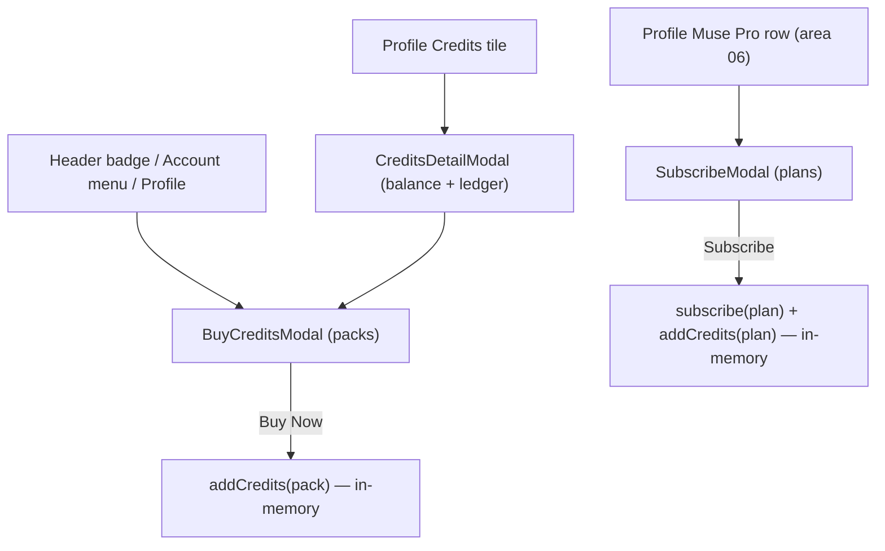

# Area 07 — Credits & IAP

> Read `../00-overview.md` first (conventions, ID scheme, global credits model §6). **As-built**;
> ⚠️ = divergence from App v3.0, ❓ = a tracked `TBD-*`, 🔒 = mock/in-memory.
>
> ⚠️ **Backend note (G3):** there is **no real payment** — every purchase/subscribe just mutates the
> in-memory balance/flag. Real IAP (App Store / Play Store), persistence, credit reset/expiry, and
> restore-purchases are backend/store concerns this spec does **not** define (`TBD-CR-*`).

---

## 1. Overview & scope

Credit balance + the three monetization modals. `CreditsProvider` holds an in-memory balance;
`SubscribeModal` (Muse Pro plans), `BuyCreditsModal` (credit packs), and `CreditsDetailModal` (balance
+ ledger) are opened from the shell, account menu, and profile. Disclaimer copy differs per modal:
only **`SubscribeModal`** says "Demo only — no real payment. Subscription credits reset each cycle.";
`BuyCreditsModal` says purchased credits **never expire** (non-refundable / prices-vary);
`CreditsDetailModal` has none.

**In scope:** `providers/CreditsProvider`, `credits/SubscribeModal`, `credits/BuyCreditsModal`,
`credits/CreditsDetailModal`; the plan/pack/ledger data in `lib/user.ts`.
**Out of scope (cross-referenced):** entry points — header credits badge + account menu Buy Credits
(area 01), profile Credits tile / Muse Pro row (area 06); how generation *spends* credits (area 02
MV flow + Edit MV, area 03 song; charging is now real — `GL-01`, see §6 overview).

**As-built vs App F20 (CR-02/03/05 landed 2026-07-23, now synced to app):** plans are **Weekly /
Monthly / Yearly** with an **"800 Weekly Credits"** header + a **six-feature list** (`WEEKLY_CREDITS`,
`MUSE_PRO_FEATURES` in `lib/user.ts`); **Restore Purchases** and an **"already on Muse Pro"** state
exist; purchased credits **never expire** and subscription credits **reset per cycle** (copy only — no
real reset/expiry engine). Still mock: **no native IAP** — purchase is instant `addCredits` 🔒
(`TBD-CR-01`); prices/credit amounts are **placeholders pending RD confirmation** (see the handoff
reconciliation note).

---

## 2. Route / component / state / API map (RD)

| Component | Owns UI | Reads/writes state | `MuseApi` |
|---|---|---|---|
| `providers/CreditsProvider` | — (state only) | `useState(DEFAULT_CREDITS=390)`, `addCredits(n)` | **none** |
| `credits/SubscribeModal` | Muse Pro plan picker + Subscribe CTA | `useAuth().subscribe`, `useCredits().addCredits`, `SUBSCRIPTION_PLANS` | — |
| `credits/BuyCreditsModal` | balance + credit-pack picker + Buy CTA | `useCredits().{credits,addCredits}`, `CREDIT_PACKS` | — |
| `credits/CreditsDetailModal` | balance + transaction ledger + Buy CTA | `useCredits().credits`, `CREDIT_TRANSACTIONS` | — |

No route of its own; opened as modals. No backend.

---

## 3. State model & rules

- **Balance** (`CreditsProvider.tsx`): single in-memory `credits` (`DEFAULT_CREDITS = 390`) +
  `addCredits(n)` (adds `n`, may be negative). **GL-01 (2026-07-23):** the MV/song **flow providers**
  now decrement on generation start (`COST_STORYBOARD`/`COST_RENDER`/`COST_SONG`, refunded on failure)
  and Edit-MV still charges its micro-ops (`COST_REGEN`/`COST_COVER`); when the balance can't cover a
  cost the CTA **routes to IAP instead of generating** (`MvRoom`, `SongCompose`, `StoryboardEditor`,
  `MvEditor`, `SongResultView`). `CreditsProvider` also exposes `enhanceCost` / `consumeEnhance` for
  the AI-Enhance charge (SONG-04). Balance still resets to 390 on reload 🔒 (`TBD-GL-04`); real ledger
  is `TBD-CR-04`.
- **`SubscribeModal`** (`SubscribeModal.tsx`): title "Muse Pro"; **"800 Weekly Credits"** header +
  six-feature list (`MUSE_PRO_FEATURES`); three `SUBSCRIPTION_PLANS` cards (**"Weekly Plan"**
  $9.99 · **"Monthly Plan"** $29.99 **POPULAR** · **"Yearly Plan"** $199.99 **BEST VALUE**, all on the
  `WEEKLY_CREDITS = 800` allowance; prices/credits are placeholders); default selected **monthly**;
  **Subscribe** → `subscribe(plan)` + `addCredits(plan.credits)` + `onSubscribed` toast + close.
  **Restore Purchases** action ("No previous purchases found"); when already subscribed the modal
  shows the **"You're already on Muse Pro"** state instead of the picker (CR-05). Disclaimer: "Demo
  only — no real payment. Subscription credits reset each cycle. Cancel anytime."
- **`BuyCreditsModal`** (`BuyCreditsModal.tsx`): shows balance; four `CREDIT_PACKS` (**100** $0.99 ·
  **300** $2.49 **POPULAR** · **600** $4.49 · **1000** $6.49); default selected **300** (id 2);
  **Buy Now** → `addCredits(pack.credits)` + `onPurchased` toast + close. Copy (CR-03): "Purchased
  credits never expire. Non-refundable. Prices may vary by region." + "Cancel anytime · No commitment".
- **`CreditsDetailModal`** (`CreditsDetailModal.tsx`): balance card + **Buy Credits** CTA + a
  **Transaction History** list rendered from the static 7-entry `CREDIT_TRANSACTIONS` seed
  (`lib/user.ts`) — 🔒 **not live**; it does not reflect `addCredits` calls.
- 🔒 All credit state and the ledger are in-memory/static; nothing persists across reload; no store integration.

---

## 4. Journeys

Screens to capture later: SubscribeModal, BuyCreditsModal, CreditsDetailModal.

### CR-P1 — Buy credits
- **CR-P1-S1** Open `BuyCreditsModal` (header badge / account menu / profile). **System:** shows balance + 4 packs (300 preselected).
- **CR-P1-S2** Pick a pack → **Buy Now** → `addCredits(pack.credits)`, toast "Added N credits", close. Balance updates in the shell (in-memory).

### CR-P2 — Subscribe (Muse Pro)
- **CR-P2-S1** Open `SubscribeModal` (profile Muse Pro row). **System:** 3 plans (super preselected).
- **CR-P2-S2** Pick a plan → **Subscribe** → `subscribe(plan)` (account → subscriber) + `addCredits(plan.credits)` + toast, close. Avatar gains the gold ring / PRO badge (areas 01/06).

### CR-P3 — Credits detail
- **CR-P3-S1** Open `CreditsDetailModal` (profile Credits tile / Muse Pro Manage). **System:** balance + static ledger + **Buy Credits** → `BuyCreditsModal`.

---

## 5. Error & edge states

| ID | Trigger | Behaviour |
|---|---|---|
| **CR-E1** | Reload after buy/subscribe | Balance resets to 390; subscription cleared (in-memory; → `TBD-GL-04`). |
| **CR-E2** | Ledger vs balance mismatch | The ledger is a fixed seed; it never matches actual `addCredits` history 🔒 (→ `TBD-CR-04`). |
| **CR-E3** | Already subscribed | `SubscribeModal` shows the **"You're already on Muse Pro"** state (no plan picker / re-subscribe) — CR-05 landed 2026-07-23. |
| **CR-E4** | Insufficient balance for a generation | The CTA opens `BuyCreditsModal` (IAP) instead of starting the job (GL-01). |

---

## 6. Acceptance criteria (EARS)

- **AC-CR-01** — WHEN a credit pack is purchased, THE SYSTEM SHALL add the pack's credits to the balance, toast, and close — with no real payment step.
- **AC-CR-02** — WHEN a plan is subscribed, THE SYSTEM SHALL set the account to subscriber, add the plan's credits, and reflect PRO status in the shell/profile.
- **AC-CR-03** — WHEN `CreditsDetailModal` opens, THE SYSTEM SHALL show the current balance, the static transaction ledger, and a Buy Credits CTA.
- **AC-CR-04** — THE SYSTEM SHALL show `SubscribeModal`'s "Demo only — no real payment. Subscription credits reset each cycle. Cancel anytime." disclaimer; `BuyCreditsModal`'s "Purchased credits never expire. Non-refundable. Prices may vary by region." + "Cancel anytime · No commitment"; and no disclaimer on `CreditsDetailModal`. *(as-built per-modal copy)*
- **AC-CR-05** — THE SYSTEM SHALL render the three modals at 390/768/1024/1440px with no overflow. *(visual)*
- **AC-CR-06** — WHILE already subscribed, WHEN `SubscribeModal` opens, THE SYSTEM SHALL show the "You're already on Muse Pro" state (no plan picker) and expose a Restore Purchases action.
- **AC-CR-07** — WHEN a generation is started with `credits < cost`, THE SYSTEM SHALL open the buy-credits IAP instead of generating (GL-01).

> Charging is now real within the in-memory economy (GL-01); persistence, a live ledger, real IAP, and real reset/expiry remain backend-deferred (§8).

---

## 7. Per-path QA checklist

- [ ] **CR-P1**: 300 preselected; Buy adds pack credits + toast; balance updates (AC-01).
- [ ] **CR-P2**: super preselected; Subscribe → subscriber + credits + PRO badge (AC-02).
- [ ] **CR-P3**: detail shows balance + 7-entry ledger + Buy Credits → BuyCreditsModal (AC-03).
- [ ] **CR-E1**: reload resets balance/subscription. **CR-E2**: ledger static. **CR-E3**: no already-Pro guard.
- [ ] **AC-04/05**: SubscribeModal shows the demo disclaimer, BuyCredits the expiry/refund copy, CreditsDetail none; modals clean at 4 widths *(visual)*.

---

## 8. Area TBD register — decisions 2026-07-22

**Decisions** — codebase change list in [`../../docs/handoff-2026-07-23.md`](../../docs/handoff-2026-07-23.md).

| ID | Decision |
|---|---|
| TBD-CR-01 | 🔧 **Backend (RD)** — real IAP (App Store / Play Store). |
| TBD-CR-02 | ✅ **Sync App** — plans = Weekly / Monthly / Yearly + "800 Weekly Credits" header + 6-feature list (reconcile current weekly/super/yearly). |
| TBD-CR-03 | ✅ **Sync App** — purchased credits never expire; subscription credits reset per cycle. |
| TBD-CR-04 | 🔧 **Backend (RD)** — live credit ledger. |
| TBD-CR-05 | ✅ **Sync App** — add Restore Purchases + "already on Muse Pro" state. |

See also global: `TBD-GL-01` (credit charging/spending), `TBD-GL-04` (persistence).

| ID | Question |
|---|---|
| **TBD-CR-01** | **Real IAP** — App Store / Play Store purchase for packs and subscription. None today (instant `addCredits`). |
| **TBD-CR-02** | **Plan structure** — App F20 = Weekly/Monthly/Yearly + "800 Weekly Credits" header + 6-feature list; web = Weekly/Super/Yearly (200/1000/2000). Finalize plans, prices, and credit grants. |
| **TBD-CR-03** | **Credit lifecycle** — App: purchased credits never expire, subscription credits reset per cycle; web shows "expire after 12 months" (copy only) and has no reset. Define the real rules. |
| **TBD-CR-04** | **Live ledger** — `CreditsDetailModal` shows a static seed, not real transactions. Wire to a real ledger. |
| **TBD-CR-05** | **Restore Purchases + already-Pro state** — App F20 has Restore Purchases and an "already on Muse Pro" state; web has neither. |

---

## 9. Flow diagram

---

## 10. Decisions & changelog

**Decisions (as-built):** credits are in-memory + display-mostly; modals are demo-only (no store);
ledger is a static seed; plans differ from the app.

| Date | Change |
|---|---|
| 2026-07-22 | Initial as-built spec. |
| 2026-07-22 | Validator fix: corrected disclaimer claim (only SubscribeModal shows "Demo only — no real payment"; per-modal copy in AC-CR-04); flagged plan-card "resets {cadence}" as display-only; noted code plan names. |
| 2026-07-23 | Implemented: plans restructured to Weekly / Monthly / Yearly with an "800 Weekly Credits" header + six-feature list; `PlanId` now `weekly\|monthly\|yearly`; per-period price suffix (CR-02); purchased credits "never expire" + subscription credits reset per cycle copy (CR-03); Restore Purchases action + "already on Muse Pro" state in `SubscribeModal` (CR-05). Prices/credit amounts are placeholders pending RD confirmation (see handoff status note). GL-01 real charging wired through the flow providers with an insufficient-balance → IAP route. |
