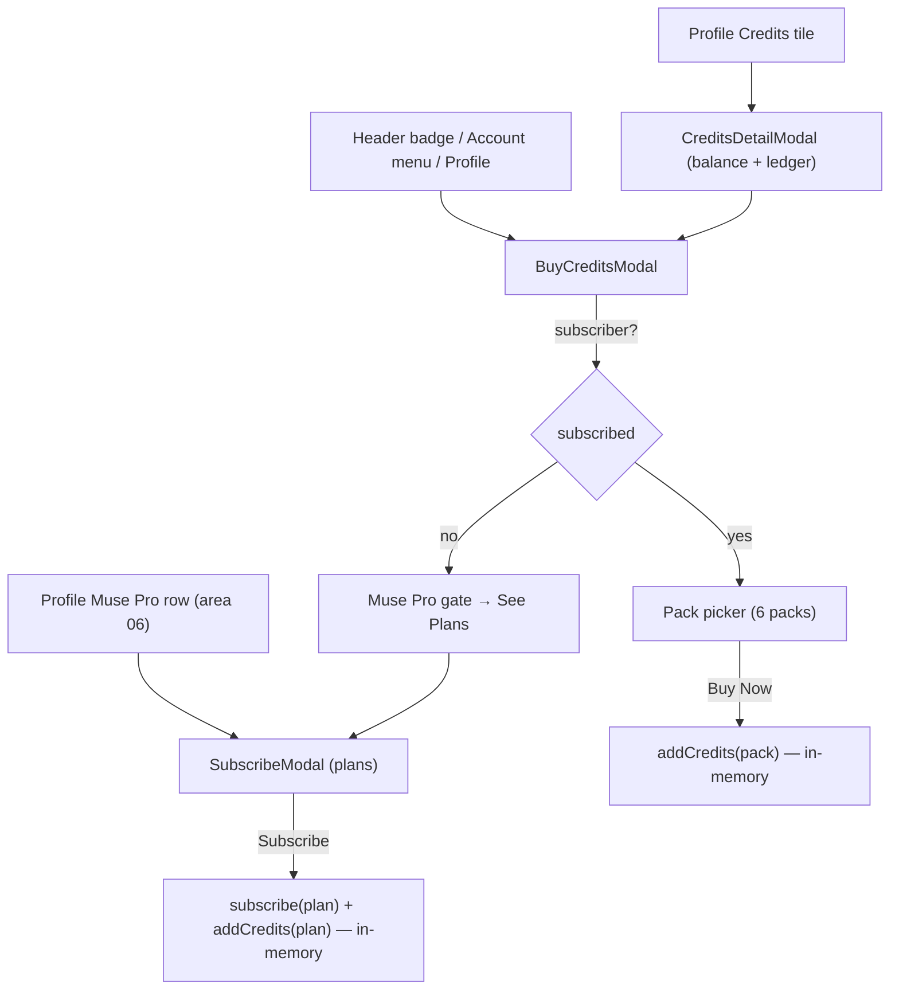

# Area 07 — Credits & IAP

> Read `../00-overview.md` first (conventions, ID scheme, global credits model §6). **As-built**;
> ⚠️ = divergence from App v3.0, ❓ = a tracked `TBD-*`, 🔒 = mock/in-memory.
>
> ⚠️ **Backend note (G3):** there is **no real payment** — every purchase/subscribe just mutates the
> in-memory balance/flag. Real IAP (App Store / Play Store), persistence, credit reset/expiry, and
> restore-purchases are backend/store concerns this spec does **not** define (`TBD-CR-*`).

---

## 1. Overview & scope

Credit balance + the three monetization modals. `CreditsProvider` holds an in-memory balance;
`SubscribeModal` (Muse Pro plans), `BuyCreditsModal` (credit packs), and `CreditsDetailModal` (balance
+ ledger) are opened from the shell, account menu, and profile. Disclaimer copy differs per modal:
only **`SubscribeModal`** says "Demo only — no real payment. Subscription credits expire each cycle.";
`BuyCreditsModal` says purchased credits are **valid for 2 years** (non-refundable / prices-vary);
`CreditsDetailModal` has none.

**In scope:** `providers/CreditsProvider`, `credits/SubscribeModal`, `credits/BuyCreditsModal`,
`credits/CreditsDetailModal`; the plan/pack/ledger data in `lib/user.ts`.
**Out of scope (cross-referenced):** entry points — header credits badge + account menu Buy Credits
(area 01), profile Credits tile / Muse Pro row (area 06); how generation *spends* credits (area 02
MV flow + Edit MV, area 03 song; charging is now real — `GL-01`, see §6 overview).

**As-built (pricing finalized 2026-07-24 from the YouCam Muse Business Model, 2026-07-13):**
prices, credit grants, and SKUs are the **as-approved** values (backend "Credit form" / "Subscription
form" tables — annotated *price/SKU 須跟後台一樣*). `SUBSCRIPTION_PLANS`, `CREDIT_PACKS`,
`MUSE_PRO_FEATURES` in `lib/user.ts` now carry these numbers + store SKUs.

- **Credits are subscriber-only** (Business Model "Credit Plans → Proposal 1, Final Decision").
  **Free users never see a Buy-Credits affordance** — every entry point shows **Subscribe** instead
  (header pill, account-menu button, Credits-detail CTA "Get Muse Pro"), and `BuyCreditsModal` renders
  `SubscribeModal` for a non-subscriber (also the safety net for the in-flow insufficient-balance path).
  Only subscribers see **Buy Credits** (CR-06). ⚠️ The in-memory starting balance is still `390` so the
  demo is playable without subscribing (`TBD-CR-06`).
- **Discount presentation (sample, `TBD-CR-07`):** `BuyCreditsModal` demonstrates the Business Model
  sale UI — a "Limited-time · N% OFF" banner, a struck-through list price + a red "N% OFF" badge per
  pack (a card may carry its tier badge and the discount badge together), and the sale price on the Buy
  CTA. Driven by `CREDIT_SALE_PCT` (demo = 20); the badge % rounds **up to the nearest 5** per the
  Business Model rule (`displayDiscountPct`). Sample only — real promotion values/rules are RD-owned.
- **Subscription plans** = **Weekly $19.99 / 200 cr**, **Weekly Pro $29.99 / 1,000 cr** (default),
  **Yearly $59.99 / 2,000 cr**; the header credit count + expiry cadence track the selected plan.
- **Credit packs** = **300 $14.99 · 600 $23.99 · 1,000 $39.99 (POPULAR) · 2,000 $59.99 (BEST VALUE,
  default) · 5,000 $148.99 · 8,000 $239.99**; displayed largest→smallest.
- **Expiry:** purchased credits are valid **2 years**; subscription credits **expire with the period**
  (weekly / yearly) — copy only, no real expiry engine.

**Restore Purchases** and the **"already on Muse Pro"** state exist. Still mock: **no native IAP** —
purchase is instant `addCredits` 🔒 (`TBD-CR-01`); the discount %-off / strike-through display and the
grid/list/popup layout *proposals* from the Business Model are **not** built (`TBD-CR-07`).

---

## 2. Route / component / state / API map (RD)

| Component | Owns UI | Reads/writes state | `MuseApi` |
|---|---|---|---|
| `providers/CreditsProvider` | — (state only) | `useState(DEFAULT_CREDITS=390)`, `addCredits(n)` | **none** |
| `credits/SubscribeModal` | Muse Pro plan picker + Subscribe CTA | `useAuth().subscribe`, `useCredits().addCredits`, `SUBSCRIPTION_PLANS` | — |
| `credits/BuyCreditsModal` | balance + credit-pack picker + Buy CTA | `useCredits().{credits,addCredits}`, `CREDIT_PACKS` | — |
| `credits/CreditsDetailModal` | balance + transaction ledger + Buy CTA | `useCredits().credits`, `CREDIT_TRANSACTIONS` | — |

No route of its own; opened as modals. No backend.

---

## 3. State model & rules

- **Balance** (`CreditsProvider.tsx`): single in-memory `credits` (`DEFAULT_CREDITS = 390`) +
  `addCredits(n)` (adds `n`, may be negative). **GL-01 (2026-07-23):** the MV/song **flow providers**
  now decrement on generation start (`COST_STORYBOARD`/`COST_RENDER`/`COST_SONG`, refunded on failure)
  and Edit-MV still charges its micro-ops (`COST_REGEN`/`COST_COVER`); when the balance can't cover a
  cost the CTA **routes to IAP instead of generating** (`MvRoom`, `SongCompose`, `StoryboardEditor`,
  `MvEditor`, `SongResultView`). `CreditsProvider` also exposes `enhanceCost` / `consumeEnhance` for
  the AI-Enhance charge (SONG-04). Balance still resets to 390 on reload 🔒 (`TBD-GL-04`); real ledger
  is `TBD-CR-04`.
- **`SubscribeModal`** (`SubscribeModal.tsx`): title "Muse Pro"; header **"{credits} {cadence} Credits"**
  that tracks the selected plan (e.g. "1,000 Weekly Credits"); the `MUSE_PRO_FEATURES` list + a
  per-plan **"Credits Expire {cadence}"** line. Three `SUBSCRIPTION_PLANS` cards — **Weekly** $19.99 /
  200 cr **MOST POPULAR** · **Weekly Pro** $29.99 / 1,000 cr **BEST VALUE** · **Yearly** $59.99 /
  2,000 cr; each card shows "{credits} credits · expire {cadence}". Default selected **weekly_pro**
  (`DEFAULT_PLAN_ID`). **Subscribe** → `subscribe(plan)` + `addCredits(plan.credits)` + `onSubscribed`
  toast + close. **Restore Purchases** action ("No previous purchases found"); when already subscribed
  the modal shows the **"You're already on Muse Pro"** state (with the subscribed plan's credit count)
  instead of the picker (CR-05). Disclaimer: "Demo only — no real payment. Subscription credits expire
  each cycle. Cancel anytime."
- **`BuyCreditsModal`** (`BuyCreditsModal.tsx`): **subscriber-gated (CR-06)** — for a non-subscriber it
  renders `SubscribeModal` directly (no Buy-Credits UI is ever shown to a free user); for a subscriber
  it shows the balance + six `CREDIT_PACKS` (**8,000** $239.99 · **5,000** $148.99 · **2,000** $59.99
  **BEST VALUE** · **1,000** $39.99 **POPULAR** · **600** $23.99 · **300** $14.99), default selected
  **2,000** (`DEFAULT_CREDIT_PACK_ID`, BEST VALUE), and the `TBD-CR-07` discount sample when
  `CREDIT_SALE_PCT > 0` (struck list price + "N% OFF" badge + sale price on the CTA). **Buy Now** →
  `addCredits(pack.credits)` + `onPurchased` toast + close. Copy (CR-03): "Purchased credits are valid
  for 2 years. Non-refundable. Prices may vary by region." + "Subscriber-only · No commitment".
- **`CreditsDetailModal`** (`CreditsDetailModal.tsx`): balance card + **Buy Credits** CTA + a
  **Transaction History** list rendered from the static 7-entry `CREDIT_TRANSACTIONS` seed
  (`lib/user.ts`) — 🔒 **not live**; it does not reflect `addCredits` calls.
- 🔒 All credit state and the ledger are in-memory/static; nothing persists across reload; no store integration.

---

## 4. Journeys

Screens to capture later: SubscribeModal, BuyCreditsModal, CreditsDetailModal.

### CR-P1 — Buy credits (subscriber-only)
- **CR-P1-S0** (non-subscriber) Open `BuyCreditsModal` → "Credit packs are a Muse Pro perk" gate → **See Muse Pro Plans** swaps in `SubscribeModal` (CR-06).
- **CR-P1-S1** (subscriber) Open `BuyCreditsModal` (header badge / account menu / profile). **System:** shows balance + 6 packs (2,000 BEST VALUE preselected).
- **CR-P1-S2** Pick a pack → **Buy Now** → `addCredits(pack.credits)`, toast "Added N credits", close. Balance updates in the shell (in-memory).

### CR-P2 — Subscribe (Muse Pro)
- **CR-P2-S1** Open `SubscribeModal` (profile Muse Pro row). **System:** 3 plans (**Weekly Pro** preselected); header shows the selected plan's credit count + expiry cadence.
- **CR-P2-S2** Pick a plan → **Subscribe** → `subscribe(plan)` (account → subscriber) + `addCredits(plan.credits)` + toast, close. Avatar gains the gold ring / PRO badge (areas 01/06).

### CR-P3 — Credits detail
- **CR-P3-S1** Open `CreditsDetailModal` (profile Credits tile / Muse Pro Manage). **System:** balance + static ledger + **Buy Credits** → `BuyCreditsModal`.

---

## 5. Error & edge states

| ID | Trigger | Behaviour |
|---|---|---|
| **CR-E1** | Reload after buy/subscribe | Balance resets to 390; subscription cleared (in-memory; → `TBD-GL-04`). |
| **CR-E2** | Ledger vs balance mismatch | The ledger is a fixed seed; it never matches actual `addCredits` history 🔒 (→ `TBD-CR-04`). |
| **CR-E3** | Already subscribed | `SubscribeModal` shows the **"You're already on Muse Pro"** state (no plan picker / re-subscribe) — CR-05 landed 2026-07-23. |
| **CR-E4** | Insufficient balance for a generation | The CTA opens `BuyCreditsModal` (IAP) instead of starting the job (GL-01). For a **non-subscriber** that modal renders `SubscribeModal` (CR-06). |
| **CR-E5** | Free user anywhere credits could be bought (header, account menu, profile Credits detail, low-balance) | No Buy-Credits UI is shown — the entry is **Subscribe** and `BuyCreditsModal` renders `SubscribeModal` (CR-06). |

---

## 6. Acceptance criteria (EARS)

- **AC-CR-01** — WHEN a credit pack is purchased, THE SYSTEM SHALL add the pack's credits to the balance, toast, and close — with no real payment step.
- **AC-CR-02** — WHEN a plan is subscribed, THE SYSTEM SHALL set the account to subscriber, add the plan's credits, and reflect PRO status in the shell/profile.
- **AC-CR-03** — WHEN `CreditsDetailModal` opens, THE SYSTEM SHALL show the current balance, the static transaction ledger, and a Buy Credits CTA.
- **AC-CR-04** — THE SYSTEM SHALL show `SubscribeModal`'s "Demo only — no real payment. Subscription credits expire each cycle. Cancel anytime." disclaimer; `BuyCreditsModal`'s "Purchased credits are valid for 2 years. Non-refundable. Prices may vary by region." + "Subscriber-only · No commitment"; and no disclaimer on `CreditsDetailModal`. *(as-built per-modal copy)*
- **AC-CR-05** — THE SYSTEM SHALL render the three modals at 390/768/1024/1440px with no overflow. *(visual)*
- **AC-CR-06** — WHILE already subscribed, WHEN `SubscribeModal` opens, THE SYSTEM SHALL show the "You're already on Muse Pro" state (no plan picker) and expose a Restore Purchases action.
- **AC-CR-07** — WHEN a generation is started with `credits < cost`, THE SYSTEM SHALL open the buy-credits IAP instead of generating (GL-01).
- **AC-CR-08** — WHILE NOT subscribed, THE SYSTEM SHALL never present a Buy-Credits affordance: entry points (header, account menu, Credits-detail CTA) SHALL show **Subscribe**, and `BuyCreditsModal` SHALL render `SubscribeModal` (credits are subscriber-only — Business Model Final Decision).
- **AC-CR-09** — WHEN a Muse Pro plan is selected in `SubscribeModal`, THE SYSTEM SHALL update the header credit count and expiry cadence to that plan (200 Weekly / 1,000 Weekly / 2,000 Yearly); default selection SHALL be **Weekly Pro**.
- **AC-CR-10** — WHILE `CREDIT_SALE_PCT > 0`, THE SYSTEM SHALL render the discount sample in `BuyCreditsModal`: a struck-through list price, a "N% OFF" badge per pack (rounded up to the nearest 5), and the sale price on the Buy CTA. *(sample of the Business Model discount presentation — `TBD-CR-07`)*

> Charging is now real within the in-memory economy (GL-01); persistence, a live ledger, real IAP, and real reset/expiry remain backend-deferred (§8).

---

## 7. Per-path QA checklist

- [ ] **CR-P1**: non-subscriber sees **Subscribe** everywhere, never Buy Credits (AC-08); subscriber sees 6 packs with **2,000 BEST VALUE** preselected + the discount sample (struck price + N% OFF, AC-10); Buy adds pack credits + toast; balance updates (AC-01).
- [ ] **CR-P2**: **Weekly Pro** preselected; header credit count/cadence follows the selected plan (AC-09); Subscribe → subscriber + credits + PRO badge (AC-02).
- [ ] **CR-P3**: detail shows balance + 7-entry ledger + Buy Credits → BuyCreditsModal (AC-03).
- [ ] **CR-E1**: reload resets balance/subscription. **CR-E2**: ledger static. **CR-E3**: already-Pro state shown. **CR-E5**: non-subscriber Buy Credits → Muse Pro gate.
- [ ] **AC-04/05**: SubscribeModal shows the demo disclaimer, BuyCredits the expiry/refund copy, CreditsDetail none; modals clean at 4 widths *(visual)*.

---

## 8. Open items for RD

| ID | Open item |
|---|---|
| **TBD-CR-01** | 🔧 **Backend (RD)** — real IAP (App Store / Play Store) for packs and subscription. None today (instant `addCredits`). |
| **TBD-CR-04** | 🔧 **Backend (RD)** — live credit ledger. `CreditsDetailModal` shows a static seed, not real transactions. |
| **TBD-CR-06a** | ⏳ **Free-user starting balance** — credits are subscriber-only (gating resolved), but the real free-tier credit grant is still open. The web demo keeps `DEFAULT_CREDITS = 390` so it stays playable pre-subscription — is the real value 0? a small trial pack? Proposal 2's 45-credit entry pack? |
| **TBD-CR-07** | ⏳ **IAP presentation** — `BuyCreditsModal` demonstrates the discount UI (struck price + "N% OFF" badge, `CREDIT_SALE_PCT`) as a **sample only**. Still open: the real promotion values, the "% off vs 300 credits" value framing, the "View all plans" expand, and the final grid/list/popup layout choice. |

See also global: `TBD-GL-01` (credit charging/spending), `TBD-GL-04` (persistence).

---

## 9. Flow diagram

---

**Decisions (as-built):** credits are in-memory + display-mostly; modals are demo-only (no store);
ledger is a static seed; pricing, credit grants, and SKUs match the approved Business Model
(2026-07-13); credits are subscriber-only (free users see only Subscribe, never Buy Credits); the
discount UI is a sample. Free-user starting balance, the discount values, and the final IAP layout
remain open (`TBD-CR-06a/07`).
