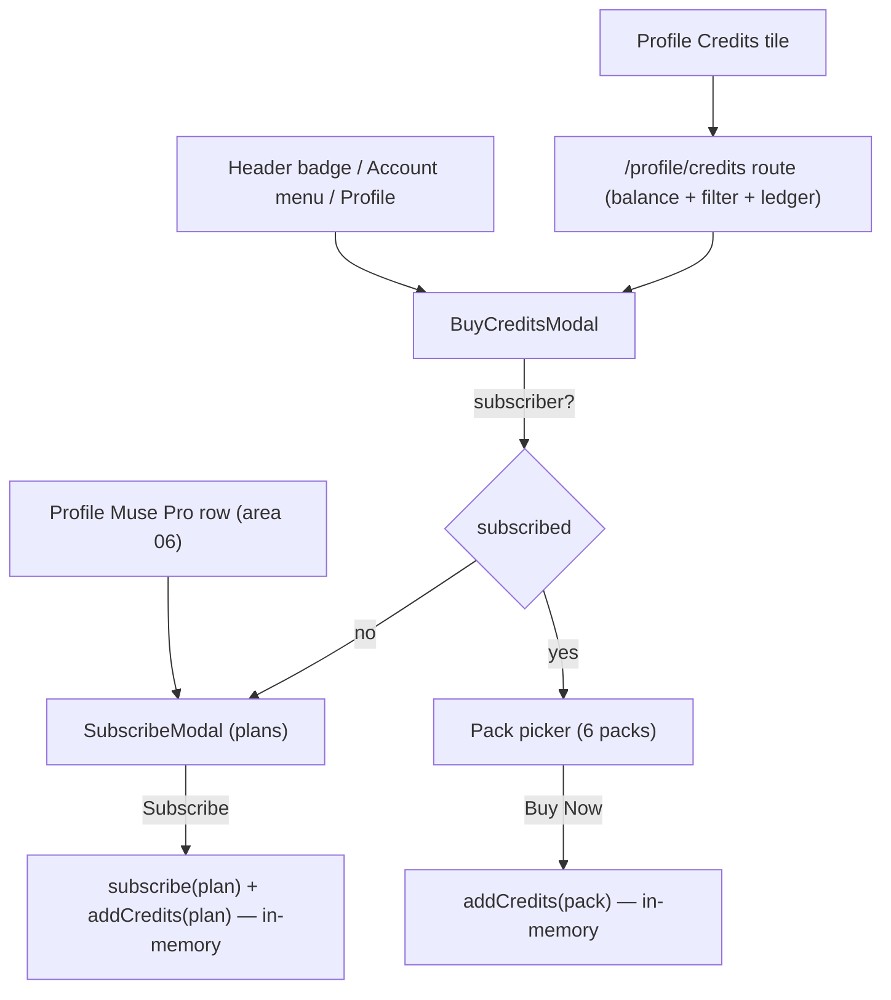

# Area 07 — Credits & IAP

> Read `../00-overview.md` first (conventions, ID scheme, global credits model §6). **As-built**;
> ⚠️ = divergence from App v3.0, ❓ = a tracked `TBD-*`, 🔒 = mock/in-memory.
>
> ⚠️ **Backend note (G3):** there is **no real payment** — every purchase/subscribe just mutates the
> in-memory balance/flag. Real IAP (App Store / Play Store), persistence, credit reset/expiry, and
> restore-purchases are backend/store concerns this spec does **not** define (`TBD-CR-*`).

---

## 1. Overview & scope

Credit balance + two monetization modals and one route. `CreditsProvider` holds an in-memory
balance; `SubscribeModal` (Muse Pro plans) and `BuyCreditsModal` (credit packs) are opened as modals
from the shell, account menu, profile and the in-flow insufficient-balance paths, while the balance
ledger screen is the **`/profile/credits` route** (`CreditsView`). Footer/disclaimer copy differs
per surface: **`SubscribeModal`** shows **Terms of Use** / **Privacy Policy** links (§3);
`BuyCreditsModal` says purchased credits are **valid for 2 years** (non-refundable / prices-vary);
the Credits Detail screen has none.

> _(Corrected 2026-09-01: `SubscribeModal` used to say "Demo only — no real payment. Subscription
> credits expire each cycle." here. That disclaimer, and the Restore Purchases row beside it, are
> gone — see §3, `AC-CR-04`, and `TBD-CR-08` (closed).)_

> **Corrected 2026-08-12 — Credits Detail is a ROUTE, not a modal.** It moved on 2026-08-11
> (`d329719`, designer request): `CreditsDetailModal.tsx` was **deleted** and replaced by
> `credits/CreditsView.tsx` at `/profile/credits`, gated by `AuthGuard`. That commit declared the
> C7 change correctly (route-map snapshot + `CHANGELOG-RD.md`, per G4-c/G4-g) but did not update
> `specs/areas/*`, so this file described a component that no longer existed for a day.
> Subscribe and Buy Credits deliberately gained **no** route — DP has none for either, and keeping
> them modal means a mid-creation top-up never navigates out of an in-memory flow.

**In scope:** `providers/CreditsProvider`, `credits/SubscribeModal`, `credits/BuyCreditsModal`,
`credits/CreditsView` + the `/profile/credits` route; the plan/pack/ledger data in `lib/user.ts`.
**Out of scope (cross-referenced):** entry points — header credits badge + account menu Buy Credits
(area 01), profile Credits tile / Muse Pro row (area 06); how generation _spends_ credits (area 02
MV flow + Edit MV, area 03 song; charging is now real — `GL-01`, see §6 overview).

**As-built (pricing finalized 2026-07-24 from the YouCam Muse Business Model, 2026-07-13; pricing
source-of-truth corrected 2026-09-01 — see below):** `SUBSCRIPTION_PLANS`, `CREDIT_PACKS`,
`MUSE_PRO_FEATURES` in `lib/user.ts` carry the current numbers + store SKUs (SKUs remain
Figma's/Business-Model's — the newer deck lists no store identifiers, `TBD-CR-11`).

> **Pricing source of truth, corrected 2026-09-01 (product owner).** For **web** SKUs, "YouCam Muse
> (Web) — SKUs and Pricing: Final" (Data & Monetization, dated 2026/09/08, slide headed "YCM FINAL
> Pricing (confirmed)") now **supersedes the 2026-07-13 Business Model**. **Web and app are priced
> separately and must NOT be reconciled with each other** — the deck's own comparison table lists a
> different, higher app price for every one of the six credit packs. The deck also independently
> confirms three rules this build already had: **no free trial** (every subscription `sku` carries
> `no_trial`), **subscription credits expire on each plan renewal**, and **credit packs are
> subscriber-only** (deck: "free user can buy? ✗" — existing rule CR-06, below). It further confirms
> the **10-credit sign-up gift** matches `DEFAULT_CREDITS`. The deck's `net rev` and `*40%`/`*45% off`
> columns are internal monetization figures (net rev is uniformly 90% of list; the %-off is the
> discount ceiling Monetization may offer, +5% at 20k credits and above) — neither is a user-facing
> price, and `CREDIT_SALE_PCT` below remains an unrelated sample of the discount UI (`TBD-CR-07`).

- **Credits are subscriber-only** (Business Model "Credit Plans → Proposal 1, Final Decision").
  **Free users never see a Buy-Credits affordance** — every entry point shows **Subscribe** instead
  (header pill, account-menu button, Credits-detail CTA "Get Muse Pro"), and `BuyCreditsModal` renders
  `SubscribeModal` for a non-subscriber (also the safety net for the in-flow insufficient-balance path).
  Only subscribers see **Buy Credits** (CR-06).
  > **Starting balance is now `DEFAULT_CREDITS = 10`** (was 390; product decision 2026-08-12,
  > `TBD-CR-06a`). **10 does not cover any MV** — the cheapest MV is **105** — so a free account
  > generates one vocal song (6) and then meets the paywall. That is the intended funnel, and it
  > **reverses** this line's old claim that the demo stays playable without subscribing. Because
  > `AGENTS.md` also calls this a CEO-demoable prototype, `startingCredits()` in `lib/user.ts`
  > reads **`NEXT_PUBLIC_DEMO_CREDITS`** and falls back to the rule — set it to 1000 for a demo
  > build. e2e funds itself through the real subscribe flow (`fundAccount`) rather than the env var.
  > ✅ **Re-affirmed and re-implemented 2026-08-12.** A designer drop removed this gate on
  > 2026-08-11; CR-06 comes from the Business Model, not the comp, so the product owner reinstated
  > it and the code was reverted the same day. "As-built" holds again. Guarded by
  > `e2e`'s "3f / CR-06: a free account cannot reach Buy Credits". History in TBD-CR-10.
  >
  > ⚠️ **"cheapest MV" corrected 2026-09-03 — it said 220.** That figure was `COST_STORYBOARD` 20 +
  > `COST_RENDER` 200, two constants deleted on **2026-08-19** when `areas/11`'s per-second pricing
  > landed. Since then there is no single MV price to quote: `createMvCost()` is `45 + rate × seconds`
  > and the rate varies by MV type and resolution, so the floor is the cheapest COMBINATION — a
  > 30-second song (the trim floor, `AC-MV-16`) as a **storytelling** MV at **Standard**/720p:
  > `45 + 2×30` = **105**. For comparison, storyboard-first is **107** (`scriptCost(30)` 12 +
  > `generateMvCost` 95) and the DEFAULT compose (singing/Standard) at 30s is **195**. The same
  > stale 220 was carried in `lib/user.ts`'s `DEFAULT_CREDITS` comment and `OPEN-QUESTIONS.md`;
  > all three are corrected, and the numbers are now pinned by
  > `src/lib/api/contract.surface.test.ts` ("the CHEAPEST reachable MV is 105") so the next
  > pricing change fails a test instead of leaving three documents behind.
- **Discount presentation — UI elements only, `TBD-CR-07`.** `BuyCreditsModal` renders, per pack, a
  struck-through list price and a red "N% OFF" badge (a card may carry its tier badge — POPULAR /
  BEST VALUE — and the discount badge together), plus the discounted price shown on the Buy CTA.
  That is the full set of elements built. The discount percentage, its rounding rule, and whether a
  sale is on at all are backend/marketing-owned and may change at any time — this spec does not
  name them.
  > _(Corrected 2026-09-01, product owner: "spec 只要列出 UI 就好,實際折扣等不用寫在 spec 內(隨時
  > 會改)" — describe the elements, never the numbers. This bullet previously named the sample
  > constant and its rounding rule as if they were the spec, and also described a "Limited-time ·
  > N% OFF" banner. **No such banner exists** — `BuyCreditsModal.tsx` and `CreditsDialog.css` have
  > no banner element at all, only the per-pack tag and CTA price described above; the banner has
  > been removed from this bullet rather than carried forward as a claim the code does not support.)_
- **Subscription plans** — since 2026-08-28 a **Weekly / Monthly / Yearly duration Tab Bar**
  (`DEFAULT_DURATION = "Weekly"`), each duration offering exactly two tiers, **Basic** and **Pro** —
  **six plans total**, all matching the 2026-09-01 deck exactly (see the blockquote above):

  | Plan        | Price  | Credits | Period |
  | ----------- | ------ | ------- | ------ |
  | Weekly      | $9.99  | 200     | /week  |
  | Weekly Pro  | $29.99 | 1,000   | /week  |
  | Monthly     | $34.99 | 1,000   | /month |
  | Monthly Pro | $49.99 | 2,000   | /month |
  | Yearly      | $59.99 | 2,000   | /year  |
  | Yearly Pro  | $89.99 | 4,000   | /year  |

  `DEFAULT_PLAN_ID = "weekly_pro"` is the Business Model's stated default; it stays exported but,
  as before 3f, does not drive `SubscribeModal` directly (§3). The header credit count + expiry
  cadence track whichever plan was actually subscribed to.

- **Credit packs** = **300 $14.89 · 600 $29.59 · 1,000 $39.59 (POPULAR) · 2,000 $65.49 (BEST VALUE,
  default) · 5,000 $140.49 · 8,000 $224.49**; displayed largest→smallest. **Five of the six prices
  changed 2026-09-01** (only 8,000 is unchanged — it was itself corrected from $239.99 on
  2026-07-24, before this deck existed); `lib/user.ts`'s own comment on `CREDIT_PACKS` carries the
  full was/now table.
- **Expiry:** purchased credits are valid **2 years** (independently confirmed by the 2026-09-01
  deck: "Expiration — 2 years"); subscription credits **expire on each plan renewal** — copy only,
  no real expiry engine.

The **"already on Muse Pro"** state exists (CR-05). ⚠️ **Restore Purchases was removed 2026-09-01**
(product owner) — `SubscribeModal`'s footer used to read "Restore Purchases | Demo only — no real
payment" and now shows real **Terms of Use** / **Privacy Policy** links instead (§3; closes
`TBD-CR-08`, §8). Still mock: **no native IAP** — purchase is instant `addCredits` 🔒 (`TBD-CR-01`);
the discount UI above is built as a **sample** (a fixed placeholder percentage, not a backend-driven
value), and the Business Model's grid/list/popup layout _proposals_ beyond what is built are **not**
adopted (`TBD-CR-07`).

> _(Corrected 2026-09-01: this line used to say the discount %-off / strike-through display itself
> was "not built", which contradicted the bullet above it — the elements ARE built and on screen
> today; what is not built is the real, backend-owned percentage and layout choice.)_

**Amended 2026-08-06 by the designer-UI migration (slice 3f).** All three dialogs are now DP's
markup on the shared `ui/DpDialog` shell (they **unmount when closed**, unlike the 3b overlays that
stay mounted with `inert`). Two things about that port matter to RD:

- ⚠️ **`SubscribeModal` is no longer a single radio picker.** DP's `UpgradeDialog` renders
  self-contained cards, each with its own Subscribe button — a deliberate interaction redesign,
  ported as designed. On **desktop (≥1024px)** there is still no shared selection: each of the
  current duration's two cards subscribes itself directly, and **`DEFAULT_PLAN_ID` still does not
  drive this screen** (it stays exported because it is the Business Model's stated default and
  other code may want it).
  > _(Corrected 2026-09-01: **below 1024px** a selection concept came back — Figma's "List_M"
  > redesign, 2026-08-24 — as `selectedTier`, a `"basic" | "pro"` toggle (not a `PlanId`) that a
  > single shared Subscribe button acts on. It defaults to `"pro"` — matching, but not importing,
  > `DEFAULT_PLAN_ID`'s value — and survives a duration change on its own: switching Weekly Pro →
  > Monthly keeps Pro selected, since both tiers exist for every duration. Desktop has no such
  > state; only the mobile/tablet collapsed list does.)_
- **Every number still comes from `lib/user.ts`, not from DP** (S20). DP's own comp shows $9.99 for
  Weekly against WA's then-approved $19.99, and hardcodes a literal "/ week" on every card including
  Yearly — porting its markup verbatim would have shipped a "$59.99 per week" plan. WA models the
  billing period per plan (`SubscriptionPlan.per`), so Yearly reads "/ year". **Layout is DP's,
  pricing is the Business Model's; keep it that way on the next designer drop.** ($9.99 has since
  been confirmed the correct price — `TBD-CR-09`, §8 — but DP's hardcoded period and its "never
  expire" copy still stand uncorrected.)

3f also widened `lib/user.ts` (the only `src/lib` file Phase 3 touched): per-plan `description`,
`per`, an icon per `MUSE_PRO_FEATURES` entry, and `YEARLY_EXTRA_FEATURES` — DP gives the yearly card
one benefit the weekly cards do not have.

> _(Corrected 2026-09-01: this line used to also credit 3f with separate `cta` and `featured`
> fields. Neither exists on `SubscriptionPlan` today — `PlanCard`'s gradient CTA and featured
> border are both derived directly from `tier === "pro"`, per the interface's own comment.)_

---

## 2. Route / component / state / API map (RD)

| Component                   | Owns UI                                            | Reads/writes state                                                                                   | `MuseApi` |
| --------------------------- | -------------------------------------------------- | ---------------------------------------------------------------------------------------------------- | --------- |
| `providers/CreditsProvider` | — (state only)                                     | `useState(startingCredits())` — `DEFAULT_CREDITS=10`, or `NEXT_PUBLIC_DEMO_CREDITS`; `addCredits(n)` | **none**  |
| `credits/SubscribeModal`    | Muse Pro plan picker + Subscribe CTA               | `useAuth().subscribe`, `useCredits().addCredits`, `SUBSCRIPTION_PLANS`                               | —         |
| `credits/BuyCreditsModal`   | balance + credit-pack picker + Buy CTA             | `useCredits().{credits,addCredits}`, `CREDIT_PACKS`                                                  | —         |
| `credits/CreditsView`       | balance + All/Spend/Earn filter + ledger + Buy CTA | `useCredits().credits`, `CREDIT_TRANSACTIONS`                                                        | —         |

| Route              | Component             | Guard                                         |
| ------------------ | --------------------- | --------------------------------------------- |
| `/profile/credits` | `credits/CreditsView` | `AuthGuard` (same as `/profile`, `/settings`) |

Subscribe and Buy Credits have no route of their own — they stay modals, opened from the shell,
account menu, profile, the in-flow insufficient-balance paths, and from `/profile/credits` itself.
No backend.

`CreditsView` renders DP's Credits Detail (Figma 636:11875) using `styles/designer/CreditsPage.css`
verbatim, with `shell/DetailNavbar` for the back+title bar and `RoomNavbar`'s shared `Tabs` for the
filter. The **All / Spend / Earn** filter and the per-row type icon are DP additions WA did not have
before the migration; the filter derives from the sign of `amount`.

---

## 3. State model & rules

- **Balance** (`CreditsProvider.tsx`): single in-memory `credits` (`startingCredits()` — `DEFAULT_CREDITS = 10`, demo override `NEXT_PUBLIC_DEMO_CREDITS`) +
  `addCredits(n)` (adds `n`, may be negative). **GL-01 (2026-07-23):** the MV/song **flow providers**
  now decrement on generation start (`COST_STORYBOARD`/`COST_RENDER`/`COST_SONG`, refunded on failure)
  and Edit-MV still charges its micro-ops (`COST_REGEN`/`COST_COVER`); when the balance can't cover a
  cost the CTA **routes to IAP instead of generating** (`MvRoom`, `SongCompose`, `StoryboardEditor`,
  `MvEditor`, `SongResultView`). `CreditsProvider` also exposes `enhanceCost` / `consumeEnhance` for
  the AI-Enhance charge (SONG-04). Balance still resets to **10** on reload 🔒 (`TBD-GL-04`); real ledger
  is `TBD-CR-04`.
- **`SubscribeModal`** (`SubscribeModal.tsx`, DP's `UpgradeDialog` since 3f; duration Tab Bar added
  2026-08-28): title **"Upgrade Your Plan"**, with a **Weekly / Monthly / Yearly** duration Tab Bar
  (`DurationTabs`, defaulting to **Weekly** — `DEFAULT_DURATION`) above the plan cards. Each duration
  shows exactly the **two** `SUBSCRIPTION_PLANS` rows for that `cadence` — Basic and Pro — six plans
  in total (prices/credits/periods in §1). **Desktop (≥1024px)** renders both of the duration's cards
  side by side, **each with its own Subscribe button and no shared selection**; Pro is always
  `--featured`. **Below 1024px** (Figma "List_M", 2026-08-24) the pair collapses into one
  credits/features summary panel for `selectedTier` (a `"basic" | "pro"` toggle, default `"pro"`)
  above a two-row tappable list, with a single shared Subscribe button acting on the selection;
  `selectedTier` persists across a duration switch. Each card/row carries a one-line `description`,
  a "{credits} {cadence} Credits" row, the `MUSE_PRO_FEATURES` list (+ `YEARLY_EXTRA_FEATURES` on a
  Yearly card), and a **"Credits Expire {cadence}"** line derived from `cadence`, not hardcoded per
  card. **Subscribe** → `subscribe(plan.id)` + `addCredits(plan.credits)` + `onSubscribed` toast +
  close. Footer (rewritten 2026-09-01, product owner): **Terms of Use** / **Privacy Policy** links to
  the real `TERMS_URL`/`PRIVACY_URL` (`lib/legal.ts`) — this **replaces** the previous **Restore
  Purchases** ("No previous purchases found on this account.") + **"Demo only — no real payment"**
  disclaimer row; Restore Purchases no longer exists anywhere in this dialog (closes `TBD-CR-08`,
  §8). When already subscribed the dialog shows the **"You're already on Muse Pro"** card (label/
  title "Muse Pro") with the subscribed plan's credit count and a **Done** button instead of the
  cards (CR-05) — DP has no such state, and without it a subscriber could buy a second subscription.
  > **`apiError` demo flag (`?demo=1` panel), added 2026-09-01.** Checked once when the dialog opens
  > (not kept live while it stays open, the way a real fetch would only run once). When set,
  > `SubscribeModal` renders `ApiErrorState` — icon, **"Something Went Wrong"**, **"We couldn't load
  > this right now. Please check your connection and try again."**, and a **Retry** button — in
  > place of the duration tabs / plan cards / already-Pro card, whichever branch would otherwise show.
  > Retry re-checks the flag rather than clearing it, matching how a real retry would re-fetch.
- **`BuyCreditsModal`** (`BuyCreditsModal.tsx`): **subscriber-gated (CR-06)** — for a non-subscriber it
  renders `SubscribeModal` directly (no Buy-Credits UI is ever shown to a free user, and a non-
  subscriber with the `apiError` flag on therefore sees `SubscribeModal`'s error state, not this
  dialog's own); for a subscriber it shows the balance + six `CREDIT_PACKS` at the **2026-09-01 Web
  Final prices** (**8,000** $224.49 · **5,000** $140.49 · **2,000** $65.49 **BEST VALUE** · **1,000**
  $39.59 **POPULAR** · **600** $29.59 · **300** $14.89 — five of six changed that day, §1), default
  selected **2,000** (`DEFAULT_CREDIT_PACK_ID`, BEST VALUE), and, when the `TBD-CR-07` discount
  sample is switched on, a struck-through list price + "N% OFF" badge per pack + the sale price on
  the CTA. **Buy Now** → `addCredits(pack.credits)` + `onPurchased` toast + close. Copy (CR-03):
  **"Purchased credits are valid for 2 years. Non-refundable and lost upon account deletion. Prices
  may vary by region."** — DP's own copy says purchased credits "never expire", which contradicts
  the Business Model, so WA's wording wins for the same reason its prices do.
  > **`apiError` demo flag, added 2026-09-01.** Same mechanism and same `ApiErrorState` copy as
  > `SubscribeModal` above (they share the component) — shown in place of the balance + pack grid for
  > a subscriber. The gate check (CR-06, above) runs first, so this branch is only reachable for a
  > subscriber; a free user with the flag on never sees it.
- **`CreditsView`** (`CreditsView.tsx`, route `/profile/credits`): back+title bar, balance card, an
  **All / Spend / Earn** filter, and the ledger rendered from the static 7-entry
  `CREDIT_TRANSACTIONS` seed (`lib/user.ts`) — 🔒 **not live**; it does not reflect `addCredits`
  calls. Its CTA is now an **unconditional "Buy More"** opening `BuyCreditsModal`.
  > ✅ **Restored 2026-08-12.** The CTA is CR-06-branched again: **"Buy More"** for a subscriber,
  > **"Get Muse Pro"** for a free user, both opening `BuyCreditsModal` (which itself renders
  > `SubscribeModal` for a non-subscriber, so label and destination cannot drift apart).
  > **`creditsEmpty` demo flag, added 2026-09-01.** Applied AFTER the tab filter, not by emptying
  > `CREDIT_TRANSACTIONS` at the source — so the flag reproduces an empty ledger under **all three**
  > tabs alike, the same way a real account with no history in any category would look. Shows one
  > empty state — icon + **"No activity yet"** / **"Start creating AI Music Videos or songs to see
  > your credit history here."** — with no CTA of its own (the balance card's Buy More / Get Muse Pro
  > button above already covers "go buy/subscribe"); the copy does not name which tab is empty.
- 🔒 All credit state and the ledger are in-memory/static; nothing persists across reload; no store integration.

---

## 4. Journeys

Screens to capture later: SubscribeModal, BuyCreditsModal, `/profile/credits`.

### CR-P1 — Buy credits (subscriber-only)

- **CR-P1-S0** (non-subscriber) Open `BuyCreditsModal` → it **renders `SubscribeModal` directly**, with no intermediate "Credit packs are a Muse Pro perk" gate screen and no "See Muse Pro Plans" step (CR-06). ⚠️ The gate screen this step used to describe no longer exists.
- **CR-P1-S1** (subscriber) Open `BuyCreditsModal` (header badge / account menu / profile). **System:** shows balance + 6 packs at the 2026-09-01 Web Final prices (2,000 BEST VALUE preselected, §1).
- **CR-P1-S2** Pick a pack → **Buy Now** → `addCredits(pack.credits)`, toast "Added N credits", close. Balance updates in the shell (in-memory).

### CR-P2 — Subscribe (Muse Pro)

- **CR-P2-S1** Open `SubscribeModal` (profile Muse Pro row). **System:** the "Upgrade Your Plan" dialog: a **Weekly / Monthly / Yearly** duration Tab Bar (default **Weekly**) above that duration's two cards, **Basic** and **Pro** `--featured`. **Desktop (≥1024px)** shows both, each with its own Subscribe button and **no preselection** — every card carries its own credit count, expiry line and Subscribe button (3f). **Below 1024px** the pair collapses into one summary panel for `selectedTier` (default **Pro**) above a two-row tappable list with one shared Subscribe button.
- **CR-P2-S1a** Switch duration tabs → the two cards/rows shown change to that duration's own Basic/Pro pair; `selectedTier` (mobile/tablet only) persists across the switch, so a user who had Pro selected under Weekly still sees Pro highlighted under Monthly.
- **CR-P2-S2** Press a card's (or, below 1024px, the shared) **Subscribe** → `subscribe(plan.id)` (account → subscriber) + `addCredits(plan.credits)` + toast, close. Avatar gains the gold ring / PRO badge (areas 01/06).

### CR-P3 — Credits detail

- **CR-P3-S1** Navigate to `/profile/credits` (profile Credits tile / Muse Pro **Manage** — both `router.push`, no longer a modal). **System:** balance + All/Spend/Earn filter + static ledger + **Buy More** → `BuyCreditsModal`.
- **CR-P3-S2** Pick **Spend** or **Earn** → the ledger filters to negative / positive entries; **All** restores all 7.
- **CR-P3-S3** Back → `/profile`. The route is deep-linkable and survives browser back/forward — the reason it stopped being a modal.

---

## 5. Error & edge states

| ID        | Trigger                                                                                                | Behaviour                                                                                                                                                                                                                                                                                                                                                                                                                                                                                                                                   |
| --------- | ------------------------------------------------------------------------------------------------------ | ------------------------------------------------------------------------------------------------------------------------------------------------------------------------------------------------------------------------------------------------------------------------------------------------------------------------------------------------------------------------------------------------------------------------------------------------------------------------------------------------------------------------------------------- |
| **CR-E1** | Reload after buy/subscribe                                                                             | Balance resets to **`DEFAULT_CREDITS` = 10**; subscription cleared (in-memory; → `TBD-GL-04`). _(Was 390 — corrected 2026-08-19; §1 of this file already carried the 2026-08-12 change.)_                                                                                                                                                                                                                                                                                                                                                   |
| **CR-E2** | Ledger vs balance mismatch                                                                             | The ledger is a fixed seed; it never matches actual `addCredits` history 🔒 (→ `TBD-CR-04`).                                                                                                                                                                                                                                                                                                                                                                                                                                                |
| **CR-E3** | Already subscribed                                                                                     | `SubscribeModal` shows the **"You're already on Muse Pro"** state (no plan picker / re-subscribe) — CR-05 landed 2026-07-23.                                                                                                                                                                                                                                                                                                                                                                                                                |
| **CR-E4** | Insufficient balance for a generation                                                                  | The CTA opens `BuyCreditsModal` (IAP) instead of starting the job (GL-01). For a **non-subscriber** that modal renders `SubscribeModal` (CR-06).                                                                                                                                                                                                                                                                                                                                                                                            |
| **CR-E5** | Free user anywhere credits could be bought (header, account menu, profile Credits detail, low-balance) | No Buy-Credits UI is shown — the entry is **Subscribe** and `BuyCreditsModal` renders `SubscribeModal` (CR-06).                                                                                                                                                                                                                                                                                                                                                                                                                             |
| **CR-E6** | `?demo=1` panel's `apiError` flag, checked once per open of `SubscribeModal` / `BuyCreditsModal`       | Both dialogs render `ApiErrorState` ("Something Went Wrong" / "We couldn't load this right now. Please check your connection and try again." / **Retry**) in place of their normal content — the duration tabs + plan cards, the already-Pro card, or the balance + pack grid, whichever branch would otherwise show. `BuyCreditsModal`'s CR-06 gate still runs first, so a non-subscriber with the flag on sees `SubscribeModal`'s error, never this dialog's own. Retry re-checks the flag rather than clearing it. _(Added 2026-09-01.)_ |
| **CR-E7** | `?demo=1` panel's `creditsEmpty` flag                                                                  | `/profile/credits` shows one empty state ("No activity yet" / "Start creating AI Music Videos or songs to see your credit history here.") for **all three** All/Spend/Earn tabs alike, applied after the tab filter rather than by emptying `CREDIT_TRANSACTIONS`; no CTA inside the list (the balance card's Buy More / Get Muse Pro button already covers it). _(Added 2026-09-01.)_                                                                                                                                                      |

---

## 6. Acceptance criteria (EARS)

- **AC-CR-01** — WHEN a credit pack is purchased, THE SYSTEM SHALL add the pack's credits to the balance, toast, and close — with no real payment step.
- **AC-CR-02** — WHEN a plan is subscribed, THE SYSTEM SHALL set the account to subscriber, add the plan's credits, and reflect PRO status in the shell/profile.
- **AC-CR-03** — WHEN a signed-in user opens `/profile/credits`, THE SYSTEM SHALL show the current balance, the All/Spend/Earn filter, the static transaction ledger, and a purchase CTA. WHEN a guest opens it, `AuthGuard` SHALL require sign-in first. _(rewritten 2026-08-12: was "WHEN `CreditsDetailModal` opens")_
- **AC-CR-04** — THE SYSTEM SHALL show `SubscribeModal`'s footer **Terms of Use** / **Privacy Policy** links; `BuyCreditsModal`'s "Purchased credits are valid for 2 years. Non-refundable and lost upon account deletion. Prices may vary by region."; and no disclaimer on the `/profile/credits` screen. _(as-built per-surface copy — the longer "Subscription credits expire each cycle. Cancel anytime." string was replaced in 3f by the per-plan "Credits Expire {cadence}" line inside each card, and the pack cards carry their own "Subscriber-only · No commitment" framing no longer.)_ _(Corrected 2026-09-01, product owner: `SubscribeModal`'s footer used to be a "Demo only — no real payment" disclaimer + Restore Purchases; both are gone, replaced by the `TERMS_URL`/`PRIVACY_URL` links this AC now states. See also `TBD-CR-08`, closed.)_
- **AC-CR-05** — THE SYSTEM SHALL render the three dialogs at 320/375/768/1024/1440/1920px with no overflow. _(visual — six widths since plan D2, not the old four)_
- **AC-CR-06** — WHILE already subscribed, WHEN `SubscribeModal` opens, THE SYSTEM SHALL show the "You're already on Muse Pro" state (no plan cards) with a **Done** action. ⚠️ **Restore Purchases is NOT reachable from that state** — the subscribed branch returns before the footer. This is **pre-existing, not a migration regression** (`5296f1a` behaved identically); the AC has been wrong since CR-05 landed. Decide whether Restore belongs in the subscribed state (arguably where a user would look for it) → `TBD-CR-08`. _(Corrected 2026-09-01: the ⚠️ above and `TBD-CR-08` are both now moot — the product owner removed Restore Purchases from `SubscribeModal` altogether, so there is no "unreachable" affordance left to reach. `TBD-CR-08` is closed in §8; kept here, unstruck, as the historical record of the question.)_
- **AC-CR-07** — WHEN a generation is started with `credits < cost`, THE SYSTEM SHALL open the buy-credits IAP instead of generating (GL-01).
- **AC-CR-08** — WHILE NOT subscribed, THE SYSTEM SHALL never present a Buy-Credits affordance: entry points (header, account menu, Credits-detail CTA) SHALL show **Subscribe**, and `BuyCreditsModal` SHALL render `SubscribeModal` (credits are subscriber-only — Business Model Final Decision).
- **AC-CR-09** — WHEN a Muse Pro plan is subscribed to in `SubscribeModal`, THE SYSTEM SHALL update the header credit count and expiry cadence to that plan — one of **six**: 200/week (Weekly), 1,000/week (Weekly Pro), 1,000/month (Monthly), 2,000/month (Monthly Pro), 2,000/year (Yearly), or 4,000/year (Yearly Pro). **On desktop (≥1024px) there is no default selection** — each of the current duration's two cards carries its own Subscribe button; **below 1024px** a `selectedTier` toggle (default **Pro**) picks which of that duration's two plans the single shared Subscribe button acts on. _(Corrected 2026-08-19: the "default selection SHALL be Weekly Pro" clause contradicted `CR-P2-S1` in this same file and has not matched the code since slice 3f removed the shared selection state.)_ _(Corrected 2026-09-01: the plan list grew from 3 flat plans to 6 — a Weekly/Monthly/Yearly duration Tab Bar × Basic/Pro tiers, product owner 2026-08-28 — and the mobile/tablet collapsed list (2026-08-24) reintroduced a selection concept, `selectedTier`, that the 2026-08-19 note above did not anticipate. Full model in §1/§3.)_
- **AC-CR-10** — WHILE the discount sample is switched on, THE SYSTEM SHALL render in `BuyCreditsModal`: a struck-through list price, an "N% OFF" badge per pack, and the sale price on the Buy CTA. The discount percentage, its rounding rule, and whether the sample is on at all are backend/marketing-owned and may change at any time — this AC states the elements, not the values. _(Corrected 2026-09-01, product owner: this AC used to cite `CREDIT_SALE_PCT > 0` and "rounded up to the nearest 5" as if they were the spec; UI elements are the spec, the numbers are not — `TBD-CR-07`.)_
- **AC-CR-11** — WHEN the `apiError` demo flag is set, THE SYSTEM SHALL show `ApiErrorState` ("Something Went Wrong" + Retry) in `SubscribeModal` / `BuyCreditsModal` in place of their normal content, checked once per dialog open; Retry SHALL re-check the flag rather than clear it. _(Added 2026-09-01 — `CR-E6`.)_
- **AC-CR-12** — WHEN the `creditsEmpty` demo flag is set, THE SYSTEM SHALL show `/profile/credits`'s empty state for every filter tab (All/Spend/Earn alike), with no purchase CTA inside the list area. _(Added 2026-09-01 — `CR-E7`.)_

> Charging is now real within the in-memory economy (GL-01); persistence, a live ledger, real IAP, and real reset/expiry remain backend-deferred (§8).

---

## 7. Per-path QA checklist

- [ ] **CR-P1**: non-subscriber sees **Subscribe** everywhere, never Buy Credits (AC-08); subscriber sees 6 packs at the **2026-09-01 Web Final prices** (300 $14.89 · 600 $29.59 · 1,000 $39.59 POPULAR · 2,000 $65.49 BEST VALUE, preselected · 5,000 $140.49 · 8,000 $224.49) + the discount sample (struck price + N% OFF, AC-10); Buy adds pack credits + toast; balance updates (AC-01).
- [ ] **CR-P2**: a **Weekly/Monthly/Yearly** duration Tab Bar (default Weekly) above that duration's Basic + Pro cards (six plans total; Pro `--featured`); **no preselection on desktop**, `selectedTier` (default Pro, persists across a duration switch) driving the shared CTA below 1024px; each card's credits/cadence/price come from `SUBSCRIPTION_PLANS` and every non-Weekly plan reads its own period ("/ month", "/ year"), not "/ week" (AC-09); a Subscribe action → subscriber + credits + PRO badge (AC-02).
- [ ] **CR-P3**: detail shows balance + 7-entry ledger + a purchase CTA that reads **Buy More** for a subscriber and **Get Muse Pro** for a free user (AC-03).
- [ ] **CR-E1**: reload resets balance/subscription. **CR-E2**: ledger static. **CR-E3**: already-Pro state shown. **CR-E5**: non-subscriber Buy Credits → `SubscribeModal` directly (no gate screen).
- [ ] **AC-04/05**: SubscribeModal's footer shows **Terms of Use / Privacy Policy** only (no "demo only" disclaimer, no Restore Purchases — removed 2026-09-01), BuyCredits the expiry/refund copy, CreditsDetail none; dialogs clean at **six** widths _(visual)_.
- [ ] **CR-E6** (`?demo=1` → `apiError`): open `SubscribeModal` and `BuyCreditsModal` and confirm each shows `ApiErrorState` + Retry instead of its normal content, including the already-Pro and non-subscriber branches (AC-11).
- [ ] **CR-E7** (`?demo=1` → `creditsEmpty`): `/profile/credits` shows the empty state under All, Spend, AND Earn, with no CTA in the list area (AC-12).

---

## 8. Open items for RD

| ID                 | Open item                                                                                                                                                                                                                                                                                                                                                                                                                                                                                                                                                                                                                                                                                                                                                                                                                                                                                                                                                                                                                                             |
| ------------------ | ----------------------------------------------------------------------------------------------------------------------------------------------------------------------------------------------------------------------------------------------------------------------------------------------------------------------------------------------------------------------------------------------------------------------------------------------------------------------------------------------------------------------------------------------------------------------------------------------------------------------------------------------------------------------------------------------------------------------------------------------------------------------------------------------------------------------------------------------------------------------------------------------------------------------------------------------------------------------------------------------------------------------------------------------------- |
| **TBD-CR-01**      | 🔧 **Backend (RD)** — real IAP (App Store / Play Store) for packs and subscription. None today (instant `addCredits`).                                                                                                                                                                                                                                                                                                                                                                                                                                                                                                                                                                                                                                                                                                                                                                                                                                                                                                                                |
| **TBD-CR-04**      | 🔧 **Backend (RD)** — live credit ledger. `/profile/credits` shows a static seed, not real transactions.                                                                                                                                                                                                                                                                                                                                                                                                                                                                                                                                                                                                                                                                                                                                                                                                                                                                                                                                              |
| ~~**TBD-CR-06a**~~ | ✅ **2026-08-19 結案** — 免費用戶起始額度定為 **10 credits**（產品負責人）。`DEFAULT_CREDITS = 10` 自 2026-08-12 起就是這個值，現在它從暫定值變成拍板值。demo 仍可用 `NEXT_PUBLIC_DEMO_CREDITS` 覆蓋。                                                                                                                                                                                                                                                                                                                                                                                                                                                                                                                                                                                                                                                                                                                                                                                                                                                |
| **TBD-CR-07**      | ⏳ **IAP presentation** — `BuyCreditsModal` demonstrates the discount UI (a struck-through list price + an "N% OFF" badge per pack + the sale price on the Buy CTA) as a **sample only**. Still open: the real promotion values, the "% off vs 300 credits" value framing, the "View all plans" expand, and the final grid/list/popup layout choice. _(Corrected 2026-09-01, product owner: this row — and §1/§3/`AC-CR-10` — now name only the UI elements above; the sample discount percentage, its rounding rule, and whether a sale is on at all are deliberately NOT part of the spec, since they are backend/marketing-owned and may change at any time.)_                                                                                                                                                                                                                                                                                                                                                                                     |
| ~~**TBD-CR-08**~~  | ✅ **CLOSED 2026-09-01 — moot.** Restore Purchases no longer exists anywhere in `SubscribeModal`: the product owner replaced its footer (previously "Restore Purchases \| Demo only — no real payment") with real Terms of Use / Privacy Policy links (§1, §3). There is no longer an "is it reachable while subscribed" question to answer — the affordance was removed outright, not relocated. `AC-CR-06`'s ⚠️ is kept, unstruck, as the historical record.                                                                                                                                                                                                                                                                                                                                                                                                                                                                                                                                                                                        |
| ~~**TBD-CR-10**~~  | ✅ **CLOSED 2026-08-12 — ruled AND fixed.** The spec was correct: a free user may only **Upgrade**; **Buy Credits appears only after subscribing**. The unauthorized 2026-08-11 reversal is reverted — `BuyCreditsModal` gates on `subscribed` again (returning `SubscribeModal` for a free user) and `CreditsView`'s CTA branches to "Get Muse Pro". Nothing in this file needed rewriting, which was the point of leaving it alone while the question was open. The missing free-user comp is still owed by the designer (`DESIGNER-TODO` A21) — adopting it later is a label/style change, not a behaviour change. _(Corrected 2026-09-01, product owner: A21's "missing comp" framing is closed too. Every account is granted `DEFAULT_CREDITS` at sign-up, so a free-user Credits Detail visit is the ordinary case, not an edge case waiting on design — the CR-06-branched "Get Muse Pro" CTA (§3) is as-built behaviour, not a placeholder standing in for an undrawn screen. There is no "free-user gap" left to close with a future comp.)_ |
| **TBD-CR-09**      | 🎨 **Designer (from 3f)** — DP's `UpgradeDialog` disagrees with the approved Business Model in three places: Weekly at **$9.99** (approved: $19.99), a hardcoded **"/ week"** on the Yearly card, and "credits **never expire**" against the approved 2-year validity. WA follows the Business Model (S20). Please correct the comp so the next drop does not re-introduce them. _(Corrected 2026-09-01: on the FIRST point, DP was right and the "approved" $19.99 was wrong — "YCM Web SKUs and Pricing: Final" (2026/09/08) confirms Weekly is **$9.99**, and `lib/user.ts` has carried that value since. The other two complaints stand: DP's hardcoded "/ week" and its "never expire" copy remain uncorrected in the comp, and WA still overrides both.)_                                                                                                                                                                                                                                                                                       |
| **TBD-CR-11**      | 🔧 **Backend (RD)** — "YCM Web SKUs and Pricing: Final" (2026/09/08) lists **prices only, no store SKUs**. Every `sku` in `SUBSCRIPTION_PLANS` / `CREDIT_PACKS` is still app-shaped (e.g. `ycm_ios_8000_credits_sub_discount`, `subscribe_1_week_no_trial_ycm`) from the earlier Figma/Business-Model sourcing — RD has not confirmed real web-store identifiers. _(Added 2026-09-01.)_                                                                                                                                                                                                                                                                                                                                                                                                                                                                                                                                                                                                                                                               |

See also global: `TBD-GL-01` (credit charging/spending), `TBD-GL-04` (persistence).

---

## 9. Flow diagram

```mermaid
flowchart TD
  Badge["Header badge / Account menu / Profile"] --> Buy["BuyCreditsModal"]
  Profile["Profile Muse Pro row (area 06)"] --> Sub["SubscribeModal (plans)"]
  ProfileCredits["Profile Credits tile"] --> Detail["/profile/credits route (balance + filter + ledger)"]
  Detail --> Buy
  Buy -->|subscriber?| Q{"subscribed"}
  Q -->|no| Sub
  Q -->|yes| Packs["Pack picker (6 packs)"]
  Packs -->|Buy Now| Add["addCredits(pack) — in-memory"]
  Sub -->|Subscribe| Grant["subscribe(plan) + addCredits(plan) — in-memory"]
```

---

**Decisions (as-built):** credits are in-memory + display-mostly; modals are demo-only (no store);
ledger is a static seed; the six subscription plans match the 2026-09-01 "YCM Web SKUs and Pricing:
Final" deck exactly (which also confirms the unchanged 2026-07-24 Business Model figures); the six
credit-pack prices were updated 2026-09-01 to that same deck (five of six changed); SKUs remain
Figma's/the Business Model's, unconfirmed for web (`TBD-CR-11`); credits are subscriber-only (free
users see only Subscribe, never Buy Credits); the discount UI is a sample. The discount values and
the final IAP layout remain open (`TBD-CR-07`).
