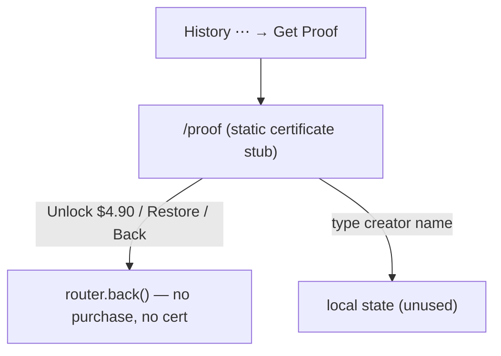

# Area 08 — Proof of Creation

> Read `../00-overview.md` first (conventions, ID scheme). **As-built**; ⚠️ = divergence from App
> v3.0, ❓ = a tracked `TBD-*`, 🔒 = mock/in-memory.
>
> ⚠️ **This screen is a non-functional placeholder as-built.** Certificate issuance, payment,
> hashing, and delivery are all **unimplemented** and backend-dependent. Per gate G3, this spec
> documents only what renders and does NOT invent the real behaviour — every real capability is a
> `TBD-PROOF-*` for RD.

---

## 1. Overview & scope

`/proof` (`ProofView`) shows a **static certificate mock**: a "Certificate of Authenticity" card with a
hardcoded verification hash, issue date, and network, plus a creator-name input and an
"Unlock for $4.90" button. Nothing is generated, charged, hashed, or persisted.

**In scope:** `proof/ProofView` (`/proof`).
**Entry point:** History `⋯` menu → **Get Proof** (`router.push("/proof")`, area 05). Not linked from
the shell.

**Key divergences from App F21:** app derives a **SHA-256 audio hash**, is a **$4.90 IAP**, binds to a
specific **song** (title from the result), takes an **owner name** onto the cert, and delivers a **PDF
by email**. Web: a **static placeholder** hash (not a real SHA-256 audio fingerprint), "Polygon" on-chain framing, **no song binding**,
owner name **unused**, **no payment**, **no PDF/email**. Effectively a visual stub. ⚠️

---

## 2. Route / component / state / API map (RD)

| Route / Component | Owns UI | Reads/writes state | `MuseApi` |
|---|---|---|---|
| `/proof` → `proof/ProofView` | Back, certificate card (hash/issued/network), creator-name input, Unlock CTA, Restore + Privacy links | local `owner` string (unused elsewhere) | **none** (no endpoint; nothing persisted) |

---

## 3. State model & rules

- **No inputs from context:** `/proof` takes **no song/creation id** — it does not know *which* creation
  it certifies (`ProofView.tsx`). ❓ → `TBD-PROOF-02`.
- **Static certificate fields** (`ProofView.tsx:14,40-42`): `hash` = hardcoded string
  `"6456474747444888g6457dhjuu64777"`; Issued = `"2026-06-22"`; Network = `"Polygon"`.
- **Creator name** input is local `useState` and is **not used or persisted** anywhere
  (`ProofView.tsx:13,46-52`).
- **Unlock for $4.90** button → `router.back()` — **no purchase, no issuance** (`ProofView.tsx:58`).
- **Restore** → `router.back()`; **Privacy Policy** button → no-op (`ProofView.tsx:60-62`).
- 🔒 Entire screen is display-only; there is no `MuseApi` proof endpoint and no persistence.

---

## 4. Journeys

Screens to capture later: `/proof`.

### PROOF-P1 — View the certificate stub
- **PROOF-P1-S1** From History `⋯` → **Get Proof** → `/proof`. **System:** renders the static certificate card + creator-name field.
- **PROOF-P1-S2** Type a creator name. **System:** updates local state only (not saved).
- **PROOF-P1-S3** Tap **Unlock for $4.90** or **Restore** or **Back**. **System:** navigates back — no purchase, no certificate generated. **Privacy Policy** does nothing.

---

## 5. Error & edge states

| ID | Trigger | Behaviour |
|---|---|---|
| **PROOF-E1** | Direct-navigate `/proof` (no entry context) | Renders the same static stub (route is public, ungated, context-free). ⚠️ The app treats Proof as an **auth-gated monetization action** (F21/F22) → see `TBD-GL-02`. |
| **PROOF-E2** | Empty creator name + Unlock | No validation; button just navigates back (nothing to validate against). |

---

## 6. Acceptance criteria (EARS)

- **AC-PROOF-01** — WHEN `/proof` is opened, THE SYSTEM SHALL render a certificate card with a verification hash, issue date, network, and a creator-name input.
- **AC-PROOF-02** — WHEN **Unlock for $4.90**, **Restore**, or **Back** is tapped, THE SYSTEM SHALL navigate back **without** performing a purchase or generating a certificate. *(as-built placeholder — pending `TBD-PROOF-01`.)*
- **AC-PROOF-03** — THE SYSTEM SHALL render `/proof` at 390/768/1024/1440px with no overflow. *(visual)*

> No AC asserts hashing, payment, ownership capture, or delivery — those behaviours do not exist yet
> (see §8). ACs will be added when the feature is defined.

---

## 7. Per-path QA checklist

- [ ] **PROOF-P1**: Get Proof → `/proof` renders certificate stub; creator-name typeable; Unlock/Restore/Back navigate back with no side effect; Privacy Policy inert (AC-01/02).
- [ ] **AC-03**: 4 viewports clean *(visual)*.

---

## 8. Area TBD register — decisions 2026-07-22

**Decision: ⏸ Proof of Creation is NOT in the web MVP — the whole feature is deferred to Phase 2.** (No codebase change now.)

| ID | Decision |
|---|---|
| TBD-PROOF-01 | ⏸ **Phase 2** — whether/how to build Proof (payment/hashing/issuance/delivery) — deferred. |
| TBD-PROOF-02 | ⏸ **Phase 2** — which creation is certified — deferred. |
| TBD-PROOF-03 | ⏸ **Phase 2** — owner-name handling — deferred. |
| TBD-PROOF-04 | ⏸ **Phase 2** — certificate delivery + re-download — deferred. |

Effectively the whole feature is undefined. RD to define once product commits.

| ID | Question |
|---|---|
| **TBD-PROOF-01** | **Is Proof of Creation in web scope, and how does it work?** Payment ($4.90 IAP vs other), hashing method (App = SHA-256 audio hash; web says "Polygon" on-chain), issuance, and delivery (App = PDF by email) are all unimplemented. RD to design end-to-end. |
| **TBD-PROOF-02** | **Which creation is certified?** `/proof` receives no id. Must it bind to a specific song/MV (App binds the song title from the result)? |
| **TBD-PROOF-03** | **Owner name** — captured but unused; is it required, validated (real name per App), and printed on the cert? |
| **TBD-PROOF-04** | **Certificate delivery & re-download** — App emails a PDF + keeps it in Downloads; web has neither. Define storage/retrieval. |

---

## 9. Flow diagram

---

## 10. Decisions & changelog

**Decisions (as-built):** `/proof` is a visual placeholder; no payment/hash/issuance/persistence; the
real feature is deferred and RD-owned.

| Date | Change |
|---|---|
| 2026-07-22 | Initial as-built spec (documents the placeholder; flags the whole feature as TBD). |
| 2026-07-22 | Validator PASS; flagged PROOF-E1 public-vs-gated divergence (→ TBD-GL-02); softened the hash divergence wording. |
