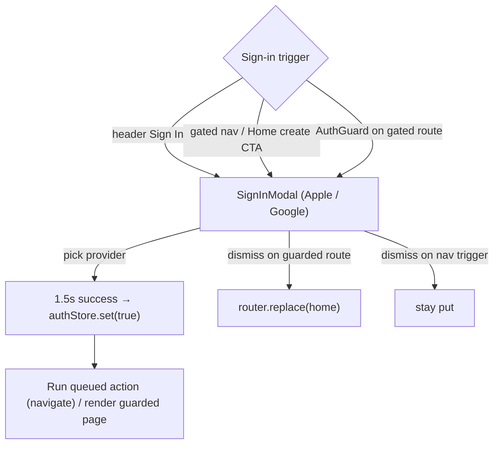

# Area 09 — Auth & Onboarding

> Read `../00-overview.md` first (conventions, ID scheme, global auth model §5). **As-built**;
> ⚠️ = divergence from App v3.0, ❓ = a tracked `TBD-*`, 🔒 = mock/in-memory.
>
> ⚠️ **Backend note (G3):** authentication is a **mock** — it is NOT part of the `MuseApi` contract.
> Real OAuth/session/identity is a backend concern this spec does **not** define; those parts are
> left for RD (`TBD-AUTH-*`). Do not read production auth behaviour into this document.

---

## 1. Overview & scope

The mock sign-in gate. The app starts **logged out**; sign-in is a two-provider social modal that
fakes success after a short delay and flips a persisted boolean. There is **no onboarding/splash** in
the web build.

**In scope:** `auth/SignInModal`, `auth/AuthGuard`, `providers/AuthProvider`, `lib/authStore`.
**Out of scope:** the account menu + Sign Out surface (area 01/06); subscription state (area 07);
Terms/Privacy/Delete-account destinations (area 06 Settings).

**Key divergences from App F01/F22:** **no email/password** option — only Continue with Apple /
Google ⚠️; **no OAuth** — a 1.5s fake success 🔒; **no Splash & Onboarding carousel** (F01) at all ⚠️
(→ `TBD-GL-03`); web gates by **route entry**, the app gates by **action** (Create/Like/Proof) ⚠️
(→ `TBD-GL-02`).

---

## 2. Route / component / state / API map (RD)

| Component | Owns UI | Reads/writes state | `MuseApi` |
|---|---|---|---|
| `providers/AuthProvider` | mounts `SignInModal`; exposes `useAuth()` | `authStore` (loggedIn), `hydratedStore`, in-memory `subscribed`/`subscribedPlan`/`profile` | **none** (mock only) |
| `auth/AuthGuard` | route-entry gate for signed-in-only pages | `useAuth().{loggedIn,hydrated,requireLogin}` | — |
| `auth/SignInModal` | Apple/Google buttons + success animation | local `signingIn` timer | — |
| `lib/authStore` | external store for the logged-in boolean | `localStorage["muse_auth"]` via `useSyncExternalStore` | — |

`useAuth()` surface: `loggedIn`, `hydrated`, `status` (`guest|free|subscriber`), `subscribed`,
`subscribedPlan`, `profile`, `requireLogin(onSuccess?, onCancel?)`, `openSignIn()`, `signOut()`,
`subscribe(plan)`, `updateProfile(patch)`.

---

## 3. State model & rules

- **Persistence (🔒 asymmetric):** `loggedIn` is the **only** state that survives reload — external
  store backed by `localStorage["muse_auth"]="1"` (`authStore.ts:5,17-35`). `subscribed`,
  `subscribedPlan`, and `profile` are in-memory React state, reset to guest defaults on reload and on
  `signOut()` (`AuthProvider.tsx:49-51,91-96`). (→ `TBD-GL-04`.)
- **Hydration:** `hydratedStore` returns `false` on the server / first paint, `true` after mount
  (`authStore.ts:39-49`); `getServerSnapshot` for `loggedIn` is `false` (no SSR mismatch).
- **`requireLogin(onSuccess?, onCancel?)`** (`AuthProvider.tsx:61-72`): if `loggedIn`, run `onSuccess`
  immediately; else queue `onSuccess`/`onCancel` and open the modal. On successful sign-in the queued
  `onSuccess` runs (`handleSignedIn`); on dismiss the queued `onCancel` runs (`handleClose`).
- **`openSignIn()`**: open the modal with **no** queued action (`AuthProvider.tsx:55-59`).
- **`AuthGuard`** (`AuthGuard.tsx`): renders `null` until `hydrated && loggedIn`. When hydrated and
  logged out, calls `requireLogin(undefined, () => router.replace(home))` — i.e. dismissing the modal
  **redirects Home**. Wraps `/mv/room`, `/song/create`, `/history`, `/profile`.
- **`SignInModal`** (`SignInModal.tsx`): title "Sign in to MuseMV" + "M" logo; **Continue with Apple**
  and **Continue with Google** (white buttons); Terms/Privacy text (**non-functional** — plain spans);
  picking a provider shows a 1.5s success state ("Signed in successfully! Welcome back, {firstName} · via {provider}")
  then calls `onSignedIn` → `authStore.set(true)`. Dismissal is **blocked during** the success
  animation (`onClose` swallowed).
- **Sign-in trigger points:** header **Sign In** (`openSignIn`, area 01); **gated nav** click while
  logged out (`Sidebar` → `requireLogin(→push)`, area 01); **AuthGuard** on the four gated routes
  (dismiss → Home); and the **Home hero "Create MV" / "Create Song" CTAs and Home song-card "create"**
  (`HomeView` → `requireLogin(→push …)`, area 04). Only **community like/share** are ungated. ⚠️ The
  app gates by *action* (Create/Like/Proof, F22); web gates these route/CTA entries.

---

## 4. Journeys

Screens to capture later: `SignInModal` (idle + success states) over a gated route.

### AUTH-P1 — Sign in from the header (no queued action)
- **AUTH-P1-S1** Logged-out user clicks **Sign In** (top bar) → `openSignIn()` opens the modal.
- **AUTH-P1-S2** Pick Apple/Google → 1.5s success animation → `authStore.set(true)`; header swaps to logged-in chrome. No navigation.

### AUTH-P2 — Gated route entry (queued action)
- **AUTH-P2-S1** Logged-out user navigates to `/mv/room` (or `/song/create` `/history` `/profile`). `AuthGuard` renders nothing and opens the modal via `requireLogin`.
- **AUTH-P2-S2** Sign in → guard re-renders the page (now `loggedIn`). **Dismiss without signing in → `router.replace(home)`.**

### AUTH-P3 — Gated create entry (queued push)
- **AUTH-P3-S1** Logged-out user clicks a gated **sidebar** item, or a **Home hero "Create MV"/"Create Song" CTA**, or a **Home song-card "create"** (`HomeView`, area 04) → `requireLogin(() => push(target))`. Sign in → navigates to target (song-card create also pre-fills the song compose); dismiss → stays on the current page.

### AUTH-P4 — Sign out
- **AUTH-P4-S1** Account menu → **Sign Out** (area 01) → `signOut()`: clears `muse_auth`, resets subscription + profile to guest defaults. On a guarded page, `AuthGuard` re-opens the sign-in gate; dismissing it → Home (see AUTH-E3).

---

## 5. Error & edge states

| ID | Trigger | Behaviour |
|---|---|---|
| **AUTH-E1** | Reload while signed in | `loggedIn` persists (localStorage); subscription/profile do **not** — user is `free` again until they re-subscribe (🔒, → `TBD-GL-04`). |
| **AUTH-E2** | Pre-hydration paint | Guarded pages render `null` (not the sign-in modal) until `hydrated`; the shell header briefly shows logged-out (area 01 SHELL-E1). |
| **AUTH-E3** | Dismiss modal on a guarded route | `router.replace(home)` (AuthGuard `onCancel`). On a nav-triggered gate, dismiss just stays put (no `onCancel`). |
| **AUTH-E4** | `storage` event (sign-in/out in another tab) | `authStore.subscribe` listens to `window "storage"`, so auth state syncs across tabs. |

---

## 6. Acceptance criteria (EARS)

- **AC-AUTH-01** — WHILE logged out, WHEN a user opens a guarded route (`/mv/room`, `/song/create`, `/history`, `/profile`), THE SYSTEM SHALL render no page content and open the sign-in modal.
- **AC-AUTH-02** — WHEN the user completes mock sign-in (Apple/Google), THE SYSTEM SHALL, after the success animation, set the persisted logged-in flag and run any queued action (navigation).
- **AC-AUTH-03** — WHEN the user dismisses the modal opened by `AuthGuard`, THE SYSTEM SHALL navigate Home; WHEN dismissed after a gated-nav click, THE SYSTEM SHALL leave the current page unchanged.
- **AC-AUTH-04** — WHILE the success animation is playing, THE SYSTEM SHALL block modal dismissal.
- **AC-AUTH-05** — WHEN the user signs out, THE SYSTEM SHALL clear the logged-in flag and reset subscription and profile to guest defaults.
- **AC-AUTH-06** — WHEN the logged-in flag is set/cleared, THE SYSTEM SHALL persist only that flag across reload (subscription/profile are not persisted). *(Locks in current behaviour pending `TBD-GL-04`.)*
- **AC-AUTH-07** — THE SYSTEM SHALL render `SignInModal` correctly at 390/768/1024/1440px. *(visual)*

---

## 7. Per-path QA checklist

- [ ] **AUTH-P1**: header Sign In → modal → provider pick → 1.5s success → logged-in chrome (AC-01/02).
- [ ] **AUTH-P2**: open `/mv/room` logged out → no page content + modal; sign in → page renders; dismiss → Home (AC-01/03).
- [ ] **AUTH-P3**: gated nav click → modal; sign in → target; dismiss → stay (AC-03).
- [ ] **AUTH-P4/E1**: sign out resets to guest; reload keeps logged-in only, subscription lost (AC-05/06).
- [ ] **AUTH-E4**: sign in/out in a second tab syncs.
- [ ] **AC-04**: cannot dismiss during success animation. **AC-07**: modal clean at 4 widths *(visual)*.

---

## 8. Area TBD register — decisions 2026-07-22

**Decisions** — codebase change list in [`../handoff.md`](../handoff.md).

| ID | Decision |
|---|---|
| TBD-AUTH-01 | 🔧 **Backend (RD)** — real auth integration (provider, session/token). |
| TBD-AUTH-02 | ✅ **Decided** — v1 is **Apple / Google SSO only; no email/password** (matches current). No change. |
| TBD-AUTH-03 | ✅ **Sync App** — wire Terms/Privacy links (localized; same links as `TBD-PROF-06`). |
| TBD-AUTH-04 | ⏳ **Web-specific spec needed** — define the web guest-browsing / gating rules in detail (a web access matrix). Not a straight App copy. |

See also global: `TBD-GL-02` (auth granularity), `TBD-GL-03` (onboarding), `TBD-GL-04` (persistence).

| ID | Question |
|---|---|
| **TBD-AUTH-01** | **Real auth integration** — provider(s), session/token model, and where it lives relative to `MuseApi`. Entirely undefined; RD to design. (Do not infer from the mock.) |
| **TBD-AUTH-02** | **Email/password** — App F22 offers it; web has only Apple/Google. Is email/password in web scope? |
| **TBD-AUTH-03** | **Terms/Privacy links** — non-functional in `SignInModal` today; wire to the real localized URLs (App F19)? |
| **TBD-AUTH-04** | **Guest browsing scope** — which surfaces are usable logged-out (today: Home/Explore/Watch/Player/Share/Settings)? Confirm intended guest capabilities. |

---

## 9. Flow diagram

---

## 10. Decisions & changelog

**Decisions (as-built):** auth is mock and outside `MuseApi`; only the logged-in boolean persists;
route-entry gating (four routes); no onboarding/splash; social-only sign-in.

| Date | Change |
|---|---|
| 2026-07-22 | Initial as-built spec. |
| 2026-07-22 | Validator fix: added Home hero CTAs + song-card create as sign-in triggers (area 04); scoped "ungated" to community like/share; corrected AUTH-P4-S1 logout-on-guarded-page wording; completed success-state quote. |
