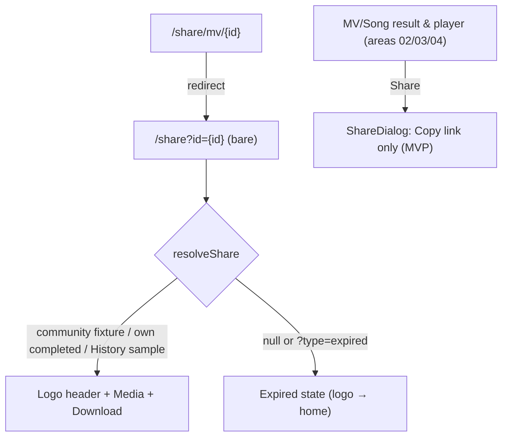

# Area 10 — Share

> Read `../00-overview.md` first (conventions, ID scheme). **As-built**; ⚠️ = divergence from App
> v3.0, ❓ = a tracked `TBD-*`, 🔒 = mock/in-memory.
>
> ⚠️ **Backend note (G3):** share-link resolution and expiry are **mock** — own creations resolve
> only from in-memory History; there is **no server-side resolution and no real expiry**. Those are
> RD-owned (`TBD-SHARE-*`). Do not read production persistence into this document.

---

## 1. Overview & scope

The recipient-facing **public** share page and the shared **Share dialog**. A share link opens a
standalone landing page (no app chrome). As of 2026-07-23 the page is **simplified** to just three
things: a **logo header** (click → home), the **media** (MV video / song), and a **Download** button —
no Share action, no title/creator, no "Try" CTA. An unresolvable id shows an expired state. The
`ShareDialog` (**copy-link only** as of 2026-07-23 — MVP, no social platforms) is **no longer used on
`/share`** but remains a shared UI primitive opened by the MV/Song result & player screens
(areas 02/03/04).

**In scope:** `share/ShareLinkView` (`/share`), the legacy redirect `share/mv/[id]`, `lib/share`,
`ui/ShareDialog` (canonical share component — cross-referenced by areas 02/03/04).
**Out of scope:** the result/player screens that open `ShareDialog` (areas 02/03/04).

**Key divergences from the app:** the app shares via a **native share sheet** from the result/player
(F08/F10/F13); web adds a **dedicated public landing page** (`/share`) — a web-only addition ⚠️.
**MVP (2026-07-23): `ShareDialog` is copy-link only — the four social-platform composer links and the
native Share button were removed** (social channels deferred → `TBD-SHARE-02`). Brand is consistently
**"YouCam Muse"** everywhere (SHELL-01 resolved 2026-07-23).

---

## 2. Route / component / state / API map (RD)

| Route / Component | Owns UI | Reads/writes state | `MuseApi` |
|---|---|---|---|
| `/share` → `share/ShareLinkView` | public landing (simplified 2026-07-23): logo header (→ home), media (MV video / song), Download button, expired state | `useSearchParams` (`id`, `type`), `useHistory`, `resolveShare`, `useLocale` | **none** (resolves from fixtures + History samples + in-memory History) |
| `/share/mv/[id]` → `page.tsx` | *(no UI)* server `redirect()` → `/share?id={id}` (locale-preserved) | route params | — |
| `ui/ShareDialog` | copy-link input + Copy button (MVP — no social targets, no native Share) | local `copied` | — |
| `lib/share` | `buildShareUrl(id)`, `resolveShare(id, history)`, `SharedMedia` | — | — |

Renders **bare** (no shell) — `AppShell` treats any `/share…` path as chrome-less (area 01 SHELL-P5).

---

## 3. State model & rules

- **Resolution order** (`lib/share.ts`): `resolveShare(id, history)` tries community MV fixture →
  community song fixture → the user's own **completed** in-memory History item → **static
  `HISTORY_SAMPLES`** (done MV/song, mapped to the shared demo video/audio) → else `null`.
  `?type=expired` forces `null` (`ShareLinkView.tsx`).
- **Valid link (`SharedMedia` present):** logo header (→ home) + media (MV = `<video controls>` at
  9:16, **capped at 80vh max-height** so it can't overflow the viewport on wide/short screens — width
  derives from the aspect ratio instead of always filling the 520px column (2026-07-24); song = cover
  image + `<audio controls>`) + a **Download** button (only if a media URL exists). No Share action,
  title/creator, or Try CTA (simplified 2026-07-23).
- **Expired/invalid (`null`):** logo header (→ home), bell-off icon, "This link has expired", copy
  "*Shared links are available for 30 days…*". ⚠️ The 30-day window is **copy only** — there is no
  expiry logic; only an unresolvable id triggers this state. (The former "Go to YouCam Muse" button was
  removed 2026-07-23; the header logo is the way home.)
- 🔒 **Prototype limit** (`lib/share.ts`): community items **and** the static History samples resolve
  from fixtures (survive reload + cross-tab). A user's **live** own creation still lives only in the
  in-memory `HistoryProvider`, so a fresh tab or reload cannot resolve it and the page shows the
  expired state. Production resolves every id server-side (→ `TBD-SHARE-01`, ties `TBD-GL-04`).
- **`buildShareUrl(id)`** (`lib/share.ts:30-33`): `${window.location.origin}/share?id={id}` (client-only;
  empty origin on server).
- **`ShareDialog`** (`ui/ShareDialog.tsx`): **MVP (2026-07-23)** — a read-only link field + **Copy**
  (clipboard, "Copied!" 1.5s) and nothing else. The prior 4-cell social composer grid
  (Facebook / X / Pinterest / Reddit), the third-party-terms note, and the native **Share…** button
  were **removed** (no social-platform sharing for MVP; → `TBD-SHARE-02`).

---

## 4. Journeys

Screens to capture later: `/share?id=…` (valid MV + valid song), `/share?type=expired`, `ShareDialog` open.

### SHARE-P1 — Open a valid share link (recipient, unauthenticated)
- **SHARE-P1-S1** Recipient opens `/share?id={hash}`. **System:** bare page; `resolveShare` finds the media; renders the logo header + media.
- **SHARE-P1-S2** **Download** (if URL) saves the file (`{title}.mp4`/`.mp3`); the **logo** → home.

### SHARE-P2 — Expired / invalid link
- **SHARE-P2-S1** `/share` with an unresolvable `id`, no `id`, or `?type=expired` → expired empty state; the **logo** → home.

### SHARE-P3 — Legacy MV share URL
- **SHARE-P3-S1** `/share/mv/{id}` → server redirect to `/share?id={id}` (locale preserved).

### SHARE-P4 — Share dialog (from any result/player, cross-area)
- **SHARE-P4-S1** User taps Share on an MV/Song result (areas 02/03/04) → `ShareDialog` with `buildShareUrl`. **Copy → clipboard** is the only action (MVP — no social targets, no native share).

---

## 5. Error & edge states

| ID | Trigger | Behaviour |
|---|---|---|
| **SHARE-E1** | **Live** own-creation link opened in a fresh tab / after reload | Not in in-memory History → expired state (🔒 prototype limit; → `TBD-SHARE-01`). Static `HISTORY_SAMPLES` are the exception — they resolve from fixtures. |
| **SHARE-E2** | Clipboard API unavailable | `copy()` silently no-ops (try/catch); Copy is the only action in the MVP dialog. |
| **SHARE-E3** | Song with no `audioUrl` / MV with no `videoUrl` | Download button hidden (renders only when a URL exists). |
| **SHARE-E4** | SSR / no `window` | `buildShareUrl` yields a relative `/share?id=…` (empty origin). |

---

## 6. Acceptance criteria (EARS)

- **AC-SHARE-01** — WHEN `/share?id={id}` resolves to media, THE SYSTEM SHALL render it bare (no app chrome) with a logo header (→ home), the media, and (if a URL exists) a Download button — and nothing else.
- **AC-SHARE-02** — WHEN the id is missing/unresolvable or `?type=expired`, THE SYSTEM SHALL render the expired empty state; the logo header links home.
- **AC-SHARE-03** — WHEN `/share/mv/{id}` is opened, THE SYSTEM SHALL redirect to `/share?id={id}` preserving the locale.
- **AC-SHARE-04** — WHEN Share is invoked, THE SYSTEM SHALL open `ShareDialog` exposing a copyable `buildShareUrl` link and a Copy button — and **no** social-platform targets or native-share button (MVP).
- **AC-SHARE-05** — WHEN Download is tapped on a valid link, THE SYSTEM SHALL download the media as `{title}.mp4` (MV) or `{title}.mp3` (song).
- **AC-SHARE-06** — THE SYSTEM SHALL render `/share` (valid + expired) and `ShareDialog` at 390/768/1024/1440px. *(visual)*

---

## 7. Per-path QA checklist

- [ ] **SHARE-P1**: valid community MV id → video card; valid song id → cover+audio; only header + media + Download shown (AC-01).
- [ ] **SHARE-P1-S2**: Download names file correctly; logo → home (AC-05).
- [ ] **SHARE-P2**: bad id / `?type=expired` → expired state; logo → home (AC-02).
- [ ] **SHARE-P3**: `/share/mv/x` → `/share?id=x`, locale kept (AC-03).
- [ ] **SHARE-E1**: static History sample (e.g. `h-cinematic-night`) resolves in a fresh tab; a *live* own creation still → expired (prototype limit).
- [ ] **SHARE-P4 / AC-04**: `ShareDialog` still reachable from MV/Song result & player screens (areas 02/03/04).
- [ ] **AC-06**: 4 widths clean, page bare (no shell) *(visual)*.

---

## 8. Open items for RD

| ID | Open item |
|---|---|
| **TBD-SHARE-01** | 🔧 **Backend (RD)** — server-side share resolution + real link expiry. Production must resolve any id (incl. the sharer's own live creations) server-side, and implement the advertised 30-day expiry (copy-only today). |
| **TBD-SHARE-02** | ⏳ **TBD** — social sharing is removed for MVP (`ShareDialog` is copy-link only); the final web social-channel set (App lists Instagram/TikTok/WhatsApp/X; the removed web set was Facebook/X/Pinterest/Reddit) is undefined and to be re-added later. |
| **TBD-SHARE-03** | ⏳ **Decided to build, details TBD** — share links should carry analytics tracking, but which recipient data (if any) is captured is undefined. |

See also global: `TBD-GL-04` (persistence), `TBD-GL-07` (`/share` gating), `TBD-SHELL-01` (brand).

---

## 9. Flow diagram

---

**Decisions (as-built):** dedicated public share page (web-only) + shared `ShareDialog`; bare (no
shell); community ids **and static History samples** resolve from fixtures, live own creations from
in-memory History only; 30-day expiry is copy, not enforced; the video frame is capped at 80vh.
