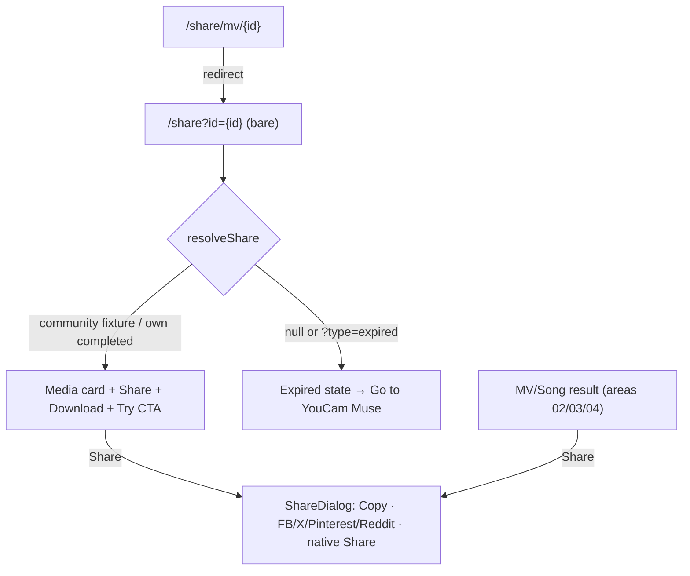

# Area 10 — Share

> Read `../00-overview.md` first (conventions, ID scheme). **As-built**; ⚠️ = divergence from App
> v3.0, ❓ = a tracked `TBD-*`, 🔒 = mock/in-memory.
>
> ⚠️ **Backend note (G3):** share-link resolution and expiry are **mock** — own creations resolve
> only from in-memory History; there is **no server-side resolution and no real expiry**. Those are
> RD-owned (`TBD-SHARE-*`). Do not read production persistence into this document.

---

## 1. Overview & scope

The recipient-facing **public** share page and the shared **Share dialog**. A share link opens a
standalone landing page (no app chrome) showing one result with Share/Download and a "Try" CTA; an
unresolvable id shows an expired state. The `ShareDialog` composer (copy link + social targets) is a
shared UI primitive used here and by MV/Song result screens.

**In scope:** `share/ShareLinkView` (`/share`), the legacy redirect `share/mv/[id]`, `lib/share`,
`ui/ShareDialog` (canonical share component — cross-referenced by areas 02/03/04).
**Out of scope:** the result/player screens that open `ShareDialog` (areas 02/03/04).

**Key divergences from the app:** the app shares via a **native share sheet** from the result/player
(F08/F10/F13); web adds a **dedicated public landing page** (`/share`) — a web-only addition ⚠️.
Social targets are **Facebook / X / Pinterest / Reddit** (app listed Instagram / TikTok / WhatsApp /
X) ⚠️. Brand strings are inconsistent: wordmark "MuseMV.ai" but aria-label/CTA say "YouCam Muse" ⚠️
(→ `TBD-SHELL-01`).

---

## 2. Route / component / state / API map (RD)

| Route / Component | Owns UI | Reads/writes state | `MuseApi` |
|---|---|---|---|
| `/share` → `share/ShareLinkView` | public landing: media card, title/creator, Share + Download, Try CTA, expired state | `useSearchParams` (`id`, `type`), `useHistory`, `resolveShare`, `useLocale` | **none** (resolves from fixtures + in-memory History) |
| `/share/mv/[id]` → `page.tsx` | *(no UI)* server `redirect()` → `/share?id={id}` (locale-preserved) | route params | — |
| `ui/ShareDialog` | copy-link input, 4 social targets, native Share (if supported) | local `copied` | — |
| `lib/share` | `buildShareUrl(id)`, `resolveShare(id, history)`, `SharedMedia` | — | — |

Renders **bare** (no shell) — `AppShell` treats any `/share…` path as chrome-less (area 01 SHELL-P5).

---

## 3. State model & rules

- **Resolution order** (`lib/share.ts:40-59`): `resolveShare(id, history)` tries community MV fixture →
  community song fixture → the user's own **completed** History item → else `null`. `?type=expired`
  forces `null` (`ShareLinkView.tsx:33-34`).
- **Valid link (`SharedMedia` present):** media card — MV = `<video controls>` at 9:16; song = cover
  image + `<audio controls>` — then title, optional "by {creator}", **Share** (opens `ShareDialog`),
  **Download** (only if a media URL exists), and a **"Try YouCam Muse"** CTA → home.
- **Expired/invalid (`null`):** bell-off icon, "This link has expired", copy "*Shared links are
  available for 30 days…*", **"Go to YouCam Muse"** → home. ⚠️ The 30-day window is **copy only** —
  there is no expiry logic; only an unresolvable id triggers this state.
- 🔒 **Prototype limit** (`lib/share.ts:6-11`): community items resolve from **static fixtures**
  (survive reload + cross-tab); a user's **own** creation lives only in the in-memory `HistoryProvider`,
  so a fresh tab or reload cannot resolve it and the page shows the expired state. Production resolves
  every id server-side (→ `TBD-SHARE-01`, ties `TBD-GL-04`).
- **`buildShareUrl(id)`** (`lib/share.ts:30-33`): `${window.location.origin}/share?id={id}` (client-only;
  empty origin on server).
- **`ShareDialog`** (`ui/ShareDialog.tsx`): read-only link field + **Copy** (clipboard, "Copied!"
  1.5s); a 4-cell grid of social **composer** links — Facebook, X, Pinterest, Reddit (open in a new
  tab); a third-party-terms note; and a native **Share…** button only when `navigator.share` exists.

---

## 4. Journeys

Screens to capture later: `/share?id=…` (valid MV + valid song), `/share?type=expired`, `ShareDialog` open.

### SHARE-P1 — Open a valid share link (recipient, unauthenticated)
- **SHARE-P1-S1** Recipient opens `/share?id={hash}`. **System:** bare page; `resolveShare` finds the media; renders the media card + title/creator.
- **SHARE-P1-S2** **Download** (if URL) saves the file (`{title}.mp4`/`.mp3`); **Try YouCam Muse** → home.
- **SHARE-P1-S3** **Share** opens `ShareDialog` (copy link / social targets / native share).

### SHARE-P2 — Expired / invalid link
- **SHARE-P2-S1** `/share` with an unresolvable `id`, no `id`, or `?type=expired` → expired empty state + "Go to YouCam Muse".

### SHARE-P3 — Legacy MV share URL
- **SHARE-P3-S1** `/share/mv/{id}` → server redirect to `/share?id={id}` (locale preserved).

### SHARE-P4 — Share dialog (from any result/player, cross-area)
- **SHARE-P4-S1** User taps Share on an MV/Song result (areas 02/03/04) → `ShareDialog` with `buildShareUrl`. Copy → clipboard; social cell → composer in new tab; native Share when supported.

---

## 5. Error & edge states

| ID | Trigger | Behaviour |
|---|---|---|
| **SHARE-E1** | Own-creation link opened in a fresh tab / after reload | Not in in-memory History → expired state (🔒 prototype limit; → `TBD-SHARE-01`). |
| **SHARE-E2** | Clipboard API unavailable | `copy()` silently no-ops (try/catch). The native `Share…` button is shown only when `navigator.share` exists, so its `else → copy()` fallback is code-present but not reachable via the button. |
| **SHARE-E3** | Song with no `audioUrl` / MV with no `videoUrl` | Download button hidden (renders only when a URL exists). |
| **SHARE-E4** | SSR / no `window` | `buildShareUrl` yields a relative `/share?id=…` (empty origin). |

---

## 6. Acceptance criteria (EARS)

- **AC-SHARE-01** — WHEN `/share?id={id}` resolves to media, THE SYSTEM SHALL render it bare (no app chrome) with the media card, title, Share, and (if a URL exists) Download, plus the Try CTA.
- **AC-SHARE-02** — WHEN the id is missing/unresolvable or `?type=expired`, THE SYSTEM SHALL render the expired empty state with a home CTA.
- **AC-SHARE-03** — WHEN `/share/mv/{id}` is opened, THE SYSTEM SHALL redirect to `/share?id={id}` preserving the locale.
- **AC-SHARE-04** — WHEN Share is invoked, THE SYSTEM SHALL open `ShareDialog` exposing a copyable `buildShareUrl` link, the four social targets, and (where supported) native share.
- **AC-SHARE-05** — WHEN Download is tapped on a valid link, THE SYSTEM SHALL download the media as `{title}.mp4` (MV) or `{title}.mp3` (song).
- **AC-SHARE-06** — THE SYSTEM SHALL render `/share` (valid + expired) and `ShareDialog` at 390/768/1024/1440px. *(visual)*

---

## 7. Per-path QA checklist

- [ ] **SHARE-P1**: valid community MV id → video card; valid song id → cover+audio; title/creator shown (AC-01).
- [ ] **SHARE-P1-S2/S3**: Download names file correctly; Share opens dialog; Copy copies `buildShareUrl` (AC-04/05).
- [ ] **SHARE-P2**: bad id / `?type=expired` → expired state (AC-02).
- [ ] **SHARE-P3**: `/share/mv/x` → `/share?id=x`, locale kept (AC-03).
- [ ] **SHARE-E1**: own creation in fresh tab → expired (prototype limit).
- [ ] **AC-06**: 4 widths clean, page bare (no shell) *(visual)*.

---

## 8. Area TBD register — decisions 2026-07-22

**Decisions** — codebase change list in [`../handoff.md`](../handoff.md).

| ID | Decision |
|---|---|
| TBD-SHARE-01 | 🔧 **Backend (RD)** — server-side share resolution + real link expiry. |
| TBD-SHARE-02 | ⏳ **TBD** — web social channels differ from app; the web set is to be defined later. |
| TBD-SHARE-03 | ✅ **Decided (yes)** — share links carry analytics; details TBD. |

See also global: `TBD-GL-04` (persistence), `TBD-GL-07` (`/share` gating), `TBD-SHELL-01` (brand).

| ID | Question |
|---|---|
| **TBD-SHARE-01** | **Server-side resolution + real expiry** — production must resolve any id (incl. the sharer's own creations) server-side, and implement the advertised 30-day expiry (copy-only today). RD to define the share record + endpoint. |
| **TBD-SHARE-02** | **Social channels** — final set? App listed Instagram / TikTok / WhatsApp / X; web has Facebook / X / Pinterest / Reddit. |
| **TBD-SHARE-03** | **Analytics / privacy** — should share links carry tracking, and what recipient data (if any) is captured? Undefined. |

---

## 9. Flow diagram

---

## 10. Decisions & changelog

**Decisions (as-built):** dedicated public share page (web-only) + shared `ShareDialog`; bare (no
shell); community ids resolve from fixtures, own creations from in-memory History only; 30-day expiry
is copy, not enforced.

| Date | Change |
|---|---|
| 2026-07-22 | Initial as-built spec. Validator PASS (2 NITs); clarified SHARE-E2 native-share fallback reachability. |
