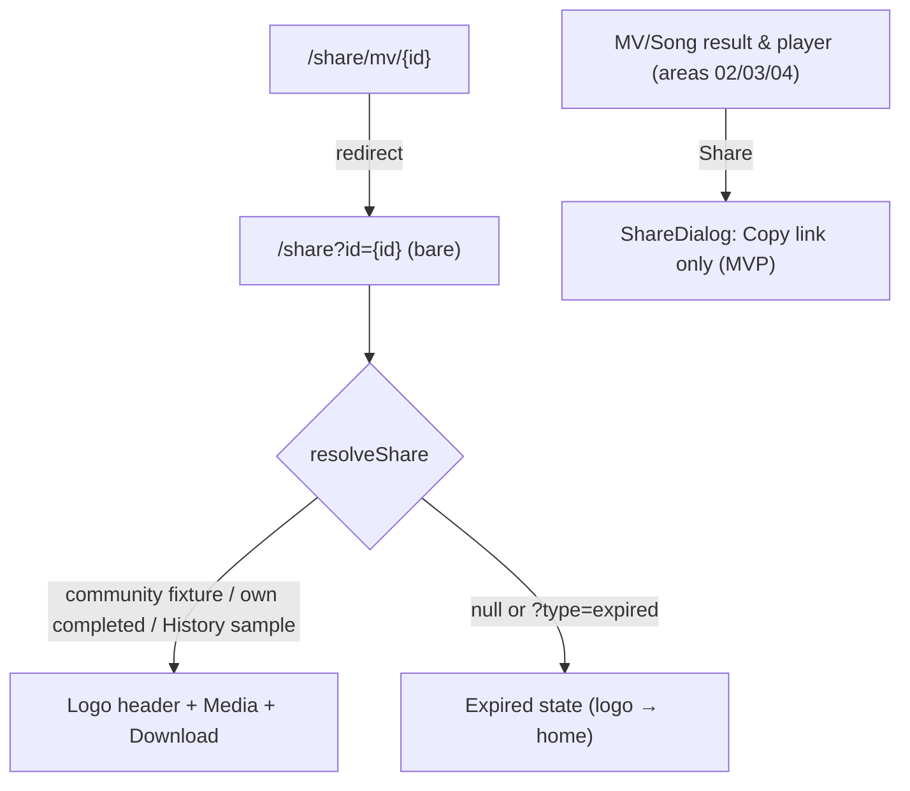

# Area 10 — Share

> Read `../00-overview.md` first (conventions, ID scheme). **As-built**; ⚠️ = divergence from App
> v3.0, ❓ = a tracked `TBD-*`, 🔒 = mock/in-memory.
>
> ⚠️ **Backend note (G3):** share-link resolution and expiry are **mock** — own creations resolve
> only from in-memory History; there is **no server-side resolution and no real expiry**. Those are
> RD-owned (`TBD-SHARE-*`). Do not read production persistence into this document.

---

## 1. Overview & scope

The recipient-facing **public** share page and the shared **Share dialog**. A share link opens a
standalone landing page (no app chrome): a **logo header** (click → home), a **media panel** with a
custom playback controller, and a **two-pill action row** (Download + a kind-labelled Create). An
unresolvable id shows an unavailable state. The
`ShareDialog` (**copy-link only** as of 2026-07-23 — MVP, no social platforms) is **no longer used on
`/share`** but remains a shared UI primitive opened by the MV/Song result & player screens
(areas 02/03/04).

**In scope:** `share/ShareLinkView` (`/share`), the legacy redirect `share/mv/[id]`, `lib/share`,
`ui/ShareDialog` (canonical share component — cross-referenced by areas 02/03/04).
**Out of scope:** the result/player screens that open `ShareDialog` (areas 02/03/04).

**Key divergences from the app:** the app shares via a **native share sheet** from the result/player
(F08/F10/F13); web adds a **dedicated public landing page** (`/share`) — a web-only addition ⚠️.
**MVP (2026-07-23): `ShareDialog` is copy-link only — the four social-platform composer links and the
native Share button were removed** (social channels deferred → `TBD-SHARE-02`). Brand is consistently
**"YouCam Muse"** everywhere (SHELL-01 resolved 2026-07-23).

---

## 2. Route / component / state / API map (RD)

| Route / Component | Owns UI | Reads/writes state | `MuseApi` |
|---|---|---|---|
| `/share` → `share/ShareLinkView` | public landing (**redesigned 2026-08-24**): logo header (→ home), `MvPanel` **or** `SongPanel` + its controller, a two-pill action row, unavailable state | `useSearchParams` (`id`, `type`), `useHistory`, `resolveShare`, `useLocale` | **none** (resolves from fixtures + History samples + in-memory History) |
| `/share/mv/[id]` → `page.tsx` | *(no UI)* server `redirect()` → `/share?id={id}` (locale-preserved) | route params | — |
| `ui/ShareDialog` | copy-link input + Copy button (MVP — no social targets, no native Share) | local `copied` | — |
| `lib/share` | `buildShareUrl(id)`, `resolveShare(id, history)`, `SharedMedia` | — | — |

Renders **bare** (no shell) — `AppShell` treats any `/share…` path as chrome-less (area 01 SHELL-P5).

---

## 3. State model & rules

- **Resolution order** (`lib/share.ts`): `resolveShare(id, history)` tries community MV fixture →
  community song fixture → the user's own **completed** in-memory History item → **static
  `HISTORY_SAMPLES`** (done MV/song, mapped to the shared demo video/audio) → else `null`.
  `?type=expired` forces `null` (`ShareLinkView.tsx`).
- **Valid link (`SharedMedia` present) — REDESIGNED 2026-08-24** (product owner, Figma
  "Share Page - MV" / song equivalent, nodes `2906:61191` / `2881:57358`), which **reverses** the
  2026-07-23 simplification this bullet used to describe:
  - **`MvPanel`** — a `<video>` with a `poster`, driven by a custom controller (play/pause,
    `elapsed / total`, the shared `SeekBar`, mute, fullscreen, **More**). ⚠️ It shows **no title and
    no creator** — confirmed live 2026-09-01.
  - **`MvMoreMenu`** — **Download · Playback Speed · Picture in Picture**. Playback Speed *cycles*
    `[1, 1.5, 2, 0.5]` and deliberately keeps the menu open; the other two act once and close.
    Closes on Escape or an outside click.
  - **`SongPanel`** — cover art, **title + creator** (the creator line only when the media carries
    one), and a pill controller: play/pause, `elapsed / total`, seek, mute, download.
  - **Two action pills** below either panel: **Download** (rendered only when a media URL exists)
    and a **Create** pill reading **`Try YouCam Muse`** on BOTH media kinds. ⚠️ **It goes to the
    HOME page**, not to a create flow — product owner, 2026-08-24: this page is unauthenticated and
    mostly reached by people with no account, so dropping them straight into a create flow skips
    the product entirely. Only the pill's GRADIENT still varies by kind
    (`--gradient-mv` / `--gradient-song`), which is decoration, not a promise.
    > ⚠️ **Label corrected 2026-09-01 (product owner, at the S9 spec review).** It read
    > `Create MV` / `Create Song` by media kind while both went to the home page — a button naming
    > a flow it never opened, which is the shape QA files as a broken link. The DESTINATION was not
    > reopened; only the label follows it now. Guarded by `e2e/behaviour-regressions.spec.ts`
    > ("/share's Create pill is neutral and goes home"), asserted on both media kinds.
  > ⚠️ **Corrected 2026-09-01 by the S9 storyboard capture (D11).** This bullet, §1, §2's table row
  > and `AC-SHARE-01` all still described the 2026-07-23 "three things only" page — logo, media,
  > Download, "no Share action, title/creator, or Try CTA". Every clause of that is now wrong on the
  > running app: there is a full controller, a More menu, a second CTA, and a title/creator on the
  > song panel. The native `<video controls>`/`<audio controls>` and the 80vh cap went with the
  > redesign. Captured at S9 `P1-S1`..`P1-S3`, `P2-S1`, `P2-S2`, `P3-S1`..`P3-S3`.
  > The **title/creator asymmetry** between the two panels is **settled as deliberate** (product
  > owner, 2026-09-01): a music video usually carries its own title on screen, so repeating it is
  > redundant, whereas a song's cover art carries no words and has to be named. Specified as a rule
  > on both panels rather than left open.
- **Unavailable/invalid (`null`):** logo header (→ home), an alert icon, "This link isn't available",
  copy "*We couldn't find this creation. Ask the sender to share it again.*".
  **Share links DO NOT EXPIRE (product owner, 2026-08-19).** The previous copy advertised a 30-day
  window that was never implemented and is now decided against — creations are kept indefinitely, so
  a link to one has no reason to lapse. This state is reached only when an id cannot be resolved. (The former "Go to YouCam Muse" button was
  removed 2026-07-23; the header logo is the way home.)
- 🔒 **Prototype limit** (`lib/share.ts`): community items **and** the static History samples resolve
  from fixtures (survive reload + cross-tab). A user's **live** own creation still lives only in the
  in-memory `HistoryProvider`, so a fresh tab or reload cannot resolve it and the page shows the
  expired state. Production resolves every id server-side (→ `TBD-SHARE-01`, ties `TBD-GL-04`).
- **`buildShareUrl(id)`** (`lib/share.ts:30-33`): `${window.location.origin}/share?id={id}` (client-only;
  empty origin on server).
- **`ShareDialog`** (`ui/ShareDialog.tsx`): **MVP (2026-07-23)** — a read-only link field + **Copy**
  (clipboard, "Copied!" 1.5s) and nothing else. The prior 4-cell social composer grid
  (Facebook / X / Pinterest / Reddit), the third-party-terms note, and the native **Share…** button
  were **removed** (no social-platform sharing for MVP; → `TBD-SHARE-02`).

---

## 4. Journeys

Screens to capture later: `/share?id=…` (valid MV + valid song), `/share?type=expired`, `ShareDialog` open.

### SHARE-P1 — Open a valid share link (recipient, unauthenticated)
- **SHARE-P1-S1** Recipient opens `/share?id={hash}`. **System:** bare page; `resolveShare` finds the media; renders the logo header + media.
- **SHARE-P1-S2** **Download** (if URL) saves the file (`{title}.mp4`/`.mp3`) — offered both as a
  pill and, on an MV, inside the More menu; the **Create** pill and the **logo** both → home.
- **SHARE-P1-S3** _(new 2026-09-01)_ The MV controller's **More** menu: Download, **Playback
  Speed** (cycles `1 → 1.5 → 2 → 0.5`, menu stays open), **Picture in Picture** (a no-op where the
  browser does not support it). See §3 and S9 `P2`.

### SHARE-P2 — Expired / invalid link
- **SHARE-P2-S1** `/share` with an unresolvable `id`, no `id`, or `?type=expired` → expired empty state; the **logo** → home.

### SHARE-P3 — Legacy MV share URL
- **SHARE-P3-S1** `/share/mv/{id}` → server redirect to `/share?id={id}` (locale preserved).

### SHARE-P4 — Share dialog (from any result/player, cross-area)
- **SHARE-P4-S1** User taps Share on an MV/Song result (areas 02/03/04) → `ShareDialog` with `buildShareUrl`. **Copy → clipboard** is the only action (MVP — no social targets, no native share).

---

## 5. Error & edge states

| ID | Trigger | Behaviour |
|---|---|---|
| **SHARE-E1** | **Live** own-creation link opened in a fresh tab / after reload | Not in in-memory History → expired state (🔒 prototype limit; → `TBD-SHARE-01`). Static `HISTORY_SAMPLES` are the exception — they resolve from fixtures. |
| **SHARE-E2** | Clipboard API unavailable | `copy()` silently no-ops (try/catch); Copy is the only action in the MVP dialog. |
| **SHARE-E3** | Song with no `audioUrl` / MV with no `videoUrl` | Download button hidden (renders only when a URL exists). |
| **SHARE-E4** | SSR / no `window` | `buildShareUrl` yields a relative `/share?id=…` (empty origin). |

---

## 6. Acceptance criteria (EARS)

- **AC-SHARE-01** — WHEN `/share?id={id}` resolves to media, THE SYSTEM SHALL render it bare (no app chrome) with a logo header (→ home), the media panel and its custom controller, and an action row carrying Download (only if a media URL exists) and a kind-labelled Create pill.
  > ⚠️ **Rewritten 2026-09-01 (D11), and this REVERSES the 2026-07-23 wording.** It read "…the media, and (if a URL exists) a Download button — **and nothing else**". The 2026-08-24 redesign added the controller, the More menu and the second pill, so "nothing else" was asserting the absence of four things that are on screen. See §3.
- **AC-SHARE-02** — WHEN the id is missing/unresolvable or `?type=expired`, THE SYSTEM SHALL render the expired empty state; the logo header links home.
- **AC-SHARE-03** — WHEN `/share/mv/{id}` is opened, THE SYSTEM SHALL redirect to `/share?id={id}` preserving the locale.
- **AC-SHARE-04** — WHEN Share is invoked, THE SYSTEM SHALL open `ShareDialog` exposing a copyable `buildShareUrl` link and a Copy button — and **no** social-platform targets or native-share button (MVP).
- **AC-SHARE-05** — WHEN Download is tapped on a valid link, THE SYSTEM SHALL download the media as `{title}.mp4` (MV) or `{title}.mp3` (song).
- **AC-SHARE-07** — _(added 2026-09-01)_ WHEN a valid share link is opened, THE SYSTEM SHALL offer a
  Create pill whose LABEL is the same string for both media kinds and whose destination is the home
  page. THE SYSTEM SHALL NOT label it with a creation flow it does not open. See §3.
- **AC-SHARE-06** — THE SYSTEM SHALL render `/share` (valid + expired) and `ShareDialog` at 320/375/768/1024/1440/1920px. *(visual)* _(Widths corrected 2026-08-19 to the six tiers the code and `visual-baseline.spec.ts` actually use; the old list said 390, which no test has ever measured.)_

---

## 7. Per-path QA checklist

- [ ] **SHARE-P1**: valid community MV id → video card; valid song id → cover+audio; only header + media + Download shown (AC-01).
- [ ] **SHARE-P1-S2**: Download names file correctly; logo → home (AC-05).
- [ ] **SHARE-P2**: bad id / `?type=expired` → expired state; logo → home (AC-02).
- [ ] **SHARE-P3**: `/share/mv/x` → `/share?id=x`, locale kept (AC-03).
- [ ] **SHARE-E1**: static History sample (e.g. `h-cinematic-night`) resolves in a fresh tab; a *live* own creation still → expired (prototype limit).
- [ ] **SHARE-P4 / AC-04**: `ShareDialog` still reachable from MV/Song result & player screens (areas 02/03/04).
- [ ] **AC-07**: both a valid MV link and a valid song link show the SAME Create pill label, and it
      goes to the home page — not to `/mv/room` or `/song/create`.
- [ ] **AC-06**: 4 widths clean, page bare (no shell) *(visual)*.

---

## 8. Open items for RD

| ID | Open item |
|---|---|
| **TBD-SHARE-01** | 🔧 **Backend (RD)** — server-side share resolution. Production must resolve any id (incl. the sharer's own live creations) server-side. **The 30-day expiry requirement was REMOVED 2026-08-19** — links do not expire, so there is nothing to implement beyond resolution. |
| ~~**TBD-SHARE-02**~~ | ✅ **2026-08-19 結案 — V1 只做複製連結。** 社群分享管道（IG / TikTok / WhatsApp / X）移到下一階段 roadmap；web 適用的管道與手機 app 不同，需要另外定義。 |
| **TBD-SHARE-03** | 📋 **BA 待設計（產品負責人 2026-08-19）** — 分享連結需要**完整的成效追蹤**，但要收集哪些欄位由 BA 定義。前端刻意保持空白直到欄位規格到位；不要先猜著埋參數。 |

See also global: `TBD-GL-04` (persistence), `TBD-GL-07` (`/share` gating), `TBD-SHELL-01` (brand).

---

## 9. Flow diagram

```mermaid
flowchart TD
  Legacy["/share/mv/{id}"] -->|redirect| SharePage["/share?id={id} (bare)"]
  SharePage --> Resolve{resolveShare}
  Resolve -->|community fixture / own completed / History sample| Valid["Logo header + Media + Download"]
  Resolve -->|null or ?type=expired| Expired["Expired state (logo → home)"]
  Result["MV/Song result & player (areas 02/03/04)"] -->|Share| Dialog["ShareDialog: Copy link only (MVP)"]
```

---

**Decisions (as-built):** dedicated public share page (web-only) + shared `ShareDialog`; bare (no
shell); community ids **and static History samples** resolve from fixtures, live own creations from
in-memory History only; links do not expire (the 30-day copy was removed 2026-08-19); the video frame is capped at 80vh.
