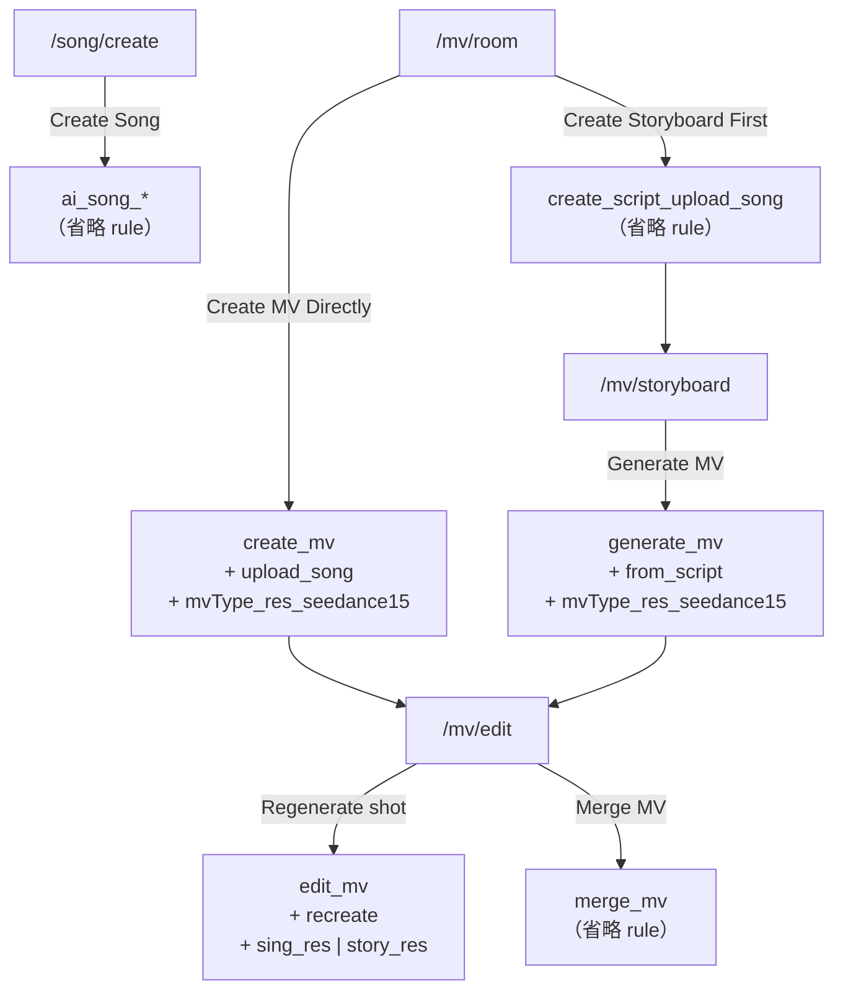

# Area 11 — Credit Consumption (RD 扣點規格)

> **Audience:** RD（App / Web 前端 + 後端串接）。
> **What this is:** 每個扣點情境要 call 哪支 API、帶哪些 action，以及後端如何算出總點數。
> **Sources:** `[YCM] Credit Consume Cloud Config .json`（**唯一權威來源**）、
> `MSR Credit Consume Form (with Sub-Actions).md`（機制說明）、`YCM Credit_Action.pdf`（成本/定價推導）。
>
> ⚠️ **數值以 cloud config JSON 為準。** `YCM Credit_Action.pdf` 的部分 credit 數字與 JSON 不同
> （6 個 `*_seedance15` 的每秒點數、`create_script_upload_song` 的級距）— PDF 是成本試算稿，會再調整。
> **點數是可調參數，RD 不應 hardcode**；本文的重點是 **action 組合方式**，那才是介面契約。
>
> Related: 餘額 / 儲值 / 訂閱 UI → `07-credits-iap.md`。各流程的 UI 行為 → `02-mv-creation.md`、
> `03-song-creation.md`。
>
> ---
>
> ## 📌 這份檔案**就是** S10（`credit-consumption`）的 spec
>
> **產品負責人裁示 2026-09-01**，沿用先前對 S11（`notifications-email`）的同一個決定:
> 「storyboard spec 都不用畫面，或是直接用 md 當成 spec 即可」。
>
> S10 因此**不另外產出 `specs/storyboards/credit-consumption/specs/spec.html`**。理由不只是省事:
> 這個題目**沒有畫面可走** —— 它是一份 payload 契約，`yco-spec` 的 storyboard 形態（截圖 →
> 步驟卡 → 焦點框）對它沒有東西可拍。skill 自己的 `data-contract` 形態原本適用，但它**強制要求**
> 一份完整的欄位表，而這裡唯一未定的就是欄位（見下方 §1.1）—— 產出一份中間空一格的 HTML，
> 不會比這份 md 更能交接。
>
> **交接時 RD 讀這一份就夠**: §1 是 API 與 payload、§2 是計量基準、§3 是六個扣點情境的完整
> 呼叫方式、§4 是 action 對照總表、§5 是扣點時機與失敗退款、§9 是 QA 檢查清單。
> **唯一的缺口是 §1.1**，且它是 blocking 的。

---

## 1. API

| 項目 | 值 |
|---|---|
| Form | **MSR Credit Consume Form** |
| GenericSetting | `credit_consume: 1.0` |

**Payload 格式** — key 名稱與 cloud config 一致。分兩種形狀：

```json
// 有 sub action（委派型 main action）
{
  "action": "<main action>",
  "consumedType": "credit",
  "rule": ["<sub action>", "…"]
}

// 無 sub action（自帶規則型 main action）— rule 整個欄位省略
{
  "action": "<main action>",
  "consumedType": "credit"
}
```

| Key | 說明 |
|---|---|
| `action` | main action 名稱，一次任務一個。 |
| `consumedType` | **一律填 `"credit"`**（cloud config 2026-08-12 更新：23 個 action 全部從 `"duration"` 改為 `"credit"`）。後端以此區分 `duration` / `credit` 兩種計費基準。**只要 payload 有這個欄位就必須帶上。** ⚠️ 這個改動同時改變了前端責任 —— 見下方 §「數量由誰提供」。 |
| `rule` | sub action 名稱陣列。**注意 key 是 `rule`，不是 `subActions`** — `MSR Credit Consume Form (with Sub-Actions).md` 的示意範例寫作 `subActions`，實際 API 以 `rule` 為準。**無 sub action 時整個欄位省略，不要送空陣列 `[]`。** |

Sub-action 機制的設計理由（避免組合爆炸、子服務可獨立複用）見 `MSR Credit Consume Form
(with Sub-Actions).md`。RD 只需知道：**一次任務 = 一個 main action + 0~N 個 sub actions**，
後端把命中的計費規則全部加總。

---

### 1.1 🔴 待補 —— 數量欄位（`TBD-CC-06`）

**這一節刻意留白。** 產品負責人 2026-09-01 指示: 「請完全不猜且留空，我會之後補」。

`consumedType` 從 `duration` 改成 `credit` 之後，**前端必須自己在 payload 帶數量／秒數**
（原本後端從 task 自己取）。上面 §1 的 payload 只有 `action` / `consumedType` / `rule[]`
三個 key，**沒有任何欄位放得下這個數量**。在補上之前，前端無法實作扣點呼叫。

| 待定項 | 目前狀態 |
| --- | --- |
| 欄位名稱 | _（待補）_ |
| 放在哪一層（payload 根層／每個 `rule` 元素內） | _（待補）_ |
| 單位（秒 / 幀 / 結果數 / 其他） | _（待補）_ |
| 委派型 action（`create_mv` / `generate_mv` / `edit_mv`）的數量對應到哪一個 sub action | _（待補）_ |
| 級距型（`create_script_upload_song` / `merge_mv`）是送原始長度、還是送已選好的級距 | _（待補）_ |
| 帶了數量之後，`rule[]` 的形狀是否改變 | _（待補）_ |

<details><summary>已經找過哪些文件，以及為什麼它們不算答案（2026-09-01）</summary>

搜過 repo 第一層與 `web-app/docs/`。**確實有 credit 相關的規範文件，但沒有一份定義這個欄位**:

| 文件 | 它定義了什麼 | 為什麼不是答案 |
| --- | --- | --- |
| `[YCM] Credit Consume Cloud Config .json` | **後端**計價規則: 每條 rule 的 `procUnit` / `token` / `tknPerRes` / `tknPerChar` / `procUnitRange` | 這是後端「一個處理單位收幾點」的設定，不是前端 request 要帶什麼 |
| `MSR Credit Consume Form (with Sub-Actions).md` | sub-action 機制、rule 形狀範例 | 同上，示範的是 cloud config 那一側 |
| `YCM Credit_Action.pdf` | 每個 sub action 幾點、`45+6*(x sec)` 這類公式 | 定義了 `x` 怎麼被使用，沒有定義 `x` 怎麼被**傳送** |
| `YCV AI MV Cost Estimation Table…pdf` | YCV 的對應成本表 | 同上，且是另一個產品線 |

也就是說: **「一秒值幾點」有文件，「秒數放在 request 的哪裡」沒有。** 這正是 `TBD-CC-06`。

</details>

---

## 2. 核心概念

**Main action** — 記錄在扣點歷史 (Token History) 用，一個生成任務對應一個。
**Sub actions** — 實際計費單位；同一個 sub action 可被不同 main action 複用
（例：`singing_720p_seedance15` 同時被 `create_mv` 和 `generate_mv` 使用）。

> ⚠️ **`rule` 這個字有兩個意思，別混淆：**
> **Payload 的 `rule`** = 前端送出的 **sub action 名稱陣列**。
> **Cloud config 的 `rule`** = 後端該 action 的**計費規則**（`token` / `tknPerRes` / `procUnitRange`）。
> 前端只組前者，後者是後端查表用的。

兩種主 action：

| 型態 | Cloud config 特徵 | 扣點來源 |
|---|---|---|
| **委派型** | 計費規則 `"rule": []` | 完全由 payload 的 `rule` 陣列決定（`create_mv` / `generate_mv` / `edit_mv`） |
| **自帶規則型** | 計費規則非空 | main action 自己就是計費單位，**payload 省略 `rule` 欄位**（AI Song 全部 / `create_script_upload_song` / `merge_mv`） |

### 計費規則速查（cloud config 端，供理解用）

| 欄位組合 | 意義 | 範例 |
|---|---|---|
| `tknPerRes: N`, `procUnit: 1` | **每次結果固定 N 點**，與長度無關 | `upload_song` → 45 |
| `token: N`, `procUnit: 1` | **每秒 N 點** → `N × x sec` | `singing_720p_seedance15` → 5/sec |
| `procUnitRange: [a,b]`, `token: N` | 長度落在 a~b 秒 → **固定 N 點** | `merge_mv` 1–240s → 10 |
| `[]`（空陣列） | 不計費，委派給 sub actions | `create_mv` |

**數量由誰提供 —— 2026-08-12 起改由前端負責。**

> ⚠️ **這一段在 2026-08-12 反轉了。** 原文是「`consumedType: "duration"` + `x sec`：秒數由**後端
> 自己從 task 取得**，App / Web **不需要在 payload 帶秒數**」。cloud config 改成 `"credit"` 之後，
> 產品負責人確認(2026-08-12)：**前端要自己在 payload 帶數量／秒數**。這是真正的介面契約變更，
> 不只是欄位換名字 —— RD 與前端都要動。實際 payload 欄位名與格式尚未定案(`TBD-CC-06`)。

各 action 的計量基準(仍然不變，只是改由前端提供)：

- `create_mv` / `generate_mv` → **最終 MV 總長**
- `edit_mv`（recreate）→ **被重生成的那一個 shot 的長度**
- `create_script_upload_song` / `merge_mv` → 歌曲 / MV 長度（用來選 `procUnitRange` 級距）

**長度上限：** 產品支援的 MV / 歌曲長度最長 **240 秒（4 分鐘）**，各 `procUnitRange` 的上限 240
已完整涵蓋，不存在「超出級距」的情況。

**總點數 = main action rule + Σ 所有 sub action rule。**

---

## 3. 六個扣點情境

### 3.1 AI Song — 生成歌曲

**觸發：** `/song/create` → **Create Song**
**Action：** 依 `mode` × `Instrumental` toggle 四選一，**無 sub action**。

| Mode | Instrumental toggle | action | credit |
|---|---|---|---|
| Simple | OFF（= vocal） | `ai_song_simple_vocal` | 6 |
| Simple | ON | `ai_song_simple_instrumental` | 12 |
| Custom | OFF（= vocal） | `ai_song_custom_vocal` | 6 |
| Custom | ON | `ai_song_custom_instrumental` | 12 |

> 早期 cloud config 上此 action 拼作 `ai_song_simpe_instrumental`（缺 `l`），**後端已修正為
> `ai_song_simple_instrumental`**。手邊若有舊版 config 快照，以本表為準。

```json
{
  "action": "ai_song_custom_vocal",
  "consumedType": "credit"
}
```

---

### 3.2 Create MV — 直接生成 MV

**觸發：** `/mv/room` → Create Music Video → ModeModal → **Create MV Directly**
**Action：** `create_mv`（委派）+ `rule` 帶 2 個 sub action。

| sub action | 來源 | 規則 |
|---|---|---|
| `upload_song` | 固定帶，不分歌曲來源（My Songs / Sample / Import 皆同） | 每次 45 點 |
| `<mvType>_<res>_seedance15` | MV type × 畫質 | 每秒 N 點 |

`mvType` = `singing` \| `storytelling` \| `hybrid`　·　`res` = `720p`（UI **Standard**）\| `1080p`（UI **High**）

```json
{
  "action": "create_mv",
  "consumedType": "credit",
  "rule": ["upload_song", "singing_1080p_seedance15"]
}
```

**計算：** `45 + 6 × x sec`　→ 30 秒 MV = **225 點**

---

### 3.3 Create Script — 生成分鏡腳本

**觸發：** `/mv/room` → Create Music Video → ModeModal → **Create Storyboard First**
**Action：** `create_script_upload_song`，**無 sub action**（自帶級距規則）。

| 歌曲長度 | credit |
|---|---|
| 1–120s | 15 |
| 121–240s | 18 |

```json
{
  "action": "create_script_upload_song",
  "consumedType": "credit"
}
```

> 級距由後端依 task 的歌曲長度自動比對 `procUnitRange`，前端不需判斷。

---

### 3.4 Generate MV — 由腳本生成 MV

**觸發：** `/mv/storyboard` → **Generate MV**
**Action：** `generate_mv`（委派）+ `rule` 帶 2 個 sub action。與 3.2 的差別只在 per-song 那顆
（`from_script` 35 取代 `upload_song` 45，因為腳本階段已收過費）。

```json
{
  "action": "generate_mv",
  "consumedType": "credit",
  "rule": ["from_script", "storytelling_720p_seedance15"]
}
```

**計算：** `35 + 2 × x sec`　→ 30 秒 MV = **95 點**

> **走 storyboard 路線的總花費** = 3.3 + 3.4。以 30 秒 storytelling/720p 為例：
> 腳本 **12**（30s 落在 §6.1 新增的 `[1,40]` 級距）+ 生成 **95** = **107**。
>
> _修正 2026-08-19：原本寫「15 + 95 = 110」，那是 §6.1 補上 `[1,40] = 12` 之前的算法 ——
> 30 秒的歌現在是 12 不是 15，所以這份文件的兩節互相矛盾。以級距表為準。_

---

### 3.5 Edit MV - Recreate — 重生成單一 shot

**觸發：** `/mv/edit` → 選一個 shot → **Regenerate**
**Action：** `edit_mv`（委派）+ `rule` 帶 2 個 sub action。**每重生成一個 shot 呼叫一次。**

| sub action | 規則 |
|---|---|
| `recreate` | 每次 8 點 |
| `sing_<res>` 或 `story_<res>` | 每秒 N 點（`sing` 7 · `story_720p` 2 · `story_1080p` 4） |

**選 `sing_*` 還是 `story_*`：依「該 shot 本身的類型」判斷，不是看 MV 的 type。**
所以 Hybrid MV 兩種都可能出現 — 歌唱段落用 `sing_*`，敘事段落用 `story_*`。
（此處**沒有** `hybrid_*` 的 sub action。）

```json
{
  "action": "edit_mv",
  "consumedType": "credit",
  "rule": ["recreate", "story_1080p"]
}
```

**計算：** `8 + 4 × (該 shot 秒數)`　→ 5 秒 shot = **28 點**

> **封面 Recreate（`TBD-CC-02`）：** 功能保留，但 cloud config 尚無對應 action —
> **後端待補**。補上前，前端執行封面重生成時**不呼叫扣點 API**；補上後回填此處的 payload 與點數。

---

### 3.6 Edit MV - Merge MV — 合併輸出

**觸發：** `/mv/edit` → **Merge MV**
**Action：** `merge_mv`，**無 sub action**。

| MV 長度 | credit |
|---|---|
| 1–240s | 10（固定） |

```json
{
  "action": "merge_mv",
  "consumedType": "credit"
}
```

---

## 4. Action 對照總表

| # | 情境 | main action | `rule`（sub actions） | 計費形態 |
|---|---|---|---|---|
| 1 | AI Song | `ai_song_{simple\|custom}_{vocal\|instrumental}` | *(省略)* | 固定 |
| 2 | Create MV | `create_mv` | `upload_song` + `<mvType>_<res>_seedance15` | 固定 + 每秒 |
| 3 | Create Script | `create_script_upload_song` | *(省略)* | 級距 |
| 4 | Generate MV | `generate_mv` | `from_script` + `<mvType>_<res>_seedance15` | 固定 + 每秒 |
| 5 | Edit MV - Recreate | `edit_mv` | `recreate` + `sing_<res>`\|`story_<res>` | 固定 + 每秒 |
| 6 | Edit MV - Merge | `merge_mv` | *(省略)* | 級距 |

**完整 sub action 清單（12 個）**

| Per-song（固定） | | Per-second（每秒） | |
|---|---|---|---|
| `upload_song` | 45 | `singing_720p_seedance15` | 5 |
| `from_script` | 35 | `singing_1080p_seedance15` | 6 |
| `recreate` | 8 | `storytelling_720p_seedance15` | 2 |
| | | `storytelling_1080p_seedance15` | 4 |
| | | `hybrid_720p_seedance15` | 4 |
| | | `hybrid_1080p_seedance15` | 5 |
| | | `sing_720p` / `sing_1080p` | 7 / 7 |
| | | `story_720p` / `story_1080p` | 2 / 4 |

---

## 5. 扣點時機與失敗處理

1. **送出生成任務時扣點**（不是完成時）。
2. **任務 failed → 全額退點。**
3. **送出前先檢查餘額**：不足時不呼叫扣點 API，改導向 IAP（`BuyCreditsModal` / `SubscribeModal`），
   細節見 `07-credits-iap.md`。
4. 每個 shot 的 Recreate 是**獨立一次扣點**，不合併計算。
5. **AI Enhance / Refine prompt 不扣點** — description、visual style、scene prompt、cover description、
   歌詞 Refine 等 prompt 優化操作皆為免費，**不呼叫本 API**。
   ~~⚠️ web prototype 目前實作為「每 session 首次免費、之後 1 點」~~ ✅ **已於 2026-08-12 移除**
   （`enhanceCost`/`consumeEnhance` 已自 `useCredits` 刪除，`EnhanceButton` 也不再顯示點數）。

---

## 6. 已從 cloud config 移除的 action（2026-08-12）

先前列為「預留、不上線」的 13 個 action **已在 2026-08-12 的 config 更新中實際刪除**，
config 從 35 個 action 降為 23 個。這是 config 往本規格靠攏，不是新的分歧：

```
{singing|storytelling|hybrid}_{short|full}_{720p|1080p}_seedance15   ← 12 個，全數移除
ai_song_custom_vocal_refine                                          ← 移除
```

那 12 個用 `tknPerRes`（固定收費）而非每秒收費，屬於未來「固定長度 MV 方案」的預留設定；
移除代表**該方案的設定已收回**，若日後要做需重新加回。`ai_song_custom_vocal_refine`
（0 點）本來就標為已刪除、prototype 無對應功能。

**RD：這 13 個不會再出現在 config，也不要呼叫。**

### 6.1 2026-08-12 config 更新的其他變更

| 變更 | 內容 |
|---|---|
| **`edit_poster`（新增）** | MV Edit 的**封面重新生成**（`MvEditor.recreateCover()`）。**每次結果固定 4 點** = `tknPerRes: 4` + `procUnit: 1`。⚠️ config 目前寫成 `{ "token": 4, "tknPerRes": 1 }` —— 兩個費率 key、缺 `procUnit`，不符合 §「計費規則速查」的任一種合法組合。原始版本是 `perRes`，改名時把 `4` 留在 `token` 上。**產品負責人確認語意為「每次 4 點」(2026-08-12)；請後台把形狀修正為 `tknPerRes: 4` + `procUnit: 1`。** |
| **`create_script_upload_song`（新增級距）** | 原本 `[1,120] = 15` / `[121,240] = 18`；現在多一段 **`[1,40] = 12`**，即 40 秒以內的短歌從 15 降為 12。 |
| **`consumedType`** | 23 個 action 全部 `"duration"` → `"credit"`。見 §「數量由誰提供」。 |

**prototype 對照（更新 2026-08-19）：** `COST_COVER` 已是權威值 **4**。所有 placeholder
都已依本規格重算，見 §7 的 `TBD-CC-05`。

---

## 7. 待確認 (TBD)

| ID | 項目 |
|---|---|
| ~~**TBD-CC-01**~~ | ✅ **2026-08-12 結案** — config 已補回 `[1,40] = 12` 那一階，三階與 PDF 一致（12 / 15 / 18）。 |
| ~~**TBD-CC-02**~~ | ✅ **2026-08-12 結案** — 後端補上了 **`edit_poster`**，就是 Edit MV 封面 Recreate 的 action（每次 4 點）。仍待後台修正規則形狀，見 §6.1。 |
| **TBD-CC-06** | 🔴 **前端要帶數量／秒數，但欄位名與格式未定 —— 空白表在 §1.1，產品負責人會補。** 2026-09-01 已搜過 repo 第一層與 `docs/`: credit 的**定價**有四份文件，但**沒有一份定義 request 要怎麼帶數量**（§1.1 的 details 列了逐份結論）。刻意不猜。（2026-08-19 註：此項**只擋 API 呼叫**，不擋計價。prototype 的餘額是本機的，四個計價函式已依本規格算出正確點數；待定的是送給後端時的欄位名。） `consumedType` 改為 `"credit"` 後，產品負責人確認前端須自行在 payload 帶數量／秒數（原本由後端從 task 取得）。**這是介面契約變更**：需要 RD 給出欄位名、單位（秒?幀?結果數?）、以及委派型 action（`create_mv`/`generate_mv`/`edit_mv`）的數量要對應到哪一個 sub action。在定案前前端無法實作扣點呼叫。 |
| ~~**TBD-CC-05**~~ | ✅ **2026-08-19 結案。** 六個 placeholder 已全數依本規格重算：`COST_SONG` → 6/12（2026-08-12）· `COST_SONG_RECREATE` → 與首次生成同價（2026-08-12）· `COST_COVER` → 4（2026-08-12）· `COST_STORYBOARD` / `COST_RENDER` / `COST_REGEN` → **刪除**，改為 `scriptCost()` / `createMvCost()` / `generateMvCost()` / `recreateShotCost()` 四個依本規格計算的函式（2026-08-19）。AI Enhance 的 1 點收費也已移除。**「改為由後端回傳」仍未做，但那四個函式就是唯一的替換點**——`contract.surface.test.ts` 用本文的計算範例（225 / 95 / 28 / 12·15·18）鎖住它們。詳見 `docs/CHANGELOG-RD.md` 2026-08-19。 |

**已結案：** ~~TBD-CC-03~~（AI Enhance 不扣點，見 §5.5）·
~~TBD-CC-04~~（產品上限 240s，級距已完整涵蓋，見 §2）· ~~`simpe` 拼字~~（後端已修正，見 §3.1）。

---

## 9. QA 檢查清單（S10）

這份 md 就是 S10 的 spec（見檔頭），所以覆蓋表放在這裡而不是另一份 HTML。**每一項都對得到本文的
某一節**；打不了勾的那一項就是還沒交接完的那一項。

| # | 檢查 | 對應 | 現在能測嗎 |
| --- | --- | --- | --- |
| 1 | 六個扣點情境各自送出正確的 `action` | §3.1–§3.6、§4 | ✅ 前端四個計價函式已算對，`contract.surface.test.ts` 用本文的範例鎖住（225 / 95 / 28 / 12·15·18） |
| 2 | 有 sub action 時 `rule[]` 內容與順序正確；沒有時**整個欄位省略**（不是空陣列） | §1、§4 | ✅ 可用本文的對照表逐一核對 |
| 3 | `consumedType` **一律** `"credit"`（23 個 action 全部） | §1 | ✅ |
| 4 | 12 個 sub action 的點數與 cloud config 一致（不 hardcode） | §4 | ✅ 以 JSON 為準 |
| 5 | 扣點時機：開始時扣、失敗時退 | §5 | ✅ e2e 已涵蓋（`charges` / `refunds`） |
| 6 | 級距型（`create_script_upload_song` / `merge_mv`）落在正確的 `procUnitRange` | §2、§3.3、§3.6 | ✅ |
| 7 | AI Enhance 不扣點 | §5.5 | ✅ |
| 8 | **request 帶出的數量／秒數欄位正確** | **§1.1** | ❌ **擋住** —— 欄位未定義，無從測起 |

> **第 8 項是唯一的紅燈，而且它擋的是「呼叫後端」這一段，不擋計價。** prototype 的餘額是本機的，
> 四個計價函式已依本規格算出正確點數；缺的是把數量送出去時要用哪個欄位。

---

## 8. 流程圖


