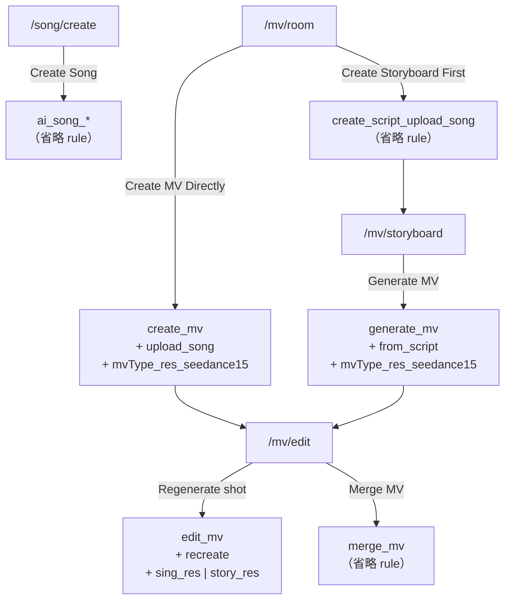

# Area 11 — Credit Consumption (RD 扣點規格)

> **Audience:** RD（App / Web 前端 + 後端串接）。
> **What this is:** 每個扣點情境要 call 哪支 API、帶哪些 action，以及後端如何算出總點數。
> **Sources:** `[YCM] Credit Consume Cloud Config .json`（**唯一權威來源**）、
> `MSR Credit Consume Form (with Sub-Actions).md`（機制說明）、`YCM Credit_Action.pdf`（成本/定價推導）。
>
> ⚠️ **數值以 cloud config JSON 為準。** `YCM Credit_Action.pdf` 的部分 credit 數字與 JSON 不同
> （6 個 `*_seedance15` 的每秒點數、`create_script_upload_song` 的級距）— PDF 是成本試算稿，會再調整。
> **點數是可調參數，RD 不應 hardcode**；本文的重點是 **action 組合方式**，那才是介面契約。
>
> Related: 餘額 / 儲值 / 訂閱 UI → `07-credits-iap.md`。各流程的 UI 行為 → `02-mv-creation.md`、
> `03-song-creation.md`。

---

## 1. API

| 項目 | 值 |
|---|---|
| Form | **MSR Credit Consume Form** |
| GenericSetting | `credit_consume: 1.0` |

**Payload 格式** — key 名稱與 cloud config 一致。分兩種形狀：

```json
// 有 sub action（委派型 main action）
{
  "action": "<main action>",
  "consumedType": "duration",
  "rule": ["<sub action>", "…"]
}

// 無 sub action（自帶規則型 main action）— rule 整個欄位省略
{
  "action": "<main action>",
  "consumedType": "duration"
}
```

| Key | 說明 |
|---|---|
| `action` | main action 名稱，一次任務一個。 |
| `consumedType` | **一律填 `"duration"`**。後端以此區分 `duration` / `credit` 兩種計費基準；本文所有情境都是 `duration`，**只要 payload 有這個欄位就必須帶上**。 |
| `rule` | sub action 名稱陣列。**注意 key 是 `rule`，不是 `subActions`** — `MSR Credit Consume Form (with Sub-Actions).md` 的示意範例寫作 `subActions`，實際 API 以 `rule` 為準。**無 sub action 時整個欄位省略，不要送空陣列 `[]`。** |

Sub-action 機制的設計理由（避免組合爆炸、子服務可獨立複用）見 `MSR Credit Consume Form
(with Sub-Actions).md`。RD 只需知道：**一次任務 = 一個 main action + 0~N 個 sub actions**，
後端把命中的計費規則全部加總。

---

## 2. 核心概念

**Main action** — 記錄在扣點歷史 (Token History) 用，一個生成任務對應一個。
**Sub actions** — 實際計費單位；同一個 sub action 可被不同 main action 複用
（例：`singing_720p_seedance15` 同時被 `create_mv` 和 `generate_mv` 使用）。

> ⚠️ **`rule` 這個字有兩個意思，別混淆：**
> **Payload 的 `rule`** = 前端送出的 **sub action 名稱陣列**。
> **Cloud config 的 `rule`** = 後端該 action 的**計費規則**（`token` / `tknPerRes` / `procUnitRange`）。
> 前端只組前者，後者是後端查表用的。

兩種主 action：

| 型態 | Cloud config 特徵 | 扣點來源 |
|---|---|---|
| **委派型** | 計費規則 `"rule": []` | 完全由 payload 的 `rule` 陣列決定（`create_mv` / `generate_mv` / `edit_mv`） |
| **自帶規則型** | 計費規則非空 | main action 自己就是計費單位，**payload 省略 `rule` 欄位**（AI Song 全部 / `create_script_upload_song` / `merge_mv`） |

### 計費規則速查（cloud config 端，供理解用）

| 欄位組合 | 意義 | 範例 |
|---|---|---|
| `tknPerRes: N`, `procUnit: 1` | **每次結果固定 N 點**，與長度無關 | `upload_song` → 45 |
| `token: N`, `procUnit: 1` | **每秒 N 點** → `N × x sec` | `singing_720p_seedance15` → 5/sec |
| `procUnitRange: [a,b]`, `token: N` | 長度落在 a~b 秒 → **固定 N 點** | `merge_mv` 1–240s → 10 |
| `[]`（空陣列） | 不計費，委派給 sub actions | `create_mv` |

**`consumedType: "duration"` + `x sec`：** 秒數由**後端自己從 task 取得**，App / Web **不需要在
payload 帶秒數**。基準為：

- `create_mv` / `generate_mv` → **最終 MV 總長**
- `edit_mv`（recreate）→ **被重生成的那一個 shot 的長度**
- `create_script_upload_song` / `merge_mv` → 歌曲 / MV 長度（用來選 `procUnitRange` 級距）

**長度上限：** 產品支援的 MV / 歌曲長度最長 **240 秒（4 分鐘）**，各 `procUnitRange` 的上限 240
已完整涵蓋，不存在「超出級距」的情況。

**總點數 = main action rule + Σ 所有 sub action rule。**

---

## 3. 六個扣點情境

### 3.1 AI Song — 生成歌曲

**觸發：** `/song/create` → **Create Song**
**Action：** 依 `mode` × `Instrumental` toggle 四選一，**無 sub action**。

| Mode | Instrumental toggle | action | credit |
|---|---|---|---|
| Simple | OFF（= vocal） | `ai_song_simple_vocal` | 6 |
| Simple | ON | `ai_song_simple_instrumental` | 12 |
| Custom | OFF（= vocal） | `ai_song_custom_vocal` | 6 |
| Custom | ON | `ai_song_custom_instrumental` | 12 |

> 早期 cloud config 上此 action 拼作 `ai_song_simpe_instrumental`（缺 `l`），**後端已修正為
> `ai_song_simple_instrumental`**。手邊若有舊版 config 快照，以本表為準。

```json
{
  "action": "ai_song_custom_vocal",
  "consumedType": "duration"
}
```

---

### 3.2 Create MV — 直接生成 MV

**觸發：** `/mv/room` → Create Music Video → ModeModal → **Create MV Directly**
**Action：** `create_mv`（委派）+ `rule` 帶 2 個 sub action。

| sub action | 來源 | 規則 |
|---|---|---|
| `upload_song` | 固定帶，不分歌曲來源（My Songs / Sample / Import 皆同） | 每次 45 點 |
| `<mvType>_<res>_seedance15` | MV type × 畫質 | 每秒 N 點 |

`mvType` = `singing` \| `storytelling` \| `hybrid`　·　`res` = `720p`（UI **Standard**）\| `1080p`（UI **High**）

```json
{
  "action": "create_mv",
  "consumedType": "duration",
  "rule": ["upload_song", "singing_1080p_seedance15"]
}
```

**計算：** `45 + 6 × x sec`　→ 30 秒 MV = **225 點**

---

### 3.3 Create Script — 生成分鏡腳本

**觸發：** `/mv/room` → Create Music Video → ModeModal → **Create Storyboard First**
**Action：** `create_script_upload_song`，**無 sub action**（自帶級距規則）。

| 歌曲長度 | credit |
|---|---|
| 1–120s | 15 |
| 121–240s | 18 |

```json
{
  "action": "create_script_upload_song",
  "consumedType": "duration"
}
```

> 級距由後端依 task 的歌曲長度自動比對 `procUnitRange`，前端不需判斷。

---

### 3.4 Generate MV — 由腳本生成 MV

**觸發：** `/mv/storyboard` → **Generate MV**
**Action：** `generate_mv`（委派）+ `rule` 帶 2 個 sub action。與 3.2 的差別只在 per-song 那顆
（`from_script` 35 取代 `upload_song` 45，因為腳本階段已收過費）。

```json
{
  "action": "generate_mv",
  "consumedType": "duration",
  "rule": ["from_script", "storytelling_720p_seedance15"]
}
```

**計算：** `35 + 2 × x sec`　→ 30 秒 MV = **95 點**

> **走 storyboard 路線的總花費** = 3.3 + 3.4（例：15 + 95 = 110），比 3.2 直接生成多出腳本費用。

---

### 3.5 Edit MV - Recreate — 重生成單一 shot

**觸發：** `/mv/edit` → 選一個 shot → **Regenerate**
**Action：** `edit_mv`（委派）+ `rule` 帶 2 個 sub action。**每重生成一個 shot 呼叫一次。**

| sub action | 規則 |
|---|---|
| `recreate` | 每次 8 點 |
| `sing_<res>` 或 `story_<res>` | 每秒 N 點（`sing` 7 · `story_720p` 2 · `story_1080p` 4） |

**選 `sing_*` 還是 `story_*`：依「該 shot 本身的類型」判斷，不是看 MV 的 type。**
所以 Hybrid MV 兩種都可能出現 — 歌唱段落用 `sing_*`，敘事段落用 `story_*`。
（此處**沒有** `hybrid_*` 的 sub action。）

```json
{
  "action": "edit_mv",
  "consumedType": "duration",
  "rule": ["recreate", "story_1080p"]
}
```

**計算：** `8 + 4 × (該 shot 秒數)`　→ 5 秒 shot = **28 點**

> **封面 Recreate（`TBD-CC-02`）：** 功能保留，但 cloud config 尚無對應 action —
> **後端待補**。補上前，前端執行封面重生成時**不呼叫扣點 API**；補上後回填此處的 payload 與點數。

---

### 3.6 Edit MV - Merge MV — 合併輸出

**觸發：** `/mv/edit` → **Merge MV**
**Action：** `merge_mv`，**無 sub action**。

| MV 長度 | credit |
|---|---|
| 1–240s | 10（固定） |

```json
{
  "action": "merge_mv",
  "consumedType": "duration"
}
```

---

## 4. Action 對照總表

| # | 情境 | main action | `rule`（sub actions） | 計費形態 |
|---|---|---|---|---|
| 1 | AI Song | `ai_song_{simple\|custom}_{vocal\|instrumental}` | *(省略)* | 固定 |
| 2 | Create MV | `create_mv` | `upload_song` + `<mvType>_<res>_seedance15` | 固定 + 每秒 |
| 3 | Create Script | `create_script_upload_song` | *(省略)* | 級距 |
| 4 | Generate MV | `generate_mv` | `from_script` + `<mvType>_<res>_seedance15` | 固定 + 每秒 |
| 5 | Edit MV - Recreate | `edit_mv` | `recreate` + `sing_<res>`\|`story_<res>` | 固定 + 每秒 |
| 6 | Edit MV - Merge | `merge_mv` | *(省略)* | 級距 |

**完整 sub action 清單（12 個）**

| Per-song（固定） | | Per-second（每秒） | |
|---|---|---|---|
| `upload_song` | 45 | `singing_720p_seedance15` | 5 |
| `from_script` | 35 | `singing_1080p_seedance15` | 6 |
| `recreate` | 8 | `storytelling_720p_seedance15` | 2 |
| | | `storytelling_1080p_seedance15` | 4 |
| | | `hybrid_720p_seedance15` | 4 |
| | | `hybrid_1080p_seedance15` | 5 |
| | | `sing_720p` / `sing_1080p` | 7 / 7 |
| | | `story_720p` / `story_1080p` | 2 / 4 |

---

## 5. 扣點時機與失敗處理

1. **送出生成任務時扣點**（不是完成時）。
2. **任務 failed → 全額退點。**
3. **送出前先檢查餘額**：不足時不呼叫扣點 API，改導向 IAP（`BuyCreditsModal` / `SubscribeModal`），
   細節見 `07-credits-iap.md`。
4. 每個 shot 的 Recreate 是**獨立一次扣點**，不合併計算。
5. **AI Enhance / Refine prompt 不扣點** — description、visual style、scene prompt、cover description、
   歌詞 Refine 等 prompt 優化操作皆為免費，**不呼叫本 API**。
   ⚠️ web prototype 目前實作為「每 session 首次免費、之後 1 點」（`enhanceCost`/`consumeEnhance`），
   與此決議不符，需移除（`TBD-CC-05`）。

---

## 6. 保留 / 不使用的 action

Cloud config 內以下 **12 個 action 為預留、目前不上線**，RD **不要呼叫**：

```
{singing|storytelling|hybrid}_{short|full}_{720p|1080p}_seedance15
```

它們用 `tknPerRes`（固定收費）而非每秒收費，屬於未來「固定長度 MV 方案」的預留設定。

`ai_song_custom_vocal_refine`（0 點）為**已刪除的 action**，prototype 無對應功能，**忽略**。

---

## 7. 待確認 (TBD)

| ID | 項目 |
|---|---|
| **TBD-CC-01** | `create_script_upload_song` 的級距：PDF 有 3 階（1–40s=12 / 41–120s=15 / 121–240s=18），JSON 只有 2 階（1–120s=15 / 121–240s=18）。以 JSON 為準，但需確認是否要補回 12 點那一階。 |
| **TBD-CC-02** | **Edit MV 的封面 Recreate — 後端待補 action。** 功能保留在 spec 中（見 §3.5），但 cloud config 目前無對應 action，後端補上後回填本文的 payload 與點數。在那之前前端不呼叫扣點 API。 |
| **TBD-CC-05** | Prototype 目前的 placeholder 點數（`COST_STORYBOARD=20` / `COST_RENDER=200` / `COST_SONG=10` / `COST_SONG_RECREATE=50` / `COST_REGEN=20` / `COST_COVER=10`）與本規格不符 — 需依本文重算，並改為由後端回傳而非 hardcode；同時移除 AI Enhance 的 1 點收費（`enhanceCost`/`consumeEnhance`，見 §5.5）。 |

**已結案：** ~~TBD-CC-03~~（AI Enhance 不扣點，見 §5.5）·
~~TBD-CC-04~~（產品上限 240s，級距已完整涵蓋，見 §2）· ~~`simpe` 拼字~~（後端已修正，見 §3.1）。

---

## 8. 流程圖


