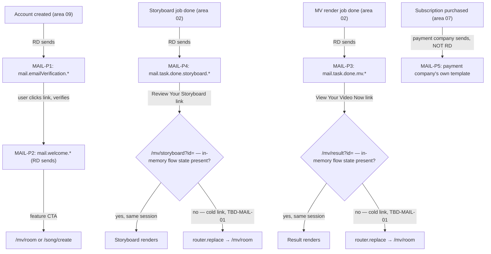

# Area 12 — Notification Emails

> Read `../00-overview.md` first (conventions, ID scheme). **As-built**; ⚠️ = divergence /
> correction, ❓ = a tracked `TBD-*`, 🔒 = mock/in-memory, 🔧 = backend work item for RD.
>
> ⚠️ **Backend note (G3): this entire area is a backend contract, not a built feature.** The
> prototype (`web-app/`) has **no mail capability at all** — no mail service, no send API, no
> template engine. `email` exists only as a field on the mock `Profile` (`lib/user.ts` →
> `AuthProvider`'s `DEFAULT_PROFILE`, area 06 §3.1). Nothing in this document is exercised by
> clicking around the running app; it exists so RD can implement the real thing.

---

## 1. Overview & scope

Source: `../../docs/RD-REQUEST-NOTIFICATION-EMAILS.md` (Chinese, with the English `.properties`
copy blocks that ARE the RD contract for four of the five emails — read it in full before touching
this file; this spec references it rather than re-transcribing it, per the single-source rule).

**Five email types are confirmed.** Who sends each:

| # | Email                       | Sender                                                                 | In this spec? |
| - | ---------------------------- | ----------------------------------------------------------------------- | -------------- |
| 1 | Email verification           | **RD** (already sending; this request adds Muse-specific copy)          | ✅ MAIL-P1     |
| 2 | Onboarding / Welcome         | **RD** (re-requested — see below)                                       | ✅ MAIL-P2     |
| 3 | MV generation complete       | **RD**                                                                   | ✅ MAIL-P3     |
| 4 | Storyboard generation complete | **RD**                                                                 | ✅ MAIL-P4     |
| 5 | Subscription confirmation    | **The payment company** — see next paragraph                            | ✅ MAIL-P5 (reference only) |

Emails 1–4 are **implemented by RD, with copy supplied by Marcom, ready 2026-09-09**.

⚠️ **Email 5 (subscription confirmation) — supersession.** The product owner's conclusion of
**2026-09-01** is: it is sent by **the payment company — Stripe in the US, 2Checkout everywhere
else**. This **supersedes** `docs/RD-REQUEST-NOTIFICATION-EMAILS.md`, which predates the US/Stripe
split and names **only 2Checkout** (its own closing section, "訂閱成功信", says the confirmation is
set up "in 2Checkout's back office"). Neither RD nor this app sends it, and neither implements it —
there is no copy to build against and no `.properties` block for it. It is listed here only so the
area's map is complete and so a future alignment pass (brand voice/signature/link colour) has
somewhere to start from; see `TBD-MAIL-03`.

**In scope:** the trigger/recipient/timing/dynamic-field contract for all five email types, the
`.properties` key names and subject lines RD implements against, and the one blocking technical
gap (deep-link cold-resolve) that stands between "RD ships the template" and "the link in the email
actually works." **Out of scope, cross-referenced:** the sign-up/verification UX itself (area 09),
the MV and storyboard job lifecycle that emails 3–4 fire from (area 02), and subscription purchase
(area 07). The full copy text (subject lines aside) lives in
`docs/RD-REQUEST-NOTIFICATION-EMAILS.md` — that document, not this one, is the copy source of
truth; do not re-transcribe its `.properties` bodies here or let them drift out of sync.

**Brand-colour correction (already made in the RD request, recorded here for completeness):** the
RD reference document's link colour was `#03ade2` (another product's theme colour); every link in
the four `.properties` blocks now uses Muse's own accent, `#a855f7` (`--accent`,
`token-aliases.css`). Underline and font-weight are unchanged from RD's original styling.

❓ **Signup-form assumption vs. the actual mock auth flow.** Scenario 1's trigger is written as "the
user completes the sign-up form, the backend creates the account" — i.e. it presumes an
email/password (or at least email-collecting) sign-up step. The web mock has no such step today:
area 09 §1 records **social-only sign-in** (Continue with Apple / Continue with Google,
`SignInModal.tsx`), which collects no email address at all. `profile.email` is a static mock value
(`scott_wu@mail.com`, area 06 §3.1) editable only via the Send Feedback form, never captured at
"sign-up." This is a real gap between the RD request's premise and the current web auth model, not
something this file can resolve — flagged rather than silently reconciled; see `TBD-MAIL-04`.

---

## 2. Scenario map (RD contract)

All four RD-owned emails follow RD's existing `mail.<scenario>.<field> = text` `.properties`
convention (FreeMarker-style), and every link uses:
`<strong><a href="{link}" rel="noopener" style="text-decoration: underline; color: #a855f7;" target="_blank"><u>text</u></a></strong>`.

| # | Scenario | `.properties` prefix | Trigger | Recipient | Timing | Dynamic fields | Deep link |
| - | -------- | --------------------- | ------- | --------- | ------ | --------------- | --------- |
| 1 | Verification | `mail.emailVerification.*` | Account created (new accounts only — not every sign-in) | The address given at sign-up | Immediately on account creation | `{userName}` `{link}` `{helpMailReciever}` | one-time verification token URL (RD-generated) |
| 2 | Onboarding / Welcome | `mail.welcome.*` | Email verified (account activated) | Account email | Immediately after MAIL-P1 completes | `{userName}` `{helpMailReciever}`, plus per-feature `{link}` | `/mv/room`, `/song/create` (two feature CTAs) |
| 3 | MV generation complete | `mail.task.done.mv.*` | MV job status → `done` (`resultUrl` produced) | Account email | On job completion (async — user may have left) | `{userName}` `{link}` | `/mv/result?id={mv_id}` ⚠️ see §3 |
| 4 | Storyboard generation complete | `mail.task.done.storyboard.*` | Storyboard job status → `done`, **before** MV generation is triggered | Account email | On job completion (async) | `{userName}` `{link}` | `/mv/storyboard?id={storyboard_id}` ⚠️ see §3 |
| 5 | Subscription confirmation | — (no `.properties` here; payment company's own template) | Successful subscription purchase | Account email | Payment-company-determined | Payment-company-determined | Payment-company-determined |

**Subject lines** (the one piece of full copy reproduced here, since a reader needs it to recognize
the email without opening the source doc — bodies are NOT reproduced, see §1):

- MAIL-P1: *"Verify Your Account"*
- MAIL-P2: *"Welcome to YouCam Muse — Let's Get Creative!"*
- MAIL-P3: *"Your AI Generated Music Video from YouCam Muse is ready!"*
- MAIL-P4: *"Your Storyboard is Ready — Come Create Your Video!"*
- MAIL-P5: not specified here (payment company's template).

MAIL-P2's two feature CTAs (order matters — this is the deliberately-trimmed "just two features"
version, not RD's fuller welcome-email format):

| Order | Feature | CTA copy | Target |
| ----- | ------- | -------- | ------ |
| 01 | AI Music Video Creator | "Try it Now" | `/mv/room` |
| 02 | AI Song Composer | "Try it Now" | `/song/create` |

Both targets are reachable **logged out** — per the source doc's own note, sign-in is gated at the
Create button on each screen (area 09 AC-AUTH-08), not at the route, so these two links need no
guest-access workaround.

---

## 3. State & rules

- 🔒 **Nothing here is implemented.** `grep -rn 'fetch(' src` stays empty per `AGENTS.md`'s standing
  rule, and there is no mail-adjacent code anywhere in `src/` — no send call, no template renderer,
  no queue. `email` is read and written in exactly one place, the mock `Profile` object (area 06
  §3.1), and nothing in `src/` observes an account-created, email-verified, or job-completion event
  to trigger a send. This area exists purely as a backend spec for RD to build against.
- **RD's `done.ftl` placeholder structure was borrowed, not confirmed.** The source doc notes RD
  supplied a reference template (`done.ftl`) believed to belong to the subscription-confirmation
  flow, but its placeholder shape (`${congratulation}`, `${content1}`, `${content2}`, …) matches the
  `mail.task.done.*` family used for MAIL-P3/P4 instead. The source doc borrows that shape for
  MAIL-P3/P4 without RD confirming it is the actual file RD intends to reuse — flagged for RD to
  correct if it doesn't match (`TBD-MAIL-04`).
- ⚠️ **The deep links in MAIL-P3 and MAIL-P4 cannot cold-resolve today — this is the area's one real
  blocker.** Verified by reading the code, not inferred from the source doc:
  - **`/mv/result` (`MvResult.tsx`):** does read `?id=` (`useSearchParams().get("id")`), but only to
    compute `shareId` for the Share dialog (falling back to a matching `History` entry) — it is
    never used to look up or restore the result itself. The screen's actual guard is
    `const { resultUrl, ... } = useMvFlow(); useEffect(() => { if (!resultUrl) router.replace(localePath(locale, "/mv/room")); }, ...); if (!resultUrl) return null;` —
    i.e. it depends entirely on **in-memory flow state** (`useMvFlow()`), which does not exist on a
    fresh tab/device/session. An MV-done email opened anywhere but the same in-memory session that
    generated it redirects straight to `/mv/room`, `?id=` and all.
  - **`/mv/storyboard` (`StoryboardEditor.tsx`):** doesn't even read `?id=` — no `useSearchParams`
    import at all. Its guard is a **tolerant redirect**: `useEffect(() => { if (storyboard) return; const t = setTimeout(() => router.replace(localePath(locale, "/mv/room")), 400); return () => clearTimeout(t); }, ...)` —
    it waits 400ms for `useMvFlow()`'s in-memory `storyboard` to hydrate, then redirects if it
    never did. Same failure mode: no in-memory state, no id-based lookup, redirect to `/mv/room`.
  - `?id=` **does** work today, but only for **in-app** navigation that sets flow state before
    pushing the route — e.g. `History`'s row click (`useOpenCreation.ts`, `HistoryView.tsx`) builds
    exactly these same URL shapes (`/mv/result?id=`, `/mv/storyboard?id=`). The email links reuse
    that URL *format* without the in-app navigation that makes it work. See `TBD-MAIL-01` — this is
    the RD warning already on record in the source document, verified against the current code
    rather than taken on faith.
- **No expiry reminder for MV results.** MAIL-P3 deliberately omits any "download before it's
  deleted" language — Muse videos never expire, unlike some competitor products' finite-retention
  copy that the RD reference material was drafted against.
- **CTA copy in MAIL-P4 is deliberately not "Create MV."** It reads "Review Your Storyboard"
  because the email lands the user on the storyboard **review** screen (`/mv/storyboard`,
  `StoryboardEditor`, area 02) — "Create MV" is the button *on that screen* the user presses next,
  after reviewing, and using the same word for both would suggest the email itself starts
  generation.

---

## 4. Journeys

Nothing here is capturable as a screenshot or QA-walkable path — these are backend event
sequences, not UI flows. Each "journey" below is the trigger → send → (eventual) click sequence RD
implements.

### MAIL-P1 — Verification

- **MAIL-P1-S1** Account created (area 09 owns the actual sign-up/creation event, once one exists —
  see the ❓ note in §1) → RD sends `mail.emailVerification.*` immediately, to the address on file.
- **MAIL-P1-S2** User clicks the verification link (one-time token, RD-issued and RD-validated;
  the token/expiry mechanics are entirely RD's, not specified by this app).

### MAIL-P2 — Onboarding / Welcome

- **MAIL-P2-S1** Verification (MAIL-P1) succeeds, account activated → RD sends `mail.welcome.*`
  immediately.
- **MAIL-P2-S2** User clicks either feature CTA → lands on `/mv/room` or `/song/create` logged out;
  gating happens at the Create button on that screen (area 09 AC-AUTH-08), not the route.

### MAIL-P3 — MV generation complete

- **MAIL-P3-S1** An MV render job (area 02 `MvFlowProvider`) transitions to `done` → RD sends
  `mail.task.done.mv.*` to the account email, asynchronously (the user may no longer be on the
  page — this is the whole reason the email exists).
- **MAIL-P3-S2** User clicks **View Your Video Now** → intended target `/mv/result?id={mv_id}`.
  ⚠️ **Today this redirects to `/mv/room` instead of showing the result** unless the click happens
  in the same in-memory session the MV was generated in — see §3 and `TBD-MAIL-01`.

### MAIL-P4 — Storyboard generation complete

- **MAIL-P4-S1** A storyboard job (area 02, the two-stage MV flow's first stage) transitions to
  `done`, **before** the user has triggered actual MV generation → RD sends
  `mail.task.done.storyboard.*` asynchronously.
- **MAIL-P4-S2** User clicks **Review Your Storyboard** → intended target
  `/mv/storyboard?id={storyboard_id}`. ⚠️ Same cold-resolve failure as MAIL-P3-S2 — see §3 and
  `TBD-MAIL-01`.

### MAIL-P5 — Subscription confirmation (reference only — not this app's contract)

- **MAIL-P5-S1** Subscription purchase succeeds (area 07 owns the purchase flow itself, mocked
  today via `subscribe(plan)`) → **the payment company** (Stripe US / 2Checkout elsewhere) sends
  its own confirmation, on its own template, outside RD's and this app's control. Nothing to
  implement or QA here.

---

## 5. Error & edge states

| ID          | Trigger                                                              | Behaviour                                                                                                                                                                                     |
| ----------- | --------------------------------------------------------------------- | --------------------------------------------------------------------------------------------------------------------------------------------------------------------------------------------- |
| **MAIL-E1** | MAIL-P3 link opened cold (new tab/device/session, or same tab reload) | `/mv/result`'s guard sees no `resultUrl` in `useMvFlow()` and `router.replace()`s to `/mv/room` — the video is never shown, regardless of a valid `?id=` in the URL. Blocks on `TBD-MAIL-01`. |
| **MAIL-E2** | MAIL-P4 link opened cold                                              | `/mv/storyboard` waits 400ms for `useMvFlow()`'s `storyboard` to hydrate, finds nothing, and `router.replace()`s to `/mv/room` — `?id=` is never even read. Blocks on `TBD-MAIL-01`.          |
| **MAIL-E3** | Any of the four RD-owned emails, in the prototype today               | **None are sent.** There is no mail service to fail — this is a standing 🔒 state of the whole area, not a per-scenario edge case, until RD builds emails 1–4.                                |
| **MAIL-E4** | A signed-out visitor with no `email` ever collected (see §1 ❓ note)   | Scenario 1 has no address to send to under the current mock sign-in flow — moot until the sign-up premise in `TBD-MAIL-04` is resolved.                                                       |

---

## 6. Acceptance criteria (EARS)

These are **RD-contract** acceptance criteria — nothing here is verifiable against the running
prototype (§7 says so explicitly); they exist to give RD/QA a testable target once the backend is
built.

- **AC-MAIL-01** — THE SYSTEM (prototype) SHALL NOT send any email under any circumstance — no mail
  service, send API, or template engine exists in `web-app/`. _(as-built; asserts an absence)_
- **AC-MAIL-02** — WHEN a new account is created, THE SYSTEM (RD backend) SHALL send
  `mail.emailVerification.*` to the sign-up address immediately, populated with `{userName}`,
  `{link}` (one-time token, expires in 24h per copy), and `{helpMailReciever}`.
- **AC-MAIL-03** — WHEN email verification succeeds, THE SYSTEM (RD backend) SHALL send
  `mail.welcome.*` to the account email immediately, with both feature CTAs pointing at `/mv/room`
  and `/song/create` respectively.
- **AC-MAIL-04** — WHEN an MV generation job reaches `done`, THE SYSTEM (RD backend) SHALL send
  `mail.task.done.mv.*` to the account email, with `{link}` targeting `/mv/result?id={mv_id}`.
- **AC-MAIL-05** — WHEN a storyboard generation job reaches `done` (and MV generation has not yet
  been triggered), THE SYSTEM (RD backend) SHALL send `mail.task.done.storyboard.*` to the account
  email, with `{link}` targeting `/mv/storyboard?id={storyboard_id}`.
- **AC-MAIL-06** — THE SYSTEM SHALL NOT treat the subscription-confirmation email as this app's or
  RD's responsibility — it is sent by the payment company (Stripe US / 2Checkout elsewhere) on its
  own template, per the product owner's 2026-09-01 conclusion, which supersedes the source
  document's 2Checkout-only statement.
- **AC-MAIL-07** — WHILE `/mv/result` or `/mv/storyboard` is opened via a `?id=` URL with **no**
  matching in-memory flow state (`useMvFlow()`), THE SYSTEM SHALL `router.replace()` to `/mv/room`
  rather than render the target content — i.e. **the email links in AC-MAIL-04/05 do not work from
  a cold session today.** This is the current, verified behaviour, not the desired end state; RD
  must add id-based resolution to both routes before those links are usable (`TBD-MAIL-01`).
- **AC-MAIL-08** — All four RD-owned templates' link markup SHALL use `color: #a855f7` (Muse's
  `--accent`), not the `#03ade2` in RD's original reference material.

---

## 7. Per-path QA checklist

**There is nothing to test in the running prototype for this area.** Every item below is N/A
against `web-app/` as it stands today — no mail service exists to trigger, receive, or inspect an
email against. This checklist is for **RD's implementation**, once built:

- [ ] N/A in prototype — **MAIL-P1**: new-account creation sends verification mail with correct
      `{userName}`/`{link}`/`{helpMailReciever}` (AC-02). _Backend-only; nothing to click here._
- [ ] N/A in prototype — **MAIL-P2**: verification success sends welcome mail; both feature CTAs
      resolve to `/mv/room` / `/song/create` (AC-03). _Backend-only._
- [ ] N/A in prototype — **MAIL-P3**: MV job `done` sends mail; **link cold-open currently fails**
      (AC-07, `TBD-MAIL-01`) — do not mark this green until RD ships the id-resolution fix.
- [ ] N/A in prototype — **MAIL-P4**: storyboard job `done` sends mail; same cold-open caveat as
      MAIL-P3 (AC-07).
- [ ] N/A in prototype — **MAIL-P5**: confirm no Muse/RD branding drifts from the payment company's
      independently-configured confirmation email (AC-06) — not blocking, no owner assigned yet.
- [ ] **AC-01**: confirm `grep -rn 'fetch(' src` and a search for a mail/send API stay empty — the
      one thing this area's QA CAN check today is that nothing was accidentally half-built.

---

## 8. Open items for RD

| ID              | Open item                                                                                                                                                                                                                                                                                                                                                        |
| ---------------- | ------------------------------------------------------------------------------------------------------------------------------------------------------------------------------------------------------------------------------------------------------------------------------------------------------------------------------------------------------------------ |
| **TBD-MAIL-01** | 🔧 **Backend (RD), blocking.** `/mv/result` and `/mv/storyboard` cannot cold-resolve a `?id=` today — both guard on in-memory `useMvFlow()` state only (verified in `MvResult.tsx` / `StoryboardEditor.tsx`, §3). RD must add id-based content resolution to both routes (fetch the MV/storyboard by id and populate the screen) before the MAIL-P3/P4 email links work from another device, tab, or session. Until then, those links are correctly-formatted URLs that redirect to `/mv/room`. |
| **TBD-MAIL-02** | 🔧 **Backend (RD), scheduled.** Emails 1–4 are copy-complete and RD-scoped; target ready date **2026-09-09** per Marcom. Not yet built as of this writing (2026-09-01).                                                                                                                                                                                          |
| **TBD-MAIL-03** | 🎨 **Product/Marcom, non-blocking.** Whether the payment company's subscription-confirmation template (Stripe US / 2Checkout elsewhere) should be brand-aligned with RD's four templates — product name, signature block, `#a855f7` link colour — is unresolved; the source document raises it only as a "for later, if it comes up" note.                    |
| **TBD-MAIL-04** | ❓ **Product/RD.** MAIL-P1's trigger ("user completes the sign-up form") presumes an email-collecting sign-up step that does not exist in the web mock — area 09's sign-in is social-only (Apple/Google), collecting no email. Either a real email/password path is coming with the real backend (and this file's trigger description already anticipates it), or the trigger needs restating against whatever the real auth model turns out to be. Do not resolve by guessing; ask.                |
| **TBD-MAIL-05** | ❓ **RD to confirm.** The source document borrows RD's `done.ftl` reference template's placeholder shape for MAIL-P3/P4 without confirming that file is actually the one RD intends to reuse for these two scenarios (§3). If it isn't, the `.properties` key names in §2 may need to move to a different template family.                                    |

See also global: `TBD-GL-04` (production persistence — relevant once RD wires real job-completion
events to trigger MAIL-P3/P4).

---

## 9. Flow diagram

---

**Decisions (as-built):** five email types confirmed; four (verification, welcome, MV done,
storyboard done) are RD-implemented with Marcom copy, ready 2026-09-09; the fifth (subscription
confirmation) is the payment company's — Stripe US / 2Checkout elsewhere — **not** RD's or this
app's, superseding the source document's 2Checkout-only statement. The prototype implements none of
this; it is a backend contract only. The one blocking technical gap is real: neither `/mv/result`
nor `/mv/storyboard` can cold-resolve an `id`, so MAIL-P3/P4's links do not work outside the
generating session until RD adds that resolution (`TBD-MAIL-01`).
